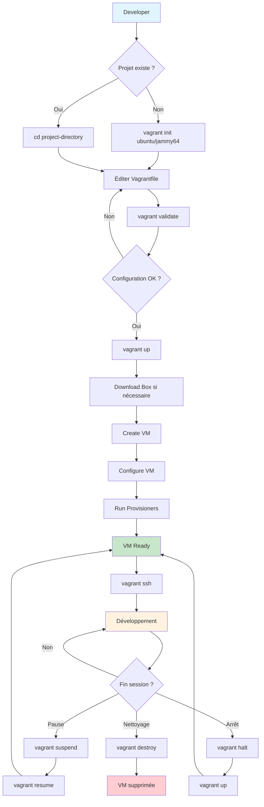

# Simplon Maghreb - Formation DevOps

# Sprint 0 - Séance 2 : Installation Environnement de Développement

## Objectifs pédagogiques

- Comprendre l'architecture d'un environnement de développement DevOps moderne
- Installer et configurer les outils de virtualisation et containerisation
- Maîtriser la configuration d'un environnement Python professionnel
- Valider le fonctionnement complet de l'environnement de travail

## Objectifs techniques

VirtualBox, Vagrant, Git, VS Code, Chocolatey, SSH, validation environnement, automation installation

## Table des matières

1. [Architecture Environnement DevOps](#1-architecture-environnement-devops)
2. [Installation et Configuration VirtualBox](#2-installation-et-configuration-virtualbox)
3. [Configuration Vagrant pour Automation VMs](#3-configuration-vagrant-pour-automation-vms)
4. [Installation Outils Essentiels DevOps](#4-installation-outils-essentiels-devops)
5. [Configuration SSH et Authentification](#5-configuration-ssh-et-authentification)
6. [Validation et Tests Environnement](#6-validation-et-tests-environnement)
7. [Récapitulatif et Prochaines Étapes](#7-récapitulatif-et-prochaines-étapes)
8. [Ressources Complémentaires](#8-ressources-complémentaires)

---

## 1. Architecture Environnement DevOps

### 1.1 Composants de l'environnement moderne

Un environnement de développement DevOps professionnel comprend plusieurs couches technologiques :

**Couche Virtualisation**

- **VirtualBox** : Hyperviseur pour machines virtuelles locales
- **Vagrant** : Automatisation et gestion des VMs de développement

**Couche Containerisation**

- **Docker Desktop** : Platform de containerisation avec GUI
- **Container Runtime** : Exécution containers Linux/Windows

**Couche Développement**

- **Python** : Langage principal pour automatisation DevOps
- **Virtual Environments** : Isolation des dépendances Python
- **Package Managers** : pip, conda pour gestion bibliothèques

**Couche Outils**

- **Git** : Versioning et collaboration code
- **VS Code** : IDE moderne avec extensions DevOps
- **Chocolatey** : Package manager Windows
- **SSH Tools** : Authentification et accès sécurisé

### 1.2 Bénéfices de l'approche multicouche

**Flexibilité** : Adaptation aux différents environnements de déploiement

**Isolation** : Séparation des projets et dépendances

**Reproductibilité** : Environnements identiques entre développeurs

**Scalabilité** : Préparation aux architectures cloud et microservices

### 1.3 Architecture cible

```
┌─────────────────────────────────────────────────────────────┐
│                    ENVIRONNEMENT DEVOPS                     │
├─────────────────────────────────────────────────────────────┤
│  IDE & Tools        │  Git & Collaboration                  │
│  ├─ VS Code         │  ├─ Git CLI                           │
│  ├─ Extensions      │  └─ SSH Keys                          │
│  └─ Terminal        │                                       │
├─────────────────────┼─────────────────────────────────────────┤
│  Python Stack      │  Package Management                    │
│  ├─ Python 3.11+   │  ├─ Chocolatey                        │
│  ├─ pip            │  └─ pip                               │
│  └─ virtualenv     │                                       │
├─────────────────────┼─────────────────────────────────────────┤
│  Containerisation   │  Virtualisation                       │
│  ├─ Docker Desktop │  ├─ VirtualBox                        │
│  ├─ Docker CLI     │  ├─ Vagrant                           │
│  └─ Docker Compose │  └─ VM Templates                      │
├─────────────────────┼─────────────────────────────────────────┤
│                  WINDOWS 10/11 HOST                        │
└─────────────────────────────────────────────────────────────┘
```

---

## 2. Installation et Configuration VirtualBox

### 2.0 Prérequis - Installation Chocolatey

**Chocolatey** est un gestionnaire de packages pour Windows qui simplifie l'installation des outils DevOps.

**Installation Chocolatey** :

```powershell
# IMPORTANT : Exécuter ces commandes UNE PAR UNE dans PowerShell Administrateur

# 1. Modifier la politique d'exécution (ligne 1)
Set-ExecutionPolicy Bypass -Scope Process -Force

# 2. Configurer le protocole de sécurité (ligne 2)
[System.Net.ServicePointManager]::SecurityProtocol = [System.Net.ServicePointManager]::SecurityProtocol -bor 3072

# 3. Télécharger et installer Chocolatey (ligne 3)
iex ((New-Object System.Net.WebClient).DownloadString('https://community.chocolatey.org/install.ps1'))

# 4. Vérification installation
choco --version

# 5. Redémarrer PowerShell pour prendre en compte les variables d'environnement
```

** ATTENTION** :

- **NE PAS** copier-coller toutes les commandes d'un coup
- **Exécuter ligne par ligne** pour éviter les erreurs de syntaxe PowerShell
- **Attendre** que chaque commande se termine avant la suivante
- **Redémarrer PowerShell** après installation pour actualiser l'environnement

**Configuration Chocolatey** :

```powershell
# Activer les fonctionnalités avancées (optionnel)
choco feature enable -n allowGlobalConfirmation

# Mise à jour Chocolatey
choco upgrade chocolatey
```

### 2.0.1 Dépannage Installation Chocolatey

**Erreurs courantes et solutions** :

**Erreur 1 : "A positional parameter cannot be found"**

```powershell
#  INCORRECT - Toutes les commandes sur une ligne
Set-ExecutionPolicy Bypass -Scope Process -Force [System.Net.ServicePointManager]::SecurityProtocol = [System.Net.ServicePointManager]::SecurityProtocol -bor 3072

#  CORRECT - Une commande à la fois
Set-ExecutionPolicy Bypass -Scope Process -Force
# Attendre la fin, puis exécuter la suivante
[System.Net.ServicePointManager]::SecurityProtocol = [System.Net.ServicePointManager]::SecurityProtocol -bor 3072
```

**Erreur 2 : "Execution Policy Restriction"**

```powershell
# Solution : Exécuter PowerShell en tant qu'Administrateur
# Clic droit sur PowerShell > "Exécuter en tant qu'administrateur"
Get-ExecutionPolicy
Set-ExecutionPolicy Bypass -Scope Process -Force
```

**Erreur 3 : "choco : The term 'choco' is not recognized"**

```powershell
# Solution : Redémarrer PowerShell ou recharger PATH
refreshenv
# OU fermer/rouvrir PowerShell
# OU redémarrer Windows
```

**Test de validation Chocolatey** :

```powershell
# Vérifier installation réussie
choco --version
choco list --local-only

# Si erreur, désinstaller et réinstaller
# Voir : https://chocolatey.org/docs/uninstallation
```

### 2.1 Qu'est-ce que VirtualBox

**VirtualBox** est un hyperviseur de type 2 développé par Oracle qui permet de créer et gérer des machines virtuelles sur un ordinateur hôte.

#### Types d'hyperviseurs

Il existe deux types principaux d'hyperviseurs selon leur architecture :

```
┌─────────────────────────────────────────────────────────────────┐
│                    HYPERVISEUR TYPE 1 (Bare-metal)             │
├─────────────────────────────────────────────────────────────────┤
│  VM 1           │  VM 2           │  VM 3                       │
│  ┌───────────┐  │  ┌───────────┐  │  ┌───────────┐               │
│  │    OS     │  │  │    OS     │  │  │    OS     │               │
│  │   App     │  │  │   App     │  │  │   App     │               │
│  └───────────┘  │  └───────────┘  │  └───────────┘               │
├─────────────────┼─────────────────┼─────────────────────────────┤
│              HYPERVISEUR (VMware ESXi, Hyper-V)                │
├─────────────────────────────────────────────────────────────────┤
│                    HARDWARE PHYSIQUE                           │
└─────────────────────────────────────────────────────────────────┘

┌─────────────────────────────────────────────────────────────────┐
│                    HYPERVISEUR TYPE 2 (Hosted)                 │
├─────────────────────────────────────────────────────────────────┤
│  VM 1           │  VM 2           │  VM 3                       │
│  ┌───────────┐  │  ┌───────────┐  │  ┌───────────┐               │
│  │    OS     │  │  │    OS     │  │  │    OS     │               │
│  │   App     │  │  │   App     │  │  │   App     │               │
│  └───────────┘  │  └───────────┘  │  └───────────┘               │
├─────────────────┴─────────────────┴─────────────────────────────┤
│  HYPERVISEUR    │  APPLICATIONS HÔTE                            │
│  (VirtualBox,   │  ┌───────────┐  ┌───────────┐  ┌───────────┐  │
│   VMware        │  │ VS Code   │  │ Browser   │  │ Office    │  │
│   Workstation)  │  └───────────┘  └───────────┘  └───────────┘  │
├─────────────────┴─────────────────────────────────────────────────┤
│                    OS HÔTE (Windows/Linux/macOS)               │
├─────────────────────────────────────────────────────────────────┤
│                    HARDWARE PHYSIQUE                           │
└─────────────────────────────────────────────────────────────────┘
```

**Comparaison des types** :

| Critère          | Type 1 (Bare-metal)       | Type 2 (Hosted)                |
| ---------------- | ------------------------- | ------------------------------ |
| **Installation** | Directement sur hardware  | Sur OS existant                |
| **Performance**  | Excellente (accès direct) | Bonne (overhead OS hôte)       |
| **Exemples**     | VMware ESXi, Hyper-V, Xen | VirtualBox, VMware Workstation |
| **Usage**        | Datacenters, production   | Développement, tests           |
| **Complexité**   | Élevée                    | Modérée                        |

**Avantages pour DevOps** :

- Création d'environnements isolés pour tests
- Simulation d'infrastructures multi-serveurs
- Compatibilité avec différents OS (Linux, Windows, macOS)
- Intégration native avec Vagrant

### 2.2 Installation VirtualBox

**Étapes d'installation** :

1. **Téléchargement**

   - Site officiel : https://www.virtualbox.org/wiki/Downloads
   - Version recommandée : VirtualBox 7.1.0 (compatible Vagrant) avec Extension Pack

2. **Installation Windows**

   ```powershell
   # Via Chocolatey (recommandé) - Version 7.1 compatible Vagrant
   choco install virtualbox --version=7.1.0

   # Ou installation manuelle depuis l'exécutable
   VirtualBox-7.1.0-Win.exe
   ```

3. **Configuration initiale**
   - Allocation mémoire par défaut : 2048 MB minimum
   - Répertoire VMs : `C:\VirtualBox VMs`
   - Réseau : Configuration NAT par défaut

### 2.3 Configuration avancée VirtualBox

**Paramètres globaux optimisés** :

```bash
# Configuration mémoire et processeur
- Default Machine Folder: C:\DevOps\VMs
- Memory: 4096 MB (minimum pour VMs DevOps)
- CPU: 2 cores minimum
- Video Memory: 128 MB
- Enable VT-x/AMD-V: Activé
- Enable Nested Paging: Activé
```

**Configuration réseau** :

- **NAT Network** : Communication entre VMs
- **Host-Only Adapter** : Accès depuis machine hôte
- **Bridged Adapter** : Accès réseau externe

### 2.4 Application pratique

**LAB 1** - Installation VirtualBox et première VM : `S0_S0_S2_lab1_virtualbox_setup.md`

**Énoncé du LAB 1** :

Installer VirtualBox et créer une première machine virtuelle Ubuntu Server pour environnement DevOps.

- **Objectif** : Maîtriser l'installation et configuration de base VirtualBox
- **Contexte** : Préparation infrastructure pour environnements de test et développement
- **Instructions** :
  1. Installer VirtualBox via Chocolatey ou installeur manuel
  2. Télécharger image Ubuntu Server 22.04 LTS
  3. Créer VM avec 2GB RAM, 20GB disque, 2 CPU cores
  4. Configurer réseau en mode NAT avec port forwarding SSH
  5. Installer Ubuntu Server et configurer utilisateur devops
  6. Valider connectivité SSH depuis machine hôte
- **Critères d'évaluation** : Installation réussie (2 pts), configuration VM (2 pts), connectivité SSH (1 pt)
- **Durée estimée** : 15 minutes
- **Fichier de travail** : `S0_S0_S2_lab1_virtualbox_setup.md`

---

## 3. Configuration Vagrant pour Automation VMs

### 3.1 Concepts fondamentaux de Vagrant

**Qu'est-ce que Vagrant ?**

Vagrant est un outil open-source développé par HashiCorp qui automatise la création, la configuration et la gestion de machines virtuelles de développement. Il permet de créer des environnements de développement reproductibles et portables.

**Problématiques résolues par Vagrant** :

- **"Ça marche sur ma machine"** : Standardisation des environnements
- **Configuration manuelle** : Automation complète via code
- **Temps de setup** : Déploiement rapide d'environnements complexes
- **Cohérence équipe** : Environnements identiques pour tous les développeurs

### 3.2 Architecture et concepts clés

**Les 4 piliers de Vagrant** :

1. **Vagrantfile** : Fichier de configuration déclaratif en Ruby

   - Définit l'infrastructure as Code
   - Versionnable avec Git
   - Partageable entre équipes

2. **Box** : Template de machine virtuelle pré-configurée

   - Image de base (Ubuntu, CentOS, Windows...)
   - Optimisée et testée
   - Distribuée via Vagrant Cloud

3. **Provider** : Backend de virtualisation

   - VirtualBox (gratuit, local)
   - VMware (performance, payant)
   - Docker (containers)
   - Cloud (AWS, Azure, GCP)

4. **Provisioner** : Moteur d'automatisation de configuration
   - Shell scripts
   - Ansible, Chef, Puppet
   - Docker
   - Fichiers de configuration

### 3.3 Workflow Vagrant - Diagramme Mermaid



**Commandes essentielles du workflow** :

| Commande           | Description                      | Phase        |
| ------------------ | -------------------------------- | ------------ |
| `vagrant init`     | Initialise un nouveau projet     | Création     |
| `vagrant validate` | Valide la syntaxe du Vagrantfile | Validation   |
| `vagrant up`       | Démarre et provisionne la VM     | Démarrage    |
| `vagrant ssh`      | Connexion SSH à la VM            | Connexion    |
| `vagrant status`   | Affiche l'état des VMs           | Monitoring   |
| `vagrant suspend`  | Met en pause la VM               | Pause        |
| `vagrant resume`   | Reprend une VM suspendue         | Reprise      |
| `vagrant reload`   | Redémarre avec nouvelle config   | Rechargement |
| `vagrant halt`     | Arrêt propre de la VM            | Arrêt        |
| `vagrant destroy`  | Supprime complètement la VM      | Destruction  |

### 3.4 Installation et configuration Vagrant

**Installation Vagrant** :

```powershell
# Installation via Chocolatey (recommandé)
choco install vagrant

# Vérification installation
vagrant --version

# Installation plugins essentiels
vagrant plugin install vagrant-vbguest     # Guest Additions auto
vagrant plugin install vagrant-hostmanager # Gestion DNS/hosts
vagrant plugin install vagrant-reload      # Redémarrage propre

# Liste des plugins installés
vagrant plugin list
```

**Configuration système** :

```powershell
# Répertoire global Vagrant (optionnel)
$env:VAGRANT_HOME = "C:\vagrant\global"

# Vérification configuration
vagrant version
```

### 3.5 Anatomie d'un Vagrantfile

**Vagrantfile simple** :

```ruby
# -*- mode: ruby -*-
# vi: set ft=ruby :

# Configuration version (ne pas modifier)
Vagrant.configure("2") do |config|

  # === BOX CONFIGURATION ===
  # Box Ubuntu 22.04 LTS officielle
  config.vm.box = "ubuntu/jammy64"
  config.vm.box_check_update = true

  # === NETWORK CONFIGURATION ===
  # IP privée pour accès host
  config.vm.network "private_network", ip: "192.168.56.10"

  # Port forwarding pour services web
  config.vm.network "forwarded_port", guest: 80, host: 8080
  config.vm.network "forwarded_port", guest: 22, host: 2222

  # === PROVIDER CONFIGURATION (VirtualBox) ===
  config.vm.provider "virtualbox" do |vb|
    # Nom de la VM dans VirtualBox
    vb.name = "devops-env"

    # Allocation ressources
    vb.memory = "2048"  # 2GB RAM
    vb.cpus = 2         # 2 CPU cores

    # Interface utilisateur
    vb.gui = false      # Mode headless

  end

  # === PROVISIONING ===
  # Script de configuration automatique
  config.vm.provision "shell", inline: <<-SHELL
    # Mise à jour système
    apt-get update
    apt-get upgrade -y

    # Installation outils de base
    apt-get install -y curl wget git vim tree htop

    # Configuration utilisateur vagrant
    echo 'alias ll="ls -la"' >> /home/vagrant/.bashrc
    echo 'export EDITOR=vim' >> /home/vagrant/.bashrc

    # Message de bienvenue
    echo "=== DevOps Environment Ready ==="
    echo "Vagrant VM successfully provisioned!"
  SHELL

  # === SHARED FOLDERS ===
  # Partage dossier host <-> guest
  config.vm.synced_folder ".", "/vagrant",
    owner: "vagrant",
    group: "vagrant",
    mount_options: ["dmode=755,fmode=644"]

  # Dossier projet spécifique
  config.vm.synced_folder "./app", "/opt/app",
    create: true

end
```

### 3.6 Configuration multi-machines

**Configuration environnement complexe** :

```ruby
Vagrant.configure("2") do |config|
  # Web server
  config.vm.define "web" do |web|
    web.vm.box = "ubuntu/jammy64"
    web.vm.network "private_network", ip: "192.168.56.10"
    web.vm.provider "virtualbox" do |vb|
      vb.memory = "1024"
      vb.name = "web-server"
    end
  end

  # Database server
  config.vm.define "db" do |db|
    db.vm.box = "ubuntu/jammy64"
    db.vm.network "private_network", ip: "192.168.56.11"
    db.vm.provider "virtualbox" do |vb|
      vb.memory = "2048"
      vb.name = "db-server"
    end
  end
end
```

### 3.6 Application pratique

**LAB 2** - Environnement Vagrant multi-VMs : `S0_S0_S2_lab2_vagrant_multienv.md`

**Énoncé du LAB 2** :

Créer un environnement multi-machines avec Vagrant simulant une infrastructure DevOps complète.

- **Objectif** : Maîtriser Vagrant pour automation et gestion d'infrastructures de développement
- **Contexte** : Simulation environnement 3-tiers (web, app, database) pour projet DevOps
- **Instructions** :
  1. Créer Vagrantfile avec 3 VMs (web, app, db)
  2. Configurer réseau privé avec IPs fixes
  3. Implémenter provisioning automatique par rôle
  4. Installer Docker sur toutes les machines
  5. Configurer partage de dossiers pour développement
  6. Tester communication entre VMs et accès depuis hôte
- **Critères d'évaluation** : Configuration multi-VM (2 pts), provisioning (2 pts), connectivité (1 pt)
- **Durée estimée** : 20 minutes
- **Fichier de travail** : `S0_S0_S2_lab2_vagrant_multienv.md`

---

## 4. Installation Outils Essentiels DevOps

### 4.1 Git et versioning

**Installation Git** :

```powershell
# Via Chocolatey
choco install git

# Configuration globale
git config --global user.name "Votre Nom"
git config --global user.email "email@example.com"
git config --global init.defaultBranch main
```

**Git Credential Manager** :

```powershell
# Installation
choco install git-credential-manager-for-windows

# Configuration
git config --global credential.helper manager-core
```

### 4.2 VS Code et extensions

**Installation VS Code** :

```powershell
choco install vscode
```

**Extensions DevOps essentielles** :

- **Git** : Intégration Git native
- **Remote - WSL** : Développement dans WSL
- **GitLens** : Git enhanced
- **YAML** : Support fichiers YAML
- **Terraform** : Infrastructure as Code
- **REST Client** : Tests API

### 4.3 Package managers

**Chocolatey (Windows)** :

```powershell
# Packages DevOps essentiels (Chocolatey déjà installé)
choco install nodejs terraform kubectl
```

**npm (Node.js packages)** :

```bash
npm install -g @angular/cli
npm install -g create-react-app
npm install -g serverless
```

### 4.4 Outils ligne de commande

**Windows Terminal** :

```powershell
choco install microsoft-windows-terminal
```

**PowerShell Core** :

```powershell
choco install powershell-core
```

**WSL2 et distribution Linux** :

```powershell
wsl --install -d Ubuntu-22.04
```

---

## 5. Configuration SSH et Authentification

### 5.1 Génération clés SSH

**Création paire de clés** :

```bash
# Génération clé RSA
ssh-keygen -t rsa -b 4096 -C "email@example.com"

# Génération clé Ed25519 (recommandé)
ssh-keygen -t ed25519 -C "email@example.com"

# Emplacement : ~/.ssh/id_rsa (ou id_ed25519)
```

### 6.2 VS Code et extensions

**Installation VS Code** :

```powershell
choco install vscode
```

**Extensions DevOps essentielles** :

- **Git** : Intégration Git native
- **Remote - WSL** : Développement dans WSL
- **GitLens** : Git enhanced
- **YAML** : Support fichiers YAML
- **Terraform** : Infrastructure as Code
- **REST Client** : Tests API
- **Kubernetes** : Gestion clusters K8s
- **Terraform** : Infrastructure as Code
- **REST Client** : Tests API

### 6.3 Package managers

**Chocolatey (Windows)** :

```powershell
# Packages DevOps essentiels (Chocolatey déjà installé)
choco install nodejs terraform kubectl
```

**npm (Node.js packages)** :

```bash
npm install -g @angular/cli
npm install -g create-react-app
npm install -g serverless
```

### 6.4 Outils ligne de commande

**Windows Terminal** :

```powershell
choco install microsoft-windows-terminal
```

**PowerShell Core** :

```powershell
choco install powershell-core
```

**WSL2 et distribution Linux** :

```powershell
wsl --install -d Ubuntu-22.04
```

---

## 7. Configuration SSH et Authentification

### 7.1 Génération clés SSH

**Création paire de clés** :

```bash
# Génération clé RSA
ssh-keygen -t rsa -b 4096 -C "email@example.com"

# Génération clé Ed25519 (recommandé)
ssh-keygen -t ed25519 -C "email@example.com"

# Emplacement : ~/.ssh/id_rsa (ou id_ed25519)
```

### 7.2 Configuration SSH client

**Fichier ~/.ssh/config** :

```
# GitHub
Host github.com
    HostName github.com
    User git
    IdentityFile ~/.ssh/id_ed25519

# GitLab
Host gitlab.com
    HostName gitlab.com
    User git
    IdentityFile ~/.ssh/id_ed25519

# Server DevOps
Host devops-server
    HostName 192.168.1.100
    User devops
    Port 22
    IdentityFile ~/.ssh/id_rsa
```

### 7.3 Agent SSH

**Démarrage agent SSH** :

```bash
# Windows
ssh-agent -s

# Ajout clé privée
ssh-add ~/.ssh/id_ed25519

# Liste des clés
ssh-add -l
```

---

## 8. Validation et Tests Environnement

### 8.1 Checklist validation complète

**Tests VirtualBox** :

```bash
# Version VirtualBox
VBoxManage --version

# Liste VMs
VBoxManage list vms

# Test création VM
VBoxManage createvm --name test-vm --register
```

**Tests Vagrant** :

```bash
# Version Vagrant
vagrant --version

# Plugins installés
vagrant plugin list

# Test box
vagrant box list
```

### 6.2 Script de validation automatique

**Script PowerShell de validation** :

```powershell
# validation-environnement.ps1
Write-Host "=== VALIDATION ENVIRONNEMENT DEVOPS ===" -ForegroundColor Green

# Test VirtualBox
try {
    $vbox_version = VBoxManage --version
    Write-Host "✓ VirtualBox: $vbox_version" -ForegroundColor Green
} catch {
    Write-Host "✗ VirtualBox non installé" -ForegroundColor Red
}

# Test Vagrant
try {
    $vagrant_version = vagrant --version
    Write-Host "✓ Vagrant: $vagrant_version" -ForegroundColor Green
} catch {
    Write-Host "✗ Vagrant non installé" -ForegroundColor Red
}

# Test Git
try {
    $git_version = git --version
    Write-Host "✓ Git: $git_version" -ForegroundColor Green
} catch {
    Write-Host "✗ Git non installé" -ForegroundColor Red
}
```

````

**Tests Docker** :

```bash
# Version Docker
docker --version
docker-compose --version

# Test container
docker run hello-world

# Test service
docker run -d nginx:alpine
````

**Tests Python** :

```bash
# Version Python
python --version
pip --version

# Test virtualenv
python -m venv test-env
test-env\Scripts\activate
deactivate
```

### 8.2 Script de validation automatique

**Script PowerShell de validation** :

```powershell
# validation-environnement.ps1
Write-Host "=== VALIDATION ENVIRONNEMENT DEVOPS ===" -ForegroundColor Green

# Test VirtualBox
try {
    $vbox_version = VBoxManage --version
    Write-Host "✓ VirtualBox: $vbox_version" -ForegroundColor Green
} catch {
    Write-Host "✗ VirtualBox non installé" -ForegroundColor Red
}

# Test Docker
try {
    $docker_version = docker --version
    Write-Host "✓ Docker: $docker_version" -ForegroundColor Green
} catch {
    Write-Host "✗ Docker non installé" -ForegroundColor Red
}

# Tests additionnels...
```

---

## 9. Récapitulatif et Prochaines Étapes

### 9.1 Points clés de la séance

- **Architecture environnement** : Compréhension des couches technologiques
- **VirtualBox** : Installation et configuration pour virtualisation
- **Vagrant** : Automation de gestion des VMs de développement
- **Outils DevOps** : Git, VS Code, package managers, SSH

### 9.2 Préparation séance 3

La prochaine séance se concentrera sur le panorama des outils DevOps :

- Cartographie complète de la chaîne d'outils DevOps
- Critères de sélection et évaluation des outils
- Architecture de référence et bonnes pratiques
- Tendances et évolutions de l'écosystème

### 9.3 Actions recommandées

- Compléter l'installation de tous les outils
- Pratiquer les commandes de base Docker et Vagrant
- Configurer l'environnement Python avec Poetry
- Valider la connectivité SSH et Git

---

## 10. Ressources Complémentaires

### 10.1 Documentation officielle

- [VirtualBox Documentation](https://www.virtualbox.org/wiki/Documentation) - Guide utilisateur complet
- [Vagrant Documentation](https://www.vagrantup.com/docs) - Référence Vagrant
- [Docker Documentation](https://docs.docker.com/) - Guide Docker complet
- [Python Packaging](https://packaging.python.org/) - Bonnes pratiques Python

### 10.2 Tutoriels et guides

- [Docker Get Started](https://docs.docker.com/get-started/) - Tutorial interactif Docker
- [Vagrant Tutorial](https://learn.hashicorp.com/vagrant) - Apprentissage Vagrant
- [Poetry Documentation](https://python-poetry.org/docs/) - Gestion dépendances moderne
- [Git Handbook](https://guides.github.com/introduction/git-handbook/) - Guide Git

### 10.3 Outils complémentaires

- [Portainer](https://www.portainer.io/) - GUI Docker management
- [Vagrant Manager](http://vagrantmanager.com/) - GUI Vagrant
- [Python virtualenvwrapper](https://virtualenvwrapper.readthedocs.io/) - Gestion virtualenv
- [Oh My Zsh](https://ohmyz.sh/) - Terminal amélioré

---

_Formateur : Hassan ESSADIK | Sprint 0 - Séance 2 : Installation Environnement de Développement_
