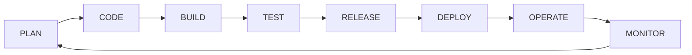
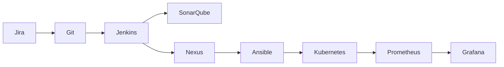
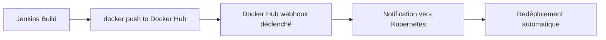
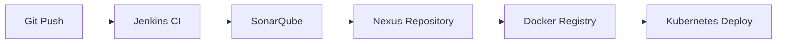
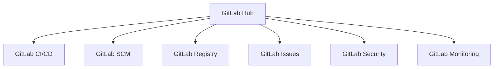
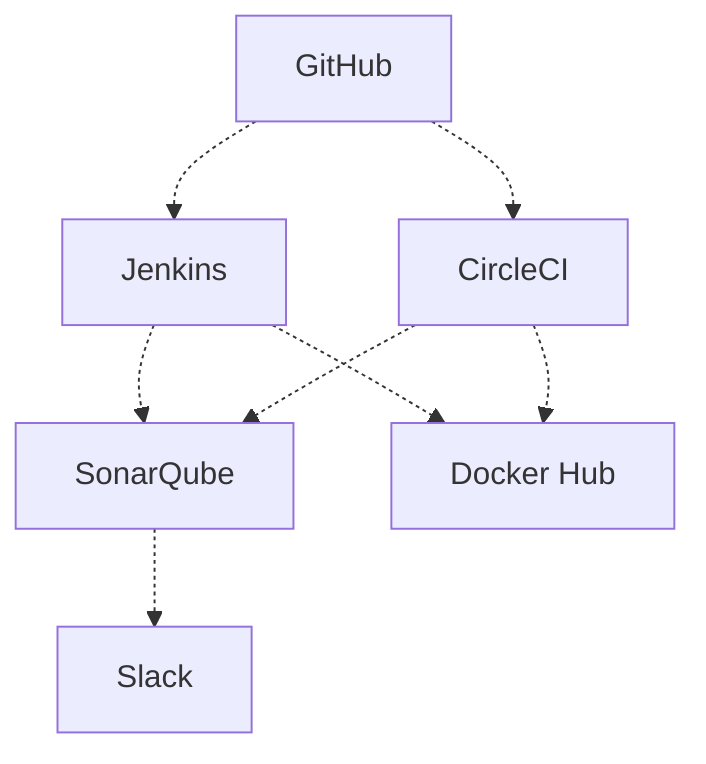

# Simplon Maghreb - Formation DevOps

# Sprint 0 - Séance 3 : Panorama des Outils DevOps

## Objectifs pédagogiques

Cette troisième séance constitue la découverte fondamentale de l'écosystème d'outils DevOps et permet aux apprenants de :

- Comprendre l'écosystème d'outils DevOps et leur intégration dans la chaîne de développement
- Découvrir le catalogue des outils essentiels par catégorie DevOps
- Analyser des chaînes d'outils concrètes et leurs mécanismes d'intégration
- Appliquer les concepts via des exercices pratiques d'audit et de conception

## Objectifs techniques

Écosystème DevOps, chaîne d'outils, intégration APIs, Git, GitHub, Jenkins, Docker, Kubernetes, monitoring, CI/CD pipelines, audit d'outillage, conception de chaînes

## Table des matières

1. [Comprendre l'écosystème d'outils DevOps](#1-comprendre-lécosystème-doutils-devops)
2. [La chaîne d'outils et son fonctionnement](#2-la-chaîne-doutils-et-son-fonctionnement)
3. [Catalogue des outils essentiels par catégorie](#3-catalogue-des-outils-essentiels-par-catégorie)
4. [Récapitulatif et prochaines étapes](#4-récapitulatif-et-prochaines-étapes)
5. [Ressources complémentaires](#5-ressources-complémentaires)

**📋 Timing de la séance (2 heures)** :

- **Introduction et écosystème** (30 minutes) : Vue d'ensemble et segmentation
- **Chaînes d'outils** (40 minutes) : Concepts et mécanismes d'intégration
- **Catalogue essentiel** (30 minutes) : Outils par catégorie
- **LABs pratiques** (20 minutes) : Audit et conception d'outils

---

## 1. Comprendre l'écosystème d'outils DevOps

### 1.1 Définition et contexte

L'écosystème DevOps comprend plus de 500 outils spécialisés couvrant l'ensemble du cycle de vie du développement logiciel. Cette diversité s'explique par trois facteurs principaux :

**Spécialisation fonctionnelle** : Chaque phase du cycle DevOps nécessite des outils adaptés à ses contraintes spécifiques.

**Évolution technologique** : L'émergence de nouvelles architectures (cloud, containers, microservices) génère de nouveaux besoins outillage.

**Préférences organisationnelles** : Les équipes privilégient différentes approches selon leur contexte et leur maturité.

### 1.2 Segmentation de l'écosystème

L'écosystème DevOps se structure autour de **8 phases principales** correspondant au cycle de vie du développement logiciel :

**Phase PLAN** : Gestion de projet, planification, collaboration équipes

- _Outils typiques_ : Jira, Trello, Azure Boards, Monday.com

**Phase CODE** : Développement, versioning, collaboration développeurs

- _Outils typiques_ : Git, GitHub, GitLab, Bitbucket, VS Code

**Phase BUILD** : Compilation, packaging, intégration continue

- _Outils typiques_ : Jenkins, GitLab CI, Azure DevOps, Maven, Gradle

**Phase TEST** : Tests automatisés, qualité code, validation

- _Outils typiques_ : JUnit, Selenium, SonarQube, Jest, Cypress

**Phase RELEASE** : Gestion artefacts, versioning, distribution

- _Outils typiques_ : Nexus, Artifactory, Docker Registry, npm

**Phase DEPLOY** : Déploiement automatisé, infrastructure, orchestration

- _Outils typiques_ : Ansible, Terraform, Kubernetes, Docker, Helm

**Phase OPERATE** : Exploitation, gestion infrastructure, scaling

- _Outils typiques_ : Kubernetes, Docker Swarm, AWS ECS, Nomad

**Phase MONITOR** : Surveillance, métriques, alerting, observabilité

- _Outils typiques_ : Prometheus, Grafana, ELK Stack, DataDog, New Relic

### 1.3 Acteurs majeurs du marché

**Plateformes intégrées :**

- **Microsoft** : Azure DevOps + GitHub (acquisition 2018)
- **Atlassian** : Jira + Bitbucket + Bamboo + Confluence
- **GitLab** : Plateforme DevOps complète end-to-end
- **Google** : Cloud Build + GKE + Anthos

**Spécialistes par domaine :**

- **CI/CD** : Jenkins, CircleCI, Travis CI
- **Containers** : Docker, Kubernetes, Red Hat OpenShift
- **Monitoring** : Prometheus, Grafana, Elastic Stack
- **Infrastructure** : Terraform, Ansible, Pulumi

**Clouds publics** : AWS, Microsoft Azure, Google Cloud Platform proposent des suites d'outils intégrées à leurs écosystèmes.

### 1.4 Application pratique

📝 **LAB 1** - Audit d'outils existants : `S0_S3_S3_lab1_audit_outils.md`

**Énoncé du LAB 1** :

Analyser l'écosystème d'outils actuel d'une organisation selon la segmentation par phases DevOps et identifier les gaps et opportunités d'amélioration.

- **Objectif** : Maîtriser l'analyse d'écosystème DevOps existant
- **Contexte** : InnovateTech, PME avec outils disparates nécessitant une rationalisation
- **Prérequis** : Segmentation DevOps et catégories d'outils vues en cours
- **Format** : Analyse qualitative et recommandations (accessible niveau débutant)
- **Instructions** :
  1. Cartographier les outils par phase DevOps (Plan, Code, Build, Test, etc.)
  2. Identifier les gaps, doublons et problèmes d'intégration
  3. Proposer un plan de rationalisation avec priorités
  4. Justifier les choix par rapport aux bonnes pratiques
- **Critères d'évaluation** : Cartographie (2 pts), analyse gaps (2 pts), recommandations (1 pt)
- **Durée estimée** : 15 minutes
- **Fichier de travail** : `S0_S3_S3_lab1_audit_outils.md`

---

## 2. La chaîne d'outils et son fonctionnement

### 2.1 Concept de chaîne d'outils

Une **chaîne d'outils DevOps** (toolchain) est l'ensemble des outils intégrés qui automatisent et orchestrent le cycle de développement, depuis la planification jusqu'au monitoring en production.

**Exemple de chaîne d'outils typique :**

**Flux d'information :**

1. **Ticket Jira** → **Branche Git** (liaison automatique via numéro ticket)
2. **Git Push** → **Jenkins Build** (webhook déclenché)
3. **Build réussi** → **Tests SonarQube** (quality gate)
4. **Tests passés** → **Upload Nexus** (artefact versionné)
5. **Artefact validé** → **Déploiement Ansible** (infrastructure provisionnée)
6. **Déploiement** → **Orchestration Kubernetes** (containers gérés)
7. **Monitoring** → **Prometheus + Grafana** (métriques temps réel)

### 2.2 Mécanismes d'intégration

**APIs REST :**
Les outils modernes exposent des APIs REST pour automatiser leurs fonctionnalités.

- _Exemple_ : API GitHub pour création automatique de Pull Requests
- _Exemple_ : API Jenkins pour déclenchement de builds
- _Exemple_ : API Kubernetes pour déploiements programmatiques

**Webhooks :**
Notifications push pour déclencher des actions en temps réel.

- _Exemple_ : Git push → webhook → build Jenkins automatique
- _Exemple_ : Docker Hub → notifie le déploiement quand une nouvelle image est publiée
- _Exemple_ : Monitoring → alerte Slack/Teams lors d'un incident de production

**Flux webhook Docker Hub → Déploiement automatique :**

- **Message queues** : Communication asynchrone fiable
  - _Exemple_ : RabbitMQ pour orchestrer les déploiements multi-environnements
  - _Exemple_ : Apache Kafka pour streamer les logs vers Elasticsearch
  - _Exemple_ : Redis pour gérer les jobs de backup et synchronisation

**Formats d'échange :**

- **YAML/JSON** : Configuration et métadonnées
- **Docker images** : Artefacts containerisés
- **Git repositories** : Code source et configuration

### 2.3 Patterns d'architecture

**Pipeline Pattern :**
Architecture linéaire où chaque outil traite les sorties du précédent.

_Principe :_ Flux séquentiel où la sortie de l'étape N devient l'entrée de l'étape N+1.

_Exemple typique :_

_Avantages :_ Simple à comprendre, traçabilité claire, debugging facile
_Inconvénients :_ Point de défaillance unique, scalabilité limitée

**Hub Pattern :**
Architecture centralisée autour d'une plateforme unique (GitLab, Azure DevOps).

_Principe :_ Une plateforme centrale qui intègre tous les outils et orchestrer les workflows.

_Exemple GitLab Hub :_

_Avantages :_ Interface unique, intégration native, gestion centralisée
_Inconvénients :_ Vendor lock-in, limitation aux fonctionnalités du hub

**Microservices Pattern :**
Architecture distribuée avec outils spécialisés communicant via APIs.

_Principe :_ Chaque outil reste indépendant et communique via APIs/webhooks.

_Exemple architecture distribuée :_

_Avantages :_ Flexibilité, best-of-breed, évolutivité
_Inconvénients :_ Complexité d'intégration, maintenance distribuée

### 2.4 Application pratique

📝 **LAB 2** - Conception de chaîne d'outils : `S0_S3_S3_lab2_chaines_outils.md`

**Énoncé du LAB 2** :

Concevoir une chaîne d'outils DevOps complète pour un projet de développement web moderne, en spécifiant les mécanismes d'intégration et les patterns d'architecture.

- **Objectif** : Maîtriser la conception de chaînes d'outils intégrées
- **Contexte** : WebCommerce, startup e-commerce avec équipe agile démarrant un nouveau projet
- **Prérequis** : Chaînes d'outils et mécanismes d'intégration vus en cours
- **Format** : Conception architecturale et spécifications techniques (niveau débutant)
- **Instructions** :
  1. Analyser les besoins selon le contexte projet (web, agile, startup)
  2. Sélectionner les outils par catégorie avec justification
  3. Concevoir l'architecture d'intégration (APIs, webhooks, etc.)
  4. Spécifier les patterns d'automatisation et de déploiement
- **Critères d'évaluation** : Sélection outils (2 pts), architecture (2 pts), intégration (1 pt)
- **Durée estimée** : 15 minutes
- **Fichier de travail** : `S0_S3_S3_lab2_chaines_outils.md`

---

## 3. Catalogue des outils essentiels par catégorie

### 3.1 Source Code Management (SCM)

**Leaders du marché :**

| Outil         | Type     | Points forts                    | Limitations              |
| ------------- | -------- | ------------------------------- | ------------------------ |
| **Git**       | DVCS     | Standard industrie, performance | Courbe apprentissage     |
| **GitHub**    | Platform | Écosystème, communauté          | Coût enterprise          |
| **GitLab**    | Platform | DevOps intégré, CI/CD natif     | Complexité setup         |
| **Bitbucket** | Platform | Intégration Atlassian           | Fonctionnalités limitées |

### 3.2 Continuous Integration/Continuous Deployment

**Solutions CI/CD populaires :**

| Outil              | Déploiement      | Points forts             | Cas d'usage              |
| ------------------ | ---------------- | ------------------------ | ------------------------ |
| **Jenkins**        | On-premise/Cloud | Flexibilité, plugins     | Environnements complexes |
| **GitLab CI**      | Intégré          | Platform intégrée        | Workflow unified         |
| **Azure DevOps**   | Cloud            | Intégration Microsoft    | Écosystème Windows       |
| **GitHub Actions** | Cloud            | Simplicité, marketplace  | Projets open-source      |
| **CircleCI**       | Cloud            | Performance, scalabilité | Projets cloud-native     |

### 3.3 Testing et Quality Assurance

**Framework de tests :**

- **Unit Testing** : JUnit, pytest, Jest, RSpec
- **Integration Testing** : Postman, Rest Assured, Cypress
- **Performance Testing** : JMeter, Artillery, k6
- **Security Testing** : OWASP ZAP, SonarQube, Snyk

### 3.4 Infrastructure et Déploiement

**Infrastructure as Code :**

| Outil              | Approche     | Points forts           | Écosystème       |
| ------------------ | ------------ | ---------------------- | ---------------- |
| **Terraform**      | Déclaratif   | Multi-cloud, mature    | Tous clouds      |
| **CloudFormation** | Déclaratif   | Intégration AWS native | AWS seulement    |
| **Ansible**        | Impératif    | Simplicité, agentless  | Multi-plateforme |
| **Pulumi**         | Programmable | Langages populaires    | Multi-cloud      |

**Orchestration Containers :**

- **Kubernetes** : Standard orchestration enterprise
- **Docker Swarm** : Simplicité, intégration Docker
- **OpenShift** : Kubernetes enterprise (Red Hat)
- **Amazon ECS** : Orchestration AWS managed

### 3.5 Monitoring et Observabilité

**Stack d'observabilité :**

- **Métriques** : Prometheus + Grafana
- **Logs** : Elasticsearch + Kibana
- **Traces** : Jaeger + Grafana
- **Alerting** : AlertManager + PagerDuty

**Solutions cloud :**

- **AWS** : CloudWatch, X-Ray, Systems Manager
- **Azure** : Monitor, Application Insights, Log Analytics
- **GCP** : Cloud Operations, Cloud Logging, Cloud Trace

---

## 4. Récapitulatif et Prochaines Étapes

### 4.1 Points clés de la séance

- **Écosystème DevOps** : Plus de 1000 outils organisés en 10 catégories principales
- **Chaînes d'outils** : Intégration via APIs et webhooks pour automatisation bout-en-bout
- **Catalogue essentiel** : Git, Jenkins, Docker, Kubernetes, Prometheus comme standards de facto
- **Patterns d'architecture** : Pipeline as Code, GitOps, et Infrastructure as Code
- **Mécanismes d'intégration** : REST APIs, event-driven architecture, et orchestration

### 4.2 Préparation séance 4

La prochaine séance se concentrera sur l'introduction aux tests et à la qualité dans DevOps :

- Architecture de testing (pyramide des tests)
- Quality gates et métriques qualité
- Tests automatisés et shift-left testing
- Integration avec CI/CD pipelines
- SonarQube et analyse statique

**Prérequis pour la séance 4 "Introduction aux Tests et Qualité" :**

- Compréhension des outils de tests identifiés (JUnit, SonarQube, Selenium)
- Familiarisation avec les concepts de quality gates
- Révision des notions de test pyramid et shift-left testing

**Exercices préparatoires :**

- Installation locale de SonarQube Community Edition
- Configuration d'un projet sample avec analyse qualité
- Exploration des métriques et rapports de qualité

### 4.3 Actions recommandées

#### Actions immédiates (priorité haute)

- Compléter les LABs 1 et 2 si non terminés
- Passer le quiz de validation des acquis
- Créer des comptes gratuits sur GitHub, GitLab, Azure DevOps

#### Actions pédagogiques

- Réviser le catalogue d'outils par catégorie
- Explorer les ressources complémentaires listées
- Tester les pipelines CI/CD basiques sur projets personnels
- Installer et configurer Git en local avec workflows standards

#### Veille technologique

- Suivre les roadmaps des outils identifiés (GitHub, Jenkins, Docker)
- Participer aux communautés DevOps (Reddit, Discord, Slack)
- Lire les State of DevOps Reports annuels

---

## 5. Ressources complémentaires

### 5.1 Documentation officielle

- [DevOps Roadmap](https://roadmap.sh/devops) - Parcours d'apprentissage complet
- [State of DevOps Report 2024](https://cloud.google.com/devops/state-of-devops) - Google Cloud & DORA
- [Awesome DevOps](https://github.com/awesome-soft/awesome-devops) - Catalogue d'outils GitHub
- [CNCF Landscape](https://landscape.cncf.io/) - Écosystème Cloud Native interactif

### 5.2 Communautés et événements

**Communautés actives :**

- **DevOps Institute** : Certification et recherche
- **Cloud Native Computing Foundation** : Écosystème Kubernetes
- **Continuous Delivery Foundation** : Standards CI/CD

**Événements majeurs :**

- **DevOpsDays** : Conférences locales mondiales
- **KubeCon + CloudNativeCon** : Containers et orchestration
- **DockerCon** : Containerisation et DevOps

### 5.3 Formations et certifications

**Certifications reconnues :**

- **AWS Certified DevOps Engineer**
- **Microsoft Azure DevOps Solutions**
- **Google Professional DevOps Engineer**
- **Docker Certified Associate**
- **Kubernetes CKA/CKAD**

### 5.4 Plateformes d'apprentissage

- [GitHub Learning Lab](https://github.com/apps/github-learning-lab) - Labs interactifs Git/GitHub
- [Katacoda](https://www.katacoda.com/) - Scenarios DevOps pratiques
- [Play with Docker](https://labs.play-with-docker.com/) - Environnement Docker gratuit
- [Kill the CODA](https://www.katacoda.com/courses/kubernetes) - Kubernetes hands-on

### 5.5 Outils d'évaluation

**Assessment tools :**

- **DevOps Maturity Model** (Capability Maturity Model)
- **CALMS Framework Assessment** (Culture, Automation, Lean, Measurement, Sharing)
- **Value Stream Mapping** pour analyse des flux

**Calculateurs ROI :**

- **DevOps ROI Calculator** (Puppet)
- **CI/CD Cost-Benefit Analysis** templates
- **Tool Comparison Matrices** par catégorie

---

_Formateur : Hassan ESSADIK | Sprint 0 - Séance 3 : Panorama des Outils DevOps_
