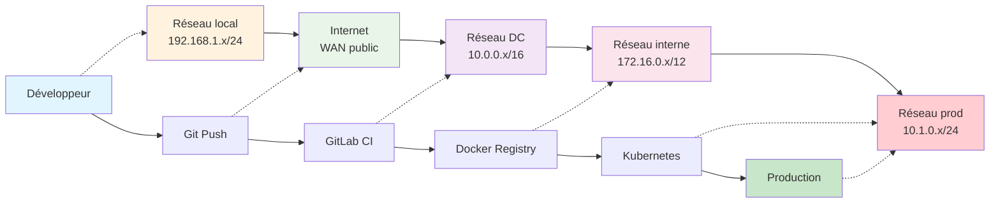
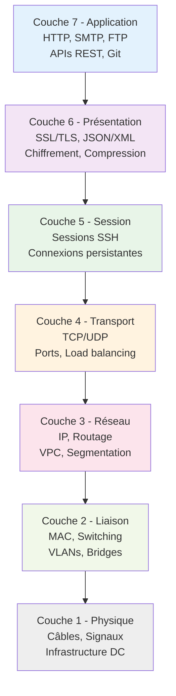
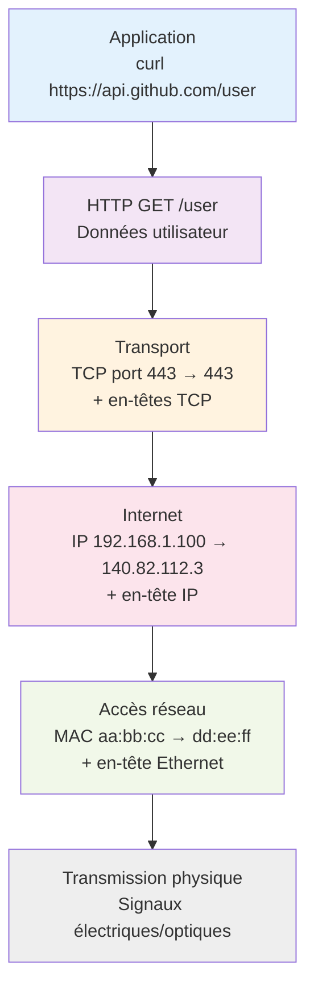
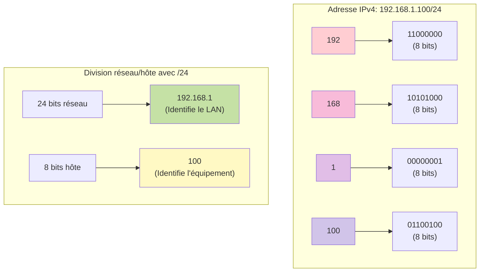
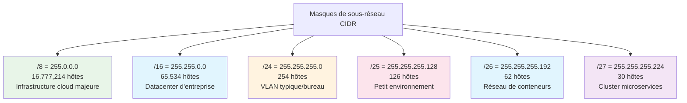
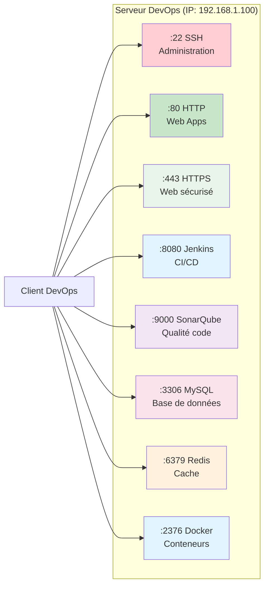
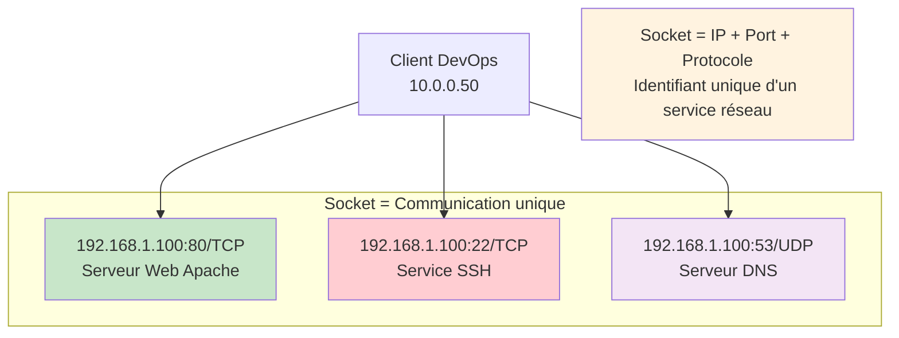
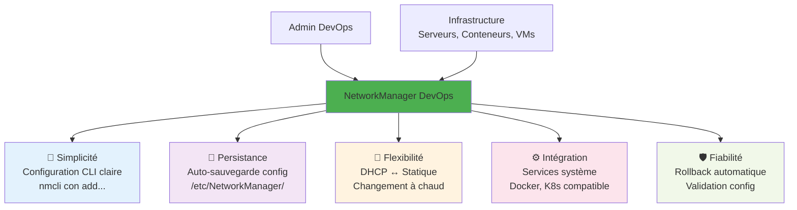

# Simplon Maghreb - Formation DevOps

# Sprint 1 - Semaine 1 - Séance 3 : Réseaux - Fondations Linux

## Objectifs pédagogiques

- Maîtriser les commandes réseau de base sur Linux pour l'administration DevOps
- Configurer et gérer les interfaces réseau avec NetworkManager en environnement serveur
- Diagnostiquer et tester la connectivité réseau avec les outils standards Linux
- Comprendre la configuration DNS et la résolution de noms pour les services DevOps

## Objectifs techniques

Modèle OSI, TCP/IP, IPv4/IPv6, adresses MAC, ports, NetworkManager, nmcli, ip, ping, traceroute, ss, netstat, DNS, /etc/hosts, resolv.conf, connectivité DevOps

## Table des matières

1. [Fondamentaux des réseaux informatiques](#1-fondamentaux-des-réseaux-informatiques)
2. [Modèle OSI et pile TCP/IP](#2-modèle-osi-et-pile-tcpip)
3. [Types d'adresses réseau](#3-types-dadresses-réseau)
4. [Découverte des réseaux Linux](#4-découverte-des-réseaux-linux)
5. [Configuration d'interfaces avec NetworkManager](#5-configuration-dinterfaces-avec-networkmanager)
6. [Tests de connectivité et diagnostic de base](#6-tests-de-connectivité-et-diagnostic-de-base)
7. [Configuration DNS et résolution de noms](#7-configuration-dns-et-résolution-de-noms)
8. [Récapitulatif et prochaines étapes](#8-récapitulatif-et-prochaines-étapes)

---

## 1. Fondamentaux des réseaux informatiques

### 1.1 Qu'est-ce qu'un réseau informatique ?

**Définition** : Un réseau informatique est un ensemble d'équipements (ordinateurs, serveurs, routeurs, commutateurs) interconnectés pour permettre l'échange de données et le partage de ressources.

**Analogie** : Un réseau informatique fonctionne comme un système postal moderne. Imaginez que chaque ordinateur est une maison avec une adresse unique, les câbles réseau sont les routes, les routeurs sont les centres de tri postal, et les données sont des lettres qui voyagent d'une adresse à une autre.

**Composants essentiels d'un réseau** :

- **Hôtes** : Ordinateurs, serveurs, smartphones (les "maisons" du réseau)
- **Infrastructure** : Câbles, commutateurs, routeurs (les "routes" et "carrefours")
- **Protocoles** : Règles de communication (le "langage" commun)
- **Services** : Web, email, DNS (les "services publics" du réseau)

### 1.2 Pourquoi les réseaux sont cruciaux en DevOps ?

**Rôle en DevOps** :

- **Infrastructure distribuée** : Applications sur plusieurs serveurs
- **CI/CD** : Pipelines qui communiquent entre environnements
- **Monitoring** : Surveillance des services via réseau
- **Déploiement** : Distribution automatisée des applications
- **Conteneurs** : Orchestration Docker/Kubernetes via réseau
- **Cloud** : Connectivité vers services AWS/Azure/GCP

**Exemple concret DevOps** :

**Description** : Ce diagramme illustre un pipeline DevOps typique montrant comment le code d'un développeur traverse différents environnements réseau jusqu'à la production. Chaque étape du pipeline utilise une infrastructure réseau spécifique, démontrant l'importance cruciale de la connectivité dans les pratiques DevOps modernes.



**Clé du diagramme** :

| **Composant**       | **Réseau associé**                 | **Description technique**                                             |
| ------------------- | ---------------------------------- | --------------------------------------------------------------------- |
| **Développeur**     | **Réseau local** (192.168.1.x/24)  | Poste de travail connecté au réseau de l'entreprise via Ethernet/WiFi |
| **Git Push**        | **Internet** (WAN public)          | Transit via fournisseur d'accès Internet, protocoles HTTPS/SSH        |
| **GitLab CI**       | **Réseau DC** (10.0.0.x/16)        | Serveurs CI/CD dans datacenter avec connectivité haute disponibilité  |
| **Docker Registry** | **Réseau interne** (172.16.0.x/12) | Stockage sécurisé des images avec accès restreint et chiffrement      |
| **Kubernetes**      | **Réseau prod** (10.1.0.x/24)      | Orchestrateur de conteneurs avec réseau overlay et services mesh      |
| **Production**      | **Réseau prod** (10.1.0.x/24)      | Applications finales exposées aux utilisateurs via load balancers     |

**Points clés réseau** :

- **Segmentation** : Chaque environnement utilise un sous-réseau dédié pour la sécurité
- **Routage** : Les firewalls contrôlent les communications inter-réseaux
- **DNS** : Résolution de noms pour tous les services (gitlab.company.com, registry.company.com)
- **TLS/SSL** : Chiffrement des communications sensibles (Git, Docker, K8s API)

### 1.3 Types de réseaux par portée

**Classification par taille géographique** :

- **LAN** (Local Area Network) : Réseau local (bureau, datacenter)
- **WAN** (Wide Area Network) : Réseau étendu (Internet, liaisons inter-sites)
- **MAN** (Metropolitan Area Network) : Réseau métropolitain (ville)
- **PAN** (Personal Area Network) : Réseau personnel (Bluetooth, USB)

**En contexte DevOps** :

- **LAN** : Serveurs dans même datacenter
- **WAN** : Connexions entre datacenters, cloud hybride
- **Internet** : Services publics, APIs externes, CDN

---

## 2. Modèle OSI et pile TCP/IP

### 2.1 Le modèle OSI - Architecture en couches

**Définition** : Le modèle OSI (Open Systems Interconnection) est un modèle de référence qui divise la communication réseau en 7 couches distinctes, chacune ayant un rôle spécifique.

**Analogie** : Le modèle OSI fonctionne comme l'envoi d'une lettre internationale. Chaque couche ajoute ses informations (comme les cachets postaux) et a sa responsabilité dans le processus de livraison.

**Diagramme du modèle OSI** :



**Les 7 couches OSI détaillées** :

**Couche 7 - Application** : Interface utilisateur

- **Rôle** : Services réseau directs (HTTP, SMTP, FTP)
- **DevOps** : APIs REST, interfaces web, clients Git

**Couche 6 - Présentation** : Format et chiffrement des données

- **Rôle** : Compression, chiffrement, encodage
- **DevOps** : SSL/TLS, JSON/XML, compression gzip

**Couche 5 - Session** : Gestion des sessions

- **Rôle** : Établissement, maintien, fermeture de sessions
- **DevOps** : Sessions SSH, connexions persistantes

**Couche 4 - Transport** : Fiabilité de bout en bout

- **Rôle** : TCP (fiable), UDP (rapide)
- **DevOps** : Ports d'applications, load balancing

**Couche 3 - Réseau** : Routage des paquets

- **Rôle** : Adressage IP, routage
- **DevOps** : Segmentation réseau, VPC cloud

**Couche 2 - Liaison** : Communication directe entre équipements

- **Rôle** : Adresses MAC, commutation
- **DevOps** : VLANs, bridges Docker

**Couche 1 - Physique** : Transmission des bits

- **Rôle** : Câbles, signaux électriques/optiques
- **DevOps** : Infrastructure datacenter, câblage

### 2.2 La pile TCP/IP - Modèle pratique d'Internet

**Définition** : TCP/IP est la suite de protocoles utilisée sur Internet et la plupart des réseaux modernes. C'est une version simplifiée et pratique du modèle OSI en 4 couches.

**Les 4 couches TCP/IP** :

**Couche Application** (OSI 5-6-7) :

- **Protocoles** : HTTP/HTTPS, FTP, SMTP, DNS, SSH
- **Ports standards** : 80 (HTTP), 443 (HTTPS), 22 (SSH), 53 (DNS)
- **DevOps** : APIs microservices, interfaces CI/CD

**Couche Transport** (OSI 4) :

- **TCP** : Protocole fiable avec contrôle d'erreurs
- **UDP** : Protocole rapide sans garanties
- **DevOps** : Connexions base de données (TCP), monitoring (UDP)

**Couche Internet** (OSI 3) :

- **IP** : Adressage et routage des paquets
- **ICMP** : Messages de contrôle (ping, traceroute)
- **DevOps** : Routage entre environnements, VPN

**Couche Accès réseau** (OSI 1-2) :

- **Ethernet** : Standard pour réseaux locaux
- **WiFi** : Standard pour réseaux sans fil
- **DevOps** : Infrastructure physique, virtualisation réseau

### 2.3 Encapsulation des données

**Processus d'encapsulation** :



**Processus d'encapsulation détaillé** :

1. **Application** → Données utilisateur (HTTP request)
2. **Transport** → Segment TCP (+ port source/destination)
3. **Internet** → Paquet IP (+ adresses IP source/destination)
4. **Accès réseau** → Trame Ethernet (+ adresses MAC)
5. **Physique** → Signaux électriques/optiques sur le média

---

## 3. Types d'adresses réseau

### 3.1 Adresses IPv4 - Le standard actuel

**Définition** : IPv4 (Internet Protocol version 4) utilise des adresses de 32 bits représentées en notation décimale pointée (ex: 192.168.1.100).

**Analogie** : Une adresse IPv4 fonctionne comme une adresse postale complète : le quartier (réseau) + le numéro de maison (hôte). Par exemple, "Rue des Lilas 123" où "Rue des Lilas" identifie le quartier et "123" la maison spécifique.

**Structure d'une adresse IPv4** :



- **32 bits total** = 4 octets de 8 bits chacun
- **Exemple binaire** : 192.168.1.100 = 11000000.10101000.00000001.01100100

**Classes d'adresses IPv4** :

- **Classe A** : 1.0.0.0 - 126.255.255.255 (réseaux très larges)
- **Classe B** : 128.0.0.0 - 191.255.255.255 (réseaux moyens)
- **Classe C** : 192.0.0.0 - 223.255.255.255 (réseaux petits)

**Adresses privées (RFC 1918)** - Importantes en DevOps :

- **10.0.0.0/8** : 10.0.0.0 - 10.255.255.255 (grandes entreprises)
- **172.16.0.0/12** : 172.16.0.0 - 172.31.255.255 (réseaux moyens)
- **192.168.0.0/16** : 192.168.0.0 - 192.168.255.255 (réseaux locaux)

**Usage DevOps des adresses privées** :

```
10.0.0.0/8    → Infrastructure cloud (AWS VPC, Azure VNet)
172.16.0.0/12 → Conteneurs Docker par défaut
192.168.0.0/16 → Réseaux locaux, développement, VM
```

### 3.2 Masques de sous-réseau et notation CIDR

**Définition du masque** : Le masque de sous-réseau détermine quelle partie de l'adresse IP identifie le réseau et quelle partie identifie l'hôte.

**Notation CIDR** (Classless Inter-Domain Routing) :

- **Format** : Adresse IP/nombre de bits réseau
- **Exemple** : 192.168.1.0/24 = 24 bits pour le réseau, 8 bits pour les hôtes

**Masques courants en DevOps** :



**Calcul pratique** : Plus le nombre après "/" est grand, moins il y a d'hôtes disponibles

- `/24` = 2^(32-24) - 2 = 2^8 - 2 = 254 hôtes utilisables
- `/27` = 2^(32-27) - 2 = 2^5 - 2 = 30 hôtes utilisables

### 3.3 Adresses IPv6 - L'avenir du réseau

**Définition** : IPv6 utilise des adresses de 128 bits pour résoudre l'épuisement des adresses IPv4. Notation hexadécimale avec séparateurs ":".

**Format IPv6** :

- **Exemple complet** : 2001:0db8:85a3:0000:0000:8a2e:0370:7334
- **Forme abrégée** : 2001:db8:85a3::8a2e:370:7334
- **Loopback IPv6** : ::1 (équivalent de 127.0.0.1 en IPv4)

**Avantages IPv6 pour DevOps** :

- **Espace d'adressage illimité** : Plus de pénurie d'adresses
- **Configuration automatique** : SLAAC (StateLess Address AutoConfiguration)
- **Sécurité intégrée** : IPSec obligatoire
- **Mobilité native** : Idéal pour conteneurs mobiles

**Coexistence IPv4/IPv6 en DevOps** :

- **Dual Stack** : Support simultané IPv4 et IPv6
- **Tunneling** : IPv6 over IPv4 (6to4, Teredo)
- **Translation** : NAT64 pour interopérabilité

### 3.4 Adresses MAC - Identité physique

**Définition** : L'adresse MAC (Media Access Control) est un identifiant unique de 48 bits assigné à chaque interface réseau physique.

**Format MAC** :

- **Exemple** : 00:1B:44:11:3A:B7 ou 00-1B-44-11-3A-B7
- **Structure** : OUI (24 bits) + Identifiant unique (24 bits)
- **OUI** : Organizationally Unique Identifier (constructeur)

**Rôle des adresses MAC** :

- **Couche 2** : Communication dans le même segment réseau
- **ARP** : Association IP ↔ MAC pour livraison locale
- **Switching** : Tables MAC des commutateurs

**MAC en contexte DevOps** :

```bash
# Voir les adresses MAC des interfaces
ip link show

# Table ARP (correspondance IP-MAC)
arp -a

# Wake-on-LAN pour serveurs physiques
wakeonlan 00:1B:44:11:3A:B7
```

### 3.5 Ports et sockets réseau

**Définition** : Un port réseau est un point de terminaison logique qui permet à plusieurs applications d'utiliser simultanément les services réseau d'un même hôte.

**Analogie** : Si l'adresse IP est comme l'adresse d'un immeuble, le port est comme le numéro d'appartement. L'immeuble "192.168.1.100" peut avoir plusieurs services : appartement "80" pour le web, appartement "22" pour SSH.

**Classification des ports** :

- **Ports bien connus** (0-1023) : Réservés aux services système
- **Ports enregistrés** (1024-49151) : Applications spécifiques
- **Ports dynamiques** (49152-65535) : Allocation temporaire

**Ports essentiels DevOps** :



**Tableau détaillé des ports DevOps** :

| **Port** | **Service**    | **Protocole** | **Description**               | **Usage DevOps**                               |
| -------- | -------------- | ------------- | ----------------------------- | ---------------------------------------------- |
| 22       | SSH            | TCP           | Secure Shell                  | Administration serveur, accès distant sécurisé |
| 53       | DNS            | UDP/TCP       | Domain Name System            | Résolution de noms de domaine                  |
| 80       | HTTP           | TCP           | HyperText Transfer Protocol   | Web non sécurisé, APIs REST                    |
| 443      | HTTPS          | TCP           | HTTP Secure                   | Web sécurisé, APIs chiffrées                   |
| 3306     | MySQL          | TCP           | Base de données relationnelle | Stockage de données applications               |
| 5432     | PostgreSQL     | TCP           | Base de données relationnelle | Stockage de données avancées                   |
| 6379     | Redis          | TCP           | Cache en mémoire              | Cache applicatif, sessions                     |
| 8080     | Jenkins/Tomcat | TCP           | Serveur d'applications        | CI/CD, déploiement automatisé                  |
| 9090     | Prometheus     | TCP           | Système de monitoring         | Collecte de métriques système                  |

**Concept de socket** :



- **Socket** = Adresse IP + Port + Protocole
- **Exemple** : 192.168.1.100:80/TCP (serveur web)
- **Unique** : Identifie précisément un service
- **Multiplexage** : Un serveur peut héberger plusieurs services simultanément

---

## 4. Découverte des réseaux Linux

### 4.1 Interfaces réseau sous Linux

**Définition** : Une interface réseau sous Linux est un point de connexion logique entre le système d'exploitation et le matériel réseau (physique ou virtuel). C'est par ces interfaces que transitent toutes les communications réseau.

**Analogie** : Imaginez votre serveur Linux comme un bureau d'entreprise moderne. Les interfaces réseau sont comme les différentes connexions : la ligne téléphonique fixe (Ethernet), le WiFi (sans fil), l'interphone interne (loopback), et les lignes dédiées aux partenaires (VPN, conteneurs).

**Types d'interfaces courantes en environnement DevOps** :

**Interfaces physiques** :

- **eth0, eth1, enp0s3** : Interfaces Ethernet filaires (serveurs physiques)
- **wlan0, wlp2s0** : Interfaces WiFi sans fil (laptops, IoT)

**Interfaces virtuelles** :

- **lo** : Interface de loopback (127.0.0.1) - communication interne
- **docker0** : Bridge par défaut pour conteneurs Docker
- **br-xxxx** : Bridges réseau Docker personnalisés
- **vethxxxx** : Interfaces virtuelles pour conteneurs
- **tun0, tap0** : Interfaces VPN (OpenVPN, WireGuard)

**Nommage moderne des interfaces** (systemd) :

- **enp0s3** : en (Ethernet) + p0 (PCI slot) + s3 (port)
- **wlp2s0** : wl (Wireless) + p2 (PCI slot) + s0 (port)
- **Avantage** : Noms prévisibles et stables

### 4.2 Commandes de base pour découvrir les interfaces

**Commande ip** - Outil moderne Linux :

```bash
# Lister toutes les interfaces
ip addr show

# Lister uniquement les interfaces actives
ip link show up

# Voir les statistiques d'une interface
ip -s link show eth0
```

**Exemple de sortie typique** :

```bash
$ ip addr show eth0
2: eth0: <BROADCAST,MULTICAST,UP,LOWER_UP> mtu 1500
    inet 192.168.1.100/24 brd 192.168.1.255 scope global eth0
    inet6 fe80::a00:27ff:fe4e:66a1/64 scope link
```

**Explication des éléments** :

- **UP** : Interface activée
- **192.168.1.100/24** : Adresse IP avec masque de sous-réseau
- **mtu 1500** : Taille maximale des paquets réseau

### 1.3 Application pratique

📝 **LAB 1** - Découverte des interfaces réseau : `S1_S1_S3_lab1_decouverte_interfaces.py`

**Énoncé du LAB 1** :

Vous êtes nouvel administrateur DevOps et devez faire l'inventaire réseau de votre serveur Linux de production.

**Objectif** : Identifier et documenter toutes les interfaces réseau disponibles

**Contexte** : Serveur web DevOps fraîchement installé, vous devez comprendre sa configuration réseau

**Instructions** :

1. Utilisez la commande `ip addr show` pour lister toutes les interfaces
2. Identifiez quelles interfaces sont actives (statut UP)
3. Notez les adresses IP configurées sur chaque interface active
4. Vérifiez l'interface de loopback (lo) et son adresse IP
5. Utilisez `ip link show` pour voir l'état physique des interfaces
6. Documentez vos findings dans un format structuré

**Critères d'évaluation** :

- Identification correcte de toutes les interfaces (2 points)
- Reconnaissance des interfaces actives vs inactives (1 point)
- Documentation des adresses IP trouvées (1 point)
- Compréhension de l'interface loopback (1 point)

**Durée estimée** : 15 minutes  
**Fichier de travail** : `S1_S1_S3_lab1_decouverte_interfaces.py`

---

## 5. Configuration d'interfaces avec NetworkManager

### 2.1 Comprendre NetworkManager

**Définition** : NetworkManager est le gestionnaire de réseau moderne de Linux qui simplifie la configuration et la gestion des connexions réseau.

**Analogie** : NetworkManager est comme un assistant personnel pour vos connexions réseau - il gère automatiquement les détails techniques pendant que vous vous concentrez sur vos tâches DevOps.

**Avantages pour DevOps** :



**Pourquoi NetworkManager pour DevOps** :

- **Simplicité** : Configuration via ligne de commande claire
- **Persistance** : Configuration sauvegardée automatiquement
- **Flexibilité** : Support DHCP et IP statique
- **Intégration** : Fonctionne avec tous les services Linux
- **Fiabilité** : Rollback automatique si problème de configuration

### 2.2 Outil nmcli - Interface en ligne de commande

**Commandes de base nmcli** :

```bash
# Voir l'état général du réseau
nmcli general status

# Lister toutes les connexions
nmcli connection show

# Voir les appareils réseau disponibles
nmcli device status

# Voir les détails d'une connexion
nmcli connection show "nom-connexion"
```

### 2.3 Différence cruciale : Device vs Connection

**Concept fondamental** : NetworkManager distingue les **devices** (interfaces physiques) des **connections** (profils de configuration).

**Analogie** : Un device est comme une prise électrique murale, et les connections sont comme différents appareils que vous pouvez brancher sur cette prise. Une même prise peut accueillir un ordinateur portable le matin et une lampe le soir.

**Device (Interface physique)** :

- **Définition** : Matériel réseau réel (carte Ethernet, WiFi)
- **Exemples** : eth0, enp0s8, wlan0
- **Caractéristiques** : Un seul device peut porter plusieurs profils

**Connection (Profil de configuration)** :

- **Définition** : Configuration réseau sauvegardée (IP, DNS, routes)
- **Exemples** : "bureau-fixe", "serveur-prod", "backup-config"
- **Caractéristiques** : Plusieurs connections peuvent partager le même device

**Démonstration pratique** :

```bash
# Voir les interfaces disponibles
nmcli device status

# Voir les profils créés
nmcli connection show

# Créer un nouveau profil pour la même interface
nmcli connection add con-name "backup-config" type ethernet ifname enp0s8 ipv4.addresses 10.7.0.20/24

# Maintenant 1 device a 2 connections possibles !
nmcli connection show
# private-network     -> enp0s8
# backup-config       -> enp0s8

# Basculer entre les configurations
nmcli connection up backup-config    # Active backup-config sur enp0s8
nmcli connection up private-network  # Revient à private-network sur enp0s8
```

**Avantages DevOps de cette approche** :

- **Flexibilité** : Profils multiples pour différents environnements (dev/prod)
- **Basculement rapide** : Changement de configuration sans redémarrage
- **Sauvegarde** : Configurations prêtes à l'emploi en cas de problème
- **Tests** : Profils temporaires pour validation avant production

### 2.4 Configuration d'une interface statique

**Exemple pratique DevOps** - Configurer un serveur web :

```bash
# Créer une connexion ethernet avec IP statique
nmcli connection add type ethernet con-name "serveur-web" ifname eth0 \
    ip4 192.168.1.100/24 gw4 192.168.1.1

# Configurer les serveurs DNS
nmcli connection modify "serveur-web" ipv4.dns "8.8.8.8,8.8.4.4"

# Activer la connexion
nmcli connection up "serveur-web"
```

**Explication des paramètres** :

- **con-name** : Nom de la connexion (pour la gestion)
- **ifname** : Interface physique à utiliser
- **ip4** : Adresse IP avec masque (/24 = 255.255.255.0)
- **gw4** : Passerelle par défaut
- **ipv4.dns** : Serveurs DNS

### 2.5 Configuration DHCP simple

```bash
# Créer une connexion DHCP automatique
nmcli connection add type ethernet con-name "serveur-dhcp" ifname eth0

# Activer la connexion
nmcli connection up "serveur-dhcp"
```

### 2.6 Mention de systemd-networkd

**systemd-networkd** est une alternative moderne à NetworkManager, plus légère et orientée serveur :

```bash
# Configuration basique systemd-networkd (exemple informatif)
# Fichier : /etc/systemd/network/20-wired.network
[Match]
Name=eth0

[Network]
DHCP=yes
```

**Note** : NetworkManager reste l'outil principal que nous utiliserons car il est plus accessible pour débuter.

### 2.7 Application pratique

📝 **LAB 2** - Configuration NetworkManager : `S1_S1_S3_lab2_configuration_networkmanager.py`

**Énoncé du LAB 2** :

Votre équipe DevOps vient de recevoir un nouveau serveur qui doit être configuré avec une IP statique pour héberger une application web.

**Objectif** : Configurer une interface réseau avec NetworkManager pour un serveur de production

**Contexte** : Serveur d'application DevOps nécessitant une IP fixe pour la production

**Instructions** :

1. Vérifiez l'état actuel des connexions avec `nmcli connection show`
2. Créez une nouvelle connexion ethernet nommée "prod-server" sur eth0
3. Configurez l'IP statique 192.168.1.150/24 avec passerelle 192.168.1.1
4. Ajoutez les DNS 8.8.8.8 et 1.1.1.1 pour la résolution internet
5. Activez votre nouvelle connexion
6. Vérifiez que la configuration est active avec `ip addr show eth0`
7. Testez la connectivité avec `ping 192.168.1.1`

**Critères d'évaluation** :

- Création correcte de la connexion NetworkManager (2 points)
- Configuration IP statique fonctionnelle (2 points)
- Configuration DNS appropriée (1 point)

**Durée estimée** : 20 minutes  
**Fichier de travail** : `S1_S1_S3_lab2_configuration_networkmanager.py`

---

## 6. Tests de connectivité et diagnostic de base

### 3.1 Commande ping - Test de connectivité de base

**Définition** : La commande `ping` envoie des paquets de test vers une destination pour vérifier si elle est accessible sur le réseau.

**Analogie** : Ping est comme crier "Ohé !" dans une montagne et écouter l'écho - cela vous dit si quelqu'un (ou quelque chose) est là et répond.

**Syntaxe de base** :

```bash
# Test simple vers une IP
ping 192.168.1.1

# Test avec nombre limité de paquets
ping -c 4 192.168.1.1

# Test vers un nom de domaine
ping -c 3 google.com
```

**Interprétation des résultats** :

```bash
$ ping -c 3 192.168.1.1
PING 192.168.1.1 (192.168.1.1) 56(84) bytes of data.
64 bytes from 192.168.1.1: icmp_seq=1 ttl=64 time=1.23 ms
64 bytes from 192.168.1.1: icmp_seq=2 ttl=64 time=1.45 ms
64 bytes from 192.168.1.1: icmp_seq=3 ttl=64 time=1.18 ms

--- 192.168.1.1 ping statistics ---
3 packets transmitted, 3 received, 0% packet loss
```

**Éléments importants** :

- **0% packet loss** : Aucune perte de paquets (connexion stable)
- **time=1.23 ms** : Temps de réponse (latence)
- **ttl=64** : Time To Live (nombre de sauts réseau restants)

### 3.2 Commande traceroute - Tracer le chemin réseau

**Définition** : `traceroute` montre le chemin que prennent les paquets pour atteindre leur destination, étape par étape.

**Analogie** : Traceroute est comme suivre les panneaux d'autoroute lors d'un voyage - il vous montre tous les points de passage entre vous et votre destination.

```bash
# Tracer le chemin vers un serveur
traceroute google.com

# Tracer avec limitation du nombre de sauts
traceroute -m 10 8.8.8.8
```

**Exemple de sortie** :

```bash
$ traceroute google.com
 1  192.168.1.1 (192.168.1.1)  1.234 ms
 2  10.0.0.1 (10.0.0.1)  5.678 ms
 3  172.16.1.1 (172.16.1.1)  12.345 ms
 4  google.com (172.217.18.174)  25.123 ms
```

### 3.3 Commandes ss et netstat - Voir les connexions actives

**ss** (Socket Statistics) - Outil moderne :

```bash
# Lister toutes les connexions TCP
ss -t

# Lister les services en écoute
ss -tuln

# Voir les connexions établies
ss -tup
```

**netstat** - Outil traditionnel (encore utilisé) :

```bash
# Services en écoute
netstat -tuln

# Connexions actives avec processus
netstat -tulpn
```

**Exemple de sortie utile DevOps** :

```bash
$ ss -tuln
State    Recv-Q   Send-Q     Local Address:Port     Peer Address:Port
LISTEN   0        128              0.0.0.0:22            0.0.0.0:*      # SSH
LISTEN   0        128              0.0.0.0:80            0.0.0.0:*      # HTTP
LISTEN   0        128              0.0.0.0:443           0.0.0.0:*      # HTTPS
```

### 3.4 Application pratique

📝 **LAB 3** - Diagnostic de connectivité : `S1_S1_S3_lab3_diagnostic_connectivite.py`

**Énoncé du LAB 3** :

Un service web de production semble avoir des problèmes de connectivité. Vous devez diagnostiquer et identifier la source du problème.

**Objectif** : Utiliser les outils de diagnostic réseau pour identifier un problème de connectivité

**Contexte** : Application web DevOps inaccessible depuis internet, investigation nécessaire

**Instructions** :

1. Testez la connectivité locale avec `ping 127.0.0.1` (loopback)
2. Testez la passerelle par défaut avec `ping` vers l'IP de votre gateway
3. Testez la résolution DNS avec `ping google.com`
4. Si le ping DNS échoue, testez directement `ping 8.8.8.8`
5. Utilisez `traceroute 8.8.8.8` pour voir le chemin réseau
6. Vérifiez les services en écoute avec `ss -tuln`
7. Identifiez si le port 80 (HTTP) ou 443 (HTTPS) sont ouverts
8. Documentez vos conclusions sur la source du problème

**Critères d'évaluation** :

- Tests de connectivité méthodiques (2 points)
- Utilisation correcte des outils de diagnostic (2 points)
- Analyse logique des résultats (1 point)

**Durée estimée** : 20 minutes  
**Fichier de travail** : `S1_S1_S3_lab3_diagnostic_connectivite.py`

---

## 7. Configuration DNS et résolution de noms

### 4.1 Comprendre le système DNS

**Définition** : Le DNS (Domain Name System) traduit les noms de domaines (comme google.com) en adresses IP (comme 172.217.18.174) que les ordinateurs peuvent utiliser.

**Analogie** : Le DNS est comme l'annuaire téléphonique d'Internet - au lieu de mémoriser des numéros (adresses IP), vous utilisez des noms (domaines) et le DNS trouve le numéro correspondant.

**Processus de résolution DNS** :

1. Votre application demande l'IP de "google.com"
2. Linux consulte d'abord `/etc/hosts`
3. Si non trouvé, Linux utilise les serveurs DNS configurés
4. Le serveur DNS répond avec l'adresse IP
5. Votre application peut maintenant se connecter

### 4.2 Fichier /etc/hosts - DNS local

**Utilité** : Le fichier `/etc/hosts` permet de définir des correspondances nom-IP localement sur votre machine.

**Exemple de configuration DevOps** :

```bash
# Contenu de /etc/hosts
127.0.0.1   localhost
192.168.1.10   db-server
192.168.1.20   web-server
192.168.1.30   monitoring-server

# Test de résolution locale
ping db-server  # Utilise automatiquement 192.168.1.10
```

**Cas d'usage DevOps** :

- **Environnement de développement** : Redirections de domaines locaux
- **Tests** : Simuler des services sans DNS externe
- **Sécurité** : Bloquer des domaines malveillants

### 4.3 Fichier /etc/resolv.conf - Configuration DNS

**Rôle** : Ce fichier configure les serveurs DNS que Linux utilise pour résoudre les noms de domaines.

```bash
# Exemple de /etc/resolv.conf
nameserver 8.8.8.8
nameserver 1.1.1.1
search exemple.local
```

**Éléments importants** :

- **nameserver** : Adresses IP des serveurs DNS
- **search** : Domaines à ajouter automatiquement aux recherches

**Serveurs DNS populaires** :

- **Google** : 8.8.8.8 et 8.8.4.4
- **Cloudflare** : 1.1.1.1 et 1.0.0.1
- **OpenDNS** : 208.67.222.222 et 208.67.220.220

### 4.4 Test de résolution avec nslookup et dig

**nslookup** - Outil simple :

```bash
# Résolution basique
nslookup google.com

# Utiliser un serveur DNS spécifique
nslookup google.com 8.8.8.8
```

**dig** - Outil avancé :

```bash
# Résolution détaillée
dig google.com

# Résolution inverse (IP vers nom)
dig -x 8.8.8.8

# Interroger un serveur DNS spécifique
dig @1.1.1.1 google.com
```

### 4.5 Application pratique

📝 **LAB 4 - Challenge** - Configuration DNS complète : `S1_S1_S3_lab4_challenge_dns.py`

**Énoncé du LAB 4 Challenge (Hors séance - Bonus)** :

Ce challenge optionnel permet d'approfondir la configuration DNS pour un environnement DevOps complet avec plusieurs services.

**Objectif** : Configurer un environnement DNS local pour simuler une infrastructure DevOps multi-services

**Contexte** : Infrastructure DevOps avec base de données, serveur web, et monitoring nécessitant une résolution de noms locale

**Instructions** :

1. Sauvegardez votre fichier `/etc/hosts` actuel
2. Ajoutez les entrées DNS locales suivantes dans `/etc/hosts` :
   - 192.168.1.10 → db.devops.local
   - 192.168.1.20 → web.devops.local
   - 192.168.1.30 → monitoring.devops.local
   - 192.168.1.40 → ci-cd.devops.local
3. Configurez NetworkManager pour utiliser des DNS personnalisés
4. Testez la résolution avec `ping` vers chaque service local
5. Utilisez `nslookup` pour vérifier la résolution internet
6. Utilisez `dig` pour analyser la résolution détaillée
7. Créez un script de test automatisé qui vérifie toutes les résolutions
8. Documentez une procédure pour restaurer la configuration par défaut

**Critères d'évaluation** :

- Configuration /etc/hosts correcte (4 points)
- Tests de résolution fonctionnels (4 points)
- Script d'automatisation (3 points)
- Documentation de restauration (2 points)
- Compréhension DNS avancée (2 points)

**Statut** : Activité bonus, hors des 2 heures de séance  
**Durée estimée** : 30-45 minutes  
**Fichier de travail** : `S1_S1_S3_lab4_challenge_dns.py`

---

## 8. Récapitulatif et prochaines étapes

### Concepts maîtrisés

**Fondamentaux théoriques** :

- **Modèle OSI** : Compréhension des 7 couches et leur rôle en DevOps
- **Pile TCP/IP** : Architecture 4 couches utilisée par Internet
- **Adressage IPv4/IPv6** : Types d'adresses, masques CIDR, adresses privées
- **Adresses MAC** : Identifiants physiques et rôle en commutation
- **Ports et sockets** : Points d'accès aux services réseau

**Pratique Linux** :

- **Interfaces réseau** : Identification et gestion avec ip et NetworkManager
- **Configuration NetworkManager** : IP statique et DHCP via nmcli
- **Tests de connectivité** : ping, traceroute, ss/netstat
- **Configuration DNS** : /etc/hosts, /etc/resolv.conf, nslookup, dig

### Compétences DevOps acquises

**Compétences architecturales** :

- **Compréhension des flux réseau** selon le modèle OSI/TCP-IP
- **Planification d'adressage** pour infrastructures multi-environnements
- **Analyse de protocoles** pour optimisation et troubleshooting

**Compétences opérationnelles** :

- **Administration réseau de base** sur serveurs Linux de production
- **Diagnostic de connectivité** pour troubleshooting d'applications
- **Configuration DNS locale** pour environnements de développement
- **Outils de monitoring réseau** essentiels pour l'exploitation

### Préparation séance suivante

La **Séance 4 : Architecture réseau et routage** abordera :

- Concepts d'architecture réseau DevOps
- Configuration du routage avec tables multiples
- Segmentation réseau pour la sécurité
- Calculs d'adresses IP et sous-réseaux

### Liens avec l'écosystème DevOps

**Fondamentaux théoriques appliqués** :

- **Modèle OSI** : Compréhension du debug réseau multi-couches
- **TCP/IP** : Base pour protocoles microservices (HTTP/REST/gRPC)
- **Adressage IP** : Planification VPC cloud, segmentation conteneurs
- **Ports** : Configuration load balancers, services Kubernetes

**Cette base réseau Linux est fondamentale pour** :

- **Conteneurs Docker** : Networking entre services, bridges personnalisés
- **Kubernetes** : Communication pods/services, CNI (Container Network Interface)
- **CI/CD** : Connectivité entre agents et serveurs, webhooks
- **Monitoring** : Surveillance des services réseau, métriques de latence
- **Cloud** : Configuration VPC/VNet, security groups, load balancers
- **Infrastructure as Code** : Terraform/Ansible pour ressources réseau

_Formateur : Hassan ESSADIK | Sprint 1 - Semaine 1 - Séance 3_
