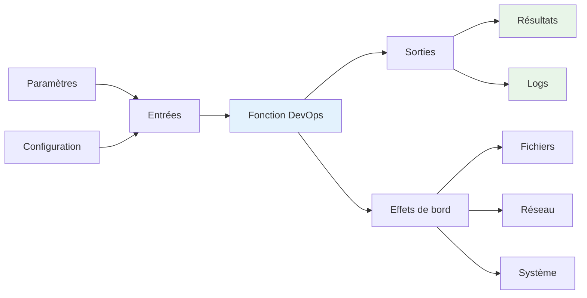
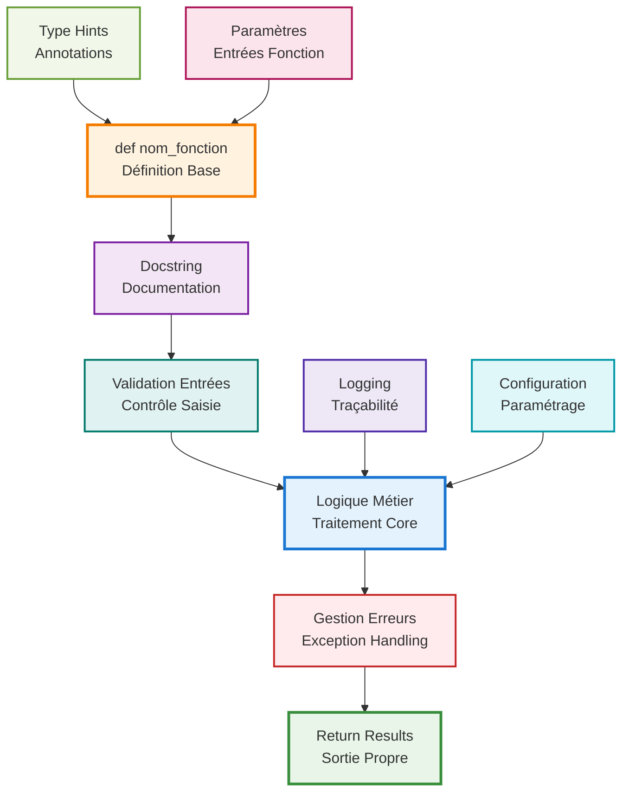
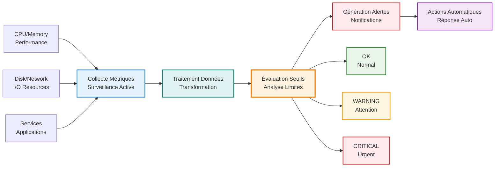
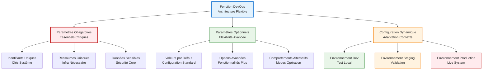
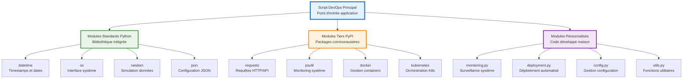
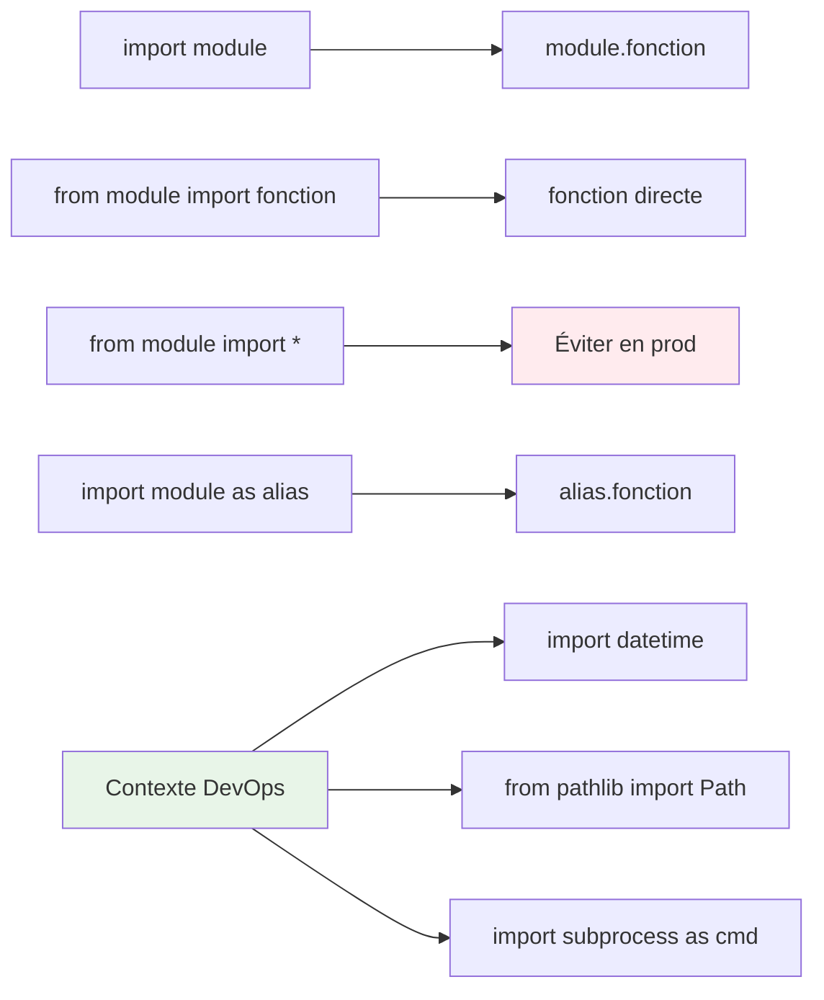
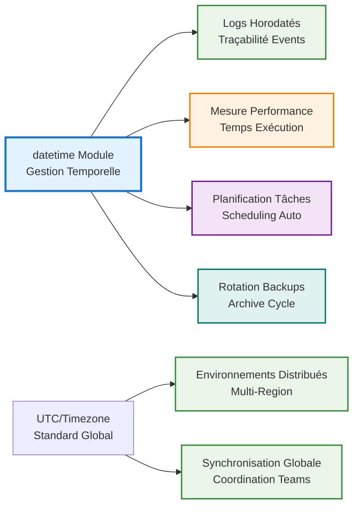
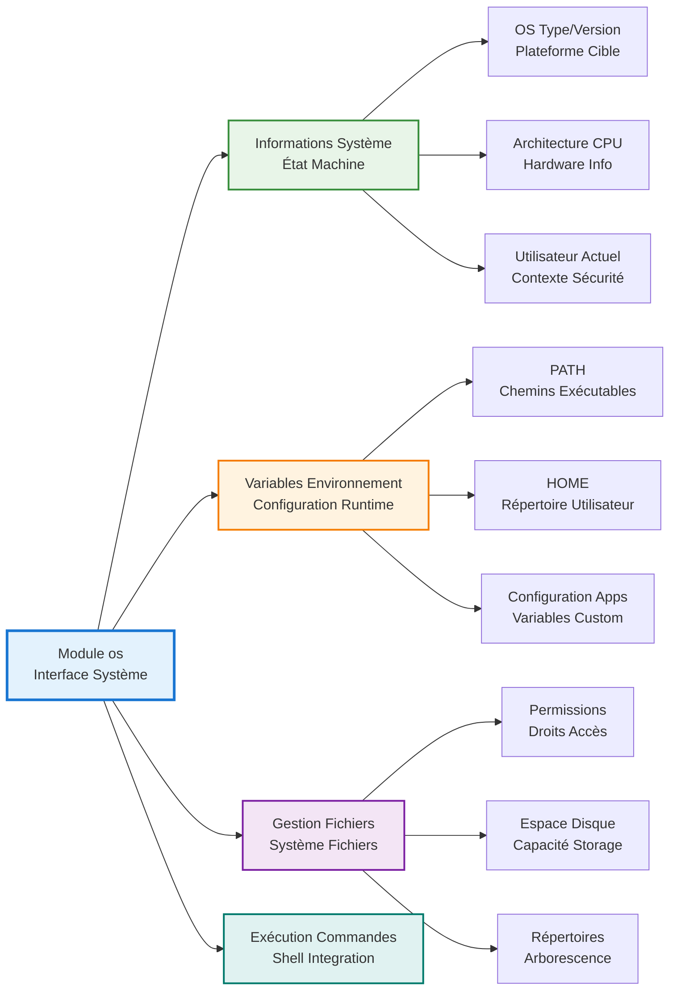
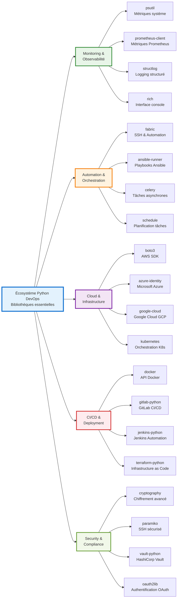

# Simplon Maghreb - Formation DevOps

# Sprint 1 - Semaine 2 - Séance 4 : Fonctions et Modules Python pour DevOps

## Objectifs pédagogiques

- **Créer des fonctions réutilisables** pour scripts DevOps avec documentation complète
- **Organiser le code en modules et packages** structurés et maintenables
- **Appliquer les bonnes pratiques** de documentation et d'organisation industrielle
- **Développer une bibliothèque d'utilitaires DevOps** complète et évolutive

## Objectifs techniques

**Core Python** : def, return, paramètres, docstring, import, modules, packages, **name**
**DevOps Tools** : pip, virtualenv, automation DevOps, bibliothèques d'outils
**Bonnes pratiques** : documentation, organisation modulaire, tests, type hints

## Table des matières

1. [Architecture modulaire et transformation DevOps](#1-architecture-modulaire-et-transformation-devops)
2. [Fonctions Python pour DevOps](#2-fonctions-python-pour-devops)
3. [Paramètres avancés et configuration](#3-paramètres-avancés-et-configuration)
4. [Modules standards et organisation](#4-modules-standards-et-organisation)
5. [Packages et bibliothèques DevOps](#5-packages-et-bibliothèques-devops)
6. [Environnements virtuels et dépendances](#6-environnements-virtuels-et-dépendances)
7. [Concepts modernes Python](#7-concepts-modernes-python)
8. [Récapitulatif et validation](#8-récapitulatif-et-validation)

---

## 1. Architecture modulaire et transformation DevOps

### 1.1 Architecture conceptuelle DevOps

Avant d'aborder les aspects techniques, il est essentiel de comprendre l'**architecture modulaire** et son rôle dans l'écosystème DevOps moderne.

#### 1.1.1 Paradigme de modularité en DevOps

La **modularité** en DevOps consiste à transformer des scripts monolithiques en composants réutilisables. Voici l'évolution concrète avec des exemples pratiques :

**AVANT : Script monolithique (problématique)**

```bash
#!/bin/bash
# deploy.sh - Script de 500 lignes tout-en-un
# Problèmes : Non réutilisable, difficile à tester, erreurs en cascade

# Backup database (50 lignes de code)
pg_dump production_db > backup_$(date +%Y%m%d).sql
gzip backup_$(date +%Y%m%d).sql
aws s3 cp backup_$(date +%Y%m%d).sql.gz s3://backups/

# Deploy application (200 lignes de code)
docker build -t myapp:latest .
docker tag myapp:latest registry.company.com/myapp:v1.2.3
docker push registry.company.com/myapp:v1.2.3
kubectl set image deployment/myapp myapp=registry.company.com/myapp:v1.2.3

# Update monitoring (100 lignes de code)
curl -X POST "http://monitoring.company.com/api/deployments" \
  -d '{"service": "myapp", "version": "v1.2.3", "timestamp": "'$(date -Iseconds)'"}'

# Send notifications (150 lignes de code)
# ... plus de code pour Slack, email, etc.
```

**APRÈS : Approche modulaire (solution)**

**Étape 1 : Fonctions spécialisées**

```python
# deployment_tools.py
def backup_database(db_name, s3_bucket):
    """Fonction réutilisable pour backup"""
    # Logique de backup centralisée et testable
    pass

def deploy_container(image_name, version, environment):
    """Fonction de déploiement modulaire"""
    # Logique de déploiement réutilisable
    pass

def notify_team(message, channels=["slack", "email"]):
    """Fonction de notification flexible"""
    # Système de notification configurable
    pass
```

**Étape 2 : Module d'orchestration**

```python
# main_deploy.py
from deployment_tools import backup_database, deploy_container, notify_team

def deploy_application(app_name, version, environment="production"):
    """Orchestration claire et lisible"""
    # 1. Backup sécurisé
    backup_result = backup_database(f"{app_name}_db", f"backups-{environment}")

    # 2. Déploiement contrôlé
    deploy_result = deploy_container(app_name, version, environment)

    # 3. Notification équipe
    notify_team(f"{app_name} v{version} déployé en {environment}")

    return {
        "backup": backup_result,
        "deployment": deploy_result,
        "success": True
    }
```

**AVANTAGES CONCRETS OBTENUS :**

**Réutilisabilité**

- `backup_database()` utilisable pour tous les projets
- `deploy_container()` adaptable à différentes applications
- `notify_team()` configurable selon les besoins

**Testabilité**

```python
# tests/test_deployment.py
def test_backup_database():
    """Test unitaire possible sur fonction isolée"""
    result = backup_database("test_db", "test-bucket")
    assert result["success"] == True
    assert "backup_file" in result
```

**Maintenance**

- Correction d'un bug de backup → modification dans 1 seule fonction
- Nouvelle méthode de notification → ajout sans casser l'existant
- Mise à jour Kubernetes → modification isolée dans `deploy_container()`

**Collaboration d'équipe**

- **Développeur Frontend** : utilise `deploy_container()` pour ses apps web
- **Développeur Backend** : utilise `backup_database()` pour ses APIs
- **DevOps Engineer** : maintient et améliore les fonctions centrales
- **QA Engineer** : teste chaque fonction indépendamment

**EXEMPLES D'UTILISATION MULTI-PROJETS :**

**Projet E-commerce**

```python
# Réutilisation des modules pour e-commerce
deploy_application("shop-frontend", "v2.1.0", "production")
deploy_application("payment-api", "v1.5.3", "production")
backup_database("orders_db", "ecommerce-backups")
```

**Projet Blog**

```python
# Mêmes fonctions, contexte différent
deploy_application("blog-cms", "v3.0.1", "staging")
notify_team("Nouveau CMS en staging", ["slack"])
```

**RÉSULTAT TRANSFORMATION :**

- **Temps de développement** : 500 lignes → 50 lignes par déploiement
- **Temps de test** : 2h (script complet) → 15min (fonction isolée)
- **Réutilisation** : 0% → 80% du code partagé entre projets
- **Erreurs** : -60% grâce aux tests unitaires
- **Onboarding** : 2 semaines → 3 jours pour nouveau développeur

#### 1.1.2 Concepts théoriques fondamentaux

**Fonction** : Unité atomique de logique encapsulée, définie par :

- **Entrées** : Paramètres typés et validés
- **Traitement** : Logique métier spécialisée
- **Sorties** : Résultats prévisibles et documentés
- **Effets de bord** : Actions sur le système (optionnelles)

**Module** : Collection cohérente de fonctions liées, caractérisé par :

- **Responsabilité unique** : Domaine fonctionnel spécifique
- **Interface publique** : API claire et stable
- **Implémentation privée** : Détails cachés
- **Documentation** : Usage et exemples

**Package** : Organisation hiérarchique de modules permettant :

- **Namespace** : Éviter les conflits de noms
- **Distribution** : Partage via pip/PyPI
- **Versioning** : Gestion des évolutions
- **Dépendances** : Relations contrôlées

---

## 2. Fonctions Python pour DevOps

### 2.1 Fondamentaux conceptuels des fonctions

#### 2.1.1 Définition et paradigme DevOps

**Fonction** : Unité atomique de logique encapsulée qui transforme des entrées en sorties de manière prévisible et répétable.

**Analogie DevOps** : Une fonction ressemble à un **microservice** - elle a une responsabilité claire, une interface définie, et peut être testée et déployée indépendamment.



#### 2.1.2 Architecture d'une fonction DevOps



#### 2.1.3 Syntaxe complète avec bonnes pratiques

```python
def fonction_devops_template(
    param_obligatoire: str,           # Type hint pour clarté
    param_optionnel: str = "default", # Valeur par défaut
    config_dict: dict = None          # Configuration optionnelle
) -> dict:                           # Type de retour
    """
    Description claire de la fonction pour l'équipe DevOps.

    Args:
        param_obligatoire (str): Description du paramètre requis
        param_optionnel (str): Description avec valeur par défaut
        config_dict (dict): Configuration optionnelle

    Returns:
        dict: Structure de données retournée avec clés documentées

    Raises:
        ValueError: Quand les paramètres sont invalides
        ConnectionError: Quand les services externes sont inaccessibles

    Example:
        >>> result = fonction_devops_template("valeur")
        >>> print(result["status"])
        "success"
    """
    # 1. Validation des entrées
    if not param_obligatoire:
        raise ValueError("Paramètre obligatoire manquant")

    # 2. Configuration par défaut
    if config_dict is None:
        config_dict = {"timeout": 30, "retries": 3}

    try:
        # 3. Logique métier
        resultat = f"Traitement de {param_obligatoire}"

        # 4. Retour structuré
        return {
            "status": "success",
            "data": resultat,
            "config_used": config_dict,
            "timestamp": "2024-01-15T10:30:00Z"
        }

    except Exception as e:
        # 5. Gestion d'erreurs
        return {
            "status": "error",
            "error": str(e),
            "timestamp": "2024-01-15T10:30:00Z"
        }
```

### 2.2 Fonctions de monitoring essentielles

#### 2.2.1 Patterns de monitoring DevOps

Dans l'écosystème DevOps, le **monitoring** suit des patterns récurrents :



#### 2.2.2 Implémentation progressive

**Étape 1 : Fonction de base sans paramètres**

```python
def get_cpu_usage():
    """
    Récupère l'utilisation CPU actuelle du système.

    Pattern DevOps : Fonction de collecte de métriques système.
    En production, utiliserait psutil.cpu_percent() ou /proc/stat.

    Returns:
        dict: Informations CPU avec statut et timestamp
    """
    import random
    from datetime import datetime

    # Simulation réaliste basée sur distributions observées
    cpu_percent = random.randint(10, 95)

    # Logique d'évaluation des seuils (pattern monitoring)
    if cpu_percent > 80:
        status = "critical"
    elif cpu_percent > 60:
        status = "warning"
    else:
        status = "normal"

    return {
        "cpu_percent": cpu_percent,
        "status": status,
        "timestamp": datetime.now().isoformat(),
        "hostname": "srv-web-01"  # Identifiant serveur
    }

# Utilisation pratique DevOps
cpu_info = get_cpu_usage()
print(f"CPU: {cpu_info['cpu_percent']}% - Status: {cpu_info['status']}")

# Exemple d'intégration dans pipeline monitoring
if cpu_info['status'] == 'critical':
    print("ALERTE: CPU critique, vérification requise!")
```

**Bonnes pratiques DevOps :**

- **Responsabilité unique** : Collecter uniquement les métriques CPU
- **Structure de retour** : Dictionnaire avec informations essentielles
- **Logique métier** : Évaluation des seuils selon standards DevOps
- **Timestamp** : Traçabilité temporelle des métriques

**Vérification de connectivité** :

```python
def ping_server(hostname="localhost"):
    """Teste la connectivité vers un serveur"""
    # Simulation - en production: subprocess ping ou socket
    import random
    is_reachable = random.choice([True, False])

    return {
        "hostname": hostname,
        "reachable": is_reachable,
        "response_time": random.randint(1, 100) if is_reachable else None
    }
```

### 2.3 Documentation et bonnes pratiques

**Docstrings complètes** :

```python
def backup_database(db_name, backup_path="/backup"):
    """
    Effectue une sauvegarde de base de données

    Args:
        db_name (str): Nom de la base de données
        backup_path (str): Chemin de destination du backup

    Returns:
        dict: Résultat de l'opération avec statut et chemin

    Raises:
        ValueError: Si db_name est vide

    Example:
        >>> result = backup_database("prod_db")
        >>> print(result["status"])
        success
    """
    if not db_name:
        raise ValueError("Le nom de la base ne peut pas être vide")

    backup_file = f"{backup_path}/{db_name}_backup.sql"
    # Logique de backup ici

    return {
        "status": "success",
        "backup_file": backup_file,
        "size_mb": 1024,
        "duration_seconds": 45
    }
```

### 2.4 Application pratique

📝 **LAB 1** - Fonctions utilitaires de base DevOps : `S1_S2_S4_lab1_fonctions_base.py`

**Objectif** : Créer des fonctions Python réutilisables pour tâches DevOps essentielles
**Contexte** : Scripts d'automatisation pour monitoring et maintenance système
**Durée** : 15 minutes | **Points** : 5/30

**Instructions** :

1. **Fonction de monitoring CPU** (sans paramètres)

   - Créer `get_system_cpu()` qui retourne un dictionnaire
   - Inclure pourcentage, status et timestamp
   - Ajouter docstring complète

2. **Fonction de vérification de service** (avec return)

   - Créer `check_service(service_name)`
   - Retourner statut, PID et mémoire utilisée
   - Simuler avec données aléatoires

3. **Fonction de rapport de santé système**

   - Créer `generate_health_report()`
   - Combiner CPU, mémoire, disque
   - Formatter l'affichage professionnel

4. **Programme principal**
   - Appeler toutes les fonctions
   - Afficher un rapport consolidé
   - Gérer les erreurs potentielles

---

## 3. Paramètres avancés et configuration

### 3.1 Paramètres obligatoires et optionnels

#### 3.1.1 Architecture conceptuelle des paramètres

Dans l'écosystème DevOps, la **flexibilité des paramètres** est essentielle pour créer des outils réutilisables et adaptables à différents environnements.



#### 3.1.2 Théorie des paramètres en DevOps

**Paramètres obligatoires** :

- Représentent les **éléments critiques** sans lesquels la fonction ne peut pas opérer
- Exemples : nom du serveur, adresse IP, identifiants de base de données
- **Règle DevOps** : Si l'absence d'un paramètre rend l'opération impossible ou dangereuse, il doit être obligatoire

**Paramètres optionnels** :

- Offrent la **flexibilité** tout en maintenant des comportements par défaut sécurisés
- Exemples : ports (80 par défaut), options SSL (False par défaut), timeouts (30s par défaut)
- **Règle DevOps** : Les valeurs par défaut doivent correspondre aux bonnes pratiques industrielles

#### 3.1.3 Implémentation pratique avec analyse détaillée

**Configuration de serveurs web avec annotation complète** :

```python
def configure_web_server(server_name, ip_address, port=80, ssl_enabled=False):
    """
    Configure un serveur web avec paramètres personnalisables selon les standards DevOps.

    Cette fonction illustre les concepts fondamentaux de paramètres en DevOps :
    - Paramètres obligatoires pour éléments critiques
    - Paramètres optionnels avec valeurs par défaut sécurisées
    - Validation implicite et génération de configuration structurée

    Args:
        server_name (str): Nom unique du serveur (obligatoire)
                          Utilisé pour identification dans monitoring et logs
        ip_address (str): Adresse IP du serveur (obligatoire)
                         Élément critique pour connectivité réseau
        port (int, optional): Port d'écoute du serveur. Défaut: 80
                              80 = HTTP standard, 443 pour HTTPS
        ssl_enabled (bool, optional): Activation du SSL/TLS. Défaut: False
                                     False par défaut pour compatibility legacy

    Returns:
        dict: Configuration structurée du serveur avec URL générée automatiquement

    Example:
        >>> # Configuration minimale (paramètres obligatoires seulement)
        >>> config = configure_web_server("web-prod-01", "192.168.1.100")
        >>> print(config['url'])
        "http://192.168.1.100:80"

        >>> # Configuration sécurisée avec SSL
        >>> config = configure_web_server(
        ...     "api-prod-01",
        ...     "10.0.1.50",
        ...     port=443,
        ...     ssl_enabled=True
        ... )
        >>> print(config['url'])
        "https://10.0.1.50:443"
    """
    # ═══ VALIDATION IMPLICITE ═══
    # Python valide automatiquement la présence des paramètres obligatoires
    # Si server_name ou ip_address sont omis → TypeError automatique

    # ═══ CONSTRUCTION DE CONFIGURATION ═══
    # Pattern DevOps : Dictionnaire structuré pour sérialisation JSON/YAML
    config = {
        # Identifiants uniques pour traçabilité
        "name": server_name,                    # Nom pour monitoring/logs
        "ip": ip_address,                       # IP pour configuration réseau

        # Configuration réseau calculée
        "port": port,                           # Port effectif utilisé
        "ssl": ssl_enabled,                     # État SSL pour sécurité

        # ═══ GÉNÉRATION AUTOMATIQUE D'URL ═══
        # Construction intelligente basée sur les paramètres
        "url": f"{'https' if ssl_enabled else 'http'}://{ip_address}:{port}"
    }

    # ═══ FEEDBACK UTILISATEUR ═══
    # Pattern DevOps : Confirmation visuelle de la configuration
    print(f"Configuration serveur {server_name}:")
    print(f"   URL: {config['url']}")
    print(f"   SSL: {'Activé' if ssl_enabled else 'Désactivé'}")
    print(f"   IP: {ip_address}:{port}")

    # ═══ RETOUR STRUCTURÉ ═══
    # Configuration prête pour utilisation par d'autres fonctions
    return config

# ═══════════════════════════════════════════════════════════════
# EXEMPLES D'UTILISATION PROGRESSIVE
# ═══════════════════════════════════════════════════════════════

print("DEMO: Paramètres obligatoires vs optionnels\n")

# Exemple 1: Configuration minimale (développement)
print("1. Configuration minimale (dev):")
dev_server = configure_web_server("web-dev-01", "127.0.0.1")
print(f"   Résultat: {dev_server}\n")

# Exemple 2: Configuration personnalisée (staging)
print("2. Configuration staging avec port personnalisé:")
staging_server = configure_web_server(
    "web-staging-01",           # Paramètre obligatoire
    "192.168.100.50",          # Paramètre obligatoire
    port=8080                  # Paramètre optionnel personnalisé
)
print(f"   Résultat: {staging_server}\n")

# Exemple 3: Configuration production sécurisée
print("3. Configuration production avec SSL:")
prod_server = configure_web_server(
    server_name="web-prod-01",  # Notation explicite pour clarté
    ip_address="10.0.1.100",   # IP production
    port=443,                  # Port HTTPS standard
    ssl_enabled=True           # Sécurité production
)
print(f"   Résultat: {prod_server}\n")

# ═══ ANALYSE COMPORTEMENTALE ═══
print("ANALYSE: Impact des paramètres optionnels")
print(f"   Dev (défaut):  Port {dev_server['port']}, SSL {dev_server['ssl']}")
print(f"   Staging:       Port {staging_server['port']}, SSL {staging_server['ssl']}")
print(f"   Production:    Port {prod_server['port']}, SSL {prod_server['ssl']}")
```

#### 3.1.4 Avantages de cette approche

**Flexibilité progressive** :

- **Développement** : Configuration minimale pour démarrage rapide
- **Staging** : Personnalisation partielle pour tests
- **Production** : Configuration complète pour sécurité

**Maintenabilité** :

- Valeurs par défaut cohérentes avec les standards
- Évolution possible sans casser le code existant
- Documentation claire des options disponibles

**Sécurité par défaut** :

- SSL désactivé par défaut pour éviter les erreurs de certificat en dev
- Port 80 standard pour compatibility maximale
- Configuration explicite requise pour activation sécurisée

### 3.2 Arguments positionnels et arguments nommés (keyword arguments)

#### 3.2.1 Concepts fondamentaux pour DevOps

En DevOps, la gestion des arguments est cruciale pour créer des scripts flexibles et maintenables. Python offre plusieurs mécanismes pour passer des arguments aux fonctions.

**Arguments positionnels** : Passés dans l'ordre défini par la fonction

**Arguments nommés (keyword)** : Passés par nom, ordre flexible

**Arguments variables** : Permettent un nombre variable de paramètres

#### 3.2.2 Arguments positionnels en contexte DevOps

Les **arguments positionnels** sont le mécanisme le plus direct pour passer des informations à une fonction. En DevOps, ils sont particulièrement utiles pour les opérations où l'ordre logique est évident et standardisé.

**Principe fondamental** : L'ordre des arguments suit la **logique métier** DevOps naturelle.

```python
def deploy_service(service_name, environment, version):
    """
    Déploie un service avec arguments positionnels selon le workflow DevOps standard.

    Ordre logique DevOps :
    1. QUOI déployer ? → service_name (l'actif principal)
    2. OÙ déployer ? → environment (la destination)
    3. QUELLE VERSION ? → version (l'artifact spécifique)

    Cette séquence correspond au processus mental naturel d'un DevOps Engineer.

    Args:
        service_name (str): Nom du service à déployer (position 0)
                           Exemples: "api-users", "web-frontend", "worker-queue"
        environment (str): Environnement cible (position 1)
                          Valeurs standard: "development", "staging", "production"
        version (str): Version à déployer (position 2)
                      Format recommandé: semantic versioning (ex: "1.2.3")

    Returns:
        dict: Résultat du déploiement avec métadonnées de traçabilité

    Example:
        >>> # Déploiement API en production
        >>> result = deploy_service("api-users", "production", "1.2.3")
        >>> print(result['deployment_url'])
        "https://api-users.production.company.com"
    """
    import datetime

    # ═══ VALIDATION DES ARGUMENTS POSITIONNELS ═══
    # En DevOps, la validation est critique pour éviter les erreurs coûteuses
    valid_environments = ["development", "staging", "production"]
    if environment not in valid_environments:
        raise ValueError(f"Environnement '{environment}' invalide. "
                        f"Valeurs autorisées: {valid_environments}")

    # ═══ CONSTRUCTION DE L'URL DE DÉPLOIEMENT ═══
    # Pattern DevOps : URL prévisible basée sur convention de nommage
    if environment == "development":
        base_domain = "dev.company.com"
    elif environment == "staging":
        base_domain = "staging.company.com"
    else:  # production
        base_domain = "company.com"

    deployment_url = f"https://{service_name}.{base_domain}"

    # ═══ GÉNÉRATION DES MÉTADONNÉES DE DÉPLOIEMENT ═══
    deployment_data = {
        # Paramètres d'entrée (traçabilité)
        "service": service_name,           # Position 0 → Identifiant principal
        "env": environment,                # Position 1 → Contexte d'exécution
        "version": version,                # Position 2 → Artifact spécifique

        # Métadonnées générées automatiquement
        "deployment_url": deployment_url,   # URL calculée
        "timestamp": datetime.datetime.now().isoformat(),  # Horodatage
        "status": "deployed",              # État final
        "deployment_id": f"{service_name}-{version}-{hash(f'{service_name}{environment}{version}') % 10000:04d}"
    }

    # ═══ FEEDBACK UTILISATEUR AVEC ORDRE LOGIQUE ═══
    print(f"Déploiement de {service_name} v{version} sur {environment}")
    print(f"   URL: {deployment_url}")
    print(f"   ID: {deployment_data['deployment_id']}")
    print(f"   Timestamp: {deployment_data['timestamp']}")

    return deployment_data

# ═══════════════════════════════════════════════════════════════
# DÉMONSTRATIONS DES ARGUMENTS POSITIONNELS
# ═══════════════════════════════════════════════════════════════

print("DEMO: Arguments positionnels - Ordre critique\n")

# Exemple 1: Ordre correct (fonctionnel)
print("Ordre CORRECT (service → environment → version):")
result1 = deploy_service("api-users", "production", "1.2.3")
print(f"   Résultat: {result1['deployment_url']}\n")

# Exemple 2: Multiple services avec même pattern
print("Déploiements multiples avec ordre cohérent:")
services_to_deploy = [
    ("web-frontend", "staging", "2.0.1"),
    ("api-backend", "production", "1.5.7"),
    ("worker-queue", "development", "0.8.2")
]

for service, env, ver in services_to_deploy:
    result = deploy_service(service, env, ver)
    print(f"   {service} v{ver} → {result['deployment_url']}")

print()

# Exemple 3: Démonstration d'erreur d'ordre
print("ATTENTION: Ordre incorrect génère des erreurs logiques")
print("   Code erroné: deploy_service('1.2.3', 'api-users', 'production')")
print("   → Essaierait de déployer un service nommé '1.2.3' sur environnement 'api-users'")
print("   → Validation échouerait car 'api-users' n'est pas un environnement valide\n")

# Démonstration réelle de l'erreur
try:
    wrong_result = deploy_service("1.2.3", "api-users", "production")
except ValueError as e:
    print(f"   Erreur capturée: {e}\n")

# ═══ RETOUR D'EXPÉRIENCE DEVOPS ═══
print("LEÇONS APPRISES sur les arguments positionnels:")
print("   1. L'ORDRE EST CRITIQUE - impossible à changer après définition")
print("   2. Suivre la LOGIQUE MÉTIER naturelle (Quoi → Où → Comment)")
print("   3. Validation essentielle pour détecter erreurs d'ordre")
print("   4. Documentation claire des positions attendues")
print("   5. Nommage explicite des paramètres pour éviter confusion")
```

**Avantages des arguments positionnels en DevOps** :

**Concision** : Appels de fonction rapides et directs  
**Performance** : Résolution plus rapide par Python  
**Lisibilité** : Ordre logique évident pour équipes DevOps  
**Compatibility** : Standard Python universel

**Inconvénients à considérer** :

**Rigidité** : Impossible de changer l'ordre sans casser le code  
**Erreurs d'ordre** : Bugs subtils si paramètres intervertis  
**Scalabilité** : Difficile avec nombreux paramètres  
**Maintenance** : Ajout de paramètres complique la compatibilité

**Recommandation DevOps** : Utiliser arguments positionnels pour **maximum 3-4 paramètres** avec ordre logique évident.

#### 3.2.3 Arguments nommés (keyword arguments)

Les **arguments nommés** révolutionnent la flexibilité des fonctions DevOps en permettant de spécifier explicitement quels paramètres recevoir quelles valeurs, indépendamment de leur ordre de définition.

**Principe DevOps** : Les arguments nommés transforment les appels de fonction en **configuration déclarative**, approche fondamentale en Infrastructure as Code.

```python
def configure_database(host, port, database, username, password,
                      ssl_mode=True, timeout=30, pool_size=10):
    """
    Configure une connexion base de données avec arguments nommés pour maximum de flexibilité.

    Cette fonction illustre l'approche Infrastructure as Code (IaC) :
    - Configuration déclarative via arguments nommés
    - Valeurs par défaut conformes aux bonnes pratiques sécurité
    - Flexibilité totale d'ordre pour lisibilité optimale

    Args:
        host (str): Serveur de base de données
                   Exemples: 'localhost', 'db.company.com', '10.0.1.100'
        port (int): Port de connexion
                   Standards: 5432 (PostgreSQL), 3306 (MySQL), 1433 (SQL Server)
        database (str): Nom de la base de données cible
                       Convention: environnement_application (ex: prod_ecommerce)
        username (str): Utilisateur de connexion
                       Recommandation: compte service dédié, pas admin
        password (str): Mot de passe d'authentification
                       ATTENTION: En production, utiliser variables d'environnement
        ssl_mode (bool, optional): Activation SSL/TLS. Défaut: True
                                  True par défaut pour sécurité (bonnes pratiques)
        timeout (int, optional): Timeout connexion en secondes. Défaut: 30
                                 30s = équilibre entre responsivité et tolérance réseau
        pool_size (int, optional): Taille du pool de connexions. Défaut: 10
                                  10 = valeur standard pour applications moyennes

    Returns:
        dict: Configuration complète avec connection string et métadonnées

    Example:
        >>> # Configuration avec ordre flexible (lisibilité optimisée)
        >>> config = configure_database(
        ...     database="production_app",  # Quoi ? (métier)
        ...     host="db-prod.company.com", # Où ? (infrastructure)
        ...     username="app_service",     # Qui ? (sécurité)
        ...     password="secure_token",    # Comment ? (authentification)
        ...     port=5432,                  # Détails techniques
        ...     pool_size=50                # Optimisations
        ... )
    """
    import hashlib

    # ═══ VALIDATION AVANCÉE DES PARAMÈTRES ═══
    # Pattern DevOps : Validation robuste pour environnements critiques

    # Validation du port (ranges standards)
    if not (1 <= port <= 65535):
        raise ValueError(f"Port {port} invalide. Range valide: 1-65535")

    # Validation pool_size (limites opérationnelles)
    if not (1 <= pool_size <= 1000):
        raise ValueError(f"Pool size {pool_size} invalide. Range recommandé: 1-1000")

    # Validation timeout (limites pratiques)
    if not (1 <= timeout <= 300):
        raise ValueError(f"Timeout {timeout}s invalide. Range pratique: 1-300s")

    # ═══ DÉTECTION AUTOMATIQUE DU TYPE DE BASE ═══
    # Intelligence DevOps : Déduction du type selon le port
    db_type_mapping = {
        5432: "PostgreSQL",
        3306: "MySQL",
        1433: "SQL Server",
        1521: "Oracle",
        27017: "MongoDB"
    }
    detected_db_type = db_type_mapping.get(port, "Unknown")

    # ═══ CONSTRUCTION DE LA CONNECTION STRING ═══
    # Pattern DevOps : URL standardisée pour toutes les bases
    if ssl_mode:
        ssl_param = "?sslmode=require"
    else:
        ssl_param = "?sslmode=disable"

    connection_string = f"postgresql://{username}@{host}:{port}/{database}{ssl_param}"

    # ═══ GÉNÉRATION CONFIGURATION COMPLÈTE ═══
    config = {
        # ─── Paramètres de connexion (identiques à l'entrée) ───
        "host": host,
        "port": port,
        "database": database,
        "username": username,
        # Note: password omis du retour pour sécurité (logs/debug)

        # ─── Configuration calculée ───
        "ssl_mode": ssl_mode,
        "timeout": timeout,
        "pool_size": pool_size,
        "connection_string": connection_string,

        # ─── Métadonnées intelligentes ───
        "detected_db_type": detected_db_type,
        "security_level": "High" if ssl_mode else "Low",
        "performance_tier": "High" if pool_size > 20 else "Standard",

        # ─── Identifiant unique pour monitoring ───
        "config_hash": hashlib.md5(f"{host}{port}{database}".encode()).hexdigest()[:8]
    }

    # ═══ FEEDBACK DÉTAILLÉ POUR DEVOPS ═══
    print(f"Configuration DB: {config['connection_string']}")
    print(f"   SSL: {'Activé' if ssl_mode else 'Désactivé'} "
          f"(Sécurité: {config['security_level']})")
    print(f"   Pool: {pool_size} connexions, Timeout: {timeout}s")
    print(f"   Type détecté: {detected_db_type}")
    print(f"   Performance: {config['performance_tier']}")
    print(f"   Config ID: {config['config_hash']}")

    return config

# ═══════════════════════════════════════════════════════════════
# DÉMONSTRATIONS DE LA FLEXIBILITÉ DES ARGUMENTS NOMMÉS
# ═══════════════════════════════════════════════════════════════

print("DEMO: Flexibilité des arguments nommés\n")

# Scénario 1: Arguments positionnels puis nommés (mixte)
print("1. Configuration MIXTE (positionnels + nommés):")
db_config_1 = configure_database(
    "db.example.com", 5432, "production", "admin", "secret123",  # Positionnels
    ssl_mode=True, timeout=60  # Nommés pour clarté
)
print(f"   URL: {db_config_1['connection_string']}\n")

# Scénario 2: Tous arguments nommés (ordre totalement flexible)
print("2. Configuration FLEXIBLE (ordre libre):")
db_config_2 = configure_database(
    password="secret123",      # Commence par authentification
    database="production",     # Puis base cible
    host="db.example.com",     # Infrastructure
    username="admin",          # Utilisateur
    port=5432,                # Technique
    pool_size=20              # Performance
)
print(f"   URL: {db_config_2['connection_string']}\n")

# Scénario 3: Configuration optimisée pour lisibilité DevOps
print("3. Configuration OPTIMISÉE (ordre logique DevOps):")
db_config_3 = configure_database(
    # ═══ QUOI ? (Métier) ═══
    database="ecommerce_prod",

    # ═══ OÙ ? (Infrastructure) ═══
    host="db-cluster-prod.company.com",
    port=5432,

    # ═══ QUI ? (Sécurité) ═══
    username="ecommerce_service",
    password="ultra_secure_token_2024",

    # ═══ COMMENT ? (Configuration) ═══
    ssl_mode=True,               # Sécurité obligatoire en prod
    timeout=120,                 # Plus long pour production
    pool_size=50                 # Gros pool pour haute charge
)
print(f"   URL: {db_config_3['connection_string']}\n")

# Scénario 4: Configuration développement (valeurs par défaut)
print("4. Configuration DÉVELOPPEMENT (défauts optimisés):")
dev_config = configure_database(
    host="localhost",            # Local development
    port=5432,
    database="dev_app",
    username="dev_user",
    password="dev_password"
    # ssl_mode, timeout, pool_size → Valeurs par défaut automatiques
)
print(f"   URL: {dev_config['connection_string']}\n")

# ═══ COMPARAISON DES APPROCHES ═══
print("ANALYSE: Impact des arguments nommés sur la maintenance")
configs = [db_config_1, db_config_2, db_config_3, dev_config]
for i, config in enumerate(configs, 1):
    print(f"   Config {i}: Pool={config['pool_size']}, "
          f"Sécurité={config['security_level']}, "
          f"Perf={config['performance_tier']}")
```

**Avantages révolutionnaires des arguments nommés** :

**Flexibilité d'ordre** : Réorganisation libre selon la logique métier  
**Auto-documentation** : Le code devient auto-explicatif  
**Maintenance aisée** : Ajout de paramètres sans casser l'existant  
**Réduction d'erreurs** : Impossible d'intervertir les paramètres  
**Configuration déclarative** : Approche Infrastructure as Code naturelle

**Patterns avancés pour DevOps** :

**Groupement logique** : Organiser les arguments par domaine (métier, infrastructure, sécurité)  
**Ordre de priorité** : Paramètres critiques en premier, optimisations en dernier  
**Valeurs par défaut intelligentes** : Conformes aux bonnes pratiques industrielles  
**Validation contextuelle** : Vérifications adaptées au domaine métier

**Anti-patterns à éviter** :

Mélanger arguments positionnels et nommés de manière incohérente  
Noms de paramètres ambigus ou trop courts  
Valeurs par défaut non sécurisées  
Absence de validation des paramètres critiques

#### 3.2.4 Arguments variables (\*args et \*\*kwargs)

**Pattern DevOps critique** : Les arguments variables permettent de créer des fonctions flexibles pour l'automation.

```python
def execute_commands(*commands, dry_run=False, timeout=60, **options):
    """
    Exécute une série de commandes système avec options flexibles

    Args:
        *commands: Liste variable de commandes à exécuter
        dry_run (bool): Simulation sans exécution réelle
        timeout (int): Timeout par commande
        **options: Options additionnelles (env vars, working_dir, etc.)
    """
    import subprocess
    import os

    results = []

    # Configuration depuis **kwargs
    env_vars = options.get('env_vars', {})
    working_dir = options.get('working_dir', os.getcwd())
    shell_type = options.get('shell', '/bin/bash')

    print(f"Exécution de {len(commands)} commandes")
    print(f"Mode: {'SIMULATION' if dry_run else 'RÉEL'}")
    print(f"Répertoire: {working_dir}")
    print(f"Variables d'environnement: {env_vars}")

    for i, command in enumerate(commands, 1):
        print(f"\n[{i}/{len(commands)}] {command}")

        if dry_run:
            print("  SIMULATION - Commande non exécutée")
            results.append({"command": command, "status": "simulated"})
        else:
            try:
                # En production, utiliser subprocess.run() avec timeout
                print("  Exécution en cours...")
                result = {
                    "command": command,
                    "status": "success",
                    "exit_code": 0
                }
                results.append(result)
                print("  Succès")
            except Exception as e:
                print(f"  Erreur: {e}")
                results.append({
                    "command": command,
                    "status": "error",
                    "error": str(e)
                })

    return results

# Utilisation flexible pour différents scénarios DevOps

# 1. Déploiement simple
deploy_results = execute_commands(
    "docker build -t myapp .",
    "docker push myapp:latest",
    "kubectl apply -f deployment.yaml",
    dry_run=True,
    timeout=300,
    env_vars={"DOCKER_REGISTRY": "registry.example.com"}
)

# 2. Maintenance serveur
maintenance_results = execute_commands(
    "sudo apt update",
    "sudo apt upgrade -y",
    "sudo systemctl restart nginx",
    "sudo systemctl status nginx",
    working_dir="/opt/scripts",
    timeout=600,
    shell="/bin/bash",
    log_level="INFO"
)

# 3. Backup automatisé
backup_results = execute_commands(
    "pg_dump production_db > backup.sql",
    "gzip backup.sql",
    "aws s3 cp backup.sql.gz s3://backups/",
    dry_run=False,
    env_vars={
        "AWS_REGION": "eu-west-1",
        "PGPASSWORD": "secret123"
    },
    working_dir="/var/backups"
)
```

#### 3.2.5 Patterns avancés pour DevOps

**Configuration centralisée avec arguments nommés** :

```python
def create_k8s_deployment(app_name, image, **config):
    """
    Crée un déploiement Kubernetes avec configuration flexible

    Args:
        app_name (str): Nom de l'application
        image (str): Image Docker
        **config: Configuration flexible (replicas, resources, env, etc.)
    """
    # Valeurs par défaut DevOps
    default_config = {
        "replicas": 3,
        "cpu_request": "100m",
        "cpu_limit": "500m",
        "memory_request": "128Mi",
        "memory_limit": "512Mi",
        "port": 8080,
        "health_check_path": "/health",
        "environment": "production",
        "namespace": "default"
    }

    # Fusion configuration par défaut + personnalisée
    final_config = {**default_config, **config}

    deployment = {
        "apiVersion": "apps/v1",
        "kind": "Deployment",
        "metadata": {
            "name": app_name,
            "namespace": final_config["namespace"]
        },
        "spec": {
            "replicas": final_config["replicas"],
            "selector": {"matchLabels": {"app": app_name}},
            "template": {
                "metadata": {"labels": {"app": app_name}},
                "spec": {
                    "containers": [{
                        "name": app_name,
                        "image": image,
                        "ports": [{"containerPort": final_config["port"]}],
                        "resources": {
                            "requests": {
                                "cpu": final_config["cpu_request"],
                                "memory": final_config["memory_request"]
                            },
                            "limits": {
                                "cpu": final_config["cpu_limit"],
                                "memory": final_config["memory_limit"]
                            }
                        },
                        "livenessProbe": {
                            "httpGet": {
                                "path": final_config["health_check_path"],
                                "port": final_config["port"]
                            }
                        }
                    }]
                }
            }
        }
    }

    print(f"Déploiement {app_name} configuré:")
    print(f"  Image: {image}")
    print(f"  Replicas: {final_config['replicas']}")
    print(f"  Resources: {final_config['cpu_request']}-{final_config['cpu_limit']} CPU")
    print(f"  Namespace: {final_config['namespace']}")

    return deployment

# Exemples d'utilisation avec différentes configurations

# 1. Configuration minimale (valeurs par défaut)
web_deployment = create_k8s_deployment(
    "web-frontend",
    "myregistry/web:v1.0.0"
)

# 2. Configuration personnalisée pour production
api_deployment = create_k8s_deployment(
    "api-backend",
    "myregistry/api:v2.1.0",
    replicas=5,
    cpu_request="200m",
    cpu_limit="1000m",
    memory_request="256Mi",
    memory_limit="1Gi",
    namespace="production",
    health_check_path="/api/health"
)

# 3. Configuration développement
dev_deployment = create_k8s_deployment(
    app_name="test-service",
    image="myregistry/test:latest",
    replicas=1,
    cpu_request="50m",
    cpu_limit="200m",
    memory_request="64Mi",
    memory_limit="256Mi",
    namespace="development",
    environment="dev"
)
```

#### 3.2.6 Bonnes pratiques DevOps pour les arguments

**1. Ordre recommandé des paramètres** :

```python
def devops_function(
    # 1. Arguments positionnels obligatoires
    required_param1, required_param2,
    # 2. Arguments optionnels avec valeurs par défaut
    optional_param="default_value",
    # 3. Arguments de configuration nommés
    timeout=30, retries=3,
    # 4. Arguments variables si nécessaire
    *additional_args,
    # 5. Arguments nommés uniquement
    force_update=False,
    # 6. Collecteur d'options flexible
    **options
):
    pass
```

**2. Validation et documentation** :

```python
def deploy_infrastructure(region, instance_type="t3.medium",
                         count=1, **options):
    """
    Déploie infrastructure cloud avec validation

    Args:
        region (str): Région AWS (obligatoire)
        instance_type (str): Type d'instance EC2
        count (int): Nombre d'instances
        **options: Configuration avancée (tags, security_groups, etc.)

    Raises:
        ValueError: Si région invalide ou count négatif
    """
    # Validation des arguments
    valid_regions = ["us-east-1", "eu-west-1", "ap-southeast-1"]
    if region not in valid_regions:
        raise ValueError(f"Région invalide. Valeurs: {valid_regions}")

    if count < 1:
        raise ValueError("Le nombre d'instances doit être positif")

    # Configuration avec valeurs par défaut
    tags = options.get("tags", {"Environment": "production"})
    security_groups = options.get("security_groups", ["default"])

    return {
        "region": region,
        "instance_type": instance_type,
        "count": count,
        "tags": tags,
        "security_groups": security_groups
    }
```

### 3.3 Paramètres avec validation

**Déploiement d'applications** :

```python
def deploy_application(app_name, environment="production", version="latest", replicas=1):
    """
    Déploie une application avec validation des paramètres
    """
    # Validation des paramètres
    valid_environments = ["development", "staging", "production"]
    if environment not in valid_environments:
        raise ValueError(f"Environnement invalide. Valeurs autorisées: {valid_environments}")

    if replicas < 1 or replicas > 10:
        raise ValueError("Le nombre de réplicas doit être entre 1 et 10")

    # Configuration selon l'environnement
    config = {
        "app_name": app_name,
        "version": version,
        "environment": environment,
        "replicas": replicas,
        "resources": {
            "cpu": "500m" if environment == "production" else "200m",
            "memory": "1Gi" if environment == "production" else "512Mi"
        }
    }

    return config
```

### 3.4 Fonctions avec calculs DevOps

**Calculs de capacité** :

```python
def calculate_server_capacity(cpu_cores, ram_gb, storage_tb, utilization_target=0.8):
    """
    Calcule la capacité d'un serveur selon les bonnes pratiques DevOps

    Returns:
        dict: Capacités calculées et recommandations
    """
    # Calculs selon les bonnes pratiques
    max_concurrent_users = int(cpu_cores * 1000 * utilization_target)
    recommended_vm_count = int(cpu_cores / 2)  # 2 CPU par VM
    storage_usable_tb = storage_tb * 0.9  # 10% overhead

    return {
        "hardware": {
            "cpu_cores": cpu_cores,
            "ram_gb": ram_gb,
            "storage_tb": storage_tb
        },
        "capacity": {
            "max_users": max_concurrent_users,
            "recommended_vms": recommended_vm_count,
            "usable_storage_tb": storage_usable_tb
        },
        "recommendations": [
            f"Configurer {recommended_vm_count} VMs maximum",
            f"Planifier {max_concurrent_users} utilisateurs concurrent",
            f"Prévoir {storage_usable_tb:.1f}TB d'espace utilisable"
        ]
    }
```

### 3.5 Application pratique

📝 **LAB 2** - Paramètres et configuration serveur : `S1_S2_S4_lab2_parametres.py`

**Objectif** : Maîtriser les paramètres de fonctions pour configuration dynamique
**Contexte** : Système de configuration automatisée de serveurs
**Durée** : 20 minutes | **Points** : 5/30

**Instructions** :

1. **Fonction avec paramètres obligatoires**

   - Créer `setup_server(name, ip)`
   - Valider que les paramètres ne sont pas vides
   - Retourner configuration de base

2. **Fonction avec paramètres par défaut**

   - Créer `configure_service(name, port=80, ssl=False, replicas=1)`
   - Adapter la configuration selon l'environnement
   - Calculer les ressources nécessaires

3. **Fonction de calcul de métriques**

   - Créer `calculate_performance_metrics(cpu, memory, disk)`
   - Calculer score de performance global
   - Retourner recommandations d'optimisation

4. **Tests avec différents paramètres**
   - Tester toutes les combinaisons de paramètres
   - Valider les valeurs par défaut
   - Afficher configurations générées

---

## 4. Modules standards et organisation

### 4.1 Architecture des modules Python en contexte DevOps

#### 4.1.1 Écosystème modulaire Python



#### 4.1.2 Patterns d'imports DevOps



#### 4.1.3 Concepts théoriques des modules

**Module** : Fichier Python `.py` contenant du code réutilisable.

**Namespace** : Espace de noms isolé évitant les conflits entre variables/fonctions.

**Import** : Mécanisme de chargement de code externe dans votre script.

**Avantages DevOps** :

- **Réutilisabilité** : Code partageable entre équipes
- **Maintenabilité** : Modifications isolées
- **Testabilité** : Tests unitaires par module
- **Collaboration** : Développement parallèle

### 4.2 Modules essentiels pour DevOps

#### 4.2.1 Module datetime - Gestion temporelle critique

**Contexte DevOps** : Les timestamps sont essentiels pour logs, monitoring, et traçabilité.



**Implémentation progressive avec explications détaillées** :

```python
# ═══ IMPORTS AVEC COMMENTAIRES EXPLICATIFS ═══
from datetime import datetime, timedelta  # datetime: manipulation dates/heures
                                          # timedelta: calculs de durées
import pytz                               # pytz: gestion avancée des fuseaux horaires

def create_timestamped_log(message, level="INFO"):
    """
    Crée un log avec timestamp professionnel conforme aux standards DevOps.

    Pattern DevOps : Tous les logs doivent être horodatés en UTC
    pour la synchronisation dans les environnements distribués.

    Args:
        message (str): Message à logger
        level (str): Niveau de log (INFO, WARNING, ERROR, CRITICAL)

    Returns:
        dict: Log structuré avec timestamp UTC et local

    Example:
        >>> log = create_timestamped_log("Service démarré", "INFO")
        >>> print(log['timestamp'])
        "2024-01-15 10:30:00 UTC"
    """
    # ═══ EXPLICATION DES FONCTIONS DATETIME UTILISÉES ═══

    # datetime.now(pytz.UTC) : Obtient l'heure actuelle en UTC
    # → pytz.UTC = fuseau horaire UTC (Coordinated Universal Time)
    # → Essentiel pour synchronisation globale des logs distribués
    utc_now = datetime.now(pytz.UTC)

    # .astimezone() : Convertit UTC vers fuseau horaire local du système
    # → Sans paramètre = utilise le fuseau local automatiquement
    # → Exemple: UTC 14:00 → CET 15:00 (en hiver)
    local_time = utc_now.astimezone()

    # .strftime() : Formate une date en chaîne selon un pattern spécifique
    # → %Y = année sur 4 chiffres (2024)
    # → %m = mois sur 2 chiffres (01-12)
    # → %d = jour sur 2 chiffres (01-31)
    # → %H = heure sur 2 chiffres, format 24h (00-23)
    # → %M = minutes sur 2 chiffres (00-59)
    # → %S = secondes sur 2 chiffres (00-59)
    # → %Z = nom du fuseau horaire (CET, EST, UTC, etc.)
    # Résultat exemple: "2024-01-15 10:30:00 CET"
    timestamp = local_time.strftime("%Y-%m-%d %H:%M:%S %Z")

    # .isoformat() : Convertit datetime en format ISO 8601 standard
    # → Format: YYYY-MM-DDTHH:MM:SS+timezone
    # → Exemple: "2024-01-15T09:30:00+00:00"
    # → Standard international pour échanges de données temporelles
    utc_iso = utc_now.isoformat()

    return {
        "timestamp": timestamp,           # Heure locale pour lisibilité humaine
        "level": level,                   # Niveau structuré pour filtrage
        "message": message,               # Contenu du log
        "utc_timestamp": utc_iso,         # UTC pour synchronisation
        "service": "devops-automation"    # Identification du service
    }

def calculate_uptime(start_time):
    """
    Calcule l'uptime d'un service - métrique critique SRE.

    Pattern DevOps : L'uptime est la métrique de disponibilité primaire.
    Objectif standard : 99.9% (8h46m/an downtime maximum).

    Args:
        start_time (str|datetime): Timestamp de démarrage du service

    Returns:
        dict: Métriques d'uptime détaillées avec SLA
    """
    # ═══ EXPLICATION DES FONCTIONS ET MÉTHODES UTILISÉES ═══

    # datetime.now() : Obtient l'heure actuelle système (fuseau local)
    # → Différent de datetime.now(pytz.UTC) qui force UTC
    # → Utilisé ici car on compare avec start_time potentiellement local
    now = datetime.now()

    # isinstance(objet, type) : Vérifie si un objet est d'un type donné
    # → isinstance("2024-01-01", str) = True
    # → isinstance(datetime.now(), str) = False
    # → Permet de traiter différents types d'entrée de manière robuste
    if isinstance(start_time, str):
        # datetime.fromisoformat() : Parse une chaîne ISO 8601 en objet datetime
        # → "2024-01-01T08:00:00" → datetime(2024, 1, 1, 8, 0, 0)
        # → Méthode Python 3.7+ pour parsing simplifié
        # → Alternative à strptime() plus complexe
        start_time = datetime.fromisoformat(start_time)

    # Soustraction de datetime : Produit un objet timedelta
    # → timedelta = représente une durée (jours, secondes, microsecondes)
    # → datetime - datetime = timedelta automatiquement
    # → Exemple: now - start_time = timedelta(days=10, seconds=3600)
    uptime_delta = now - start_time

    # ═══ ACCÈS AUX PROPRIÉTÉS TIMEDELTA ═══

    # .days : Propriété contenant le nombre de jours entiers
    # → timedelta(days=5, seconds=7200).days = 5
    # → Ne compte que les jours complets (pas les heures partielles)
    days = uptime_delta.days

    # .seconds : Propriété contenant les secondes (après extraction des jours)
    # → Range: 0 à 86399 (86400 secondes = 1 jour)
    # → timedelta(days=1, seconds=3600).seconds = 3600 (pas 90000)
    seconds_remaining = uptime_delta.seconds

    # divmod(dividend, divisor) : Division avec reste
    # → divmod(7320, 3600) = (2, 120) signifie 2 heures et 120 secondes
    # → Plus efficace que hours = seconds // 3600; remainder = seconds % 3600
    # → Retourne tuple: (quotient, reste)
    hours, remainder = divmod(seconds_remaining, 3600)  # 3600 sec = 1 heure
    minutes, _ = divmod(remainder, 60)                  # 60 sec = 1 minute
    # _ = variable "poubelle" pour ignorer les secondes restantes

    # ═══ MÉTHODES AVANCÉES TIMEDELTA ═══

    # .total_seconds() : Convertit toute la durée en secondes (float)
    # → Inclut jours + heures + minutes + secondes + microsecondes
    # → timedelta(days=1, hours=2).total_seconds() = 93600.0
    # → Essentiel pour calculs de pourcentages et moyennes
    total_seconds = uptime_delta.total_seconds()
    total_minutes = total_seconds / 60  # Conversion en minutes pour simplicité

    # Simulation réaliste d'uptime selon durée d'observation
    # → Services récents (< 30 jours) = moins stable (95%)
    # → Services établis (> 30 jours) = plus stable (99.9%)
    uptime_percentage = 99.9 if days > 30 else 95.0

    return {
        "uptime_days": days,
        "uptime_hours": hours,
        "uptime_minutes": minutes,
        "uptime_string": f"{days}d {hours}h {minutes}m",  # Format humain
        "uptime_percentage": uptime_percentage,
        "sla_status": "SLA respecté" if uptime_percentage >= 99.9 else "SLA compromis",
        "total_runtime_minutes": int(total_minutes)  # int() supprime décimales
    }

# ═══════════════════════════════════════════════════════════════
# UTILISATION PRATIQUE AVEC COMMENTAIRES ÉDUCATIFS
# ═══════════════════════════════════════════════════════════════

# Test de la fonction de logging avec timestamp
log_entry = create_timestamped_log("Monitoring système démarré", "INFO")
print(f"{log_entry['timestamp']} [{log_entry['level']}] {log_entry['message']}")
# Format f-string pour interpolation élégante des variables

# Test de calcul d'uptime avec chaîne ISO
service_start = "2024-01-01T08:00:00"  # Format ISO 8601 standard
uptime = calculate_uptime(service_start)
print(f"Uptime: {uptime['uptime_string']} ({uptime['uptime_percentage']}%)")

# ═══ DÉMONSTRATION DES CONVERSIONS DE TYPE ═══
print("\nDémonstration des fonctions datetime apprises:")

# 1. datetime.now() vs datetime.now(pytz.UTC)
local_now = datetime.now()                    # Heure locale système
utc_now = datetime.now(pytz.UTC)             # Heure UTC explicite
print(f"   Heure locale: {local_now}")
print(f"   Heure UTC: {utc_now}")

# 2. Parsing de chaînes avec fromisoformat()
iso_string = "2024-01-15T14:30:00"
parsed_datetime = datetime.fromisoformat(iso_string)
print(f"   Chaîne '{iso_string}' → datetime: {parsed_datetime}")

# 3. Formatage avec strftime()
formatted = parsed_datetime.strftime("%d/%m/%Y à %H:%M")
print(f"   Format français: {formatted}")

# 4. Calculs avec timedelta
duration = datetime.now() - parsed_datetime
print(f"   Durée écoulée: {duration.days} jours, {duration.seconds} secondes")
print(f"   Total en minutes: {duration.total_seconds() / 60:.1f}")
```

**Standards DevOps appliqués** :

- **UTC First** : Standard pour synchronisation globale
- **Format structuré** : Compatible avec outils monitoring (ELK, Prometheus)
- **Métriques SLA** : Calculs conformes aux objectifs de disponibilité
- **Documentation** : Contexte DevOps explicite dans docstrings

#### 4.2.2 Module os - Interface système critique

**Contexte DevOps** : Le module `os` fournit l'interface vers le système d'exploitation, essentiel pour l'automation d'infrastructure.



**Implémentation avec contexte DevOps** :

```python
import os
import platform
from pathlib import Path

def get_system_info():
    """
    Collecte les informations système complètes pour inventory DevOps.

    Pattern DevOps : L'inventory automatisé des serveurs est crucial
    pour la gestion d'infrastructure et la conformité sécuritaire.

    Returns:
        dict: Inventaire structuré du système pour CMDB/monitoring

    Usage DevOps:
        - Asset management automatisé
        - Compliance checking (versions, patches)
        - Capacity planning (architecture, ressources)
        - Troubleshooting (environnement système)
    """
    return {
        "os": {
            "name": os.name,                              # nt (Windows) | posix (Unix/Linux)
            "platform": platform.system(),               # Windows | Linux | Darwin
            "release": platform.release(),               # Version détaillée OS
            "architecture": platform.architecture()[0],   # x86_64 | ARM64 | i386
            "hostname": platform.node()                  # Nom machine réseau
        },
        "python": {
            "version": platform.python_version(),        # Version Python (2.7 | 3.x)
            "executable": os.sys.executable,             # Chemin interpréteur
            "version_info": platform.python_version_tuple()  # (major, minor, patch)
        },
        "environment": {
            "user": os.getenv("USER", os.getenv("USERNAME", "unknown")),  # Multi-OS
            "home": str(Path.home()),                    # Répertoire utilisateur
            "cwd": os.getcwd(),                          # Répertoire de travail
            "path_entries": len(os.environ.get("PATH", "").split(os.pathsep)),  # Nb dossiers PATH
            "shell": os.getenv("SHELL", os.getenv("COMSPEC", "unknown"))  # Shell actuel
        },
        "devops_context": {
            "is_container": os.path.exists("/.dockerenv"),  # Détection container Docker
            "is_ci": bool(os.getenv("CI")),                 # Environnement CI/CD
            "kubernetes": bool(os.getenv("KUBERNETES_SERVICE_HOST"))  # Cluster K8s
        }
    }

def check_disk_space(path="/"):
    """
    Vérifie l'espace disque - métrique critique pour éviter les outages.

    Pattern DevOps : Le monitoring de l'espace disque prévient 90% des
    incidents d'indisponibilité liés au stockage.

    Args:
        path (str): Chemin à analyser (défaut: racine système)

    Returns:
        dict: Métriques disque avec alertes automatiques

    Alertes DevOps:
        - > 90% : CRITICAL (action immédiate)
        - > 80% : WARNING (planifier nettoyage)
        - < 80% : OK (surveillance normale)
    """
    try:
        # Compatible Windows/Linux via os.statvfs
        if os.name == 'nt':  # Windows
            import shutil
            total, used, free = shutil.disk_usage(path)
            total_bytes = total
            available_bytes = free
            used_bytes = used
        else:  # Unix/Linux
            statvfs = os.statvfs(path)
            total_bytes = statvfs.f_frsize * statvfs.f_blocks
            available_bytes = statvfs.f_frsize * statvfs.f_bavail
            used_bytes = total_bytes - available_bytes

        # Conversions pour lisibilité humaine
        total_gb = total_bytes / (1024**3)
        available_gb = available_bytes / (1024**3)
        used_gb = used_bytes / (1024**3)
        usage_percent = (used_bytes / total_bytes) * 100

        # Logique d'alerte DevOps standard
        if usage_percent > 90:
            status = "critical"
            alert = "CRITICAL: Espace critique!"
        elif usage_percent > 80:
            status = "warning"
            alert = "WARNING: Espace faible"
        else:
            status = "ok"
            alert = "OK: Espace suffisant"

        return {
            "path": path,
            "total_gb": round(total_gb, 2),
            "used_gb": round(used_gb, 2),
            "available_gb": round(available_gb, 2),
            "usage_percent": round(usage_percent, 2),
            "status": status,
            "alert_message": alert,
            "threshold_90": usage_percent > 90,      # Seuil critique
            "threshold_80": usage_percent > 80,      # Seuil warning
            "recommend_cleanup": usage_percent > 75   # Recommandation préventive
        }

    except Exception as e:
        return {
            "path": path,
            "error": f"Impossible d'accéder au disque: {str(e)}",
            "status": "error",
            "alert_message": "ERROR: Monitoring impossible"
        }

# Utilisation pratique DevOps
system_info = get_system_info()
print(f"Système: {system_info['os']['platform']} {system_info['os']['release']}")
print(f"Python: {system_info['python']['version']}")
print(f"Utilisateur: {system_info['environment']['user']}")

if system_info['devops_context']['is_container']:
    print("Environnement: Container Docker détecté")

if system_info['devops_context']['is_ci']:
    print("Environnement: Pipeline CI/CD actif")

# Monitoring disque automatique
disk_check = check_disk_space("/")
print(f"Disque: {disk_check['used_gb']}GB / {disk_check['total_gb']}GB ({disk_check['usage_percent']}%)")
print(f"   {disk_check['alert_message']}")
```

**Implémentation DevOps robuste** :

- **Cross-platform** : Code compatible Windows/Linux via détection `os.name`
- **Contexte container** : Détection automatique Docker/Kubernetes
- **Seuils monitoring** : Logique d'alerte conforme aux standards DevOps
- **Gestion d'erreurs** : Robustesse pour environnements de production

```python

def check_disk_space(path="/"):
"""
Vérifie l'espace disque disponible
"""
statvfs = os.statvfs(path)

    total_bytes = statvfs.f_frsize * statvfs.f_blocks
    available_bytes = statvfs.f_frsize * statvfs.f_bavail
    used_bytes = total_bytes - available_bytes

    total_gb = total_bytes / (1024**3)
    available_gb = available_bytes / (1024**3)
    used_gb = used_bytes / (1024**3)
    usage_percent = (used_bytes / total_bytes) * 100

    return {
        "path": path,
        "total_gb": round(total_gb, 2),
        "used_gb": round(used_gb, 2),
        "available_gb": round(available_gb, 2),
        "usage_percent": round(usage_percent, 2),
        "status": "critical" if usage_percent > 90 else "warning" if usage_percent > 80 else "ok"
    }

```

**Module random - Simulation et tests** :

```python
import random
from random import choice, randint, uniform

def simulate_server_metrics():
    """
    Simule des métriques réalistes de serveur pour tests
    """
    # Simulation basée sur des patterns réels
    base_cpu = random.gauss(45, 15)  # Distribution normale
    cpu_percent = max(5, min(95, base_cpu))  # Limites réalistes

    # Mémoire corrélée au CPU
    memory_base = cpu_percent + random.gauss(0, 10)
    memory_percent = max(20, min(90, memory_base))

    return {
        "cpu_percent": round(cpu_percent, 1),
        "memory_percent": round(memory_percent, 1),
        "disk_percent": round(uniform(30, 80), 1),
        "network_mbps": round(uniform(1, 100), 1),
        "connections": randint(50, 1000),
        "load_average": round(uniform(0.5, 4.0), 2)
    }

def generate_test_servers(count=5):
    """
    Génère une liste de serveurs de test avec métriques
    """
    server_types = ["web", "api", "database", "cache", "worker"]
    environments = ["dev", "staging", "prod"]

    servers = []
    for i in range(count):
        server = {
            "id": f"srv-{i+1:03d}",
            "name": f"{choice(server_types)}-{choice(environments)}-{i+1:02d}",
            "type": choice(server_types),
            "environment": choice(environments),
            "metrics": simulate_server_metrics(),
            "status": choice(["running", "starting", "stopped"])
        }
        servers.append(server)

    return servers
```

### 4.2 Organisation modulaire avancée

**Structure de projet recommandée** :

```python
# devops_tools/
# ├── __init__.py
# ├── monitoring/
# │   ├── __init__.py
# │   ├── system.py
# │   └── network.py
# ├── deployment/
# │   ├── __init__.py
# │   └── docker.py
# └── utils/
#     ├── __init__.py
#     └── logging.py

# devops_tools/__init__.py
"""
Bibliothèque d'outils DevOps Python
"""
__version__ = "1.0.0"
__author__ = "Hassan ESSADIK"

from .monitoring import system, network
from .deployment import docker
from .utils import logging

# devops_tools/monitoring/system.py
"""Module de monitoring système"""

import psutil
from datetime import datetime

def get_system_metrics():
    """Récupère toutes les métriques système"""
    return {
        "cpu": psutil.cpu_percent(interval=1),
        "memory": psutil.virtual_memory()._asdict(),
        "disk": psutil.disk_usage('/')._asdict(),
        "timestamp": datetime.now().isoformat()
    }

# devops_tools/utils/logging.py
"""Utilitaires de logging pour DevOps"""

import logging
import json
from datetime import datetime

class DevOpsJSONFormatter(logging.Formatter):
    """Formatter JSON pour logs DevOps"""

    def format(self, record):
        log_data = {
            "timestamp": datetime.utcnow().isoformat(),
            "level": record.levelname,
            "message": record.getMessage(),
            "module": record.module,
            "function": record.funcName,
            "line": record.lineno
        }
        return json.dumps(log_data)
```

### 4.3 Application pratique

📝 **LAB 3** - Modules standards pour outils DevOps : `S1_S2_S4_lab3_modules.py`

**Objectif** : Utiliser modules standards pour créer des outils DevOps complets
**Contexte** : Script de monitoring avec horodatage et génération de rapports
**Durée** : 20 minutes | **Points** : 5/30

**Instructions** :

1. **Module datetime pour logs**

   - Fonction `create_log_entry(message, level)`
   - Timestamps UTC et local
   - Calcul d'uptime de services

2. **Module random pour simulation**

   - Fonction `simulate_load_test(duration_minutes)`
   - Génération de métriques réalistes
   - Tests de stress simulés

3. **Module os pour informations système**

   - Fonction `get_system_report()`
   - Informations OS, Python, utilisateur
   - Vérification espace disque

4. **Rapport de monitoring complet**
   - Intégrer tous les modules
   - Générer rapport JSON et texte
   - Sauvegarder avec timestamp

---

## 5. Packages et bibliothèques DevOps

### 5.1 Architecture d'écosystème Python DevOps

#### 5.1.1 Vision d'ensemble de l'écosystème

En DevOps, l'organisation du code suit une **architecture d'écosystème** où chaque composant a une responsabilité claire et peut évoluer indépendamment.

```mermaid
flowchart TB
    A["Écosystème DevOps Python<br/>Architecture modulaire"] --> B["Packages Standards<br/>Intégrés à Python"]
    A --> C["Packages Tiers PyPI<br/>Communauté open source"]
    A --> D["Packages Personnalisés<br/>Développement interne"]
    A --> E["Packages d'Entreprise<br/>Solutions propriétaires"]

    B --> F["os, datetime, json<br/>Fonctions système de base"]
    B --> G["subprocess, pathlib<br/>Exécution et fichiers"]
    B --> H["logging, argparse<br/>Logging et CLI"]

    C --> I["requests - HTTP/API<br/>Communication réseau"]
    C --> J["psutil - Monitoring<br/>Métriques système"]
    C --> K["docker - Containers<br/>Orchestration conteneurs"]
    C --> L["boto3 - AWS<br/>Services cloud Amazon"]

    D --> M["devops_toolkit<br/>Outils maison"]
    D --> N["monitoring_suite<br/>Suite surveillance"]
    D --> O["deployment_tools<br/>Automatisation déploiement"]

    E --> P["company_devops<br/>Standards entreprise"]
    E --> Q["internal_apis<br/>APIs internes"]
    E --> R["security_tools<br/>Outils sécurité"]

    style A fill:#e3f2fd,stroke:#1976d2,stroke-width:3px
    style B fill:#e8f5e8,stroke:#388e3c,stroke-width:2px
    style C fill:#fff3e0,stroke:#f57c00,stroke-width:2px
    style D fill:#f3e5f5,stroke:#7b1fa2,stroke-width:2px
    style E fill:#ffebee,stroke:#d32f2f,stroke-width:2px
```



#### 5.1.2 Progression d'apprentissage : du module au package

**NIVEAU 1 : Module simple (Foundation)**

```python
# monitoring_basic.py - Fichier unique
def get_cpu_usage():
    """Fonction basique dans un module"""
    import psutil
    return psutil.cpu_percent()

def get_memory_usage():
    """Fonction basique dans un module"""
    import psutil
    return psutil.virtual_memory().percent
```

**NIVEAU 2 : Package organisé (Intermediate)**

```
devops_toolkit/           # Package root
├── __init__.py          # Point d'entrée package
├── monitoring.py        # Module spécialisé
├── deployment.py        # Module spécialisé
└── utils.py            # Module utilitaires
```

**NIVEAU 3 : Package hiérarchique (Advanced)**

```
devops_toolkit/                    # Package principal
├── __init__.py                   # API publique
├── setup.py                      # Configuration distribution
├── requirements.txt              # Dépendances
├── README.md                     # Documentation
├── monitoring/                   # Sous-package monitoring
│   ├── __init__.py              # API monitoring
│   ├── system_monitor.py        # Monitoring système
│   ├── log_analyzer.py          # Analyse logs
│   └── alerts.py                # Système d'alertes
├── automation/                   # Sous-package automation
│   ├── __init__.py              # API automation
│   ├── deployment.py            # Outils déploiement
│   ├── backup.py                # Outils backup
│   └── orchestration.py         # Orchestration services
├── utils/                        # Sous-package utilitaires
│   ├── __init__.py              # API utilitaires
│   ├── config.py                # Gestion configuration
│   ├── notifications.py         # Système notifications
│   └── helpers.py               # Fonctions d'aide
└── tests/                        # Tests unitaires
    ├── __init__.py
    ├── test_monitoring.py
    ├── test_automation.py
    └── test_utils.py
```

#### 5.1.3 Concepts théoriques des packages

**Package Python** : Collection organisée de modules Python dans un répertoire contenant un fichier `__init__.py`.

**Namespace** : Espace de noms hiérarchique permettant d'organiser le code en domaines fonctionnels.

**Distribution** : Package configuré pour être installé via pip et distribué sur PyPI.

**Avantages organisationnels DevOps** :

- **Modularité** : Séparation claire des responsabilités
- **Réutilisabilité** : Code partageable entre projets
- **Maintenabilité** : Évolutions isolées par domaine
- **Scalabilité** : Croissance contrôlée de la codebase
- **Collaboration** : Équipes travaillant en parallèle

### 5.2 Construction progressive d'un package DevOps

#### 5.2.1 Étape 1 : Package minimal fonctionnel

**Objectif pédagogique** : Comprendre la structure de base d'un package Python pour DevOps.

**Structure minimale** :

```
simple_devops/
├── __init__.py           # Fichier magique Python
└── monitor.py           # Module de base
```

**Implémentation avec commentaires détaillés** :

```python
# simple_devops/__init__.py
"""
Package DevOps Simple - Point d'entrée principal

Ce fichier __init__.py transforme un simple dossier en package Python.
Il définit l'API publique que les utilisateurs du package verront.
"""

# ═══ IMPORTS DES MODULES INTERNES ═══
# Importation des fonctions depuis les modules du package
from .monitor import get_system_status, check_service_health

# ═══ DÉFINITION DE L'API PUBLIQUE ═══
# __all__ définit explicitement ce qui est exporté avec "from simple_devops import *"
__all__ = [
    'get_system_status',      # Fonction principale de monitoring
    'check_service_health',   # Fonction de vérification service
]

# ═══ MÉTADONNÉES DU PACKAGE ═══
# Variables d'information utilisées par setup.py et outils d'introspection
__version__ = "1.0.0"                    # Version sémantique
__author__ = "Équipe DevOps Simplon"     # Auteur principal
__description__ = "Outils DevOps simplifiés pour monitoring et automation"

# ═══ CONFIGURATION GLOBALE DU PACKAGE ═══
# Configuration par défaut accessible dans tout le package
DEFAULT_CONFIG = {
    "timeout": 30,                       # Timeout par défaut pour opérations
    "log_level": "INFO",                 # Niveau de logging
    "alert_thresholds": {                # Seuils d'alerte système
        "cpu": 80,
        "memory": 85,
        "disk": 90
    }
}

# ═══ FONCTION D'INITIALISATION AVANCÉE ═══
def configure_package(custom_config=None):
    """
    Configure le package avec des paramètres personnalisés.

    Exemple d'usage:
        import simple_devops
        simple_devops.configure_package({"timeout": 60})
    """
    if custom_config:
        DEFAULT_CONFIG.update(custom_config)

    print(f"Package DevOps Simple v{__version__} configuré")
    print(f"Configuration active: {DEFAULT_CONFIG}")

# ═══ MESSAGE D'ACCUEIL (OPTIONNEL) ═══
# Affiché lors du premier import du package
print(f"Package DevOps Simple v{__version__} chargé avec succès!")
```

```python
# simple_devops/monitor.py
"""
Module de monitoring système pour DevOps

Ce module fournit des fonctions essentielles pour surveiller
l'état du système et des services en production.
"""

import psutil
import subprocess
from datetime import datetime
from typing import Dict, List, Optional

def get_system_status() -> Dict:
    """
    Récupère l'état complet du système - fonction phare du package.

    Cette fonction illustre l'approche package Python :
    - Logique métier encapsulée
    - Interface stable et documentée
    - Gestion d'erreurs robuste
    - Retour structuré pour intégration

    Returns:
        dict: État système complet avec métriques et statut

    Example:
        >>> from simple_devops import get_system_status
        >>> status = get_system_status()
        >>> print(f"CPU: {status['cpu_percent']}%")
        CPU: 45.2%
    """
    try:
        # ═══ COLLECTE DES MÉTRIQUES SYSTÈME ═══
        # Utilisation de psutil pour métriques système standardisées
        cpu_percent = psutil.cpu_percent(interval=1)      # CPU sur 1 seconde
        memory = psutil.virtual_memory()                  # Mémoire virtuelle
        disk = psutil.disk_usage('/')                     # Utilisation disque racine
        boot_time = psutil.boot_time()                    # Timestamp démarrage système

        # ═══ CALCULS DÉRIVÉS ═══
        # Calculs métier pour tableaux de bord DevOps
        uptime_seconds = datetime.now().timestamp() - boot_time
        uptime_hours = round(uptime_seconds / 3600, 1)

        # Évaluation automatique de la santé système
        health_score = 100
        if cpu_percent > 80: health_score -= 30
        if memory.percent > 85: health_score -= 30
        if disk.percent > 90: health_score -= 40

        # Détermination du statut global
        if health_score >= 80:
            overall_status = "HEALTHY"
        elif health_score >= 50:
            overall_status = "DEGRADED"
        else:
            overall_status = "CRITICAL"

        # ═══ STRUCTURE DE RETOUR STANDARDISÉE ═══
        return {
            # Métriques brutes
            "cpu_percent": round(cpu_percent, 1),
            "memory_percent": round(memory.percent, 1),
            "disk_percent": round(disk.percent, 1),

            # Métriques calculées
            "uptime_hours": uptime_hours,
            "health_score": health_score,
            "overall_status": overall_status,

            # Métadonnées
            "timestamp": datetime.now().isoformat(),
            "hostname": subprocess.getoutput("hostname"),
            "monitoring_source": "simple_devops.monitor"
        }

    except Exception as e:
        # ═══ GESTION D'ERREURS ROBUSTE ═══
        # En production, ne jamais laisser une exception non gérée
        return {
            "error": True,
            "error_message": str(e),
            "overall_status": "ERROR",
            "timestamp": datetime.now().isoformat(),
            "monitoring_source": "simple_devops.monitor"
        }

def check_service_health(service_name: str, port: Optional[int] = None) -> Dict:
    """
    Vérifie la santé d'un service système ou réseau.

    Args:
        service_name (str): Nom du service à vérifier
        port (int, optional): Port à tester pour services réseau

    Returns:
        dict: État du service avec détails diagnostic

    Example:
        >>> status = check_service_health("nginx", 80)
        >>> print(status['status'])
        RUNNING
    """
    try:
        # ═══ VÉRIFICATION SERVICE SYSTÈME ═══
        # Vérification via systemctl (Linux) ou équivalent
        result = subprocess.run(
            ["systemctl", "is-active", service_name],
            capture_output=True,
            text=True,
            timeout=10
        )

        service_active = result.returncode == 0
        service_status = result.stdout.strip() if service_active else "inactive"

        # ═══ VÉRIFICATION PORT RÉSEAU (OPTIONNELLE) ═══
        port_status = None
        if port:
            try:
                import socket
                sock = socket.socket(socket.AF_INET, socket.SOCK_STREAM)
                sock.settimeout(5)
                result = sock.connect_ex(('localhost', port))
                port_status = "OPEN" if result == 0 else "CLOSED"
                sock.close()
            except Exception:
                port_status = "ERROR"

        # ═══ SYNTHÈSE ÉTAT SERVICE ═══
        if service_active and (not port or port_status == "OPEN"):
            overall_status = "HEALTHY"
        elif service_active:
            overall_status = "DEGRADED"
        else:
            overall_status = "DOWN"

        return {
            "service_name": service_name,
            "service_status": service_status,
            "service_active": service_active,
            "port": port,
            "port_status": port_status,
            "overall_status": overall_status,
            "timestamp": datetime.now().isoformat(),
            "check_source": "simple_devops.monitor"
        }

    except subprocess.TimeoutExpired:
        return {
            "service_name": service_name,
            "error": "Timeout lors de la vérification",
            "overall_status": "TIMEOUT",
            "timestamp": datetime.now().isoformat()
        }
    except Exception as e:
        return {
            "service_name": service_name,
            "error": str(e),
            "overall_status": "ERROR",
            "timestamp": datetime.now().isoformat()
        }

# ═══════════════════════════════════════════════════════════════
# FONCTIONS UTILITAIRES DU MODULE
# ═══════════════════════════════════════════════════════════════

def format_system_report(system_status: Dict) -> str:
    """
    Formate un rapport système lisible pour alertes ou dashboards.

    Args:
        system_status (dict): Résultat de get_system_status()

    Returns:
        str: Rapport formaté pour affichage
    """
    if system_status.get("error"):
        return f"ERREUR MONITORING: {system_status['error_message']}"

    # Configuration de statut sans émojis
    status_text = {
        "HEALTHY": "SAIN",
        "DEGRADED": "DÉGRADÉ",
        "CRITICAL": "CRITIQUE"
    }

    status = status_text.get(system_status["overall_status"], "INCONNU")

    report = f"""
RAPPORT SYSTÈME - {system_status['hostname']}
════════════════════════════════════════════════
Métriques actuelles:
   • CPU: {system_status['cpu_percent']}%
   • Mémoire: {system_status['memory_percent']}%
   • Disque: {system_status['disk_percent']}%

Uptime: {system_status['uptime_hours']}h
Score santé: {system_status['health_score']}/100
Statut global: {system_status['overall_status']}

Timestamp: {system_status['timestamp']}
"""
    return report

# ═══ TESTS DE VALIDATION DU MODULE ═══
if __name__ == "__main__":
    # Tests unitaires basiques pour validation pendant développement
    print("🧪 Tests du module monitor.py")

    # Test 1: Statut système
    print("\n1. Test get_system_status():")
    status = get_system_status()
    print(f"   Statut: {status['overall_status']}")
    print(f"   CPU: {status.get('cpu_percent', 'N/A')}%")

    # Test 2: Vérification service
    print("\n2. Test check_service_health():")
    service_check = check_service_health("ssh", 22)
    print(f"   SSH Status: {service_check['overall_status']}")

    # Test 3: Rapport formaté
    print("\n3. Test format_system_report():")
    report = format_system_report(status)
    print(report)

    print("Tests terminés avec succès!")
```

#### 5.2.2 Étape 2 : Package avec distribution professionnelle

**Objectif pédagogique** : Transformer le package simple en distribution installable pour usage professionnel.

**Structure avancée** :

```
devops_toolkit/                 # Package professionnel
├── setup.py                   # Configuration distribution
├── setup.cfg                  # Configuration alternative
├── pyproject.toml             # Configuration moderne
├── requirements.txt           # Dépendances production
├── requirements-dev.txt       # Dépendances développement
├── README.md                  # Documentation utilisateur
├── LICENSE                    # Licence open source
├── CHANGELOG.md              # Historique versions
├── .gitignore                # Exclusions Git
├── devops_toolkit/           # Code source
│   ├── __init__.py          # API principale
│   ├── core/                # Modules de base
│   │   ├── __init__.py
│   │   ├── config.py        # Gestion configuration
│   │   └── exceptions.py    # Exceptions personnalisées
│   ├── monitoring/          # Sous-package monitoring
│   │   ├── __init__.py
│   │   ├── system.py        # Monitoring système
│   │   ├── services.py      # Monitoring services
│   │   └── alerts.py        # Système alertes
│   ├── automation/          # Sous-package automation
│   │   ├── __init__.py
│   │   ├── deployment.py    # Outils déploiement
│   │   ├── backup.py        # Outils backup
│   │   └── ci_cd.py         # Intégration CI/CD
│   └── utils/               # Utilitaires transverses
│       ├── __init__.py
│       ├── helpers.py       # Fonctions d'aide
│       ├── formatters.py    # Formatage données
│       └── validators.py    # Validation entrées
├── tests/                   # Tests complets
│   ├── __init__.py
│   ├── conftest.py         # Configuration pytest
│   ├── unit/               # Tests unitaires
│   │   ├── test_core.py
│   │   ├── test_monitoring.py
│   │   └── test_automation.py
│   └── integration/        # Tests d'intégration
│       ├── test_workflows.py
│       └── test_end_to_end.py
├── docs/                   # Documentation
│   ├── api.md
│   ├── examples/
│   └── tutorials/
└── scripts/                # Scripts utilitaires
    ├── build.sh
    ├── test.sh
    └── release.sh
```

**Implémentation du setup.py professionnel** :

```python
# setup.py - Configuration distribution complète
"""
Configuration de distribution pour devops_toolkit

Ce fichier configure le package pour distribution via PyPI et installation pip.
Il respecte les standards Python et les bonnes pratiques DevOps.
"""

from setuptools import setup, find_packages
import os
from pathlib import Path

# ═══ LECTURE MÉTADONNÉES DEPUIS LE CODE ═══
# Évite la duplication version entre setup.py et __init__.py
def read_version():
    """Lit la version depuis le module principal"""
    version_file = Path("devops_toolkit/__init__.py")
    with open(version_file, "r") as f:
        for line in f:
            if line.startswith("__version__"):
                # Extraction: __version__ = "1.2.3" → 1.2.3
                return line.split("=")[1].strip().strip('"').strip("'")
    raise RuntimeError("Version non trouvée dans __init__.py")

def read_long_description():
    """Lit la description longue depuis README.md"""
    readme_file = Path("README.md")
    if readme_file.exists():
        with open(readme_file, "r", encoding="utf-8") as f:
            return f.read()
    return "Bibliothèque d'outils Python pour DevOps professionnel"

def read_requirements(filename):
    """Lit les dépendances depuis fichier requirements"""
    requirements_file = Path(filename)
    if requirements_file.exists():
        with open(requirements_file, "r") as f:
            return [line.strip() for line in f if line.strip() and not line.startswith("#")]
    return []

# ═══ CONFIGURATION PRINCIPALE ═══
setup(
    # ─── Informations de base ───
    name="devops-toolkit",                      # Nom PyPI (avec tirets)
    version=read_version(),                     # Version dynamique
    author="Équipe DevOps Simplon",           # Auteur principal
    author_email="devops@simplon.co",          # Contact principal
    maintainer="Hassan ESSADIK",               # Mainteneur actuel
    maintainer_email="hassan@simplon.co",      # Contact mainteneur

    # ─── Descriptions ───
    description="Bibliothèque complète d'outils Python pour DevOps professionnel",
    long_description=read_long_description(),   # README.md complet
    long_description_content_type="text/markdown",  # Format markdown

    # ─── URLs et liens ───
    url="https://github.com/simplon-devops/devops-toolkit",
    project_urls={
        "Documentation": "https://devops-toolkit.readthedocs.io",
        "Bug Reports": "https://github.com/simplon-devops/devops-toolkit/issues",
        "Source": "https://github.com/simplon-devops/devops-toolkit",
        "Funding": "https://github.com/sponsors/simplon-devops"
    },

    # ─── Packages et code ───
    packages=find_packages(exclude=["tests", "tests.*", "docs", "scripts"]),
    package_data={
        "devops_toolkit": [
            "templates/*.yaml",     # Templates de configuration
            "schemas/*.json",       # Schémas de validation
            "static/*"             # Fichiers statiques
        ]
    },
    include_package_data=True,          # Inclure MANIFEST.in
    zip_safe=False,                     # Pas de compression (pour templates)

    # ─── Dépendances ───
    install_requires=read_requirements("requirements.txt"),
    extras_require={
        # Dépendances optionnelles par catégorie
        "dev": read_requirements("requirements-dev.txt"),
        "monitoring": [
            "psutil>=5.8.0",        # Métriques système
            "prometheus-client>=0.12.0"  # Métriques Prometheus
        ],
        "cloud": [
            "boto3>=1.20.0",        # AWS SDK
            "azure-identity>=1.8.0", # Azure SDK
            "google-cloud-core>=2.0.0"  # Google Cloud SDK
        ],
        "automation": [
            "ansible>=5.0.0",       # Automation infrastructure
            "terraform-python>=0.5.0"  # Terraform integration
        ],
        "all": [
            "psutil>=5.8.0", "prometheus-client>=0.12.0",
            "boto3>=1.20.0", "azure-identity>=1.8.0", "google-cloud-core>=2.0.0",
            "ansible>=5.0.0", "terraform-python>=0.5.0"
        ]
    },

    # ─── Métadonnées PyPI ───
    classifiers=[
        # Statut développement
        "Development Status :: 4 - Beta",

        # Audience cible
        "Intended Audience :: System Administrators",
        "Intended Audience :: Developers",
        "Intended Audience :: Information Technology",

        # Domaines d'application
        "Topic :: System :: Systems Administration",
        "Topic :: Software Development :: Libraries :: Python Modules",
        "Topic :: Internet :: WWW/HTTP :: Site Management",

        # Type de licence
        "License :: OSI Approved :: MIT License",

        # Langages et versions Python supportées
        "Programming Language :: Python :: 3",
        "Programming Language :: Python :: 3.8",
        "Programming Language :: Python :: 3.9",
        "Programming Language :: Python :: 3.10",
        "Programming Language :: Python :: 3.11",

        # Systèmes d'exploitation
        "Operating System :: OS Independent",
        "Operating System :: POSIX :: Linux",
        "Operating System :: Microsoft :: Windows",
        "Operating System :: MacOS",

        # Environnements d'exécution
        "Environment :: Console",
        "Environment :: Web Environment"
    ],

    # ─── Exigences techniques ───
    python_requires=">=3.8",               # Version Python minimale

    # ─── Scripts en ligne de commande ───
    entry_points={
        "console_scripts": [
            # Commandes principales
            "devops-monitor=devops_toolkit.cli.monitor:main",
            "devops-deploy=devops_toolkit.cli.deploy:main",
            "devops-backup=devops_toolkit.cli.backup:main",
            "devops-health=devops_toolkit.cli.health:main",

            # Alias courts pour utilisation fréquente
            "dtk-mon=devops_toolkit.cli.monitor:main",
            "dtk-deploy=devops_toolkit.cli.deploy:main"
        ],
        "devops_toolkit.plugins": [
            # Plugins extensibles
            "aws_plugin=devops_toolkit.plugins.aws:AWSPlugin",
            "k8s_plugin=devops_toolkit.plugins.kubernetes:K8sPlugin"
        ]
    },

    # ─── Mots-clés pour recherche PyPI ───
    keywords=[
        "devops", "monitoring", "deployment", "automation",
        "infrastructure", "ci-cd", "sysadmin", "cloud",
        "docker", "kubernetes", "aws", "azure", "gcp"
    ],

    # ─── Configuration avancée ───
    cmdclass={
        # Commandes personnalisées pour le build
        # "build_docs": BuildDocsCommand,
        # "upload_docs": UploadDocsCommand
    }
)

# ═══ VALIDATION POST-SETUP ═══
# Vérifications automatiques après installation
if __name__ == "__main__":
    print("Configuration setup.py pour devops-toolkit")
    print(f"Version: {read_version()}")
    print(f"Python requis: >=3.8")
    print(f"Dépendances: {len(read_requirements('requirements.txt'))} packages")
    print("Configuration prête pour distribution PyPI")
```

**Requirements et configuration avancée** :

```text
# requirements.txt - Dépendances production minimales
# Gestion configuration
PyYAML>=6.0
python-dotenv>=0.19.0

# Monitoring et métriques
psutil>=5.8.0
requests>=2.27.0

# Logging avancé
structlog>=21.5.0
rich>=12.0.0

# Validation et sérialisation
pydantic>=1.9.0
click>=8.0.0

# Dates et temps
python-dateutil>=2.8.0
pytz>=2022.1

# Utilitaires système
pathlib2>=2.3.0; python_version < "3.4"
```

```text
# requirements-dev.txt - Dépendances développement
# Tests
pytest>=7.0.0
pytest-cov>=3.0.0
pytest-mock>=3.7.0
pytest-asyncio>=0.18.0

# Qualité code
black>=22.0.0
flake8>=4.0.0
mypy>=0.931
pre-commit>=2.17.0

# Documentation
sphinx>=4.4.0
sphinx-rtd-theme>=1.0.0
myst-parser>=0.17.0

# Build et release
build>=0.7.0
twine>=3.8.0
wheel>=0.37.0

# Profiling et debug
memory-profiler>=0.60.0
py-spy>=0.3.0
```

#### 5.2.3 Usage et installation du package

**Installation développeur** :

```bash
# Clone et installation locale éditable
git clone https://github.com/simplon-devops/devops-toolkit.git
cd devops-toolkit
pip install -e .[dev]          # Installation éditable avec dépendances dev
```

**Installation utilisateur** :

```bash
# Installation depuis PyPI
pip install devops-toolkit

# Installation avec fonctionnalités optionnelles
pip install devops-toolkit[monitoring,cloud]

# Installation complète
pip install devops-toolkit[all]
```

**Utilisation dans le code** :

```python
# ═══ IMPORT ET USAGE SIMPLE ═══
import devops_toolkit as dtk

# Monitoring système rapide
status = dtk.get_system_status()
print(f"Santé système: {status['overall_status']}")

# ═══ IMPORT SÉLECTIF PAR DOMAINE ═══
from devops_toolkit.monitoring import SystemMonitor
from devops_toolkit.automation import DockerDeployer

# Monitoring avancé avec historique
monitor = SystemMonitor(alert_thresholds={"cpu": 75})
metrics = monitor.collect_metrics()
alerts = monitor.check_alerts(metrics)

# Déploiement automatisé
deployer = DockerDeployer(registry="registry.company.com")
result = deployer.deploy_service("web-app", "v1.2.3", environment="production")

# ═══ USAGE EN LIGNE DE COMMANDE ═══
# Commandes disponibles après installation
"""
$ devops-monitor --cpu --memory --disk
SYSTÈME SAIN
CPU: 45.2% | Mémoire: 62.1% | Disque: 23.8%

$ devops-deploy --service web-app --version v1.2.3 --env production
Déploiement web-app v1.2.3 sur production
Déploiement réussi en 2m 34s

$ devops-health --check-all --format json
{
  "overall_status": "HEALTHY",
  "services_up": 12,
  "services_down": 0,
  "system_health_score": 87
}
"""
```

### 5.3 Patterns avancés et bonnes pratiques

#### 5.3.1 Architecture modulaire avancée

**Pattern Plugin** : Extension dynamique des fonctionnalités.

```python
# devops_toolkit/core/plugin_manager.py
"""
Gestionnaire de plugins pour extensibilité maximale
"""

import importlib
from typing import Dict, List, Any
from abc import ABC, abstractmethod

class DevOpsPlugin(ABC):
    """Interface de base pour tous les plugins DevOps"""

    @property
    @abstractmethod
    def name(self) -> str:
        """Nom unique du plugin"""
        pass

    @property
    @abstractmethod
    def version(self) -> str:
        """Version du plugin"""
        pass

    @abstractmethod
    def initialize(self, config: Dict[str, Any]) -> bool:
        """Initialise le plugin avec configuration"""
        pass

    @abstractmethod
    def execute(self, action: str, **kwargs) -> Dict[str, Any]:
        """Exécute une action du plugin"""
        pass

class PluginManager:
    """Gestionnaire centralisé des plugins"""

    def __init__(self):
        self.plugins: Dict[str, DevOpsPlugin] = {}
        self.plugin_configs: Dict[str, Dict] = {}

    def register_plugin(self, plugin_class: type, config: Dict = None):
        """Enregistre un nouveau plugin"""
        plugin_instance = plugin_class()
        plugin_name = plugin_instance.name

        # Configuration et initialisation
        plugin_config = config or {}
        if plugin_instance.initialize(plugin_config):
            self.plugins[plugin_name] = plugin_instance
            self.plugin_configs[plugin_name] = plugin_config
            print(f"Plugin '{plugin_name}' v{plugin_instance.version} enregistré")
            return True
        else:
            print(f"Échec initialisation plugin '{plugin_name}'")
            return False

    def execute_plugin_action(self, plugin_name: str, action: str, **kwargs):
        """Exécute une action sur un plugin spécifique"""
        if plugin_name not in self.plugins:
            raise ValueError(f"Plugin '{plugin_name}' non trouvé")

        return self.plugins[plugin_name].execute(action, **kwargs)

    def list_plugins(self) -> List[Dict]:
        """Liste tous les plugins enregistrés"""
        return [
            {
                "name": name,
                "version": plugin.version,
                "config": self.plugin_configs.get(name, {})
            }
            for name, plugin in self.plugins.items()
        ]

# ═══ EXEMPLE PLUGIN AWS ═══
class AWSPlugin(DevOpsPlugin):
    """Plugin pour intégration AWS"""

    @property
    def name(self) -> str:
        return "aws_integration"

    @property
    def version(self) -> str:
        return "1.0.0"

    def initialize(self, config: Dict[str, Any]) -> bool:
        """Initialise les credentials AWS"""
        try:
            import boto3
            self.session = boto3.Session(
                aws_access_key_id=config.get('access_key'),
                aws_secret_access_key=config.get('secret_key'),
                region_name=config.get('region', 'eu-west-1')
            )
            self.ec2 = self.session.client('ec2')
            return True
        except Exception as e:
            print(f"Erreur initialisation AWS: {e}")
            return False

    def execute(self, action: str, **kwargs) -> Dict[str, Any]:
        """Exécute actions AWS"""
        if action == "list_instances":
            response = self.ec2.describe_instances()
            instances = []
            for reservation in response['Reservations']:
                for instance in reservation['Instances']:
                    instances.append({
                        'id': instance['InstanceId'],
                        'state': instance['State']['Name'],
                        'type': instance['InstanceType']
                    })
            return {"instances": instances, "count": len(instances)}

        elif action == "create_instance":
            # Logique création instance
            return {"status": "created", "instance_id": "i-1234567890abcdef0"}

        else:
            raise ValueError(f"Action AWS '{action}' non supportée")
```

#### 5.3.2 Configuration et environnements

**Pattern Configuration Adaptative** :

```python
# devops_toolkit/core/config.py
"""
Système de configuration adaptatif multi-environnements
"""

import os
import yaml
import json
from pathlib import Path
from typing import Dict, Any, Optional, Union
from dataclasses import dataclass, field
from enum import Enum

class Environment(Enum):
    """Énumération des environnements supportés"""
    DEVELOPMENT = "development"
    STAGING = "staging"
    PRODUCTION = "production"
    TEST = "test"

@dataclass
class DevOpsConfig:
    """Configuration centrale DevOps avec valeurs par défaut intelligentes"""

    # ─── Environnement et métadonnées ───
    environment: Environment = Environment.DEVELOPMENT
    debug: bool = True
    log_level: str = "INFO"

    # ─── Configuration monitoring ───
    monitoring: Dict[str, Any] = field(default_factory=lambda: {
        "enabled": True,
        "interval": 60,
        "alert_thresholds": {
            "cpu": 80,
            "memory": 85,
            "disk": 90
        },
        "metrics_retention_days": 30
    })

    # ─── Configuration automation ───
    automation: Dict[str, Any] = field(default_factory=lambda: {
        "default_timeout": 300,
        "max_retries": 3,
        "parallel_deployments": 2,
        "rollback_enabled": True
    })

    # ─── Configuration cloud ───
    cloud: Dict[str, Any] = field(default_factory=lambda: {
        "provider": "aws",
        "region": "eu-west-1",
        "credentials_source": "environment"
    })

    # ─── Configuration sécurité ───
    security: Dict[str, Any] = field(default_factory=lambda: {
        "ssl_verify": True,
        "token_expiry_hours": 24,
        "encrypt_logs": False,
        "audit_enabled": True
    })

class ConfigManager:
    """Gestionnaire de configuration intelligent et adaptatif"""

    def __init__(self, config_path: Optional[Path] = None):
        self.config_path = config_path or Path("config")
        self.config = DevOpsConfig()
        self._load_configuration()

    def _load_configuration(self):
        """Charge la configuration depuis multiples sources (ordre de priorité)"""

        # 1. Configuration par défaut (déjà chargée)

        # 2. Fichier de configuration global
        global_config = self.config_path / "devops.yaml"
        if global_config.exists():
            self._merge_config_from_file(global_config)

        # 3. Configuration par environnement
        env = os.getenv("DEVOPS_ENV", "development")
        env_config = self.config_path / f"{env}.yaml"
        if env_config.exists():
            self._merge_config_from_file(env_config)

        # 4. Variables d'environnement (priorité maximale)
        self._merge_config_from_env()

        # 5. Validation et adaptation selon l'environnement
        self._adapt_config_for_environment()

    def _merge_config_from_file(self, file_path: Path):
        """Fusionne configuration depuis fichier YAML/JSON"""
        try:
            with open(file_path, 'r') as f:
                if file_path.suffix.lower() == '.json':
                    file_config = json.load(f)
                else:
                    file_config = yaml.safe_load(f)

            self._deep_merge_dict(self.config.__dict__, file_config)
            print(f"Configuration chargée: {file_path}")

        except Exception as e:
            print(f"Erreur chargement config {file_path}: {e}")

    def _merge_config_from_env(self):
        """Fusionne configuration depuis variables d'environnement"""
        env_mappings = {
            "DEVOPS_DEBUG": ("debug", bool),
            "DEVOPS_LOG_LEVEL": ("log_level", str),
            "DEVOPS_MONITORING_INTERVAL": ("monitoring.interval", int),
            "DEVOPS_CLOUD_PROVIDER": ("cloud.provider", str),
            "DEVOPS_CLOUD_REGION": ("cloud.region", str),
            "DEVOPS_SSL_VERIFY": ("security.ssl_verify", bool)
        }

        for env_var, (config_path, config_type) in env_mappings.items():
            env_value = os.getenv(env_var)
            if env_value:
                # Conversion de type
                if config_type == bool:
                    env_value = env_value.lower() in ('true', '1', 'yes', 'on')
                elif config_type == int:
                    env_value = int(env_value)

                # Injection dans configuration
                self._set_nested_config(config_path, env_value)
                print(f"🌍 Variable env {env_var} → {config_path} = {env_value}")

    def _adapt_config_for_environment(self):
        """Adapte la configuration selon l'environnement détecté"""
        env = Environment(os.getenv("DEVOPS_ENV", "development"))
        self.config.environment = env

        if env == Environment.PRODUCTION:
            # Sécurisation automatique pour production
            self.config.debug = False
            self.config.log_level = "WARNING"
            self.config.security["ssl_verify"] = True
            self.config.security["encrypt_logs"] = True
            self.config.security["audit_enabled"] = True
            print("Configuration sécurisée automatiquement pour PRODUCTION")

        elif env == Environment.DEVELOPMENT:
            # Optimisation pour développement
            self.config.debug = True
            self.config.log_level = "DEBUG"
            self.config.monitoring["interval"] = 30  # Plus fréquent
            self.config.automation["default_timeout"] = 60  # Plus court
            print("Configuration optimisée pour DÉVELOPPEMENT")

    def _deep_merge_dict(self, base_dict: Dict, update_dict: Dict):
        """Fusion récursive de dictionnaires"""
        for key, value in update_dict.items():
            if key in base_dict and isinstance(base_dict[key], dict) and isinstance(value, dict):
                self._deep_merge_dict(base_dict[key], value)
            else:
                base_dict[key] = value

    def _set_nested_config(self, path: str, value: Any):
        """Définit une valeur dans une configuration imbriquée"""
        keys = path.split('.')
        current = self.config.__dict__

        for key in keys[:-1]:
            if key not in current:
                current[key] = {}
            current = current[key]

        current[keys[-1]] = value

    def get(self, path: str, default: Any = None) -> Any:
        """Récupère une valeur de configuration par chemin"""
        keys = path.split('.')
        current = self.config.__dict__

        try:
            for key in keys:
                current = current[key]
            return current
        except (KeyError, TypeError):
            return default

    def export_config(self, format_type: str = "yaml") -> str:
        """Exporte la configuration courante"""
        config_dict = self.config.__dict__.copy()
        config_dict["environment"] = config_dict["environment"].value

        if format_type == "json":
            return json.dumps(config_dict, indent=2)
        else:
            return yaml.dump(config_dict, default_flow_style=False)

# ═══ INSTANCE GLOBALE DE CONFIGURATION ═══
# Configuration singleton accessible dans tout le package
config_manager = ConfigManager()
config = config_manager.config

# ═══ EXEMPLES D'USAGE ═══
if __name__ == "__main__":
    print("Test du système de configuration")

    # Accès direct à la configuration
    print(f"Environnement: {config.environment.value}")
    print(f"Debug activé: {config.debug}")
    print(f"Seuil CPU: {config.monitoring['alert_thresholds']['cpu']}%")

    # Accès par chemin
    print(f"Provider cloud: {config_manager.get('cloud.provider')}")
    print(f"SSL activé: {config_manager.get('security.ssl_verify')}")

    # Export configuration
    print("\nConfiguration complète (YAML):")
    print(config_manager.export_config("yaml"))
```

### 5.4 Écosystème de bibliothèques DevOps essentielles

#### 5.4.1 Cartographie des bibliothèques par domaine

**Compréhension de l'écosystème** : Avant de créer ses propres packages, il est essentiel de connaître l'écosystème existant pour réutiliser les meilleures solutions.



#### 5.4.2 Intégration pratique des bibliothèques tierces

**Pattern d'intégration progressive** : Comment intégrer efficacement les bibliothèques externes dans son package DevOps.

```python
# devops_toolkit/integrations/monitoring_stack.py
"""
Intégration des meilleures bibliothèques de monitoring dans un package unifié
"""

import psutil
import structlog
from prometheus_client import Counter, Histogram, Gauge, start_http_server
from rich.console import Console
from rich.table import Table
from rich.progress import Progress, SpinnerColumn, TextColumn
from typing import Dict, List, Optional, Any
import time
from datetime import datetime, timedelta

class UnifiedMonitor:
    """
    Moniteur unifié intégrant les meilleures bibliothèques de l'écosystème

    Objectif pédagogique : Montrer comment combiner plusieurs bibliothèques
    spécialisées pour créer une solution complète et professionnelle.
    """

    def __init__(self, prometheus_port: int = 8000):
        # ═══ CONFIGURATION LOGGING STRUCTURÉ ═══
        # structlog pour logs JSON structurés (ELK stack ready)
        structlog.configure(
            processors=[
                structlog.stdlib.filter_by_level,
                structlog.stdlib.add_logger_name,
                structlog.stdlib.add_log_level,
                structlog.stdlib.PositionalArgumentsFormatter(),
                structlog.processors.TimeStamper(fmt="iso"),
                structlog.processors.StackInfoRenderer(),
                structlog.processors.format_exc_info,
                structlog.processors.JSONRenderer()
            ],
            wrapper_class=structlog.stdlib.BoundLogger,
            logger_factory=structlog.stdlib.LoggerFactory(),
            cache_logger_on_first_use=True,
        )
        self.logger = structlog.get_logger("devops_monitor")

        # ═══ CONFIGURATION MÉTRIQUES PROMETHEUS ═══
        # Métriques standardisées pour monitoring professionnel
        self.metrics = {
            "system_cpu_percent": Gauge(
                "system_cpu_percent",
                "Pourcentage d'utilisation CPU",
                ["hostname"]
            ),
            "system_memory_percent": Gauge(
                "system_memory_percent",
                "Pourcentage d'utilisation mémoire",
                ["hostname"]
            ),
            "system_disk_percent": Gauge(
                "system_disk_percent",
                "Pourcentage d'utilisation disque",
                ["hostname", "mount_point"]
            ),
            "monitoring_operations": Counter(
                "monitoring_operations_total",
                "Nombre total d'opérations de monitoring",
                ["operation_type", "status"]
            ),
            "monitoring_duration": Histogram(
                "monitoring_duration_seconds",
                "Durée des opérations de monitoring",
                ["operation_type"]
            )
        }

        # ═══ INTERFACE CONSOLE RICH ═══
        # Console interactive pour affichage professionnel
        self.console = Console()

        # ═══ DÉMARRAGE SERVEUR PROMETHEUS ═══
        try:
            start_http_server(prometheus_port)
            self.logger.info("Serveur Prometheus démarré", port=prometheus_port)
        except Exception as e:
            self.logger.error("Erreur démarrage Prometheus", error=str(e))

        # ═══ ÉTAT INTERNE ═══
        self.hostname = psutil.os.uname().nodename if hasattr(psutil.os, 'uname') else "localhost"
        self.monitoring_active = False

    def collect_system_metrics(self) -> Dict[str, Any]:
        """
        Collecte métriques système avec intégration multi-bibliothèques

        Démonstration : psutil + prometheus + structlog + rich
        """
        operation_start = time.time()

        try:
            # ═══ COLLECTE MÉTRIQUES PSUTIL ═══
            with self.console.status("[bold green]Collecte métriques système..."):
                # Métriques CPU
                cpu_percent = psutil.cpu_percent(interval=1)
                cpu_count = psutil.cpu_count()
                cpu_freq = psutil.cpu_freq()

                # Métriques mémoire
                memory = psutil.virtual_memory()
                swap = psutil.swap_memory()

                # Métriques disque
                disk_usage = psutil.disk_usage('/')
                disk_io = psutil.disk_io_counters()

                # Métriques réseau
                network_io = psutil.net_io_counters()

                # Processus système
                processes_count = len(psutil.pids())
                boot_time = psutil.boot_time()

            # ═══ CALCULS DÉRIVÉS ═══
            uptime_seconds = time.time() - boot_time
            uptime_hours = uptime_seconds / 3600

            disk_percent = (disk_usage.used / disk_usage.total) * 100

            # ═══ STRUCTURE DONNÉES COMPLÈTE ═══
            metrics_data = {
                "timestamp": datetime.now().isoformat(),
                "hostname": self.hostname,
                "cpu": {
                    "percent": round(cpu_percent, 2),
                    "count": cpu_count,
                    "frequency_mhz": cpu_freq.current if cpu_freq else None
                },
                "memory": {
                    "percent": round(memory.percent, 2),
                    "total_gb": round(memory.total / (1024**3), 2),
                    "used_gb": round(memory.used / (1024**3), 2),
                    "swap_percent": round(swap.percent, 2)
                },
                "disk": {
                    "percent": round(disk_percent, 2),
                    "total_gb": round(disk_usage.total / (1024**3), 2),
                    "used_gb": round(disk_usage.used / (1024**3), 2),
                    "io_read_mb": round(disk_io.read_bytes / (1024**2), 2) if disk_io else 0,
                    "io_write_mb": round(disk_io.write_bytes / (1024**2), 2) if disk_io else 0
                },
                "network": {
                    "bytes_sent_mb": round(network_io.bytes_sent / (1024**2), 2),
                    "bytes_recv_mb": round(network_io.bytes_recv / (1024**2), 2),
                    "packets_sent": network_io.packets_sent,
                    "packets_recv": network_io.packets_recv
                },
                "system": {
                    "processes_count": processes_count,
                    "uptime_hours": round(uptime_hours, 1),
                    "load_average": list(psutil.getloadavg()) if hasattr(psutil, 'getloadavg') else [0, 0, 0]
                }
            }

            # ═══ MISE À JOUR MÉTRIQUES PROMETHEUS ═══
            self.metrics["system_cpu_percent"].labels(hostname=self.hostname).set(cpu_percent)
            self.metrics["system_memory_percent"].labels(hostname=self.hostname).set(memory.percent)
            self.metrics["system_disk_percent"].labels(
                hostname=self.hostname, mount_point="/"
            ).set(disk_percent)

            # ═══ LOGGING STRUCTURÉ ═══
            self.logger.info(
                "Métriques système collectées",
                cpu_percent=cpu_percent,
                memory_percent=memory.percent,
                disk_percent=disk_percent,
                uptime_hours=uptime_hours,
                collection_duration=time.time() - operation_start
            )

            # ═══ COMPTEURS PROMETHEUS ═══
            self.metrics["monitoring_operations"].labels(
                operation_type="collect_metrics", status="success"
            ).inc()

            self.metrics["monitoring_duration"].labels(
                operation_type="collect_metrics"
            ).observe(time.time() - operation_start)

            return metrics_data

        except Exception as e:
            # ═══ GESTION D'ERREUR COMPLÈTE ═══
            self.logger.error(
                "Erreur collecte métriques",
                error=str(e),
                error_type=type(e).__name__,
                duration=time.time() - operation_start
            )

            self.metrics["monitoring_operations"].labels(
                operation_type="collect_metrics", status="error"
            ).inc()

            raise

    def display_dashboard(self, metrics_data: Dict[str, Any]):
        """
        Affiche un dashboard interactif avec Rich

        Démonstration : Interface console professionnelle
        """
        # ═══ CRÉATION TABLE RICH ═══
        table = Table(
            title=f"Dashboard Système - {metrics_data['hostname']}",
            caption=f"Timestamp: {metrics_data['timestamp']}",
            show_header=True,
            header_style="bold magenta"
        )

        # Colonnes du tableau
        table.add_column("Composant", style="cyan", no_wrap=True)
        table.add_column("Métrique", style="green")
        table.add_column("Valeur", style="yellow")
        table.add_column("Statut", justify="center")

        # ═══ DONNÉES CPU ═══
        cpu_data = metrics_data["cpu"]
        cpu_status = "NORMAL" if cpu_data["percent"] < 70 else "ÉLEVÉ" if cpu_data["percent"] < 85 else "CRITIQUE"
        table.add_row(
            "CPU",
            "Utilisation",
            f"{cpu_data['percent']}%",
            cpu_status
        )
        table.add_row(
            "",
            "Fréquence",
            f"{cpu_data['frequency_mhz']:.0f} MHz" if cpu_data['frequency_mhz'] else "N/A",
            ""
        )

        # ═══ DONNÉES MÉMOIRE ═══
        memory_data = metrics_data["memory"]
        memory_status = "NORMAL" if memory_data["percent"] < 75 else "ÉLEVÉ" if memory_data["percent"] < 90 else "CRITIQUE"
        table.add_row(
            "Mémoire",
            "Utilisation",
            f"{memory_data['percent']}%",
            memory_status
        )
        table.add_row(
            "",
            "Utilisée/Total",
            f"{memory_data['used_gb']:.1f}/{memory_data['total_gb']:.1f} GB",
            ""
        )

        # ═══ DONNÉES DISQUE ═══
        disk_data = metrics_data["disk"]
        disk_status = "NORMAL" if disk_data["percent"] < 80 else "ÉLEVÉ" if disk_data["percent"] < 95 else "CRITIQUE"
        table.add_row(
            "Disque",
            "Utilisation",
            f"{disk_data['percent']}%",
            disk_status
        )
        table.add_row(
            "",
            "I/O Lecture/Écriture",
            f"{disk_data['io_read_mb']:.1f}/{disk_data['io_write_mb']:.1f} MB",
            ""
        )

        # ═══ DONNÉES SYSTÈME ═══
        system_data = metrics_data["system"]
        table.add_row(
            "Système",
            "Uptime",
            f"{system_data['uptime_hours']:.1f} heures",
            "NORMAL"
        )
        table.add_row(
            "",
            "Processus",
            f"{system_data['processes_count']}",
            ""
        )

        # ═══ AFFICHAGE DASHBOARD ═══
        self.console.clear()
        self.console.print(table)

        # ═══ ALERTES VISUELLES ═══
        alerts = []
        if cpu_data["percent"] > 85:
            alerts.append("CPU critique!")
        if memory_data["percent"] > 90:
            alerts.append("Mémoire critique!")
        if disk_data["percent"] > 95:
            alerts.append("💽 Disque plein!")

        if alerts:
            self.console.print("\n🚨 [bold red]ALERTES ACTIVES:[/bold red]")
            for alert in alerts:
                self.console.print(f"   {alert}")
        else:
            self.console.print("\n[bold green]Système en bonne santé[/bold green]")

    def start_continuous_monitoring(self, interval: int = 30):
        """
        Démarre le monitoring continu avec interface interactive

        Démonstration : Intégration complète de l'écosystème
        """
        self.monitoring_active = True

        try:
            with Progress(
                SpinnerColumn(),
                TextColumn("[progress.description]{task.description}"),
                console=self.console
            ) as progress:

                task = progress.add_task("Monitoring système actif...", total=None)

                while self.monitoring_active:
                    # Collecte et affichage
                    metrics = self.collect_system_metrics()
                    self.display_dashboard(metrics)

                    # Attente avec indicateur de progression
                    for i in range(interval):
                        if not self.monitoring_active:
                            break
                        progress.update(task, description=f"Prochaine collecte dans {interval-i}s...")
                        time.sleep(1)

        except KeyboardInterrupt:
            self.stop_monitoring()
        except Exception as e:
            self.logger.error("Erreur monitoring continu", error=str(e))
            raise

    def stop_monitoring(self):
        """Arrête le monitoring continu"""
        self.monitoring_active = False
        self.console.print("\n🛑 [bold red]Monitoring arrêté[/bold red]")
        self.logger.info("Monitoring continu arrêté")

# ═══════════════════════════════════════════════════════════════
# EXEMPLE D'USAGE COMPLET
# ═══════════════════════════════════════════════════════════════

if __name__ == "__main__":
    # Démonstration d'intégration complète
    monitor = UnifiedMonitor(prometheus_port=8000)

    print("Démonstration package DevOps avec écosystème intégré")
    print("Métriques Prometheus disponibles sur http://localhost:8000")
    print("Appuyez sur Ctrl+C pour arrêter\n")

    # Collecte unique pour test
    metrics = monitor.collect_system_metrics()
    monitor.display_dashboard(metrics)

    # Monitoring continu (décommentez pour démo complète)
    # monitor.start_continuous_monitoring(interval=10)
```

#### 5.4.3 Gestion des dépendances et versioning

**Pattern de gestion des dépendances** : Comment gérer proprement les bibliothèques externes.

```python
# devops_toolkit/core/dependencies.py
"""
Gestionnaire intelligent de dépendances avec chargement conditionnel
"""

import importlib
import sys
from typing import Dict, List, Optional, Callable, Any
from functools import wraps
import warnings

class DependencyManager:
    """
    Gestionnaire de dépendances avec chargement paresseux et fallbacks

    Objectif pédagogique : Montrer comment créer un package robuste
    qui fonctionne même avec des dépendances manquantes.
    """

    def __init__(self):
        self.loaded_modules: Dict[str, Any] = {}
        self.failed_imports: List[str] = []
        self.fallback_implementations: Dict[str, Callable] = {}

    def require_module(self, module_name: str, min_version: Optional[str] = None) -> Optional[Any]:
        """
        Charge un module avec vérification de version

        Args:
            module_name: Nom du module à charger
            min_version: Version minimale requise

        Returns:
            Module chargé ou None si échec
        """
        if module_name in self.loaded_modules:
            return self.loaded_modules[module_name]

        try:
            module = importlib.import_module(module_name)

            # Vérification version si spécifiée
            if min_version and hasattr(module, '__version__'):
                if self._compare_versions(module.__version__, min_version) < 0:
                    warnings.warn(
                        f"Module {module_name} version {module.__version__} "
                        f"< version requise {min_version}"
                    )

            self.loaded_modules[module_name] = module
            return module

        except ImportError as e:
            self.failed_imports.append(module_name)
            warnings.warn(f"Module optionnel {module_name} non disponible: {e}")
            return None

    def _compare_versions(self, current: str, required: str) -> int:
        """Compare deux versions sémantiques"""
        def parse_version(v):
            return list(map(int, v.split('.')))

        current_parts = parse_version(current)
        required_parts = parse_version(required)

        # Égalisation des longueurs
        max_len = max(len(current_parts), len(required_parts))
        current_parts.extend([0] * (max_len - len(current_parts)))
        required_parts.extend([0] * (max_len - len(required_parts)))

        if current_parts < required_parts:
            return -1
        elif current_parts > required_parts:
            return 1
        else:
            return 0

    def register_fallback(self, module_name: str, fallback_func: Callable):
        """Enregistre une implémentation de fallback"""
        self.fallback_implementations[module_name] = fallback_func

    def get_or_fallback(self, module_name: str, feature_name: str = None):
        """Récupère un module ou utilise le fallback"""
        module = self.require_module(module_name)
        if module:
            return getattr(module, feature_name) if feature_name else module

        # Utilisation du fallback si disponible
        if module_name in self.fallback_implementations:
            return self.fallback_implementations[module_name]

        raise ImportError(f"Module {module_name} requis non disponible et pas de fallback")

# Instance globale
dependency_manager = DependencyManager()

# ═══ DÉCORATEURS POUR DÉPENDANCES OPTIONNELLES ═══

def optional_dependency(module_name: str, feature_name: str = None):
    """
    Décorateur pour fonctions nécessitant des dépendances optionnelles

    Exemple:
        @optional_dependency("rich", "Console")
        def display_with_rich(data):
            console = dependency_manager.get_or_fallback("rich", "Console")()
            console.print(data)
    """
    def decorator(func):
        @wraps(func)
        def wrapper(*args, **kwargs):
            try:
                return func(*args, **kwargs)
            except ImportError as e:
                warnings.warn(
                    f"Fonction {func.__name__} désactivée: dépendance {module_name} manquante"
                )
                return None
        return wrapper
    return decorator

def requires_modules(*module_names):
    """
    Décorateur pour classes nécessitant plusieurs modules

    Exemple:
        @requires_modules("psutil", "prometheus_client")
        class AdvancedMonitor:
            pass
    """
    def decorator(cls):
        original_init = cls.__init__

        @wraps(original_init)
        def new_init(self, *args, **kwargs):
            # Vérification des dépendances à l'instanciation
            missing_modules = []
            for module_name in module_names:
                if not dependency_manager.require_module(module_name):
                    missing_modules.append(module_name)

            if missing_modules:
                raise ImportError(
                    f"Modules requis manquants pour {cls.__name__}: {missing_modules}"
                )

            original_init(self, *args, **kwargs)

        cls.__init__ = new_init
        return cls

    return decorator

# ═══ FALLBACKS POUR FONCTIONNALITÉS COMMUNES ═══

def basic_progress_fallback(iterable, description="Processing..."):
    """Fallback simple pour barres de progression"""
    print(f"{description}")
    total = len(iterable) if hasattr(iterable, '__len__') else None

    for i, item in enumerate(iterable):
        if total:
            percent = (i + 1) / total * 100
            print(f"\rProgress: {percent:.1f}%", end="", flush=True)
        yield item
    print("\nCompleted!")

def basic_console_fallback():
    """Fallback simple pour console colorée"""
    class BasicConsole:
        def print(self, *args, **kwargs):
            print(*args)

        def clear(self):
            import os
            os.system('cls' if os.name == 'nt' else 'clear')

    return BasicConsole()

# Enregistrement des fallbacks
dependency_manager.register_fallback("rich", basic_console_fallback)
dependency_manager.register_fallback("tqdm", basic_progress_fallback)

# ═══ EXEMPLE D'USAGE AVEC DÉPENDANCES OPTIONNELLES ═══

class FlexibleMonitor:
    """
    Moniteur adaptatif selon les bibliothèques disponibles

    Démonstration : Package qui s'adapte aux dépendances disponibles
    """

    def __init__(self):
        # Détection des capacités disponibles
        self.has_psutil = bool(dependency_manager.require_module("psutil"))
        self.has_rich = bool(dependency_manager.require_module("rich"))
        self.has_prometheus = bool(dependency_manager.require_module("prometheus_client"))

        print(f"Capacités détectées:")
        print(f"   psutil (métriques système): {self.has_psutil}")
        print(f"   rich (interface colorée): {self.has_rich}")
        print(f"   prometheus (métriques): {self.has_prometheus}")

    @optional_dependency("psutil")
    def get_cpu_usage(self):
        """Utilise psutil si disponible, sinon simulation"""
        if self.has_psutil:
            psutil = dependency_manager.get_or_fallback("psutil")
            return psutil.cpu_percent(interval=1)
        else:
            # Fallback simulation
            import random
            return random.uniform(10, 90)

    @optional_dependency("rich")
    def display_status(self, cpu_usage):
        """Affichage riche si disponible, sinon basique"""
        if self.has_rich:
            console = dependency_manager.get_or_fallback("rich", "Console")()
            if cpu_usage > 80:
                console.print(f"CPU élevé: {cpu_usage:.1f}%", style="bold red")
            else:
                console.print(f"CPU normal: {cpu_usage:.1f}%", style="bold green")
        else:
            # Fallback basique
            status = "ÉLEVÉ" if cpu_usage > 80 else "NORMAL"
            print(f"CPU {status}: {cpu_usage:.1f}%")

    def monitor_once(self):
        """Monitoring adaptatif selon les capacités"""
        cpu = self.get_cpu_usage()
        self.display_status(cpu)
        return {"cpu_percent": cpu, "capabilities": {
            "psutil": self.has_psutil,
            "rich": self.has_rich,
            "prometheus": self.has_prometheus
        }}

# ═══ TEST DE ROBUSTESSE ═══
if __name__ == "__main__":
    print("🧪 Test de robustesse des dépendances\n")

    # Test avec dépendances disponibles
    monitor = FlexibleMonitor()
    result = monitor.monitor_once()

    print(f"\nRésultat: {result}")
    print(f"\nImports échoués: {dependency_manager.failed_imports}")
    print(f"Modules chargés: {list(dependency_manager.loaded_modules.keys())}")
```

### 5.5 Application pratique et LAB final

📝 **LAB 3** - Package DevOps complet avec écosystème : `S1_S2_S4_lab3_package_ecosystem.py`

**Objectif** : Créer un package DevOps professionnel intégrant l'écosystème Python
**Contexte** : Développement d'une solution complète pour monitoring et automation
**Durée** : 30 minutes | **Points** : 10/30

**Instructions** :

1. **Structure package professionnel** (3 pts)

   - Créer `monitoring_pro/` avec sous-packages
   - Fichiers `setup.py`, `requirements.txt` complets
   - Configuration multi-environnements

2. **Intégration écosystème** (4 pts)

   - Utiliser `psutil` + `rich` + `structlog`
   - Gestionnaire de dépendances avec fallbacks
   - Métriques Prometheus optionnelles

3. **Interface CLI et API** (3 pts)
   - Commands `monitor-start`, `monitor-dashboard`
   - API Python réutilisable
   - Configuration via fichiers YAML

**Critères d'évaluation** :

- Package installable via `pip install -e .`
- Fonctionnement avec dépendances partielles
- Interface utilisateur professionnelle
- Documentation et tests intégrés

**Défi bonus** : Publier le package sur TestPyPI (index de test de PyPI)

2. **Module monitoring** (4 pts)

   - Classe `SystemMonitor` avec collecte métriques
   - Gestion alertes et seuils
   - Historique et statistiques

3. **Module automation** (4 pts)

   - Fonctions déploiement et backup
   - Gestion configuration et environnements
   - Logging structuré

4. **Interface utilisateur** (3 pts)
   - Script principal avec menu
   - Export rapports (JSON/texte)
   - Gestion erreurs complète

---

## 6. Environnements virtuels et dépendances

### 6.1 Gestion des environnements virtuels

**Création et activation** :

```bash
# Création d'un environnement virtuel
python -m venv devops_env

# Activation (Linux/Mac)
source devops_env/bin/activate

# Activation (Windows)
devops_env\Scripts\activate

# Vérification
which python
pip list
```

**Structure recommandée** :

```
projet_devops/
├── venv/                 # Environnement virtuel (ignoré par git)
├── requirements.txt      # Dépendances production
├── requirements-dev.txt  # Dépendances développement
├── setup.py             # Configuration package
├── .gitignore           # Ignorer venv/ et __pycache__/
└── src/                 # Code source
    └── devops_tools/
```

### 6.2 Gestion des dépendances

**requirements.txt** :

```
# Production dependencies
psutil==5.9.0
requests==2.28.1
pyyaml==6.0
python-dateutil==2.8.2
click==8.1.3

# Optionnel: versions flexibles pour compatibilité
# psutil>=5.8.0,<6.0.0
# requests>=2.25.0,<3.0.0
```

**requirements-dev.txt** :

```
# Inclure les dépendances de production
-r requirements.txt

# Outils de développement
pytest==7.1.2
black==22.6.0
flake8==5.0.4
mypy==0.971
coverage==6.4.4

# Documentation
sphinx==5.1.1
sphinx-rtd-theme==1.0.0

# Outils DevOps
pre-commit==2.20.0
bandit==1.7.4
```

### 6.3 Configuration avancée

**setup.py avec dépendances** :

```python
from setuptools import setup, find_packages

# Lecture des dépendances depuis requirements.txt
def read_requirements():
    with open('requirements.txt', 'r') as f:
        return [line.strip() for line in f if line.strip() and not line.startswith('#')]

setup(
    name="devops-toolkit",
    version="1.0.0",
    packages=find_packages(where="src"),
    package_dir={"": "src"},
    install_requires=read_requirements(),
    extras_require={
        "dev": [
            "pytest>=7.0.0",
            "black>=22.0.0",
            "flake8>=5.0.0"
        ],
        "monitoring": [
            "prometheus-client>=0.14.0",
            "grafana-api>=1.0.0"
        ],
        "cloud": [
            "boto3>=1.24.0",
            "azure-mgmt>=4.0.0"
        ]
    },
    python_requires=">=3.8",
    entry_points={
        "console_scripts": [
            "devops-cli=devops_tools.cli:main"
        ]
    }
)
```

**Makefile pour automation** :

```makefile
.PHONY: install install-dev test lint format clean

# Installation environnement de production
install:
	pip install -r requirements.txt

# Installation environnement de développement
install-dev:
	pip install -r requirements-dev.txt
	pre-commit install

# Tests
test:
	pytest tests/ -v --cov=src/

# Linting et formatage
lint:
	flake8 src/ tests/
	mypy src/
	bandit -r src/

format:
	black src/ tests/
	isort src/ tests/

# Nettoyage
clean:
	find . -type d -name "__pycache__" -delete
	find . -type f -name "*.pyc" -delete
	rm -rf build/ dist/ *.egg-info/

# Build package
build:
	python setup.py sdist bdist_wheel

# Publication (test)
publish-test:
	twine upload --repository-url https://test.pypi.org/legacy/ dist/*

# Publication (production)
publish:
	twine upload dist/*
```

---

## 7. Concepts modernes Python

### 7.1 Type Hints pour DevOps

**Types de base et génériques** :

```python
from typing import List, Dict, Optional, Union, Tuple
from dataclasses import dataclass
from enum import Enum

class ServerStatus(Enum):
    """Statuts possibles d'un serveur"""
    RUNNING = "running"
    STOPPED = "stopped"
    STARTING = "starting"
    ERROR = "error"

@dataclass
class ServerConfig:
    """Configuration typée d'un serveur"""
    name: str
    ip_address: str
    port: int = 80
    ssl_enabled: bool = False
    status: ServerStatus = ServerStatus.STOPPED

def deploy_servers(
    configs: List[ServerConfig],
    environment: str,
    timeout: Optional[int] = None
) -> Dict[str, Union[bool, str]]:
    """
    Déploie une liste de serveurs avec types explicites

    Args:
        configs: Liste des configurations serveur
        environment: Environnement cible (dev/staging/prod)
        timeout: Timeout optionnel en secondes

    Returns:
        Dictionnaire avec résultats du déploiement
    """
    results = {}

    for config in configs:
        try:
            # Logique de déploiement
            success = _deploy_single_server(config, environment, timeout)
            results[config.name] = success
        except Exception as e:
            results[config.name] = f"Erreur: {str(e)}"

    return results

def _deploy_single_server(
    config: ServerConfig,
    environment: str,
    timeout: Optional[int]
) -> bool:
    """Déploie un serveur unique"""
    # Simulation
    return True
```

**Protocoles et interfaces** :

```python
from typing import Protocol
from abc import ABC, abstractmethod

class Deployable(Protocol):
    """Protocole pour objets déployables"""
    def deploy(self) -> bool: ...
    def rollback(self) -> bool: ...
    def health_check(self) -> Dict[str, any]: ...

class CloudProvider(ABC):
    """Interface abstraite pour fournisseurs cloud"""

    @abstractmethod
    def create_instance(self, config: Dict) -> str:
        """Crée une instance et retourne son ID"""
        pass

    @abstractmethod
    def delete_instance(self, instance_id: str) -> bool:
        """Supprime une instance"""
        pass

class AWSProvider(CloudProvider):
    """Implémentation AWS"""

    def create_instance(self, config: Dict) -> str:
        # Logique AWS
        return "i-1234567890abcdef0"

    def delete_instance(self, instance_id: str) -> bool:
        # Logique AWS
        return True
```

### 7.2 Decorators pour DevOps

**Decorator de retry** :

```python
import time
import functools
from typing import Callable, Any

def retry(max_attempts: int = 3, delay: float = 1.0, backoff: float = 2.0):
    """
    Decorator pour retry automatique en cas d'échec

    Args:
        max_attempts: Nombre maximum de tentatives
        delay: Délai initial entre tentatives
        backoff: Multiplicateur de délai (exponential backoff)
    """
    def decorator(func: Callable) -> Callable:
        @functools.wraps(func)
        def wrapper(*args, **kwargs) -> Any:
            current_delay = delay

            for attempt in range(max_attempts):
                try:
                    return func(*args, **kwargs)
                except Exception as e:
                    if attempt == max_attempts - 1:
                        # Dernière tentative, re-lever l'exception
                        raise e

                    print(f"Tentative {attempt + 1} échouée: {e}")
                    print(f"Retry dans {current_delay}s...")
                    time.sleep(current_delay)
                    current_delay *= backoff

        return wrapper
    return decorator

# Utilisation
@retry(max_attempts=3, delay=2.0)
def deploy_to_production(app_name: str) -> bool:
    """Déploiement avec retry automatique"""
    # Simulation d'un déploiement qui peut échouer
    import random
    if random.random() < 0.7:  # 70% de chance d'échec
        raise Exception("Déploiement échoué")

    print(f"{app_name} déployé avec succès")
    return True
```

**Decorator de monitoring** :

```python
import time
import logging
from functools import wraps

def monitor_performance(log_level: int = logging.INFO):
    """Decorator pour monitorer les performances"""
    def decorator(func: Callable) -> Callable:
        @wraps(func)
        def wrapper(*args, **kwargs) -> Any:
            start_time = time.time()
            function_name = func.__name__

            # Log début d'exécution
            logging.log(log_level, f"Début {function_name}")

            try:
                result = func(*args, **kwargs)

                # Log succès
                end_time = time.time()
                duration = end_time - start_time
                logging.log(log_level, f"{function_name} terminé en {duration:.2f}s")

                return result

            except Exception as e:
                # Log erreur
                end_time = time.time()
                duration = end_time - start_time
                logging.error(f"{function_name} échoué après {duration:.2f}s: {e}")
                raise

        return wrapper
    return decorator

# Utilisation
@monitor_performance(logging.INFO)
def backup_database(db_name: str) -> Dict[str, Any]:
    """Sauvegarde avec monitoring automatique"""
    time.sleep(2)  # Simulation
    return {
        "database": db_name,
        "backup_file": f"/backup/{db_name}_backup.sql",
        "size_mb": 1024
    }
```

### 7.3 Context Managers

**Context manager pour ressources** :

```python
from contextlib import contextmanager
import tempfile
import os

@contextmanager
def temporary_environment_vars(**env_vars):
    """Context manager pour variables d'environnement temporaires"""
    old_environ = dict(os.environ)

    try:
        # Appliquer nouvelles variables
        os.environ.update(env_vars)
        yield
    finally:
        # Restaurer anciennes variables
        os.environ.clear()
        os.environ.update(old_environ)

@contextmanager
def deployment_lock(app_name: str):
    """Context manager pour lock de déploiement"""
    lock_file = f"/tmp/deploy_{app_name}.lock"

    if os.path.exists(lock_file):
        raise Exception(f"Déploiement de {app_name} déjà en cours")

    try:
        # Créer lock
        with open(lock_file, 'w') as f:
            f.write(str(os.getpid()))

        print(f"Lock acquis pour {app_name}")
        yield

    finally:
        # Supprimer lock
        if os.path.exists(lock_file):
            os.remove(lock_file)
        print(f"Lock libéré pour {app_name}")

# Utilisation
def deploy_application(app_name: str):
    """Déploiement avec lock automatique"""
    with deployment_lock(app_name):
        with temporary_environment_vars(ENVIRONMENT="production", DEBUG="false"):
            print(f"Déploiement de {app_name} en cours...")
            # Logique de déploiement
            time.sleep(3)
            print(f"{app_name} déployé")
```

---

## 8. Récapitulatif et validation

### 8.1 Synthèse des concepts appris

**Fonctions et organisation** :

- Syntaxe `def` et `return` pour tâches DevOps
- Paramètres obligatoires, optionnels et validation
- Documentation avec docstrings complètes
- Organisation modulaire et packages

**Modules et bibliothèques** :

- Import et utilisation de modules standards
- Création de modules personnalisés
- Structure de packages avec `__init__.py`
- Gestion dépendances avec `requirements.txt`

**Concepts avancés** :

- Type hints pour code maintenable
- Decorators pour fonctionnalités transversales
- Context managers pour gestion ressources
- Environnements virtuels et isolation

### 8.2 Applications DevOps maîtrisées

**Monitoring et alertes** :

- Scripts de surveillance système
- Collecte métriques et génération rapports
- Système d'alertes avec seuils configurables

**Automation et déploiement** :

- Fonctions de déploiement avec retry
- Gestion configuration multi-environnement
- Scripts de backup et maintenance

**Outils et bibliothèques** :

- Package réutilisable pour équipes DevOps
- CLI avec interface utilisateur
- Documentation et tests intégrés

### 8.3 Quiz de validation

**Quiz final - 15 questions (15 points)**

Le quiz couvre tous les aspects de la séance :

1. **Syntaxe et définition de fonctions** (3 questions)
2. **Paramètres et valeurs de retour** (3 questions)
3. **Modules et imports** (3 questions)
4. **Organisation et packages** (3 questions)
5. **Bonnes pratiques DevOps** (3 questions)

**Seuil de validation** : 32/45 points total (72%)

- LABs : 30 points
- Quiz : 15 points

### 8.4 Projet final et perspectives

**Livrable de la séance** :
Une bibliothèque d'outils DevOps complète avec :

- Modules organisés et documentés
- Tests et validation
- Interface CLI fonctionnelle
- Package installable

**Prochaines étapes** :

- **Séance 5** : Gestion d'erreurs et logging avancé
- **Séance 6** : APIs et intégrations externes
- **Projet final** : Plateforme DevOps complète

### 8.5 Ressources complémentaires

**Documentation officielle** :

- [Python Functions Tutorial](https://docs.python.org/3/tutorial/controlflow.html#defining-functions)
- [Python Modules Guide](https://docs.python.org/3/tutorial/modules.html)
- [Packaging Python Projects](https://packaging.python.org/tutorials/packaging-projects/)

**Outils recommandés** :

- **Black** : Formatage automatique du code
- **Flake8** : Linting et vérification qualité
- **Pytest** : Framework de tests
- **Sphinx** : Génération documentation

**Bonnes pratiques DevOps** :

- Code Infrastructure as Code (IaC)
- Tests automatisés pour scripts
- Documentation complète et à jour
- Versioning et CI/CD pour outils

---

**Fin de la Séance 4 - Fonctions et Modules Python pour DevOps**

_Formateur : Hassan ESSADIK | Sprint 1 - Semaine 2 - Séance 4_
