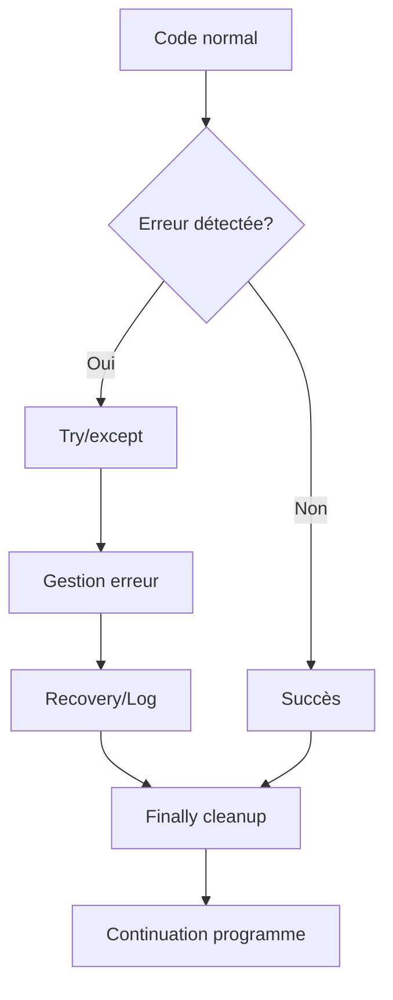
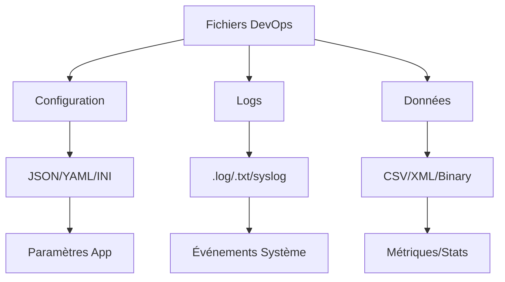
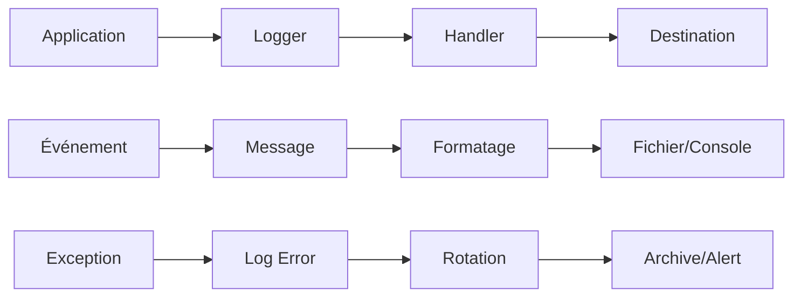

# Simplon Maghreb - Formation DevOps

# Sprint 1 - Semaine 2 - Séance 5 : Gestion d'erreurs et fichiers pour DevOps

## Objectifs pédagogiques

À l'issue de cette séance, les apprenants seront capables de :

- **Maîtriser** la gestion d'erreurs avec try/except/finally pour créer des scripts robustes
- **Manipuler** efficacement fichiers et logs pour le monitoring et la configuration DevOps
- **Valider** et sécuriser les données d'infrastructure de manière professionnelle
- **Développer** des scripts DevOps fiables et résistants aux pannes

## Objectifs techniques

try/except/finally, FileNotFoundError, PermissionError, JSON/YAML, pathlib, logging, rotation de logs, validation de données, chiffrement, sécurité fichiers DevOps

## Table des matières

1. [Gestion d'erreurs - Fondamentaux](#1-gestion-derreurs---fondamentaux)
2. [Gestion d'erreurs - Concepts avancés](#2-gestion-derreurs---concepts-avancés)
3. [Manipulation de fichiers DevOps](#3-manipulation-de-fichiers-devops)
4. [Logging et debugging professionnel](#4-logging-et-debugging-professionnel)
5. [Validation et sécurité des données](#5-validation-et-sécurité-des-données)
6. [Récapitulatif et bonnes pratiques](#6-récapitulatif-et-bonnes-pratiques)
7. [Ressources et prochaines étapes](#7-ressources-et-prochaines-étapes)

## 1. Gestion d'erreurs - Fondamentaux

### 1.1 Définitions et concepts fondamentaux

**Définition formelle** : La gestion d'erreurs est un mécanisme de programmation qui permet d'anticiper, intercepter et traiter les conditions exceptionnelles durant l'exécution d'un programme, garantissant la continuité de service et la robustesse opérationnelle.

**Terminologie technique** :

- **Exception (EN: Exception)** : Événement perturbant le flux normal d'exécution
- **Try/except (EN: Try/catch)** : Bloc de capture et traitement d'erreurs
- **Finally (EN: Finally)** : Bloc d'exécution garantie pour nettoyage
- **Raise (EN: Raise/throw)** : Déclenchement manuel d'exception
- **Stack trace (EN: Stack trace)** : Trace de la pile d'exécution d'erreur

**Contexte d'utilisation DevOps** :
Les scripts d'automation doivent être robustes car une erreur non gérée peut interrompre un déploiement critique, corrompre des configurations ou masquer des problèmes d'infrastructure.

**Liens avec les concepts précédents** :
La gestion d'erreurs s'applique aux fonctions et modules créés précédemment pour les rendre résistants aux pannes et adaptables aux environnements changeants.

### 1.2 Architecture de gestion d'erreurs

**Diagramme conceptuel** :



### 1.3 Structure et syntaxe des exceptions

**Structure formelle complète** :

```python
try:
 # Code susceptible de générer une erreur
 operation_risquee()
except SpecificError as e:
 # Gestion d'erreur spécifique
 handle_specific_error(e)
except Exception as e:
 # Gestion d'erreur générale
 handle_general_error(e)
else:
 # Exécuté si aucune erreur
 success_operation()
finally:
 # Toujours exécuté (nettoyage)
 cleanup_resources()
```

**Exemple simple DevOps** (version commentée détaillée) :

```python
def read_config_safe(config_path):
    """
    Lecture sécurisée de configuration avec gestion d'erreurs complète

    Args:
        config_path (str): Chemin vers le fichier de configuration JSON

    Returns:
        dict: Configuration chargée ou None en cas d'erreur
    """
    try:
        # Ouverture sécurisée du fichier avec context manager
        # Le 'with' garantit la fermeture automatique du fichier
        with open(config_path, 'r', encoding='utf-8') as f:
            # Parsing JSON avec validation automatique
            return json.load(f)

    except FileNotFoundError:
        # Gestion : fichier n'existe pas
        print(f"Fichier config introuvable: {config_path}")
        print("Création d'une configuration par défaut...")
        return create_default_config()

    except json.JSONDecodeError as e:
        # Gestion : JSON malformé
        print(f"Config JSON invalide: {e}")
        print(f"Ligne {e.lineno}, colonne {e.colno}")
        return None

    except PermissionError:
        # Gestion : droits d'accès insuffisants
        print(f"Permissions insuffisantes: {config_path}")
        print("Vérifiez les droits d'accès au fichier")
        return None

    except Exception as e:
        # Gestion : erreur inattendue
        print(f"Erreur inattendue lors de la lecture: {e}")
        return None
```

### 1.4 Types d'erreurs et exceptions Python

**Hiérarchie des exceptions Python** :

```python
BaseException
 +-- SystemExit
 +-- KeyboardInterrupt
 +-- GeneratorExit
 +-- Exception
      +-- StopIteration
      +-- ArithmeticError
      |    +-- ZeroDivisionError
      |    +-- OverflowError
      +-- AttributeError
      +-- EOFError
      +-- ImportError
      +-- LookupError
      |    +-- IndexError
      |    +-- KeyError
      +-- NameError
      +-- OSError
      |    +-- FileNotFoundError
      |    +-- PermissionError
      +-- RuntimeError
      +-- TypeError
      +-- ValueError
```

**Exceptions courantes en DevOps** :

```python
# Erreurs de fichiers et système
FileNotFoundError       # Fichier n'existe pas
PermissionError        # Droits d'accès insuffisants
OSError               # Erreur système générale
IOError               # Erreur d'entrée/sortie

# Erreurs de données
ValueError            # Valeur inappropriée
TypeError             # Type de données incorrect
KeyError              # Clé manquante dans dictionnaire
IndexError            # Index hors limites

# Erreurs réseau et connexion
ConnectionError       # Erreur de connexion
TimeoutError         # Timeout de connexion
socket.gaierror      # Erreur de résolution DNS

# Erreurs spécifiques aux modules
json.JSONDecodeError  # JSON malformé
yaml.YAMLError       # YAML invalide
requests.RequestException  # Erreur HTTP
```

### 1.5 Déclenchement manuel d'exceptions (Raising)

**Syntaxe du raise** :

```python
# Déclencher une exception simple
raise ValueError("Message d'erreur personnalisé")

# Re-déclencher une exception capturée
try:
    operation_risquee()
except Exception as e:
    # Logging de l'erreur
    logger.error(f"Erreur capturée: {e}")
    # Re-déclenchement
    raise

# Déclencher une nouvelle exception avec contexte
try:
    operation_risquee()
except OriginalError as e:
    raise NewError("Description plus claire") from e
```

**Exemple DevOps avec raise personnalisé** :

```python
class ConfigurationError(Exception):
    """Exception personnalisée pour erreurs de configuration"""

    def __init__(self, message, config_path=None, line_number=None):
        super().__init__(message)
        self.config_path = config_path
        self.line_number = line_number

def validate_server_config(config):
    """Valide une configuration serveur avec exceptions personnalisées"""

    # Validation du port
    if 'port' not in config:
        raise ConfigurationError("Port manquant dans la configuration")

    port = config['port']
    if not isinstance(port, int):
        raise ConfigurationError(f"Port doit être un entier, reçu: {type(port)}")

    if port < 1 or port > 65535:
        raise ConfigurationError(f"Port invalide: {port}. Doit être entre 1 et 65535")

    # Validation de l'environnement
    if 'environment' not in config:
        raise ConfigurationError("Environnement manquant")

    valid_envs = ['development', 'staging', 'production']
    if config['environment'] not in valid_envs:
        raise ConfigurationError(
            f"Environnement invalide: {config['environment']}. "
            f"Valeurs autorisées: {valid_envs}"
        )

    return True
```

### 1.6 Gestion avancée : Try/Except/Else/Finally

**Structure complète avec tous les blocs** :

```python
def advanced_file_processing(file_path):
    """Exemple complet de gestion d'erreurs avec tous les blocs"""

    file_handle = None
    processed_data = None

    try:
        # Tentative d'ouverture et traitement
        print(f"Ouverture du fichier: {file_path}")
        file_handle = open(file_path, 'r', encoding='utf-8')

        # Traitement du contenu
        content = file_handle.read()
        processed_data = process_file_content(content)

        # Validation des données traitées
        if not processed_data:
            raise ValueError("Aucune donnée valide trouvée")

    except FileNotFoundError:
        print(f"ERREUR: Fichier non trouvé: {file_path}")
        return None

    except PermissionError:
        print(f"ERREUR: Permissions insuffisantes pour: {file_path}")
        return None

    except UnicodeDecodeError as e:
        print(f"ERREUR: Encodage invalide: {e}")
        return None

    except ValueError as e:
        print(f"ERREUR: Données invalides: {e}")
        return None

    else:
        # Exécuté SEULEMENT si aucune exception n'a été levée
        print("SUCCESS: Fichier traité avec succès")

        # Opérations post-traitement (seulement en cas de succès)
        log_successful_processing(file_path, len(processed_data))

    finally:
        # Exécuté TOUJOURS, qu'il y ait eu erreur ou non
        print("CLEANUP: Nettoyage des ressources")

        # Fermeture du fichier si ouvert
        if file_handle and not file_handle.closed:
            file_handle.close()
            print("Fichier fermé proprement")

        # Nettoyage des variables temporaires
        temp_files = glob.glob("/tmp/processing_*")
        for temp_file in temp_files:
            try:
                os.remove(temp_file)
                print(f"Fichier temporaire supprimé: {temp_file}")
            except OSError:
                pass  # Ignore les erreurs de suppression

    return processed_data

def process_file_content(content):
    """Traite le contenu du fichier"""
    # Simulation de traitement
    lines = content.strip().split('\n')
    return [line for line in lines if line.strip()]

def log_successful_processing(file_path, data_count):
    """Log le succès du traitement"""
    print(f"LOG: {data_count} éléments traités depuis {file_path}")
```

### 1.7 Application pratique

📝 **LAB 1** - Gestion d'erreurs fondamentaux pour DevOps : `S1_S2_S5_lab1_gestion_erreurs.py`

**Énoncé du LAB 1** :

Vous devez créer des fonctions robustes qui gèrent les erreurs courantes dans l'automation DevOps. Implémentez la gestion d'erreurs fondamentale pour la lecture de configurations, les connexions réseau et les opérations sur fichiers.

- **Objectif** : Maîtriser les concepts fondamentaux de gestion d'erreurs avec try/except/finally pour créer des scripts DevOps fiables
- **Contexte** : Développement d'un système de base de gestion d'infrastructure qui doit fonctionner même en cas d'erreurs
- **Instructions** :

1.  Créer `read_config_with_fallback(config_path, fallback_config)` qui gère FileNotFoundError et JSONDecodeError
2.  Implémenter `validate_server_config(config_dict)` qui utilise des exceptions personnalisées pour la validation
3.  Développer `safe_file_copy(source, destination)` avec gestion complète des erreurs de fichiers
4.  Ajouter `test_network_connectivity(host, port, timeout=5)` qui gère les erreurs réseau
5.  Tester toutes les fonctions avec des cas d'erreurs simulés et validation des comportements

- **Critères d'évaluation** : Gestion appropriée des erreurs de base, exceptions spécifiques, messages informatifs
- **Durée estimée** : 25 minutes
- **Fichier de travail** : `S1_S2_S5_lab1_gestion_erreurs.py`

## 2. Gestion d'erreurs - Concepts avancés

### 2.1 Exemple avancé : Gestionnaire de déploiement DevOps

**Cas d'usage complexe avec gestion d'erreurs multicouche** :

# Gestionnaire de déploiement DevOps avec gestion d'erreurs avancée

```python
# Imports nécessaires pour le système de déploiement
import subprocess  # Exécution de commandes système
import json       # Manipulation des configurations JSON
import time       # Mesure du temps d'exécution
from pathlib import Path  # Gestion moderne des chemins de fichiers
from contextlib import contextmanager  # Création de context managers personnalisés

# Hiérarchie d'exceptions personnalisées pour le déploiement
class DeploymentError(Exception):
    """Exception de base pour les erreurs de déploiement"""
    pass

class PreDeploymentError(DeploymentError):
    """Erreurs lors des vérifications pré-déploiement"""
    pass

class DeploymentExecutionError(DeploymentError):
    """Erreurs durant l'exécution du déploiement"""
    pass

class PostDeploymentError(DeploymentError):
    """Erreurs lors des vérifications post-déploiement"""
    pass

@contextmanager
def deployment_context(environment):
    """Context manager pour gérer le cycle de vie d'un déploiement"""

    # Initialisation du déploiement avec logging
    print(f"=== DEBUT DEPLOIEMENT {environment.upper()} ===")
    start_time = time.time()  # Mesure du temps de déploiement

    try:
        # Préparation de l'environnement de déploiement
        setup_deployment_environment(environment)

        # Yield : point où le code utilisateur s'exécute
        yield environment

    except Exception as e:
        # Gestion des erreurs avec rollback automatique
        print(f"ERREUR DURANT LE DEPLOIEMENT: {e}")

        # Tentative de rollback automatique en cas d'erreur
        try:
            rollback_deployment(environment)
        except Exception as rollback_error:
            # Log des erreurs de rollback (critique)
            print(f"ERREUR DE ROLLBACK: {rollback_error}")

        # Re-lancement de l'exception originale
        raise

    finally:
        # Nettoyage final (toujours exécuté)
        cleanup_deployment_resources(environment)

        # Calcul et affichage de la durée totale
        duration = time.time() - start_time
        print(f"=== FIN DEPLOIEMENT ({duration:.2f}s) ===")

# Fonction principale de déploiement avec gestion d'erreurs multicouche
def deploy_application(app_name, version, environment):
    """
    Déploie une application avec gestion d'erreurs complète

    Args:
        app_name (str): Nom de l'application
        version (str): Version à déployer
        environment (str): Environnement cible

    Returns:
        dict: Résultat du déploiement

    Raises:
        PreDeploymentError: Erreur lors des vérifications préalables
        DeploymentExecutionError: Erreur durant le déploiement
        PostDeploymentError: Erreur lors des vérifications finales
    """

    # Initialisation du dictionnaire de résultats pour traçabilité
    deployment_result = {
        'app_name': app_name,           # Application déployée
        'version': version,             # Version déployée
        'environment': environment,     # Environnement cible
        'status': 'unknown',           # Statut du déploiement
        'steps_completed': [],         # Étapes réussies
        'errors': [],                  # Erreurs rencontrées
        'rollback_performed': False    # Indicateur de rollback
    }

    # Début du processus de déploiement avec context manager
    try:
        # Utilisation du context manager pour gérer le cycle de vie
        with deployment_context(environment) as env:

            # ETAPE 1: Vérifications pré-déploiement
            try:
                print("1. Vérifications pré-déploiement...")

                # Vérification de la santé de l'environnement cible
                check_environment_health(env)
                deployment_result['steps_completed'].append('environment_check')

                # Vérification de la disponibilité des ressources
                check_deployment_resources(app_name, version)
                deployment_result['steps_completed'].append('resources_check')

                # Validation de la configuration de déploiement
                validate_deployment_config(app_name, env)
                deployment_result['steps_completed'].append('config_validation')

            except Exception as e:
                # Conversion en exception spécialisée pour pré-déploiement
                raise PreDeploymentError(f"Vérifications pré-déploiement échouées: {e}")

            # ETAPE 2: Sauvegarde de l'état actuel
            try:
                print("2. Sauvegarde de l'état actuel...")
                # Sauvegarde pour permettre le rollback en cas d'échec
                backup_current_version(app_name, env)
                deployment_result['steps_completed'].append('backup')

            except Exception as e:
                # Sauvegarde critique - sans elle, pas de rollback possible
                raise DeploymentExecutionError(f"Sauvegarde échouée: {e}")

            # ETAPE 3: Déploiement proprement dit
            try:
                print("3. Déploiement de la nouvelle version...")

                # Arrêt des services existants pour éviter les conflits
                stop_application_services(app_name, env)
                deployment_result['steps_completed'].append('services_stopped')

                # Déploiement des nouveaux fichiers d'application
                deploy_application_files(app_name, version, env)
                deployment_result['steps_completed'].append('files_deployed')

                # Mise à jour de la configuration avec la nouvelle version
                update_application_config(app_name, env)
                deployment_result['steps_completed'].append('config_updated')

                # Redémarrage des services avec la nouvelle version
                start_application_services(app_name, env)
                deployment_result['steps_completed'].append('services_started')

            except Exception as e:
                # Erreur durant le déploiement - rollback nécessaire
                raise DeploymentExecutionError(f"Déploiement échoué: {e}")

            # ETAPE 4: Vérifications post-déploiement
            try:
                print("4. Vérifications post-déploiement...")

                # Tests de santé pour vérifier le bon fonctionnement
                health_check_result = perform_health_checks(app_name, env)
                if not health_check_result['healthy']:
                    raise Exception(f"Tests de santé échoués: {health_check_result['errors']}")

                deployment_result['steps_completed'].append('health_checks')

                # Tests fonctionnels basiques (smoke tests)
                run_smoke_tests(app_name, env)
                deployment_result['steps_completed'].append('smoke_tests')

            except Exception as e:
                # Déploiement réussi mais validation échouée
                raise PostDeploymentError(f"Vérifications post-déploiement échouées: {e}")

    except PreDeploymentError as e:
        deployment_result['status'] = 'failed_pre_deployment'
        deployment_result['errors'].append(str(e))
        print(f"ECHEC PRE-DEPLOIEMENT: {e}")

    except DeploymentExecutionError as e:
        deployment_result['status'] = 'failed_execution'
        deployment_result['errors'].append(str(e))
        print(f"ECHEC DEPLOIEMENT: {e}")

        # Tentative de rollback
        try:
            print("Tentative de rollback...")
            rollback_deployment(app_name, environment)
            deployment_result['rollback_performed'] = True
            print("Rollback réussi")
        except Exception as rollback_error:
            deployment_result['errors'].append(f"Rollback échoué: {rollback_error}")
            print(f"ECHEC ROLLBACK: {rollback_error}")

    except PostDeploymentError as e:
        deployment_result['status'] = 'failed_post_deployment'
        deployment_result['errors'].append(str(e))
        print(f"ECHEC POST-DEPLOIEMENT: {e}")

        # Le déploiement a techniquement réussi mais les tests échouent
        # Décision : rollback ou investigation manuelle ?
        if should_rollback_on_post_deployment_failure(e):
            try:
                rollback_deployment(app_name, environment)
                deployment_result['rollback_performed'] = True
            except Exception as rollback_error:
                deployment_result['errors'].append(f"Rollback échoué: {rollback_error}")

    except Exception as e:
        deployment_result['status'] = 'failed_unexpected'
        deployment_result['errors'].append(f"Erreur inattendue: {e}")
        print(f"ERREUR INATTENDUE: {e}")

    else:
        # Succès complet
        deployment_result['status'] = 'success'
        print(f"DEPLOIEMENT REUSSI: {app_name} v{version} sur {environment}")

    finally:
        # Génération du rapport final
        generate_deployment_report(deployment_result)

        # Nettoyage des fichiers temporaires
        cleanup_deployment_artifacts(app_name, version)

    return deployment_result

# Fonctions utilitaires (stubs pour l'exemple)
def setup_deployment_environment(env): pass
def check_environment_health(env): pass
def check_deployment_resources(app, ver): pass
def validate_deployment_config(app, env): pass
def backup_current_version(app, env): pass
def stop_application_services(app, env): pass
def deploy_application_files(app, ver, env): pass
def update_application_config(app, env): pass
def start_application_services(app, env): pass
def perform_health_checks(app, env): return {'healthy': True, 'errors': []}
def run_smoke_tests(app, env): pass
def rollback_deployment(app, env): pass
def should_rollback_on_post_deployment_failure(error): return True
def generate_deployment_report(result): pass
def cleanup_deployment_resources(env): pass
def cleanup_deployment_artifacts(app, ver): pass
```

### 2.2 Bonnes pratiques de gestion d'erreurs DevOps

**Règles d'or pour la gestion d'erreurs** :

1. **Spécificité des exceptions** :

```python
# Approche trop générale - masque les vraies causes
try:
    operation()
except Exception:
    print("Erreur")  # Information insuffisante

# Approche spécifique et informative - gestion ciblée
try:
    # Tentative de chargement de configuration
    load_config(path)
except FileNotFoundError:
    # Gestion spécifique : fichier manquant
    create_default_config()
except json.JSONDecodeError as e:
    # Gestion spécifique : JSON invalide avec détails
    log_json_error(e.lineno, e.msg)
except PermissionError:
    # Gestion spécifique : problème de droits
    request_elevated_privileges()
```

2. **Messages d'erreur contextuels** :

```python
# Message générique - peu utile pour le debug
raise ValueError("Erreur de validation")

# Message avec contexte - facilite le diagnostic
raise ValueError(
    f"Validation échouée pour le serveur '{server_name}': "
    f"port {port} hors de la plage autorisée (1-65535)"
)
```

3. **Logging approprié** :

```python
import logging

# Fonction de déploiement avec logging structuré
def deploy_with_logging(app_name):
    # Initialisation du logger pour ce module
    logger = logging.getLogger(__name__)

    try:
        # Tentative de déploiement avec logging du début
        logger.info(f"Début du déploiement: {app_name}")
        deploy_application(app_name)

        # Log de succès avec niveau INFO
        logger.info(f"Déploiement réussi: {app_name}")

    except DeploymentError as e:
        # Erreur métier - niveau ERROR avec contexte
        logger.error(f"Erreur de déploiement {app_name}: {e}")
        logger.debug("Stack trace:", exc_info=True)  # Debug uniquement
        raise  # Re-lancement pour gestion upstream

    except Exception as e:
        # Erreur système inattendue - niveau CRITICAL
        logger.critical(f"Erreur critique {app_name}: {e}")
        logger.debug("Stack trace complète:", exc_info=True)
        raise
```

4. **Gestion des ressources** :

```python
# Avec context manager (recommandé)
def safe_file_operation(path):
    try:
        # Context manager garantit la fermeture automatique
        with open(path, 'r') as f:
            return process_file(f)
    except Exception as e:
        # Logging avec contexte du fichier concerné
        logger.error(f"Erreur traitement fichier {path}: {e}")
        raise

# Avec finally explicite si nécessaire
def complex_resource_management():
    # Initialisation des ressources à nettoyer
    connection = None
    temp_files = []

    try:
        # Création des ressources système
        connection = create_database_connection()
        temp_files = create_temp_processing_files()

        return process_data(connection, temp_files)

    except Exception as e:
        logger.error(f"Erreur traitement: {e}")
        raise

    finally:
        # Nettoyage garanti
        if connection:
            connection.close()

        for temp_file in temp_files:
            try:
                os.remove(temp_file)
            except OSError:
                pass  # Ignore les erreurs de nettoyage
```

### 1.9 Context Managers et gestion automatique des ressources

**Le statement `with` - Context Manager :**

Le statement `with` est un mécanisme Python appelé "context manager" qui automatise la gestion des ressources système. Lorsque vous travaillez avec des fichiers, des connexions réseau ou des bases de données, il est crucial de s'assurer que ces ressources sont correctement fermées après utilisation, même si une erreur survient pendant le traitement.

Le principe de fonctionnement du `with` repose sur deux méthodes spéciales : `__enter__()` qui s'exécute au début du bloc, et `__exit__()` qui s'exécute à la fin, même en cas d'exception. Cette approche garantit qu'aucune ressource ne reste ouverte accidentellement, évitant ainsi les fuites mémoire et les blocages système.

```python
# Méthode traditionnelle (risquée)
f = open('config.json', 'r')
data = json.load(f)
f.close()  # Peut ne jamais s'exécuter si erreur !

# Méthode avec 'with' (sécurisée)
with open('config.json', 'r') as f:
    data = json.load(f)
# f.close() appelé AUTOMATIQUEMENT même en cas d'erreur
```

Dans le contexte DevOps, cette pratique est particulièrement importante car les scripts d'automatisation doivent être fiables et ne pas laisser de ressources ouvertes qui pourraient affecter les performances du système ou bloquer d'autres processus.

**Avantages du `with` :**

- **Fermeture garantie** : Le fichier se ferme même si une exception survient
- **Nettoyage automatique** : Libération des ressources système
- **Code plus propre** : Pas besoin de gérer manuellement `close()`
- **Prévention des fuites** : Évite les descripteurs de fichiers orphelins

**Cas d'usage avancés du `with` en DevOps :**

```python
# Gestion multiple de fichiers
def merge_configs(config1_path, config2_path, output_path):
    """Fusion de deux configurations avec gestion sécurisée"""
    try:
        # Ouverture simultanée de plusieurs fichiers
        with open(config1_path, 'r') as f1, \
             open(config2_path, 'r') as f2, \
             open(output_path, 'w') as out:

            config1 = json.load(f1)
            config2 = json.load(f2)

            # Fusion des configurations
            merged = {**config1, **config2}
            json.dump(merged, out, indent=2)

        print("Configurations fusionnées avec succès")

    except Exception as e:
        print(f"Erreur lors de la fusion: {e}")
```

**Bonnes pratiques pour la formation :**

1. **Toujours utiliser `with`** pour les opérations fichiers
2. **Spécifier l'encoding** : `encoding='utf-8'` pour éviter les problèmes
3. **Capturer les erreurs spécifiques** avant les générales
4. **Fournir des messages d'erreur informatifs** avec contexte
5. **Avoir une stratégie de fallback** (configuration par défaut)

### 1.10 Récapitulatif des concepts clés

**Concepts maîtrisés dans ce chapitre** :

1. **Hiérarchie des exceptions** : Comprendre la structure des erreurs Python
2. **Try/Except/Else/Finally** : Maîtriser tous les blocs de gestion d'erreurs
3. **Raising d'exceptions** : Créer et déclencher des erreurs personnalisées
4. **Context Managers** : Utiliser `with` pour la gestion automatique des ressources
5. **Bonnes pratiques DevOps** : Appliquer les règles professionnelles de gestion d'erreurs

**Applications DevOps réalisées** :

- Validation de configurations avec exceptions personnalisées
- Gestionnaire de déploiement avec gestion d'erreurs multicouche
- Context managers pour opérations critiques
- Logging structuré des erreurs avec contexte

**Préparation pour la suite** :
Les concepts de gestion d'erreurs robuste sont maintenant acquis et seront appliqués dans tous les aspects de manipulation de fichiers, logging et sécurisation des données des chapitres suivants.

### 2.3 Application pratique

📝 **LAB 2** - Gestion d'erreurs avancée - Concepts avancés : `S1_S2_S5_lab2_fichiers_logs.py`

**Énoncé du LAB 2** :

Vous devez créer un système de déploiement robuste avec gestion d'erreurs avancée, intégrant custom exceptions, context managers et recovery automatique pour l'automation DevOps critique.

- **Objectif** : Maîtriser les concepts avancés de gestion d'erreurs avec custom exceptions, context managers et système de recovery
- **Contexte** : Développement d'un gestionnaire de déploiement d'applications avec gestion d'erreurs multicouche et rollback automatique
- **Instructions** :

1.  Créer les classes d'exceptions personnalisées `DeploymentError`, `PreDeploymentError`, `DeploymentExecutionError`, `PostDeploymentError`
2.  Implémenter le context manager `@deployment_context(environment)` pour gérer le cycle de vie des déploiements
3.  Développer `deploy_application(app_name, version, environment)` avec gestion d'erreurs multicouche et rollback
4.  Ajouter `monitor_deployment_health(deployment_id)` avec recovery automatique et alertes
5.  Intégrer logging avancé, métriques de déploiement et génération de rapports détaillés

- **Critères d'évaluation** : Custom exceptions appropriées, context managers fonctionnels, gestion d'erreurs multicouche, recovery robuste
- **Durée estimée** : 35 minutes
- **Fichier de travail** : `S1_S2_S5_lab2_fichiers_logs.py`

## 3. Manipulation de fichiers DevOps

### 2.1 Définitions et concepts fondamentaux

**Définition formelle** : La manipulation de fichiers en DevOps consiste à automatiser la lecture, écriture, validation et transformation de fichiers de configuration, logs et données d'infrastructure de manière sécurisée et robuste.

**Terminologie technique** :

- **Fichier de configuration (EN: Configuration file)** : Fichier contenant les paramètres d'application
- **Log (EN: Log file)** : Fichier d'enregistrement des événements système
- **Parsing (EN: Parsing)** : Analyse et extraction de données structurées
- **Serialization (EN: Serialization)** : Conversion de données en format de stockage
- **Path (EN: File path)** : Chemin d'accès système vers un fichier

**Contexte d'utilisation DevOps** :
Les fichiers constituent l'interface principale pour la configuration d'infrastructure, le monitoring et la persistance des données dans les workflows DevOps.

**Liens avec les concepts précédents** :
La manipulation de fichiers utilise la gestion d'erreurs pour traiter les cas d'échec et s'intègre dans les modules pour créer des outils réutilisables.

### 2.2 Architecture et types de fichiers

**Diagramme des formats DevOps** :



### 2.3 Lecture et écriture sécurisées

**Gestion JSON simple** (version améliorée avec commentaires détaillés) :

```python
# Gestionnaire de configuration JSON pour DevOps
import json
from pathlib import Path

def manage_json_config(config_file, new_data=None):
    """Gestion complète configuration JSON avec sécurité"""
    # Conversion en objet Path pour manipulation moderne
    config_path = Path(config_file)

    try:
        # LECTURE : Chargement de la configuration existante
        if config_path.exists():
            # Lecture sécurisée avec encoding UTF-8
            with open(config_path, 'r', encoding='utf-8') as f:
                config = json.load(f)  # Parsing JSON avec validation
        else:
            # Initialisation d'une configuration vide si fichier absent
            config = {}

        # MODIFICATION : Mise à jour des données si nouvelles valeurs
        if new_data:
            # Fusion des nouvelles données avec les existantes
            config.update(new_data)

            # ECRITURE : Sauvegarde avec formatage lisible
            with open(config_path, 'w', encoding='utf-8') as f:
                # Sauvegarde JSON avec indentation pour lisibilité
                json.dump(config, f, indent=2, ensure_ascii=False)

        return config  # Retour de la configuration finale

    except FileNotFoundError:
        # Gestion spécifique : fichier supprimé pendant l'opération
        print(f"Fichier de configuration introuvable: {config_file}")
        return None
    except json.JSONDecodeError as e:
        # Gestion spécifique : JSON malformé
        print(f"Configuration JSON invalide: {e}")
        return None
    except PermissionError:
        # Gestion spécifique : droits d'accès insuffisants
        print(f"Permissions insuffisantes pour: {config_file}")
        return None
    except Exception as e:
        # Gestion générale des autres erreurs
        print(f"Erreur gestion config: {e}")
        return None
```

## 4. Logging et debugging professionnel

### 3.1 Définitions et concepts fondamentaux

**Définition formelle** : Le logging est un mécanisme de collecte, enregistrement et analyse des événements d'un système informatique pour assurer la traçabilité, le debugging et le monitoring opérationnel.

**Terminologie technique** :

- **Logger (EN: Logger)** : Objet responsable de l'émission des messages de log
- **Handler (EN: Handler)** : Composant dirigeant les messages vers une destination
- **Formatter (EN: Formatter)** : Configurateur du format des messages
- **Level (EN: Log level)** : Niveau de priorité des messages (DEBUG, INFO, WARNING, ERROR)
- **Rotation (EN: Log rotation)** : Archivage automatique des fichiers de log

**Contexte d'utilisation DevOps** :
Le logging professionnel permet de surveiller les déploiements, diagnostiquer les problèmes et maintenir la visibilité sur l'état des systèmes.

**Liens avec les concepts précédents** :
Le logging s'intègre avec la gestion d'erreurs pour tracer les exceptions et utilise la manipulation de fichiers pour persister les événements.

### 3.2 Architecture de logging DevOps

**Diagramme conceptuel** :



### 3.3 Configuration logging professionnel

**Setup simple DevOps** (version améliorée avec commentaires détaillés) :

```python
# Configuration professionnelle de logging pour DevOps
import logging
import logging.handlers

def setup_devops_logging(app_name, log_level=logging.INFO):
    """Configuration logging professionnelle DevOps"""

    # Création du logger principal avec nom de l'application
    logger = logging.getLogger(app_name)
    logger.setLevel(log_level)

    # Format professionnel avec timestamp, nom, niveau et message
    formatter = logging.Formatter(
        '%(asctime)s - %(name)s - %(levelname)s - %(message)s',
        datefmt='%Y-%m-%d %H:%M:%S'  # Format date lisible
    )

    # Handler fichier avec rotation automatique
    # Rotation à 10MB, conservation de 5 fichiers d'archive
    file_handler = logging.handlers.RotatingFileHandler(
        f'{app_name}.log',           # Nom du fichier de log
        maxBytes=10*1024*1024,       # Taille max : 10MB
        backupCount=5                # Nombre d'archives à conserver
    )
    file_handler.setFormatter(formatter)  # Application du format
    logger.addHandler(file_handler)       # Ajout du handler au logger

    # Handler console pour debug immédiat (optionnel)
    console_handler = logging.StreamHandler()
    console_handler.setFormatter(formatter)
    logger.addHandler(console_handler)

    return logger  # Retour du logger configuré
```

### 3.4 Context Managers - Gestion automatique des ressources

Les **context managers** garantissent que les ressources sont correctement fermées.

# Context manager pour gestion automatique des fichiers

```python
from pathlib import Path
import json

# Context manager automatique pour fichiers
def update_config(config_file: str, new_values: dict):
    """Met à jour la configuration avec gestion automatique"""
    # Conversion en objet Path pour API moderne
    config_path = Path(config_file)

    # LECTURE sécurisée avec context manager
    # Le fichier sera automatiquement fermé même en cas d'erreur
    with config_path.open('r', encoding='utf-8') as f:
        config = json.load(f)  # Chargement de la configuration existante

    # MISE À JOUR des valeurs de configuration
    config.update(new_values)  # Fusion des nouvelles valeurs

    # ÉCRITURE sécurisée (ressource fermée automatiquement)
    # Même principe : fermeture garantie par le context manager
    with config_path.open('w', encoding='utf-8') as f:
        # Sauvegarde avec formatage lisible
        json.dump(config, f, indent=2, ensure_ascii=False)

# Exemple d'utilisation DevOps
# Mise à jour de configuration d'application
update_config('app.json', {
    'debug': False,      # Désactivation du mode debug
    'version': '2.0',    # Mise à jour de version
    'env': 'production'  # Environnement de production
})
```

### 3.5 Logging JSON Structuré - Production Ready

Le **logging JSON** facilite l'analyse automatisée des logs.

# Système de logging JSON structuré pour DevOps

```python
import logging
import json
from datetime import datetime

class JSONFormatter(logging.Formatter):
    """Formatter pour logs JSON structurés - facilitant l'analyse automatisée"""

    def format(self, record):
        """Conversion d'un enregistrement de log en format JSON"""

        # Structure de base du log JSON
        log_data = {
            'timestamp': datetime.utcnow().isoformat(),  # Timestamp UTC standardisé
            'level': record.levelname,                   # Niveau de log (INFO, ERROR, etc.)
            'message': record.getMessage(),              # Message formaté
            'module': record.module,                     # Module Python source
            'function': record.funcName,                 # Fonction appelante
            'line': record.lineno                        # Numéro de ligne
        }

        # Ajout de contexte DevOps spécialisé si disponible
        if hasattr(record, 'operation'):
            # Type d'opération DevOps (deploy, backup, etc.)
            log_data['operation'] = record.operation
        if hasattr(record, 'server'):
            # Serveur concerné par l'opération
            log_data['server'] = record.server
        if hasattr(record, 'environment'):
            # Environnement (dev, staging, prod)
            log_data['environment'] = record.environment

        # Sérialisation en JSON compact
        return json.dumps(log_data, ensure_ascii=False)

def setup_json_logging(app_name: str):
    """Configuration logging JSON pour DevOps"""
    # Création du logger principal
    logger = logging.getLogger(app_name)
    logger.setLevel(logging.INFO)

    # Handler fichier avec format JSON
    handler = logging.FileHandler(f'{app_name}.jsonl')  # .jsonl pour JSON Lines
    handler.setFormatter(JSONFormatter())              # Application du formatter JSON
    logger.addHandler(handler)                         # Ajout au logger

    return logger

# Exemple d'utilisation DevOps
logger = setup_json_logging('deployment')

# Logs structurés avec contexte métier
logger.info('Déploiement démarré', extra={
    'operation': 'deploy',        # Type d'opération
    'server': 'prod-01',          # Serveur cible
    'environment': 'production'   # Environnement
})

logger.error('Erreur de déploiement', extra={
    'operation': 'deploy',
    'server': 'prod-01',
    'error_code': 'DEPLOY_001'    # Code d'erreur pour alertes
})
```

### 3.6 Application pratique

📝 **LAB 3** - Logging professionnel DevOps : `S1_S2_S5_lab3_logging_monitoring.py`

**Énoncé du LAB 3** :

Vous devez créer un système de logging professionnel pour vos applications DevOps avec monitoring temps réel, alertes automatiques et tableau de bord de supervision.

- **Objectif** : Implémenter un système de logging professionnel avec monitoring et alertes pour l'automation DevOps
- **Contexte** : Infrastructure de logging centralisée pour superviser les déploiements et opérations DevOps
- **Instructions** :

1.  Configurer `setup_advanced_logging(app_name, log_levels)` avec rotation, formatage et handlers multiples
2.  Créer `log_deployment_pipeline(pipeline_steps)` qui trace toutes les étapes avec contexte et métriques
3.  Implémenter `monitor_application_health(services)` avec logging structuré et alertes automatiques
4.  Développer `generate_monitoring_dashboard(log_data)` qui analyse les logs et génère des métriques
5.  Ajouter `setup_alert_system(thresholds, notification_channels)` pour alertes en temps réel

- **Critères d'évaluation** : Configuration logging avancée, monitoring efficace, alertes pertinentes, tableau de bord
- **Durée estimée** : 25 minutes
- **Fichier de travail** : `S1_S2_S5_lab3_logging_monitoring.py`

## 5. Validation et sécurité des données

### 5.1 Définitions et concepts fondamentaux

**Définition formelle** : La validation et sécurisation des données consiste à vérifier l'intégrité, la conformité et la protection des informations traitées par les systèmes DevOps pour prévenir les erreurs et les vulnérabilités de sécurité.

**Terminologie technique** :

- **Validation (EN: Validation)** : Vérification de conformité des données aux règles définies
- **Sanitization (EN: Data sanitization)** : Nettoyage et normalisation des données d'entrée
- **Encryption (EN: Encryption)** : Chiffrement des données sensibles pour protection
- **Input validation (EN: Input validation)** : Contrôle des données utilisateur avant traitement
- **Security audit (EN: Security audit)** : Vérification de conformité sécuritaire

**Contexte d'utilisation DevOps** :
La validation protège l'infrastructure contre les configurations erronées et les attaques, tandis que la sécurisation préserve l'intégrité des données sensibles.

**Liens avec les concepts précédents** :
La validation s'intègre avec la gestion d'erreurs pour traiter les cas non conformes et utilise les fichiers pour stocker les configurations validées.

### 5.2 Architecture de validation

**Diagramme de flux de validation** :

```
Données Entrée Validation Traitement Stockage Sécurisé
 ↓ ↓ ↓ ↓
[Input User] → [Format Check] → [Business Logic] → [Encrypted Storage]
 ↓ ↓ ↓ ↓
[Config File] → [Schema Valid] → [Apply Config] → [Audit Log]
```

### 5.3 Validation des entrées

**Validateur complet DevOps** (amélioré avec commentaires détaillés) :

```python
# Système de validation pour configurations DevOps
import re
import ipaddress
from typing import Union, List, Dict

class ConfigValidator:
    """Validateur de configuration DevOps avec gestion d'erreurs robuste"""

    @staticmethod
    def validate_ip_address(ip_str: str) -> bool:
        """
        Valide une adresse IP (IPv4 ou IPv6)

        Args:
            ip_str: Chaîne représentant l'adresse IP

        Returns:
            bool: True si IP valide, False sinon
        """
        try:
            # Utilisation du module ipaddress pour validation stricte
            ipaddress.ip_address(ip_str)
            return True  # IP valide (IPv4 ou IPv6)
        except ValueError:
            # IP invalide (format incorrect)
            return False

    @staticmethod
    def validate_port(port: Union[str, int]) -> bool:
        """
        Valide un numéro de port réseau

        Args:
            port: Port à valider (string ou int)

        Returns:
            bool: True si port valide (1-65535), False sinon
        """
        try:
            # Conversion en entier avec gestion des types
            port_num = int(port)
            # Validation de la plage des ports (1-65535)
            return 1 <= port_num <= 65535
        except (ValueError, TypeError):
            # Erreur de conversion ou type invalide
            return False

    @staticmethod
    def validate_hostname(hostname: str) -> bool:
        """
        Valide un nom d'hôte selon les standards DNS

        Args:
            hostname: Nom d'hôte à valider

        Returns:
            bool: True si hostname valide, False sinon
        """
        # Pattern regex pour validation DNS (RFC 1123)
        pattern = r'^[a-zA-Z0-9]([a-zA-Z0-9\-]{0,61}[a-zA-Z0-9])?(\.[a-zA-Z0-9]([a-zA-Z0-9\-]{0,61}[a-zA-Z0-9])?)*$'

        # Vérifications de base
        if not hostname or len(hostname) > 253:
            return False

        # Validation avec regex
        return bool(re.match(pattern, hostname))

    @staticmethod
    def validate_server_config(config: Dict) -> Dict[str, List[str]]:
        """
        Validation complète d'une configuration serveur

        Args:
            config: Dictionnaire de configuration

        Returns:
            Dict contenant les erreurs de validation par champ
        """
        errors = {}

        # Validation de l'adresse IP
        if 'ip' in config:
            if not ConfigValidator.validate_ip_address(config['ip']):
                errors['ip'] = ['Adresse IP invalide']
        else:
            errors['ip'] = ['Adresse IP manquante']

        # Validation du port
        if 'port' in config:
            if not ConfigValidator.validate_port(config['port']):
                errors['port'] = ['Port invalide (doit être entre 1 et 65535)']
        else:
            errors['port'] = ['Port manquant']

        # Validation du hostname
        if 'hostname' in config:
            if not ConfigValidator.validate_hostname(config['hostname']):
                errors['hostname'] = ['Nom d\'hôte invalide']

        return errors  # Retour des erreurs trouvées

# Exemple d'utilisation DevOps
validator = ConfigValidator()

# Configuration à valider
server_config = {
    'ip': '192.168.1.100',
    'port': '8080',
    'hostname': 'web-server-01.local'
}

# Validation complète avec gestion des erreurs
validation_errors = validator.validate_server_config(server_config)

if validation_errors:
    print("Erreurs de configuration trouvées:")
    for field, errors in validation_errors.items():
        print(f"  {field}: {', '.join(errors)}")
else:
    print("Configuration serveur valide")
```

### 5.4 Sécurisation des scripts

### 5.5 Application pratique

📝 **LAB 4 - Challenge** - Système intégré de gestion d'erreurs et sécurité : `S1_S2_S5_lab4_challenge.py`

**Énoncé du LAB 4 Challenge (Hors séance - Bonus)** :

Ce challenge optionnel permet d'intégrer tous les concepts de gestion d'erreurs, fichiers, logging et sécurité dans un système DevOps complet et robuste.

- **Objectif** : Développer un système intégré de monitoring et gestion d'infrastructure avec tous les concepts avancés
- **Statut** : Activité bonus, hors des 2 heures de séance
- **Durée estimée** : 45 minutes
- **Niveau** : Avancé, intégration complète des concepts
- **Contexte** : Système de monitoring d'infrastructure critique avec gestion d'erreurs, logging et sécurité avancée

**Instructions du Challenge** :

1. **Architecture complète** - Créer `InfrastructureMonitor` avec gestion d'erreurs hiérarchique
2. **Logging avancé** - Implémenter système de logging JSON avec rotation et alertes automatiques
3. **Validation sécurisée** - Développer validation multi-niveaux avec chiffrement des données sensibles
4. **Recovery automatique** - Ajouter mécanismes de fallback et restoration automatique
5. **Dashboard intégré** - Créer interface de monitoring temps réel avec métriques et alertes
6. **Tests de robustesse** - Simuler pannes et vérifier comportements de recovery
7. **Documentation complète** - Générer documentation automatique du système

- **Critères d'évaluation** : Architecture robuste, intégration concepts, gestion erreurs avancée, monitoring complet
- **Fichier de travail** : `S1_S2_S5_lab4_challenge.py`

## 6. Récapitulatif et bonnes pratiques

### 6.1 Concepts clés maîtrisés

**Gestion d'erreurs robuste** :

- Structure try/except/finally/else complète
- Types d'erreurs spécifiques vs générales
- Mécanismes de fallback et recovery
- Logging des erreurs pour debugging

**Manipulation de fichiers DevOps** :

- Formats multiples (JSON, YAML, logs, ENV)
- Lecture/écriture sécurisée avec validation
- Backup automatique et gestion des permissions
- Traitement de logs avec analyse d'anomalies

**Logging professionnel** :

- Configuration avancée avec handlers multiples
- Rotation automatique et archivage
- Niveaux appropriés et formatage structuré
- Monitoring temps réel avec alertes

**Validation et sécurité** :

- Validation des entrées et configurations
- Gestion chiffrée des secrets et données sensibles
- Protection contre injections et attaques
- Audit de conformité sécuritaire

### 6.2 Bonnes pratiques appliquées

**Robustesse et fiabilité** :

- **Gestion d'erreurs spécifiques** plutôt que générales
- **Validation systématique** des entrées utilisateur
- **Fallback et recovery** pour opérations critiques
- **Logging approprié** pour traçabilité

**Sécurité et protection** :

- **Chiffrement des secrets** et données sensibles
- **Validation stricte** des formats et valeurs
- **Permissions restrictives** sur fichiers critiques
- **Audit et conformité** automatisés

**Performance et maintenance** :

- **Rotation automatique** des logs pour éviter saturation
- **Compression et archivage** des données historiques
- **Monitoring proactif** avec alertes préventives
- **Documentation complète** des erreurs et solutions

### 6.3 Applications DevOps réalisées

Durant cette séance, nous avons développé :

- **Scripts robustes** avec gestion d'erreurs complète
- **Système de traitement** de fichiers multi-formats
- **Infrastructure de logging** professionnelle avec monitoring
- **Mécanismes de validation** et sécurisation des données
- **Protection avancée** contre pannes et erreurs

### 6.4 Progression vers les concepts avancés

**Continuité pédagogique** :
La **Séance 4 - Python avancé pour DevOps** explorera :

- **Programmation orientée objet** pour architecture DevOps
- **Décorateurs et gestionnaires** de contexte avancés
- **Programmation asynchrone** pour I/O intensif
- **APIs et intégrations** de services externes
- **Patterns avancés** pour automation complexe

**Concepts acquis nécessaires** :

- Maîtrise de la gestion d'erreurs et fichiers (cette séance)
- Compréhension des concepts de classes et objets
- Notions de programmation fonctionnelle
- Expérience avec les APIs REST et HTTP

## 7. Ressources et prochaines étapes

### 7.1 Documentation officielle

**Gestion d'erreurs et exceptions** :

- [Python Errors and Exceptions](https://docs.python.org/3/tutorial/errors.html) - Guide officiel
- [Built-in Exceptions](https://docs.python.org/3/library/exceptions.html) - Types d'erreurs
- [Exception Handling Best Practices](https://docs.python.org/3/library/exceptions.html#built-in-exceptions) - Bonnes pratiques

**Manipulation de fichiers** :

- [Python File I/O](https://docs.python.org/3/tutorial/inputoutput.html) - Entrées/sorties
- [Pathlib Module](https://docs.python.org/3/library/pathlib.html) - Manipulation chemins modernes
- [JSON Module](https://docs.python.org/3/library/json.html) - Traitement JSON
- [PyYAML Documentation](https://pyyaml.org/wiki/PyYAMLDocumentation) - Traitement YAML

**Logging et debugging** :

- [Python Logging](https://docs.python.org/3/library/logging.html) - Module logging complet
- [Logging Cookbook](https://docs.python.org/3/howto/logging-cookbook.html) - Recettes pratiques
- [Logging Best Practices](https://docs.python.org/3/howto/logging.html#logging-basic-tutorial) - Bonnes pratiques

### 7.2 Outils de sécurité et validation

**Validation de données** :

- [Cerberus](https://docs.python-cerberus.org/) - Validation de schémas
- [Marshmallow](https://marshmallow.readthedocs.io/) - Sérialisation et validation
- [Pydantic](https://pydantic-docs.helpmanual.io/) - Validation avec type hints

**Sécurité** :

- [Python Cryptography](https://cryptography.io/en/latest/) - Chiffrement moderne
- [OWASP Python Security](https://owasp.org/www-project-python-security/) - Guide sécurité
- [Secrets Module](https://docs.python.org/3/library/secrets.html) - Génération sécurisée

### 7.3 Monitoring et observabilité DevOps

**Logging avancé** :

- [Structlog](https://www.structlog.org/) - Logging structuré
- [Loguru](https://loguru.readthedocs.io/) - Logging moderne et simple
- [Python JSON Logger](https://github.com/madzak/python-json-logger) - Logs JSON

**Monitoring et métriques** :

- [Prometheus Python Client](https://prometheus.io/docs/instrumenting/clientlibs/) - Métriques
- [Sentry](https://sentry.io/for/python/) - Tracking d'erreurs
- [Datadog Python](https://datadogpy.readthedocs.io/) - Monitoring infrastructure

### 7.4 Projets pratiques avancés

**Pour approfondir** :

1. **Système de monitoring complet** - Avec alertes, métriques et dashboards
2. **Pipeline de déploiement robuste** - Avec rollback et validation automatique
3. **Orchestrateur d'infrastructure** - Gestion multi-cloud avec validation
4. **Système d'audit de sécurité** - Conformité et rapports automatisés

**Intégrations recommandées** :

- Configuration avec **environment variables** et **secrets managers**
- Logging vers **ELK Stack** ou **Grafana/Prometheus**
- Monitoring avec **Datadog**, **New Relic** ou **AppDynamics**
- Alertes via **Slack**, **PagerDuty** ou **email**

---

**Fin de la Séance 5 - Gestion d'erreurs et fichiers pour DevOps**

_Formateur : Hassan ESSADIK | Sprint 1 - Semaine 2 - Séance 5_
