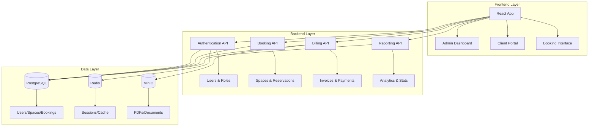
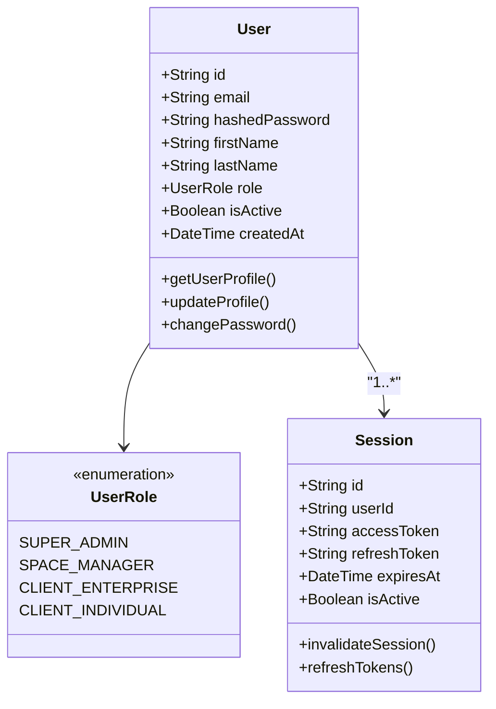
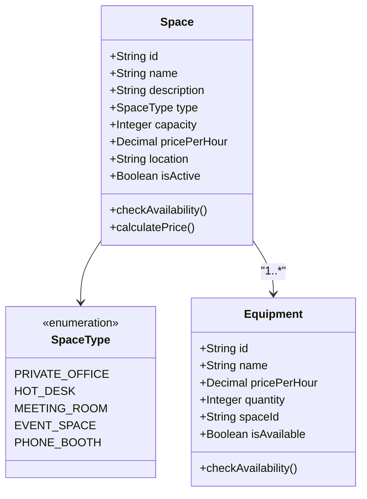
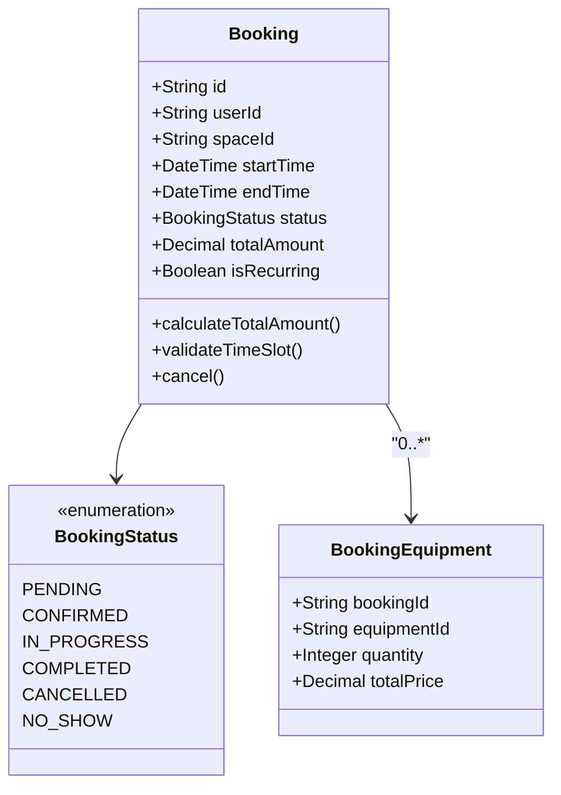
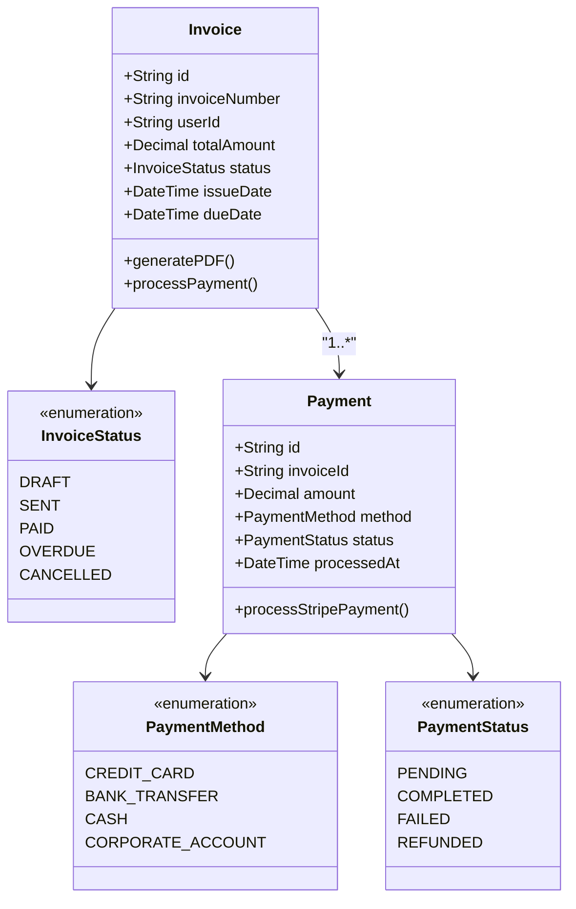
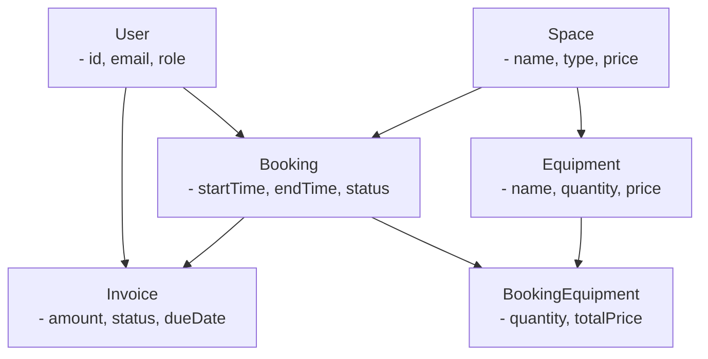

# Simplon Maghreb - Formation DevOps

# Brief Projet de Consolidation GitLab CI/CD - Coworking Space Management

## Informations générales

**Titre du projet** : Système de Gestion et Facturation Coworking Space  
**Sprint** : Sprint 2 - Semaine 3 (GitLab CI/CD Complet)  
**Durée** : 4 jours (32 heures)  
**Type** : Projet de consolidation et validation des acquis  
**Niveau** : Intermédiaire à Avancé

---

## Contexte métier

### Description générale

Vous êtes DevOps Engineer dans une startup innovante **"WorkFlow Spaces"** qui développe une solution SaaS de gestion de coworking spaces. L'application permet aux gestionnaires d'espaces de travail partagés de :

- **Gérer les réservations** de différents types d'espaces
- **Calculer automatiquement** les factures selon les services utilisés
- **Éditer et envoyer** les factures aux clients
- **Suivre l'occupation** et la rentabilité des espaces

### Types d'espaces gérés

1. **Bureaux privés** (tarification journalière/mensuelle)
2. **Espaces partagés** (tarification horaire avec forfaits)
3. **Salles de réunion** (tarification horaire avec équipements)
4. **Services additionnels** (impression, café, parking, etc.)

### Enjeux business critiques

- **Facturation précise** : Calculs complexes multi-critères
- **Disponibilité 24/7** : Réservations en temps réel
- **Sécurité des données** : Informations financières sensibles
- **Scalabilité** : Croissance rapide du nombre d'espaces clients

---

## Architecture technique

### Stack technologique imposée

```
Frontend Web Application
├── React.js 18 (TypeScript)
├── Material-UI pour l'interface
├── Redux Toolkit (state management)
└── React Query (data fetching)

Backend API REST
├── Node.js 18 LTS
├── Express.js (framework web)
├── TypeScript (typage statique)
├── Prisma ORM (base de données)
├── JWT Authentication
└── Stripe API (paiements)

Base de données
├── PostgreSQL 15 (données principales)
├── Redis 7 (cache et sessions)
└── MinIO (stockage fichiers/factures PDF)

Infrastructure
├── Docker & Docker Compose
├── GitLab CI/CD → [Scripts complets en annexe](./Annexe_Scripts_GitLab_CI.md)
├── Nexus Repository Manager (artifacts)
├── Debian Package (.deb) - Packaging & Déploiement
│   ├── Création automatique du paquet .deb
│   ├── Stockage dans Nexus Repository
│   ├── Déploiement sur serveurs Ubuntu/Debian
│   └── Gestion des versions et dépendances
```

### Architecture applicative



### Diagrammes de classes détaillés (Implémentation simplifiée)

Pour permettre aux apprenants de se concentrer sur les aspects DevOps, voici le modèle de données complet réparti en modules fonctionnels :

#### 1. Module Authentification et Utilisateurs



#### 2. Module Espaces et Équipements



#### 3. Module Réservations



#### 4. Module Facturation et Paiements



#### 5. Relations principales entre modules



### Modèles Prisma Schema (Implementation directe)

```prisma
// schema.prisma - Configuration complète pour implémentation rapide

generator client {
  provider = "prisma-client-js"
}

datasource db {
  provider = "postgresql"
  url      = env("DATABASE_URL")
}

// Énumérations
enum UserRole {
  SUPER_ADMIN
  SPACE_MANAGER
  CLIENT_ENTERPRISE
  CLIENT_INDIVIDUAL
}

enum SpaceType {
  PRIVATE_OFFICE
  HOT_DESK
  MEETING_ROOM
  EVENT_SPACE
  PHONE_BOOTH
}

enum BookingStatus {
  PENDING
  CONFIRMED
  IN_PROGRESS
  COMPLETED
  CANCELLED
  NO_SHOW
}

enum InvoiceStatus {
  DRAFT
  SENT
  PAID
  OVERDUE
  CANCELLED
  REFUNDED
}

enum PaymentStatus {
  PENDING
  PROCESSING
  COMPLETED
  FAILED
  REFUNDED
  CANCELLED
}

enum PaymentMethod {
  CREDIT_CARD
  BANK_TRANSFER
  CASH
  CORPORATE_ACCOUNT
}

enum SubscriptionStatus {
  ACTIVE
  CANCELLED
  EXPIRED
  SUSPENDED
  PENDING
}

enum NotificationType {
  BOOKING_CONFIRMATION
  BOOKING_REMINDER
  PAYMENT_SUCCESS
  PAYMENT_FAILED
  INVOICE_GENERATED
  SUBSCRIPTION_RENEWED
  SPACE_AVAILABLE
  SYSTEM_MAINTENANCE
}

// Modèles principaux
model User {
  id                     String    @id @default(uuid())
  email                  String    @unique
  hashedPassword         String
  firstName              String
  lastName               String
  phone                  String?
  role                   UserRole  @default(CLIENT_INDIVIDUAL)
  isActive               Boolean   @default(true)
  emailVerified          Boolean   @default(false)
  resetPasswordToken     String?
  resetPasswordExpires   DateTime?
  lastLoginAt            DateTime?
  createdAt              DateTime  @default(now())
  updatedAt              DateTime  @updatedAt

  // Relations
  sessions               Session[]
  bookings               Booking[]
  invoices               Invoice[]
  subscriptions          Subscription[]
  notifications          Notification[]

  @@map("users")
}

model Session {
  id           String   @id @default(uuid())
  userId       String
  accessToken  String
  refreshToken String
  expiresAt    DateTime
  ipAddress    String?
  userAgent    String?
  isActive     Boolean  @default(true)
  createdAt    DateTime @default(now())

  // Relations
  user User @relation(fields: [userId], references: [id], onDelete: Cascade)

  @@map("sessions")
}

model Space {
  id             String    @id @default(uuid())
  name           String
  description    String?
  type           SpaceType
  capacity       Int
  pricePerHour   Decimal   @db.Decimal(10, 2)
  pricePerDay    Decimal   @db.Decimal(10, 2)
  pricePerMonth  Decimal   @db.Decimal(10, 2)
  location       String
  photos         String[]  @default([])
  amenities      String[]  @default([])
  isActive       Boolean   @default(true)
  createdAt      DateTime  @default(now())
  updatedAt      DateTime  @updatedAt

  // Relations
  equipment      Equipment[]
  bookings       Booking[]
  analytics      Analytics[]

  @@map("spaces")
}

model Equipment {
  id              String    @id @default(uuid())
  name            String
  description     String?
  pricePerHour    Decimal   @db.Decimal(10, 2)
  quantity        Int
  isAvailable     Boolean   @default(true)
  spaceId         String
  createdAt       DateTime  @default(now())
  updatedAt       DateTime  @updatedAt

  // Relations
  space           Space               @relation(fields: [spaceId], references: [id])
  bookingEquipment BookingEquipment[]

  @@map("equipment")
}

model Booking {
  id                String            @id @default(uuid())
  userId            String
  spaceId           String
  startTime         DateTime
  endTime           DateTime
  status            BookingStatus     @default(PENDING)
  totalAmount       Decimal           @db.Decimal(10, 2)
  notes             String?
  isRecurring       Boolean           @default(false)
  recurringPattern  String?
  createdAt         DateTime          @default(now())
  updatedAt         DateTime          @updatedAt

  // Relations
  user              User              @relation(fields: [userId], references: [id])
  space             Space             @relation(fields: [spaceId], references: [id])
  bookingEquipment  BookingEquipment[]
  invoices          Invoice[]

  @@map("bookings")
}

model BookingEquipment {
  id          String    @id @default(uuid())
  bookingId   String
  equipmentId String
  quantity    Int
  unitPrice   Decimal   @db.Decimal(10, 2)
  totalPrice  Decimal   @db.Decimal(10, 2)
  createdAt   DateTime  @default(now())

  // Relations
  booking     Booking   @relation(fields: [bookingId], references: [id])
  equipment   Equipment @relation(fields: [equipmentId], references: [id])

  @@unique([bookingId, equipmentId])
  @@map("booking_equipment")
}

model Invoice {
  id                    String        @id @default(uuid())
  invoiceNumber         String        @unique
  userId                String
  bookingId             String?
  subtotal              Decimal       @db.Decimal(10, 2)
  taxAmount             Decimal       @db.Decimal(10, 2) @default(0)
  discountAmount        Decimal       @db.Decimal(10, 2) @default(0)
  totalAmount           Decimal       @db.Decimal(10, 2)
  status                InvoiceStatus @default(DRAFT)
  issueDate             DateTime      @default(now())
  dueDate               DateTime
  paidDate              DateTime?
  paymentMethod         String?
  stripePaymentIntentId String?
  pdfPath               String?
  notes                 String?
  createdAt             DateTime      @default(now())
  updatedAt             DateTime      @updatedAt

  // Relations
  user                  User          @relation(fields: [userId], references: [id])
  booking               Booking?      @relation(fields: [bookingId], references: [id])
  invoiceItems          InvoiceItem[]
  payments              Payment[]

  @@map("invoices")
}

model InvoiceItem {
  id          String  @id @default(uuid())
  invoiceId   String
  description String
  quantity    Int
  unitPrice   Decimal @db.Decimal(10, 2)
  totalPrice  Decimal @db.Decimal(10, 2)
  type        String
  referenceId String?
  createdAt   DateTime @default(now())

  // Relations
  invoice     Invoice @relation(fields: [invoiceId], references: [id])

  @@map("invoice_items")
}

model Payment {
  id                    String        @id @default(uuid())
  invoiceId             String
  amount                Decimal       @db.Decimal(10, 2)
  currency              String        @default("EUR")
  method                PaymentMethod
  status                PaymentStatus @default(PENDING)
  stripeChargeId        String?
  stripePaymentIntentId String?
  processedAt           DateTime?
  failureReason         String?
  createdAt             DateTime      @default(now())
  updatedAt             DateTime      @updatedAt

  // Relations
  invoice               Invoice       @relation(fields: [invoiceId], references: [id])

  @@map("payments")
}

model SubscriptionPlan {
  id                  String   @id @default(uuid())
  name                String   @unique
  description         String?
  monthlyPrice        Decimal  @db.Decimal(10, 2)
  includedHours       Int
  overageRate         Decimal  @db.Decimal(10, 2)
  includedSpaceTypes  String[] @default([])
  includedServices    String[] @default([])
  isActive            Boolean  @default(true)
  createdAt           DateTime @default(now())
  updatedAt           DateTime @updatedAt

  // Relations
  subscriptions       Subscription[]

  @@map("subscription_plans")
}

model Subscription {
  id              String             @id @default(uuid())
  userId          String
  planId          String
  status          SubscriptionStatus @default(PENDING)
  startDate       DateTime
  endDate         DateTime
  monthlyAmount   Decimal            @db.Decimal(10, 2)
  includedHours   Int
  usedHours       Int                @default(0)
  autoRenew       Boolean            @default(true)
  createdAt       DateTime           @default(now())
  updatedAt       DateTime           @updatedAt

  // Relations
  user            User               @relation(fields: [userId], references: [id])
  plan            SubscriptionPlan   @relation(fields: [planId], references: [id])

  @@map("subscriptions")
}

model Analytics {
  id                      String   @id @default(uuid())
  reportDate              DateTime @db.Date
  spaceId                 String?
  revenue                 Decimal  @db.Decimal(10, 2) @default(0)
  bookingCount            Int      @default(0)
  uniqueUsers             Int      @default(0)
  occupancyRate           Decimal  @db.Decimal(5, 2) @default(0)
  averageBookingDuration  Decimal  @db.Decimal(5, 2) @default(0)
  customerSatisfaction    Decimal  @db.Decimal(3, 2) @default(0)
  createdAt               DateTime @default(now())

  // Relations
  space                   Space?   @relation(fields: [spaceId], references: [id])

  @@unique([reportDate, spaceId])
  @@map("analytics")
}

model Notification {
  id           String           @id @default(uuid())
  userId       String
  type         NotificationType
  title        String
  message      String
  isRead       Boolean          @default(false)
  channels     String[]         @default(["EMAIL"])
  referenceId  String?
  scheduledAt  DateTime?
  sentAt       DateTime?
  createdAt    DateTime         @default(now())

  // Relations
  user         User             @relation(fields: [userId], references: [id])

  @@map("notifications")
}
```

---

#### Structure du paquet .deb

```
coworking-space-app/
├── DEBIAN/
│   ├── control                 # Métadonnées du paquet
│   ├── postinst               # Script post-installation
│   ├── prerm                  # Script pré-suppression
│   └── postrm                 # Script post-suppression
├── etc/
│   └── coworking-space/
│       ├── app.conf           # Configuration application
│       └── database.conf      # Configuration base de données
├── usr/
│   └── share/
│       └── coworking-space/
│           ├── app/           # Binaires application
│           ├── web/           # Assets frontend
│           └── migrations/    # Scripts migration DB
└── lib/
    └── systemd/
        └── system/
            └── coworking-space.service  # Service systemd
```

#### Fichier DEBIAN/control

```bash
Package: coworking-space-app
Version: 1.0.0
Section: web
Priority: optional
Architecture: amd64
Depends: nodejs (>= 18), postgresql-client (>= 12), redis-tools (>= 6)
Maintainer: DevOps Team <devops@coworking-space.com>
Description: Application de gestion d'espaces de coworking
 Application complète pour la gestion de réservations,
 facturation et administration d'espaces de coworking.
 Inclut l'API REST, l'interface web et les outils d'administration.
```

#### Configuration GitLab CI pour le packaging .deb

> **Voir Annexe** : [Scripts GitLab CI - Section 1](./Annexe_Scripts_GitLab_CI.md#1-configuration-gitlab-ci-pour-le-packaging-deb)

**Fichiers requis :**

- `.gitlab-ci.yml` - Stage packaging et upload Nexus
- Configuration des variables d'environnement GitLab CI
- Scripts de build automatique des paquets .deb

#### Scripts de déploiement automatique

> **Voir Annexe** : [Scripts GitLab CI - Section 4](./Annexe_Scripts_GitLab_CI.md#4-scripts-système-et-configuration)

**Scripts système inclus :**

- **postinst** - Configuration post-installation automatique
- **Service systemd** - Gestion et supervision du service
- **DEBIAN/control** - Métadonnées et dépendances du paquet

#### Gestion des versions et mise à jour

> **Voir Annexe** : [Scripts GitLab CI - Sections 2 & 3](./Annexe_Scripts_GitLab_CI.md#2-pipeline-de-déploiement-production)

**Composants de déploiement :**

- **Pipeline GitLab CI** - Déploiement automatique avec Ansible
- **Playbook Ansible** - Installation et mise à jour des serveurs
- **Gestion des versions** - Rollback et migration base de données

### Avantages du déploiement .deb

**Gestion des dépendances** - APT gère automatiquement les dépendances système  
**Installation standardisée** - Processus uniforme sur tous les serveurs Ubuntu/Debian  
**Rollback facilité** - Retour à version précédente avec `apt install package=version`  
**Intégration système** - Services systemd, logs centralisés, monitoring natif  
**Sécurité** - Vérification des signatures, contrôle d'intégrité  
**Maintenance simplifiée** - Mise à jour avec `apt upgrade coworking-space-app`

---

## Fonctionnalités détaillées

### Module Authentication & Authorization

**Rôles utilisateurs** :

- **Super Admin** : Gestion globale plateforme
- **Space Manager** : Gestion d'un coworking space
- **Client Enterprise** : Réservations pour équipe
- **Client Individual** : Réservations personnelles

**Fonctionnalités** :

- Inscription/Connexion sécurisée (JWT + refresh tokens)
- Authentification multi-facteurs (2FA) pour admins
- Gestion des profils et préférences
- Audit trail des connexions

### Module Booking & Reservations

**Gestion des espaces** :

- Catalogue des espaces avec photos, équipements, tarifs
- Calendrier de disponibilité temps réel
- Réservation avec conflit detection
- Modification/annulation avec policies

**Types de réservations** :

- **Bureaux privés** : Réservation journalière/mensuelle
- **Hot desks** : Réservation horaire (check-in/out)
- **Salles de réunion** : Créneaux horaires avec équipements
- **Événements** : Réservation d'espaces pour conférences

### Module Billing & Invoicing (Cœur métier)

**Calcul des tarifs** :

```typescript
interface BillingCalculation {
  baseRate: number; // Tarif de base espace
  duration: number; // Durée d'utilisation
  services: ServiceUsage[]; // Services additionnels
  discounts: Discount[]; // Remises appliquées
  taxes: TaxCalculation; // Calculs fiscaux
  total: number; // Montant total
}

interface ServiceUsage {
  serviceId: string;
  quantity: number;
  unitPrice: number;
  total: number;
}
```

**Fonctionnalités facturation** :

- Calcul automatique selon utilisation réelle
- Gestion des forfaits et abonnements
- Application de remises (volume, fidélité, promotions)
- Génération PDF factures avec template personnalisé
- Envoi automatique par email
- Intégration Stripe pour paiements en ligne
- Relances automatiques factures impayées

### Module Reporting & Analytics

**Tableaux de bord** :

- Occupation des espaces (taux, heures de pointe)
- Chiffre d'affaires par période/espace/client
- Clients les plus actifs et rentables
- Prédictions de revenus
- KPIs métier temps réel

---

## Exigences techniques GitLab CI/CD

### Pipeline Architecture (Obligatoire)

Le pipeline GitLab CI/CD doit être organisé en **9 stages séquentiels** pour garantir la qualité et la sécurité du déploiement :

1. **PREPARE** - Préparation environnement et cache
2. **VALIDATE** - Validation code et formats
3. **BUILD** - Compilation et construction
4. **TEST** - Tests automatisés complets
5. **SECURITY** - Analyse sécurité et vulnérabilités
6. **PACKAGE** - Création paquets .deb et images
7. **DEPLOY** - Déploiement multi-environnements
8. **VERIFY** - Vérification post-déploiement
9. **NOTIFY** - Notifications et rapports

> **Note technique** : Les scripts détaillés, configurations YAML complètes et exemples de code sont disponibles dans le fichier annexe **[Annexe_Scripts_GitLab_CI.md](./Annexe_Scripts_GitLab_CI.md)**

### Exigences détaillées par stage

#### Stage PREPARE - Préparation des environnements

**Objectifs** : Préparer l'environnement de build et optimiser les temps d'exécution

**Jobs requis** :

**1. Installation Frontend**

- Utiliser image Node.js 18 Alpine optimisée
- Installer dépendances npm avec cache intelligent
- Configurer cache basé sur package-lock.json
- Générer artifacts node_modules réutilisables
- Durée cible : < 2 minutes

**2. Installation Backend**

- Installation dépendances Node.js backend
- Configuration Prisma ORM et génération client
- Cache séparé pour optimiser les builds parallèles
- Artifacts disponibles pour stages suivants
- Validation des versions de dépendances

**Contraintes techniques** :

- Cache partagé entre branches pour optimiser performance
- Artifacts avec expiration courte (2h) pour éviter surcharge
- Gestion des erreurs d'installation avec retry automatique
- Variables d'environnement spécifiques par composant

#### Stage VALIDATE - Validation qualité du code

**Objectifs** : Garantir la qualité du code avant build et déploiement

**Jobs requis** :

**1. Linting Frontend (ESLint + TypeScript)**

- Validation syntaxe et conventions React/TypeScript
- Vérification des règles ESLint configurées
- Type checking TypeScript complet
- Génération rapports de qualité exportables
- Blocage du pipeline si erreurs critiques

**2. Linting Backend (ESLint + TypeScript)**

- Validation code Node.js/Express/Prisma
- Vérification des patterns de sécurité backend
- Contrôle des imports et dépendances
- Validation des schémas de données

**3. Format et conventions (Prettier)**

- Vérification formatage uniforme du code
- Contrôle des conventions de nommage
- Validation des fichiers config (JSON, YAML, MD)
- Rapport des écarts de formatage

**4. Audit de sécurité préliminaire**

- Scan des vulnérabilités npm audit
- Détection des dépendances obsolètes
- Vérification des licences compatibles
- Alerte sur packages sensibles

**Critères d'acceptation** :

- 0 erreur de linting critique
- 0 erreur de type TypeScript
- Code formaté selon standards Prettier
- Aucune vulnérabilité HIGH ou CRITICAL

#### Stage BUILD - Compilation et construction

**Objectifs** : Compiler le code source en artefacts déployables optimisés

**Jobs requis** :

**1. Build Frontend (React TypeScript)**

- Compilation TypeScript vers JavaScript optimisé
- Bundling avec Webpack/Vite pour production
- Optimisation des assets (minification, compression)
- Génération des source maps pour debugging
- Variables d'environnement de production injectées
- Output dans répertoire `/build` standardisé

**2. Build Backend (Node.js TypeScript)**

- Compilation TypeScript Node.js vers JavaScript
- Génération du client Prisma pour la base de données
- Optimisation des imports et tree-shaking
- Préparation des assets statiques nécessaires
- Configuration des variables d'environnement
- Output dans répertoire `/dist` standardisé

**Contraintes de performance** :

- Build frontend : < 5 minutes maximum
- Build backend : < 3 minutes maximum
- Taille des artifacts finaux optimisée
- Cache des builds intermédiaires activé
- Artifacts conservés 24h pour déploiements

**Validation du build** :

- Aucune erreur de compilation TypeScript
- Bundles générés avec tailles acceptables
- Assets optimisés (images, CSS, JS compressés)
- Source maps générées pour environnement de debug

#### Stage TEST - Tests automatisés complets (Obligatoire)

**Objectifs** : Valider la qualité fonctionnelle et technique de l'application

**Jobs requis** :

**1. Tests unitaires Frontend (Jest + React Testing Library)**

- Tests des composants React isolés
- Tests des hooks et utilitaires
- Tests des services et API calls
- Couverture de code minimum 80%
- Génération rapports JUnit et coverage
- Durée cible : < 5 minutes

**2. Tests unitaires Backend (Jest + Supertest)**

- Tests des contrôleurs et middlewares
- Tests des services métier (billing, booking)
- Tests des modèles Prisma et validations
- Tests des utilitaires et helpers
- Services PostgreSQL et Redis en conteneurs
- Couverture minimum 85% (logique métier critique)

**3. Tests d'intégration Backend**

- Tests end-to-end des APIs complètes
- Tests avec vraie base de données PostgreSQL
- Tests d'intégration Redis pour cache/sessions
- Tests de stockage MinIO pour fichiers
- Validation des workflows métier complets
- Tests des calculs de facturation complexes

**4. Tests E2E Frontend (Cypress)**

- Tests des parcours utilisateur complets
- Tests de l'authentification et autorisation
- Tests du processus de réservation
- Tests de génération de factures
- Tests responsive mobile/desktop
- Captures d'écran et vidéos sur échecs

**Environnement de test** :

- Base de données PostgreSQL 15 dédiée
- Cache Redis 7 isolé
- Stockage MinIO pour tests fichiers
- Applications démarrées en mode test
- Données de test automatiquement générées

**Critères d'acceptance** :

- Couverture frontend ≥ 80%
- Couverture backend ≥ 85%
- 0 test en échec
- Tests E2E passent sur parcours critiques
- Temps d'exécution total < 15 minutes

#### Stage SECURITY - Analyse de sécurité DevSecOps (Obligatoire)

**Objectifs** : Détecter et prévenir les vulnérabilités de sécurité avant déploiement

**Jobs requis** :

**1. SAST (Static Application Security Testing)**

- Analyse statique du code source TypeScript/JavaScript
- Détection des patterns de sécurité dangereux
- Scan des injections SQL, XSS, CSRF potentiels
- Vérification des configurations sensibles
- Outils : Semgrep, ESLint Security, SonarQube
- Rapport au format SARIF/JSON standard

**2. Dependency Scanning (SCA - Software Composition Analysis)**

- Audit complet des dépendances npm/yarn
- Détection des CVE dans les packages
- Vérification des licences open source
- Analyse des packages obsolètes ou suspects
- Outils : Snyk, npm audit, OWASP Dependency Check
- Base de données NVD/CVE mise à jour

**3. Container Security Scanning**

- Scan des images Docker finales
- Détection des vulnérabilités système (OS)
- Analyse des configurations Docker (privilèges, ports)
- Vérification des images de base
- Outils : Trivy, Clair, Anchore
- Scan des layers et cache Docker

**4. Infrastructure Security (DAST préparatoire)**

- Validation des configurations réseau
- Scan des ports et services exposés
- Vérification des certificats SSL/TLS
- Tests de configuration sécurisée

**Seuils de sécurité critiques** :

- 0 vulnérabilité CRITICAL acceptée
- ≤ 5 vulnérabilités HIGH acceptées
- ≤ 20 vulnérabilités MEDIUM acceptées
- Pipeline bloqué si seuils dépassés
- Rapports intégrés à GitLab Security Dashboard

**Gestion des exceptions** :

- Système de whitelist pour faux positifs
- Documentation obligatoire des exceptions
- Review sécurité pour vulnérabilités acceptées
- Expiration automatique des exceptions

#### Stage PACKAGE - Création des artefacts de déploiement

**Objectifs** : Créer les paquets .deb et images Docker pour déploiement

**Jobs requis** :

**1. Création paquets .deb Frontend**

- Packaging des fichiers build React en paquet Debian
- Création de la structure `/opt/coworking/frontend`
- Configuration du service systemd frontend
- Scripts post-installation automatiques
- Gestion des dépendances système (nginx, certains nodejs)
- Métadonnées du paquet (version, description, maintainer)

**2. Création paquets .deb Backend**

- Packaging de l'application Node.js compilée
- Installation dans `/opt/coworking/backend`
- Configuration service systemd backend
- Scripts de migration base de données
- Dépendances : nodejs, postgresql-client
- Configuration des permissions utilisateur système

**3. Images Docker optimisées (parallèle aux .deb)**

- Build multi-stage pour réduire la taille finale
- Images basées sur Alpine Linux (sécurité + taille)
- Métadonnées images (labels, versions, git commit)
- Push vers Nexus Docker Registry
- Tagging intelligent (commit SHA + latest + tag)
- Optimisation des layers Docker

**4. Artifacts et versioning**

- Archivage des paquets .deb dans Nexus Repository
- Stockage permanent avec politique de rétention
- Versioning automatique basé sur Git
- Génération de checksums pour intégrité
- Documentation automatique des packages

**Optimisations techniques** :

- Docker BuildKit activé pour performance
- Cache des layers partagés entre builds
- Parallélisation des builds frontend/backend
- Authentification Nexus sécurisée avec tokens
- Taille finale images < 500MB par service

**Intégration Nexus dans le packaging** :

- **Authentication** : Login Docker et Nexus avec tokens sécurisés
- **Push strategique** :
  - Images Docker : `nexus.example.com:8082/coworking-frontend:$CI_COMMIT_SHA`
  - Packages .deb : Upload via Nexus REST API vers repository raw
  - Metadata : Tags avec informations Git (branch, commit, date)
- **Validation upload** : Vérification checksum et disponibilité artifacts
- **Cleanup** : Nettoyage automatique des artifacts temporaires locaux

**Validation packaging** :

- Tests d'installation .deb sur Ubuntu clean
- Vérification des services systemd
- Test de démarrage des containers depuis Nexus
- Validation des ports et healthchecks
- Scan sécurité final des artifacts dans Nexus

#### Stage DEPLOY - Déploiement multi-environnements (VirtualBox + Ansible obligatoire)

**Objectifs** : Déployer automatiquement l'application sur différents environnements

**Architecture de déploiement principale** :

- **Environnement principal** : VirtualBox VM (Ubuntu Server 22.04 LTS)
- **Méthode** : Ansible + paquets .deb via pipeline GitLab
- **Réseau** : Configuration Host-Only (192.168.56.10)
- **Accès** : SSH key-based authentication sécurisé

**Jobs de déploiement requis** :

**1. Déploiement VirtualBox VM (Principal - Obligatoire)**

- Image Ansible officielle avec outils nécessaires
- Connexion SSH sécurisée via clé privée stockée dans GitLab CI/CD
- Configuration dynamique de l'inventaire Ansible
- Exécution du playbook principal avec variables d'environnement
- **Téléchargement depuis Nexus** : Récupération automatique des paquets .deb depuis le repository
- Installation des paquets .deb téléchargés depuis Nexus
- Pull des images Docker depuis Nexus Registry pour les services conteneurisés
- Configuration et démarrage des services systemd
- Tests de santé post-déploiement avec rapports
- Déclenchement manuel uniquement sur branche `main`
- URL finale accessible : http://192.168.56.10:3000

**2. Déploiement Développement (Docker Compose)**

- Auto-déclenchement sur branche `develop`
- Déploiement containerisé via Docker Compose
- Configuration environnement développement
- Variables spécifiques (base de données de dev, logs verbeux)
- Services auxiliaires : PostgreSQL, Redis, MinIO en dev
- URL de développement : https://dev-coworking.example.com
- Rollback automatique si échec de démarrage

**3. Déploiement Staging (Docker Compose)**

- Auto-déclenchement sur branche `main` après tests réussis
- Environnement miroir de production pour validation
- Base de données staging avec données anonymisées
- Tests de performance et validation métier
- Configuration proche production pour tests finaux
- URL de staging : https://staging-coworking.example.com
- Validation obligatoire avant promotion production

**Gestion avancée des déploiements** :

- Stratégie Blue-Green pour production (bonus)
- Variables d'environnement sécurisées par environnement
- Secrets chiffrés dans GitLab CI/CD Variables
- Rollback automatique en cas d'échec de healthcheck
- Notifications Slack/Teams sur succès/échec déploiement

#### Stage VERIFY - Vérification post-déploiement

**Objectifs** : Valider le bon fonctionnement de l'application déployée

**Tests de vérification requis** :

**1. Tests de santé (Health Checks)**

- Ping des endpoints API critiques (/health, /api/status)
- Vérification connectivité base de données PostgreSQL
- Test du cache Redis et sessions utilisateur
- Validation des services systemd (statut UP)
- Contrôle de la charge système (CPU, RAM, disque)

**2. Tests fonctionnels post-déploiement**

- Tests d'authentification (login/logout)
- Validation des fonctionnalités critiques (booking, billing)
- Tests des APIs métier principales
- Vérification de la génération de factures PDF
- Tests des notifications et emails

**3. Tests de performance basiques**

- Tests de charge légère (10-50 utilisateurs simultanés)
- Temps de réponse API < 500ms pour endpoints critiques
- Validation des métriques de performance
- Test de la montée en charge progressive

**4. Tests de sécurité runtime**

- Vérification des certificats SSL/TLS si applicable
- Test des headers de sécurité HTTP
- Validation des permissions de fichiers
- Contrôle des processus en cours d'exécution

#### Stage NOTIFY - Notifications et rapports

**Objectifs** : Communiquer les résultats du pipeline et alerter les équipes

**Notifications automatiques** :

**1. Notifications de succès**

- Message Slack/Teams avec résumé du déploiement
- Emails aux équipes dev/ops avec liens environnements
- Mise à jour automatique des tickets Jira/GitLab Issues
- Génération rapport de déploiement (artefacts, versions, durée)

**2. Notifications d'échec et alerting**

- Alertes immédiates en cas d'échec critique
- Logs détaillés des erreurs avec contexte
- Notifications aux responsables techniques
- Création automatique d'incidents pour suivi

**3. Rapports de qualité et sécurité**

- Dashboard consolidé des métriques pipeline
- Rapports de couverture de tests
- Résumé des vulnérabilités détectées/corrigées
- Métriques de performance des déploiements

**4. Documentation automatique**

- Mise à jour des notes de release
- Génération changelog automatique depuis Git
- Documentation des changements de configuration
- Archivage des rapports dans GitLab/Confluence

---

## Packaging et Déploiement Debian (.deb)

> **Documentation complète** : [Annexe - Scripts GitLab CI/CD](./Annexe_Scripts_GitLab_CI.md)
>
> Tous les scripts de configuration GitLab CI, Ansible, et les fichiers système ont été déplacés vers l'annexe pour faciliter la lecture du brief principal.

### Configuration du packaging .deb

L'application doit être packagée sous forme de paquet Debian (.deb) pour faciliter le déploiement sur les serveurs Ubuntu/Debian de production.

#### Structure du paquet .deb

```
coworking-space-app/
├── DEBIAN/
│   ├── control                 # Métadonnées du paquet
│   ├── postinst               # Script post-installation
│   ├── prerm                  # Script pré-suppression
│   └── postrm                 # Script post-suppression
├── etc/
│   └── coworking-space/
│       ├── app.conf           # Configuration application
│       └── database.conf      # Configuration base de données
├── usr/
│   └── share/
│       └── coworking-space/
│           ├── app/           # Binaires application
│           ├── web/           # Assets frontend
│           └── migrations/    # Scripts migration DB
└── lib/
    └── systemd/
        └── system/
            └── coworking-space.service  # Service systemd
```

#### Fichier DEBIAN/control

```bash
Package: coworking-space-app
Version: 1.0.0
Section: web
Priority: optional
Architecture: amd64
Depends: nodejs (>= 18), postgresql-client (>= 12), redis-tools (>= 6)
Maintainer: DevOps Team <devops@coworking-space.com>
Description: Application de gestion d'espaces de coworking
 Application complète pour la gestion de réservations,
 facturation et administration d'espaces de coworking.
 Inclut l'API REST, l'interface web et les outils d'administration.
```

#### Configuration GitLab CI pour le packaging .deb

> **Voir Annexe** : [Scripts GitLab CI - Section 1](./Annexe_Scripts_GitLab_CI.md#1-configuration-gitlab-ci-pour-le-packaging-deb)

**Fichiers requis :**

- `.gitlab-ci.yml` - Stage packaging et upload Nexus
- Configuration des variables d'environnement GitLab CI
- Scripts de build automatique des paquets .deb

#### Scripts de déploiement automatique

> **Voir Annexe** : [Scripts GitLab CI - Section 4](./Annexe_Scripts_GitLab_CI.md#4-scripts-système-et-configuration)

**Scripts système inclus :**

- **postinst** - Configuration post-installation automatique
- **Service systemd** - Gestion et supervision du service
- **DEBIAN/control** - Métadonnées et dépendances du paquet

#### Gestion des versions et mise à jour

> **Voir Annexe** : [Scripts GitLab CI - Sections 2 & 3](./Annexe_Scripts_GitLab_CI.md#2-pipeline-de-déploiement-production)

**Composants de déploiement :**

- **Pipeline GitLab CI** - Déploiement automatique avec Ansible
- **Playbook Ansible** - Installation et mise à jour des serveurs
- **Gestion des versions** - Rollback et migration base de données

### Avantages du déploiement .deb

**Gestion des dépendances** - APT gère automatiquement les dépendances système  
**Installation standardisée** - Processus uniforme sur tous les serveurs Ubuntu/Debian  
**Rollback facilité** - Retour à version précédente avec `apt install package=version`  
**Intégration système** - Services systemd, logs centralisés, monitoring natif  
**Sécurité** - Vérification des signatures, contrôle d'intégrité  
**Maintenance simplifiée** - Mise à jour avec `apt upgrade coworking-space-app`

---

## Contraintes techniques et prérequis

### Prérequis machine de développement

**Logiciels obligatoires** :

- **VirtualBox 7.0+** avec Extension Pack
- **Git** et **GitLab CLI** configurés
- **Ansible 2.9+** installé
- **Docker** et **Docker Compose**
- **Node.js 18 LTS** et **npm**

**Ressources système minimales** :

- **RAM** : 16GB (8GB pour hôte + 4GB pour VM + buffers)
- **CPU** : Processeur 4 cœurs minimum
- **Stockage** : 100GB libres (50GB pour VM + projet)
- **Réseau** : Connexion Internet stable pour téléchargements

### Configuration VirtualBox obligatoire

**Paramètres VM** :

- **OS** : Ubuntu Server 22.04 LTS (ISO officielle)
- **RAM** : 4096 MB allouée
- **CPU** : 2 processeurs virtuels
- **Stockage** : 50GB VDI dynamique
- **Réseau 1** : NAT (accès Internet)
- **Réseau 2** : Host-Only Adapter (vboxnet0)
- **IP statique** : 192.168.56.10/24

**Configuration Host-Only Network** :

```bash
# Configuration réseau obligatoire
Network: 192.168.56.0/24
Gateway: 192.168.56.1
DHCP: Disabled (IP statique sur VM)
```

### Contraintes de déploiement

**Packaging .deb obligatoire** :

- Packages séparés frontend/backend
- Services systemd automatiques
- Post-installation scripts fonctionnels
- Gestion des dépendances système

**Intégration Nexus Repository (Obligatoire)** :

- **Stockage exclusif** : Tous les artifacts doivent être stockés dans Nexus
- **Types d'artifacts** :
  - Packages .deb (raw repository)
  - Images Docker (docker-hosted repository)
  - Packages npm (npm-hosted repository)
  - Archives de build (raw repository)
- **Authentification** : Token-based avec rotation recommandée
- **Politique de rétention** : Minimum 30 jours, configurable par projet
- **Versioning** : Semantic versioning obligatoire (semver)
- **Métadonnées** : Tags Git, commit SHA, build number dans les labels

**Ansible requirements** :

- Playbooks idempotents
- Gestion des erreurs robuste
- Variables sécurisées (Vault pour secrets)
- Support rollback en cas d'échec

---

## Livrables obligatoires

### 1. Structure projet complète

```
coworking-space-management/
├── README.md                          # Documentation complète
├── .gitlab-ci.yml                     # Pipeline principal avec VirtualBox
├── Vagrantfile                        # Configuration VM automatisée (optionnel)
├── docker-compose.yml                 # Développement local
├── docker-compose.dev.yml             # Environnement dev
├── docker-compose.staging.yml         # Environnement staging
├── scripts/
│   ├── create-deb-package.sh         # Création paquets .deb
│   ├── setup-virtualbox-vm.sh        # Configuration VM
│   ├── blue-green-deploy.sh          # Script déploiement
│   ├── database-migration.sh         # Migrations DB
│   └── health-check.sh              # Vérifications santé
├── ansible/                           # Configuration Ansible OBLIGATOIRE
│   ├── deploy-coworking.yml          # Playbook principal
│   ├── inventory/
│   │   └── production.ini            # Inventaire VirtualBox VM
│   ├── roles/
│   │   ├── common/                   # Configuration système
│   │   ├── postgresql/               # Base de données
│   │   ├── redis/                    # Cache
│   │   ├── nginx/                    # Reverse proxy
│   │   └── coworking-app/           # Déploiement application
│   ├── group_vars/
│   │   ├── all.yml                  # Variables globales
│   │   └── production.yml           # Variables VM
│   └── templates/
│       ├── systemd.service.j2      # Services système
│       └── nginx.conf.j2            # Configuration Nginx
├── nexus/                             # Configuration et scripts Nexus
│   ├── upload-artifacts.sh           # Script upload vers Nexus
│   ├── download-artifacts.sh         # Script téléchargement depuis Nexus
│   └── nexus-config.yml             # Configuration repositories Nexus
├── templates/                         # Templates système
│   ├── coworking-frontend.service    # Service systemd frontend
│   └── coworking-backend.service     # Service systemd backend
├── frontend/
│   ├── src/                          # Code source React
│   ├── tests/                        # Tests unitaires Jest
│   ├── e2e/                          # Tests E2E Cypress
│   ├── Dockerfile                    # Image Docker optimisée
│   ├── package.json                  # Dépendances Node.js
│   └── tsconfig.json                 # Configuration TypeScript
├── backend/
│   ├── src/                          # Code source API Node.js
│   ├── tests/                        # Tests unitaires + intégration
│   ├── prisma/                       # Schema et migrations DB
│   ├── Dockerfile                    # Image Docker optimisée
│   ├── package.json                  # Dépendances Node.js
│   └── tsconfig.json                 # Configuration TypeScript
└── docs/
    ├── API.md                        # Documentation API
    ├── DEPLOYMENT.md                 # Guide déploiement complet
    ├── VIRTUALBOX-SETUP.md           # Setup VM et Ansible
    ├── Annexe_Scripts_GitLab_CI.md   # Scripts techniques GitLab CI/CD
    └── SECURITY.md                   # Sécurité et bonnes pratiques
```

### 2. Pipeline GitLab CI/CD avec déploiement VirtualBox

**Critères de validation obligatoires** :

- Pipeline exécuté avec succès incluant packaging .deb
- **Artifacts stockés exclusivement dans Nexus Repository Manager**
- **Images Docker pushées vers Nexus Docker Registry**
- **Paquets .deb uploadés vers Nexus Raw Repository**
- Déploiement automatisé sur VM VirtualBox via Ansible
- **Téléchargement automatique des artifacts depuis Nexus lors du déploiement**
- VM accessible via réseau Host-Only (192.168.56.x)
- Application fonctionnelle sur http://192.168.56.10:3000
- Tous les tests passent (couverture > 80%)
- Sécurité : 0 vulnérabilité critique, < 5 moyennes
- **Authentification Nexus fonctionnelle avec tokens sécurisés**
- Services systemd configurés et démarrés automatiquement
- Base de données PostgreSQL déployée et migrée
- Rollback fonctionnel testé sur la VM

### 3. Configuration VirtualBox et Ansible (Obligatoire)

**VM VirtualBox configurée** :

- Ubuntu Server 22.04 LTS installé
- Configuration réseau : NAT + Host-Only (192.168.56.10)
- RAM : 4GB, CPU : 2 cœurs, Stockage : 50GB
- Utilisateur `deployer` avec sudo et clés SSH
- Services système : PostgreSQL, Redis, Nginx

**Ansible Playbooks fonctionnels** :

- Playbook principal `deploy-coworking.yml` exécutable
- Rôles organisés : common, postgresql, redis, nginx, coworking-app
- Inventaire correct pour VirtualBox VM
- Variables d'environnement sécurisées
- Handlers pour restart des services

**Paquets .deb et installation** :

- Script `create-deb-package.sh` fonctionnel
- Paquets frontend/backend générés automatiquement
- Installation via Ansible réussie
- Services systemd configurés et démarrés
- Application accessible post-déploiement

**Tests de déploiement** :

- Déploiement complet en < 10 minutes
- Application accessible sur http://192.168.56.10:3000
- Base de données migrée et fonctionnelle
- Tous les services systemd démarrés
- Logs d'application accessibles via journalctl

### 4. Application fonctionnelle

**Fonctionnalités frontend obligatoires** :

- Interface d'authentification complète
- Dashboard admin avec métriques
- Calendrier de réservation interactif
- Module de facturation avec aperçu PDF
- Responsive design (mobile + desktop)

**API backend obligatoire** :

- CRUD complet pour tous les modules
- Authentification JWT sécurisée
- Calcul de facturation complexe
- Génération PDF factures
- Documentation API (Swagger/OpenAPI)

### 5. Documentation technique

**Documentation obligatoire** :

- **README.md** : Installation, configuration, utilisation
- **API.md** : Documentation complète des endpoints
- **DEPLOYMENT.md** : Guide de déploiement complet (Docker + VirtualBox)
- **VIRTUALBOX-SETUP.md** : Configuration VM et Ansible détaillée
- **Annexe_Scripts_GitLab_CI.md** : Scripts techniques et configurations YAML complètes
- **SECURITY.md** : Mesures de sécurité implémentées

### 6. Fichier annexe technique (OBLIGATOIRE)

**Annexe_Scripts_GitLab_CI.md** - Référence technique complète :

- Configuration complète `.gitlab-ci.yml` avec tous les jobs
- Scripts shell détaillés (packaging .deb, déploiement, tests)
- Dockerfiles optimisés pour frontend et backend
- Templates systemd pour services Linux
- Configurations Docker Compose par environnement
- Playbooks et rôles Ansible complets
- Scripts de tests de performance (k6)
- Configuration des variables GitLab CI/CD
- Exemples de commandes et troubleshooting

> **Important** : Ce fichier annexe contient l'implémentation technique détaillée que les apprenants doivent développer en se basant sur les exigences fonctionnelles décrites dans ce brief.

---

## Système d'évaluation par compétences DevOps - Niveau 2

### Référentiel de compétences évaluées

Cette évaluation se base sur le **référentiel officiel des compétences DevOps niveau 2**. Chaque compétence est évaluée selon le principe **VALIDÉ** / **NON VALIDÉ**.

| **Code** | **Compétence Niveau 2**                                         | **Critères d'évaluation dans le projet**                                                   |
| -------- | --------------------------------------------------------------- | ------------------------------------------------------------------------------------------ |
| **C1**   | **Définir un environnement de développement commun**            | Dockerfiles optimisés, docker-compose multi-environnements, infrastructure reproductible   |
| **C2**   | **Concevoir la procédure d'intégration continue**               | Pipeline GitLab CI/CD fonctionnel avec builds et tests automatiques sur push/merge         |
| **C3**   | **Concevoir les éléments de configuration de l'infrastructure** | Variables d'environnement structurées, configuration par environnement, secrets management |
| **C5**   | **Créer une procédure de déploiement continu**                  | Déploiement automatisé multi-environnements avec stratégies avancées (Blue-Green)          |
| **C7**   | **Concevoir un système de veille technologique**                | Veille sécurité automatisée (SAST/DAST), audit dependencies, documentation technique       |

> **Note** : Les compétences C4 (Tests automatiques infrastructure) et C6 (Monitorage) sont intégrées transversalement dans les autres compétences mais ne font pas l'objet d'une évaluation séparée pour ce projet.

### Grille d'évaluation détaillée par compétence

#### **C1 - Environnement de développement commun**

**Objectif** : Prouver la capacité à créer un environnement reproductible et versionné

| **Critère**                     | **Indicateur de validation**                         | **Livrables attendus**                 |
| ------------------------------- | ---------------------------------------------------- | -------------------------------------- |
| **Dockerisation complète**      | Images Docker fonctionnelles pour frontend + backend | `Dockerfile` optimisés multi-stage     |
| **Infrastructure as Code**      | Configuration environment reproductible              | `docker-compose.yml` par environnement |
| **Virtualisation cohérente**    | Environnement identique dev/staging/prod             | Variables d'environnement structurées  |
| **Automatisation installation** | Setup en une commande                                | Documentation `README.md` claire       |

**Validation** : Environnement VirtualBox + Ansible déployable automatiquement depuis pipeline GitLab

---

#### **C2 - Procédure d'intégration continue**

**Objectif** : Démontrer la maîtrise des pipelines CI/CD automatisés

| **Critère**              | **Indicateur de validation**               | **Livrables attendus**                 |
| ------------------------ | ------------------------------------------ | -------------------------------------- |
| **Pipeline fonctionnel** | Exécution automatique sur git push         | `.gitlab-ci.yml` avec stages organisés |
| **Builds automatiques**  | Compilation frontend + backend sans erreur | Jobs de build réussis                  |
| **Tests automatisés**    | Tests unitaires + intégration exécutés     | Couverture de code > 70%               |
| **Feedback rapide**      | Pipeline < 15 minutes                      | Optimisation cache et parallélisation  |

**Validation** : Pipeline s'exécute avec succès sur 3 commits consécutifs

---

#### **C3 - Configuration de l'infrastructure**

**Objectif** : Maîtriser la gestion de configuration automatisée

| **Critère**                       | **Indicateur de validation**                      | **Livrables attendus**                          |
| --------------------------------- | ------------------------------------------------- | ----------------------------------------------- |
| **Gestionnaire de configuration** | Variables GitLab + Ansible Vault organisées       | Configuration dev/staging/VirtualBox distinctes |
| **Provisionnement automatisé**    | Déploiement VirtualBox sans intervention manuelle | Playbooks Ansible idempotents complets          |
| **Gestion des secrets**           | Credentials sécurisés et chiffrés                 | Variables sensibles dans GitLab + Ansible Vault |
| **Configuration versionnée**      | Changements de config dans Git                    | Historique modifications traçable + templates   |

**Validation** : Déploiement VirtualBox réussi via Ansible depuis pipeline GitLab

---

#### **C5 - Procédure de déploiement continu**

**Objectif** : Automatiser les déploiements de bout en bout

| **Critère**                    | **Indicateur de validation**                      | **Livrables attendus**          |
| ------------------------------ | ------------------------------------------------- | ------------------------------- |
| **Déploiement automatisé**     | De l'intégration au déploiement sans intervention | Pipeline end-to-end fonctionnel |
| **Stratégies avancées**        | Blue-Green ou Canary deployment                   | Script de déploiement avancé    |
| **Rollback automatique**       | Retour version précédente en cas d'échec          | Mécanisme de rollback testé     |
| **Promotion d'environnements** | dev → staging → prod automatisé                   | Workflow de promotion configuré |

**Validation** : Déploiement production réalisé avec rollback functional testé

---

#### **C7 - Système de veille technologique**

**Objectif** : Maintenir la sécurité et qualité du code de façon proactive

| **Critère**                    | **Indicateur de validation**                 | **Livrables attendus**             |
| ------------------------------ | -------------------------------------------- | ---------------------------------- |
| **Veille sécurité**            | Scan automatique vulnérabilités              | SAST/DAST/dependency scanning      |
| **Classification information** | Vulnérabilités triées par criticité          | Rapports sécurité organisés        |
| **Analyse automatisée**        | Blocage pipeline si vulnérabilités critiques | Quality gates sécurisés            |
| **Amélioration décisions**     | Documentation des risques et mitigation      | Rapport sécurité + recommandations |

**Validation** : Pipeline bloque déploiement si vulnérabilité critique détectée

### Modalités d'évaluation

#### **Système binaire de validation**

| **Statut**     | **Critère**                                        | **Action**                  |
| -------------- | -------------------------------------------------- | --------------------------- |
| **VALIDÉ**     | Tous les indicateurs de la compétence sont remplis | Compétence acquise niveau 2 |
| **NON VALIDÉ** | Au moins un indicateur manquant ou insuffisant     | Remédiation nécessaire      |

#### **Seuil de validation globale**

**Pour valider le projet** : **4 compétences sur 5 minimum doivent être VALIDÉES**

- **5/5 validées** : Excellent niveau DevOps niveau 2
- **4/5 validées** : Niveau DevOps niveau 2 validé
- **3/5 validées** : Remédiation ciblée nécessaire
- **< 3/5 validées** : Projet à refaire

#### **Grille de passage en revue**

L'évaluateur utilisera cette grille pour chaque compétence :

```
□ C1 - Environnement développement : VALIDÉ / NON VALIDÉ
□ C2 - Intégration continue : VALIDÉ / NON VALIDÉ
□ C3 - Configuration infrastructure : VALIDÉ / NON VALIDÉ
□ C5 - Déploiement continu : VALIDÉ / NON VALIDÉ
□ C7 - Veille technologique : VALIDÉ / NON VALIDÉ

RÉSULTAT GLOBAL : ___/5 validées → PROJET VALIDÉ / NON VALIDÉ
```

### Processus de remédiation

En cas de compétence **NON VALIDÉE** :

1. **Analyse des écarts** : Identification précise des indicateurs manquants
2. **Plan de remédiation** : Actions correctives ciblées
3. **Nouvelle évaluation** : Réévaluation uniquement des compétences non validées
4. **Accompagnement** : Support technique si nécessaire

---

## Compétences visées post-projet

À l'issue de ce projet, vous maîtriserez :

### **Compétences techniques GitLab CI/CD**

- Architecture de pipeline enterprise-grade
- Stratégies de testing automatisé complètes
- Security scanning et DevSecOps practices
- Déploiement multi-environnements avancé
- Optimisation performance et coûts

### **Compétences métier DevOps**

- Analyse d'exigences métier complexes
- Translation business → technique
- Gestion d'environnements production
- Monitoring et observabilité
- Documentation technique professionnelle

### **Profils métier accessibles**

- **DevOps Engineer** (Senior level)
- **Platform Engineer**
- **Site Reliability Engineer (SRE)**
- **CI/CD Specialist**
- **Cloud Engineer**

---

## Ressources recommandées

### Documentation officielle

- [GitLab CI/CD Documentation](https://docs.gitlab.com/ee/ci/)
- [Docker Best Practices](https://docs.docker.com/develop/dev-best-practices/)
- [Node.js Production Practices](https://nodejs.org/en/docs/guides/nodejs-docker-webapp/)

### Outils et références

- [React TypeScript Starter](https://github.com/facebook/create-react-app)
- [Express.js Security](https://expressjs.com/en/advanced/best-practice-security.html)
- [Prisma Schema Reference](https://www.prisma.io/docs/reference/api-reference/prisma-schema-reference)

### Exemples et templates

- [GitLab CI Templates](https://gitlab.com/gitlab-org/gitlab/-/tree/master/lib/gitlab/ci/templates)
- [Docker Multi-stage Examples](https://docs.docker.com/develop/develop-images/multistage-build/)

---

## Méthodologie de développement - CI d'abord, puis CD

### Objectif pédagogique

Ce projet suit une approche progressive **CI-First, CD-Later** pour développer les bonnes pratiques DevOps :

1. **Phase 1 - Continuous Integration (CI)** : Focus sur la qualité du code, tests, et intégration
2. **Phase 2 - Continuous Deployment (CD)** : Ajout du déploiement automatisé sur VirtualBox

Cette méthodologie permet de maîtriser chaque aspect séparément avant d'intégrer le pipeline complet.

---

## Configuration GitLab.com - Étapes préparatoires obligatoires

### Étape 1 : Création et configuration du projet GitLab

**1.1 Création du repository**

- Créer un nouveau projet sur GitLab.com : `coworking-space-management`
- Visibilité : Private (pour simulation entreprise)
- Initialiser avec README.md
- Ajouter .gitignore (Node.js template)
- Choisir licence MIT

**1.2 Configuration des branches et stratégie**

```
Stratégie de branches (Git Flow adapté) :
├── main                    # Production - Protected
├── develop                 # Intégration - Protected
├── feature/*              # Features individuelles
├── bugfix/*               # Corrections de bugs
├── hotfix/*               # Corrections urgentes production
└── release/*              # Préparation releases
```

**1.3 Protection de la branche main**

- Aller dans `Settings > Repository > Protected Branches`
- Protéger `main` avec :
  - Push rules : No one
  - Merge requests : Maintainers only
  - Required approvals : 1 minimum
  - Resolve discussions : Required
  - Pipeline must succeed : Required

**1.4 Protection de la branche develop**

- Protéger `develop` avec :
  - Push rules : Developers + Maintainers
  - Merge requests : Required
  - Pipeline must succeed : Required
  - Allow force push : Disabled

### Étape 2 : Configuration des Merge Requests

**2.1 Template de Merge Request**
Créer `.gitlab/merge_request_templates/Default.md` :

```markdown
## Description

Brief description of changes

## Type de changement

- [ ] Bug fix (non-breaking change qui corrige un issue)
- [ ] New feature (non-breaking change qui ajoute une fonctionnalité)
- [ ] Breaking change (fix ou feature qui causent un changement dans l'API)
- [ ] Documentation update

## Tests

- [ ] Tests unitaires passent localement
- [ ] Tests d'intégration passent
- [ ] Tests E2E validés
- [ ] Couverture de code maintenue/améliorée

## Checklist DevOps

- [ ] Pipeline GitLab CI réussi
- [ ] Sécurité : aucune vulnérabilité critique
- [ ] Performance : pas de régression détectée
- [ ] Documentation mise à jour si nécessaire

## Tickets liés

Fixes #[numéro du ticket]
```

**2.2 Règles de merge**

- `Settings > General > Merge requests` :
  - Merge method : Merge commit
  - Squash commits : Allow
  - Delete source branch : Required
  - Merge trains : Enabled (si disponible)

### Étape 3 : Configuration GitLab CI/CD

**3.1 Variables d'environnement**

- `Settings > CI/CD > Variables` - Ajouter :

```bash
# Phase CI (dès le début)
NODE_ENV = production
POSTGRES_PASSWORD = [PROTECTED] test_password_dev

# Nexus Repository Manager (obligatoire)
NEXUS_REGISTRY_URL = [PROTECTED] nexus.example.com:8082
NEXUS_USERNAME = [PROTECTED] gitlab-ci-user
NEXUS_PASSWORD = [PROTECTED] [NEXUS_TOKEN]

# Phase CD (ajout ultérieur)
VIRTUALBOX_SSH_PRIVATE_KEY = [PROTECTED] [SSH_KEY]
SLACK_WEBHOOK_URL = [PROTECTED] [WEBHOOK_URL]
SNYK_TOKEN = [PROTECTED] [TOKEN]
```

**3.2 Configuration Nexus Repository Manager (Obligatoire)**

- **URL Nexus** : Demander l'URL du serveur Nexus à votre formateur
- **Repositories configurés requis** :
  - `npm-hosted` : Packages npm/JavaScript
  - `docker-hosted` : Images Docker
  - `raw-hosted` : Paquets .deb et archives
  - `maven2-hosted` : Archives JAR (si applicable)
- **Utilisateur GitLab CI** : Compte dédié avec permissions push/pull
- **Token d'authentification** : Stocké en variable protégée GitLab

**3.3 Runners configuration**

- Utiliser GitLab.com shared runners
- Activer `Settings > CI/CD > Runners > Shared runners`
- Configurer les tags si nécessaire

### Étape 4 : Structure Issues/Tickets

**4.1 Labels standardisés**
Créer les labels dans `Issues > Labels` :

```
Type:
- type::feature (nouvelles fonctionnalités)
- type::bug (corrections)
- type::enhancement (améliorations)
- type::ci (pipeline/infrastructure)
- type::docs (documentation)

Priority:
- priority::high (urgent)
- priority::medium (normal)
- priority::low (peut attendre)

Status:
- status::todo (à faire)
- status::in-progress (en cours)
- status::review (en review)
- status::done (terminé)

Component:
- component::frontend (React)
- component::backend (Node.js)
- component::database (PostgreSQL)
- component::devops (CI/CD/Infrastructure)
```

**4.2 Templates d'Issues**
Créer `.gitlab/issue_templates/Feature.md` :

```markdown
## Description

Description détaillée de la fonctionnalité à développer

## Critères d'acceptation

- [ ] Critère 1
- [ ] Critère 2
- [ ] Critère 3

## Définition of Done

- [ ] Code développé et testé
- [ ] Tests unitaires avec couverture > 80%
- [ ] Documentation mise à jour
- [ ] Pipeline CI réussi
- [ ] Code review approuvée
- [ ] Déployé en environnement de développement

## Estimation

Story Points : X

## Dépendances

- Dépend de : #[issue]
- Bloque : #[issue]
```

---

## Liste des tickets de développement (Challenge complet)

> **Important** : Cette liste contient 38 tickets organisés pour un apprentissage progressif sur 4 semaines. Chaque ticket inclut des estimations de temps, prérequis et ressources d'apprentissage.

### Matrice de dépendances et prérequis

```mermaid
gantt
    title Planning général tickets DevOps
    dateFormat  X
    axisFormat %d

    section Phase 1
    Tickets #1-3 (Setup CI)     :active, p1, 0, 5
    Tickets #4-6 (Backend)      :p2, after p1, 7
    Tickets #7-10 (Tests)       :p3, after p2, 5

    section Phase 2
    Tickets #11-14 (Frontend)   :p4, after p3, 7
    Tickets #15-20 (Features)   :p5, after p4, 7

    section Phase 3
    Tickets #21-24 (Security)   :p6, after p5, 5
    Tickets #25-27 (Performance):p7, after p6, 5

    section Phase 4
    Tickets #28-36 (Deploy)     :p8, after p7, 7
```



### Phase 1 - Setup et Infrastructure (Semaine 1)

_Durée estimée : 5 jours • Difficulté : ⭐⭐☆☆☆_

#### Epic 1 : Configuration projet et CI de base

**Ticket #1 - Setup projet et structure initiale**

```
Type: type::ci, priority::high, estimation::4h
Branch: feature/project-setup
Prérequis: Git, Node.js 18+, VS Code
Ressources: [Guide TypeScript](link), [ESLint Config](link)

Description: Initialiser la structure du projet avec les bonnes pratiques

Tâches détaillées:
- [ ] Créer structure dossiers (frontend/, backend/, docs/, scripts/) [30min]
- [ ] Configuration package.json frontend (React + TypeScript) [45min]
- [ ] Configuration package.json backend (Node.js + TypeScript) [45min]
- [ ] Setup ESLint, Prettier, Husky (pre-commit hooks) [90min]
- [ ] Configuration TypeScript stricte (tsconfig.json) [30min]
- [ ] Documentation README.md initiale avec instructions setup [30min]

Critères d'acceptation (DoD):
 Structure projet créée et validée
 npm install fonctionne sans erreur
 ESLint détecte erreurs sur code test
 Prettier formate automatiquement
 Pre-commit hooks bloquent si erreurs
 README contient instructions setup complètes

Tests validation:
- npm run lint (0 erreur)
- npm run format:check (succès)
- git commit avec erreur bloqué par husky
```

**Ticket #2 - Pipeline GitLab CI - Stage PREPARE**

```
Type: type::ci, priority::high, estimation::3h
Branch: feature/ci-prepare-stage
Prérequis: Ticket #1 terminé, Compte GitLab configuré
Ressources: [GitLab CI Docs](link), [Cache Best Practices](link)
 Blocage: Ne peut pas démarrer avant ticket #1

Description: Implémenter le stage PREPARE du pipeline CI

Tâches détaillées:
- [ ] Créer .gitlab-ci.yml avec stage prepare [30min]
- [ ] Job install_frontend avec cache npm optimisé [60min]
- [ ] Job install_backend avec cache npm optimisé [60min]
- [ ] Configuration artifacts (node_modules) et dependencies [30min]
- [ ] Tests et optimisation temps d'exécution < 3min [30min]

Critères d'acceptation (DoD):
 Pipeline s'exécute sur push/MR
 Cache npm fonctionnel (2ème run < 1min)
 Jobs install parallélisés
 Artifacts node_modules disponibles pour stages suivants
 Temps total stage PREPARE < 3min
 Logs clairs et informatifs

Tests validation:
- 2 pushes consécutifs: 2ème run utilise cache
- Artifacts présents dans GitLab UI
- Pipeline badge vert sur README
```

**Ticket #3 - Pipeline GitLab CI - Stage VALIDATE**

```
Type: type::ci, priority::high
Branch: feature/ci-validate-stage

Description: Ajouter validation qualité code au pipeline

Tâches:
- [ ] Job lint_frontend (ESLint + type-check)
- [ ] Job lint_backend (ESLint + type-check)
- [ ] Job format_check (Prettier)
- [ ] Job vulnerability_check (npm audit)
- [ ] Rapports JUnit intégrés

DoD: Validation code automatisée, 0 erreur acceptée
```

#### Epic 2 : Application Backend de base

**Ticket #4 - Architecture backend Node.js/Express**

```
Type: type::feature, component::backend, priority::high
Branch: feature/backend-architecture

Description: Créer l'architecture de base du backend

Tâches:
- [ ] Setup Express.js avec TypeScript
- [ ] Configuration middleware (cors, helmet, morgan)
- [ ] Structure routes et controllers
- [ ] Configuration variables environnement
- [ ] Endpoint /health pour monitoring
- [ ] Gestion d'erreurs centralisée

DoD: Backend démarre, endpoints de base fonctionnels
```

**Ticket #5 - Base de données Prisma + PostgreSQL**

```
Type: type::feature, component::database, priority::high
Branch: feature/database-setup

Description: Configuration base de données et ORM

Tâches:
- [ ] Schema Prisma (Users, Spaces, Bookings, Invoices)
- [ ] Configuration PostgreSQL dans Docker Compose
- [ ] Migrations initiales
- [ ] Seeders pour données de test
- [ ] Configuration Redis pour cache/sessions

DoD: BDD opérationnelle, migrations fonctionnelles
```

**Ticket #6 - Authentification JWT**

```
Type: type::feature, component::backend, priority::high
Branch: feature/auth-jwt

Description: Système d'authentification complet

Tâches:
- [ ] Modèles User avec rôles (Admin, Manager, Client)
- [ ] Routes register/login/logout
- [ ] Middleware authentification JWT
- [ ] Refresh tokens automatiques
- [ ] Hash passwords (bcrypt)
- [ ] Validation Joi pour inputs

DoD: Auth complète, tokens sécurisés, rôles gérés
```

**Ticket #7 - Pipeline CI - Stage BUILD Backend**

```
Type: type::ci, component::backend, priority::medium
Branch: feature/ci-build-backend

Description: Build automatisé backend TypeScript

Tâches:
- [ ] Job build_backend (TypeScript compilation)
- [ ] Génération client Prisma automatique
- [ ] Optimisation build (tree-shaking)
- [ ] Artifacts dist/ pour déploiement
- [ ] Variables environnement injectées

DoD: Build backend automatisé, < 2 min d'exécution
```

#### Epic 3 : Tests Backend automatisés

**Ticket #8 - Tests unitaires backend**

```
Type: type::feature, component::backend, priority::high
Branch: feature/backend-unit-tests

Description: Suite de tests unitaires complète

Tâches:
- [ ] Configuration Jest + Supertest
- [ ] Tests controllers authentification
- [ ] Tests services métier (calculs facturation)
- [ ] Tests middlewares et validations
- [ ] Mocks base de données (test DB)
- [ ] Couverture code > 85%

DoD: Tests unitaires complets, couverture respectée
```

**Ticket #9 - Tests d'intégration backend**

```
Type: type::feature, component::backend, priority::medium
Branch: feature/backend-integration-tests

Description: Tests d'intégration API complètes

Tâches:
- [ ] Tests end-to-end des APIs
- [ ] Tests avec vraie DB PostgreSQL (conteneur)
- [ ] Tests intégration Redis (cache/sessions)
- [ ] Tests workflows métier complets
- [ ] Tests de charge basiques (performance)

DoD: Tests intégration fonctionnels, APIs validées
```

**Ticket #10 - Pipeline CI - Stage TEST Backend**

```
Type: type::ci, component::backend, priority::high
Branch: feature/ci-test-backend

Description: Intégration tests dans pipeline CI

Tâches:
- [ ] Job test_unit_backend avec services DB
- [ ] Job test_integration avec PostgreSQL + Redis
- [ ] Configuration variables test environment
- [ ] Rapports coverage + JUnit
- [ ] Parallélisation tests si possible

DoD: Tests backend intégrés CI, feedback rapide
```

### Phase 2 - Frontend et Interface (Semaine 2)

#### Epic 4 : Application React Frontend

**Ticket #11 - Architecture frontend React**

```
Type: type::feature, component::frontend, priority::high
Branch: feature/frontend-architecture

Description: Structure de base React TypeScript

Tâches:
- [ ] Setup Create React App + TypeScript
- [ ] Configuration Redux Toolkit + RTK Query
- [ ] Structure composants (pages, components, hooks)
- [ ] Configuration routing (React Router)
- [ ] Setup Material-UI theme custom
- [ ] Configuration proxy API backend

DoD: Frontend structure opérationnelle, routing OK
```

**Ticket #12 - Interface authentification**

```
Type: type::feature, component::frontend, priority::high
Branch: feature/frontend-auth

Description: Écrans authentification complets

Tâches:
- [ ] Page Login/Register responsive
- [ ] Formulaires validation (Formik + Yup)
- [ ] Gestion état utilisateur (Redux)
- [ ] Redirection selon rôles
- [ ] Logout sécurisé + token cleanup
- [ ] Messages d'erreur UX friendly

DoD: Auth frontend fonctionnelle, UX optimale
```

**Ticket #13 - Dashboard administrateur**

```
Type: type::feature, component::frontend, priority::medium
Branch: feature/admin-dashboard

Description: Interface administration complète

Tâches:
- [ ] Dashboard avec métriques temps réel
- [ ] Graphiques occupancy rate (Chart.js)
- [ ] Liste utilisateurs avec CRUD
- [ ] Gestion espaces coworking
- [ ] Paramètres plateforme
- [ ] Export données (CSV/PDF)

DoD: Dashboard admin complet, métriques visibles
```

**Ticket #14 - Interface réservations**

```
Type: type::feature, component::frontend, priority::high
Branch: feature/booking-interface

Description: Système réservation utilisateur

Tâches:
- [ ] Calendrier interactif (FullCalendar)
- [ ] Sélection espaces avec filtres
- [ ] Formulaire réservation multi-étapes
- [ ] Validation disponibilité temps réel
- [ ] Confirmation réservation + email
- [ ] Historique réservations utilisateur

DoD: Réservations fonctionnelles, UX fluide
```

**Ticket #15 - Tests frontend React**

```
Type: type::feature, component::frontend, priority::medium
Branch: feature/frontend-tests

Description: Tests complets interface React

Tâches:
- [ ] Configuration Jest + React Testing Library
- [ ] Tests composants authentification
- [ ] Tests dashboard et métriques
- [ ] Tests formulaires et validations
- [ ] Tests navigation et routing
- [ ] Couverture code > 80%

DoD: Tests frontend robustes, couverture OK
```

**Ticket #16 - Pipeline CI - BUILD + TEST Frontend**

```
Type: type::ci, component::frontend, priority::high
Branch: feature/ci-frontend-complete

Description: Pipeline CI complet frontend

Tâches:
- [ ] Job build_frontend optimisé production
- [ ] Job test_unit_frontend avec coverage
- [ ] Optimisation bundle size (< 2MB)
- [ ] Variables environnement (API URLs)
- [ ] Artifacts build/ pour déploiement

DoD: Pipeline frontend complet, build optimisé
```

#### Epic 5 : Fonctionnalités Métier Avancées

**Ticket #17 - Module facturation backend**

```
Type: type::feature, component::backend, priority::high
Branch: feature/billing-engine

Description: Moteur de calcul facturation complexe

Tâches:
- [ ] Algorithmes tarification multi-critères
- [ ] Calcul automatique usage espaces
- [ ] Gestion forfaits et réductions
- [ ] Génération factures PDF (jsPDF)
- [ ] Intégration Stripe (paiements)
- [ ] Historique facturation

DoD: Facturation automatisée, calculs précis
```

**Ticket #18 - Interface facturation frontend**

```
Type: type::feature, component::frontend, priority::high
Branch: feature/billing-interface

Description: Interface gestion facturation

Tâches:
- [ ] Écran génération factures
- [ ] Prévisualisation PDF intégrée
- [ ] Envoi factures par email
- [ ] Dashboard revenus et statistiques
- [ ] Exports comptables
- [ ] Gestion moyens paiement

DoD: Interface facturation complète, UX optimale
```

**Ticket #19 - Notifications système**

```
Type: type::feature, component::backend, priority::medium
Branch: feature/notifications

Description: Système notifications multi-canaux

Tâches:
- [ ] Service email (NodeMailer + templates)
- [ ] Notifications push in-app
- [ ] Webhooks pour événements métier
- [ ] Templates emails personnalisables
- [ ] Queue jobs (Bull + Redis)
- [ ] Logs notifications envoyées

DoD: Notifications robustes, templates élégants
```

**Ticket #20 - Tests E2E Cypress**

```
Type: type::feature, component::frontend, priority::medium
Branch: feature/e2e-tests

Description: Tests end-to-end parcours utilisateur

Tâches:
- [ ] Configuration Cypress + TypeScript
- [ ] Tests parcours authentification complet
- [ ] Tests réservation end-to-end
- [ ] Tests génération factures
- [ ] Tests responsive mobile/desktop
- [ ] Screenshots et vidéos sur échecs

DoD: E2E couvrent parcours critiques
```

### Phase 3 - Sécurité et Qualité (Semaine 3)

#### Epic 6 : DevSecOps et Sécurité

**Ticket #21 - Pipeline SECURITY - SAST**

```
Type: type::ci, component::devops, priority::high
Branch: feature/ci-security-sast

Description: Analyse statique sécurité code

Tâches:
- [ ] Job sast_scanning (Semgrep)
- [ ] Configuration règles sécurité TypeScript
- [ ] Détection patterns dangereux (SQL injection, XSS)
- [ ] Rapports SARIF intégrés GitLab
- [ ] Seuils sécurité configurables
- [ ] Whitelist faux positifs

DoD: SAST intégré, vulnérabilités détectées
```

**Ticket #22 - Pipeline SECURITY - Dependency Scanning**

```
Type: type::ci, component::devops, priority::high
Branch: feature/ci-security-dependencies

Description: Audit sécurité dépendances

Tâches:
- [ ] Job dependency_scanning (Snyk)
- [ ] Scan CVE npm packages
- [ ] Vérification licences open source
- [ ] Rapports vulnérabilités détaillés
- [ ] Intégration GitLab Security Dashboard
- [ ] Alerts automatiques maintainers

DoD: Dependencies auditées, CVE trackées
```

**Ticket #23 - Durcissement sécurité application**

```
Type: type::enhancement, component::backend, priority::high
Branch: feature/security-hardening

Description: Renforcement sécurité application

Tâches:
- [ ] Headers sécurité (helmet.js complet)
- [ ] Rate limiting (express-rate-limit)
- [ ] Validation inputs stricte (Joi)
- [ ] Logging sécurité (audit trail)
- [ ] CORS configuration restrictive
- [ ] Secrets management (env vars)

DoD: App durcie, tests pénétration basiques OK
```

**Ticket #24 - Monitoring et observabilité**

```
Type: type::feature, component::devops, priority::medium
Branch: feature/monitoring

Description: Monitoring application production-ready

Tâches:
- [ ] Métriques Prometheus (custom metrics)
- [ ] Health checks avancés (/health, /ready)
- [ ] Logging structuré (Winston + JSON)
- [ ] Tracing requests (correlation IDs)
- [ ] Alerting sur erreurs critiques
- [ ] Dashboard métriques

DoD: Monitoring complet, alerting fonctionnel
```

#### Epic 7 : Performance et Optimisation

**Ticket #25 - Optimisation performance frontend**

```
Type: type::enhancement, component::frontend, priority::medium
Branch: feature/frontend-performance

Description: Optimisations performance React

Tâches:
- [ ] Code splitting par routes (React.lazy)
- [ ] Optimisation images (lazy loading)
- [ ] Mise en cache API calls (RTK Query)
- [ ] Bundle analyzer et optimizations
- [ ] Service Worker pour cache assets
- [ ] Métriques Core Web Vitals

DoD: Performance frontend optimale, scores Lighthouse > 90
```

**Ticket #26 - Optimisation performance backend**

```
Type: type::enhancement, component::backend, priority::medium
Branch: feature/backend-performance

Description: Optimisations performance API

Tâches:
- [ ] Cache Redis pour requêtes fréquentes
- [ ] Optimisation requêtes Prisma (N+1)
- [ ] Compression responses (gzip)
- [ ] Pagination APIs efficace
- [ ] Index base de données optimisés
- [ ] Connection pooling PostgreSQL

DoD: APIs performantes, temps réponse < 200ms
```

**Ticket #27 - Tests performance automatisés**

```
Type: type::ci, component::devops, priority::medium
Branch: feature/performance-tests

Description: Tests charge et performance

Tâches:
- [ ] Scripts k6 pour tests charge
- [ ] Tests performance dans pipeline
- [ ] Benchmarks APIs critiques
- [ ] Métriques performance tracking
- [ ] Seuils performance CI/CD
- [ ] Rapports performance détaillés

DoD: Tests performance automatisés, seuils respectés
```

### Phase 4 - Déploiement et CD (Semaine 4)

#### Epic 8 : Containerisation et Packaging

**Ticket #28 - Docker images optimisées**

```
Type: type::ci, component::devops, priority::high
Branch: feature/docker-images

Description: Images Docker production-ready

Tâches:
- [ ] Dockerfile multi-stage frontend (nginx)
- [ ] Dockerfile multi-stage backend (node alpine)
- [ ] Optimisation taille images (< 500MB)
- [ ] Security scanning images (Trivy)
- [ ] Labels et métadonnées images
- [ ] Health checks containers

DoD: Images Docker optimisées, sécurisées
```

**Ticket #29 - Packaging .deb système**

```
Type: type::ci, component::devops, priority::high
Branch: feature/deb-packaging

Description: Paquets Debian pour déploiement VM

Tâches:
- [ ] Script create-deb-package.sh
- [ ] Structure paquets frontend/backend
- [ ] Services systemd templates
- [ ] Scripts post-installation
- [ ] Gestion dépendances système
- [ ] Tests installation packages

DoD: Packages .deb fonctionnels, installation automatique
```

**Ticket #30 - Pipeline PACKAGE complet**

```
Type: type::ci, component::devops, priority::high
Branch: feature/ci-package-stage

Description: Stage packaging artifacts déploiement

Tâches:
- [ ] Job package_deb avec build tools
- [ ] Job build_docker_images parallèle
- [ ] Push vers Nexus Repository Manager
- [ ] Tagging intelligent (commit + latest)
- [ ] Artifacts management dans Nexus (retention)
- [ ] Metadata packaging

DoD: Packaging automatisé, artifacts stockés dans Nexus
```

#### Epic 9 : Infrastructure as Code

**Ticket #31 - Configuration VirtualBox**

```
Type: type::devops, component::devops, priority::high
Branch: feature/virtualbox-setup

Description: Setup VM cible automatisé

Tâches:
- [ ] Vagrantfile pour VM Ubuntu 22.04
- [ ] Configuration réseau Host-Only
- [ ] Script setup-virtualbox-vm.sh
- [ ] Utilisateur deployer + SSH keys
- [ ] Pré-installation dépendances système
- [ ] Documentation VIRTUALBOX-SETUP.md

DoD: VM VirtualBox prête, accessible SSH
```

**Ticket #32 - Playbooks Ansible complets**

```
Type: type::devops, component::devops, priority::high
Branch: feature/ansible-playbooks

Description: Infrastructure as Code Ansible

Tâches:
- [ ] Playbook principal deploy-coworking.yml
- [ ] Rôle common (système de base)
- [ ] Rôle postgresql (BDD)
- [ ] Rôle redis (cache)
- [ ] Rôle nginx (reverse proxy)
- [ ] Rôle coworking-app (application)
- [ ] Variables et secrets Ansible Vault

DoD: Playbooks Ansible opérationnels, déploiement automatisé
```

**Ticket #33 - Pipeline DEPLOY VirtualBox**

```
Type: type::ci, component::devops, priority::high
Branch: feature/ci-deploy-virtualbox

Description: Déploiement automatisé sur VM

Tâches:
- [ ] Job deploy_virtualbox avec Ansible
- [ ] Configuration SSH secrets GitLab
- [ ] Inventaire dynamique VM
- [ ] Déploiement packages .deb depuis Nexus
- [ ] Tests post-déploiement automatiques
- [ ] Rollback en cas échec

DoD: Déploiement VirtualBox automatisé via CI
```

#### Epic 10 : Finalisation et Documentation

**Ticket #34 - Tests déploiement complets**

```
Type: type::ci, component::devops, priority::medium
Branch: feature/deployment-verification

Description: Validation déploiement automatisée

Tâches:
- [ ] Tests health checks post-déploiement
- [ ] Validation services systemd
- [ ] Tests APIs déployées
- [ ] Tests interface utilisateur
- [ ] Monitoring post-déploiement
- [ ] Rapports déploiement

DoD: Déploiement validé automatiquement
```

**Ticket #35 - Documentation complète**

```
Type: type::docs, priority::medium
Branch: feature/documentation

Description: Documentation technique exhaustive

Tâches:
- [ ] README.md installation et usage
- [ ] API.md documentation endpoints
- [ ] DEPLOYMENT.md guide déploiement
- [ ] SECURITY.md mesures sécurité
- [ ] CONTRIBUTING.md guide développeurs
- [ ] Architecture decision records (ADR)

DoD: Documentation complète, maintenable
```

**Ticket #36 - Pipeline notifications**

```
Type: type::ci, component::devops, priority::low
Branch: feature/ci-notifications

Description: Notifications pipeline et rapports

Tâches:
- [ ] Intégration Slack notifications
- [ ] Emails rapports pipeline
- [ ] Dashboard métriques CI/CD
- [ ] Rapports qualité automatiques
- [ ] Historique déploiements
- [ ] Métriques performance pipeline

DoD: Équipe informée état pipeline, rapports automatiques
```

### Tickets Bonus (Challenge Avancé)

**Ticket #37 - Blue-Green Deployment**

```
Type: type::enhancement, component::devops, priority::low
Branch: feature/blue-green-deploy

Description: Stratégie déploiement sans interruption

Tâches:
- [ ] Script blue-green-deploy.sh
- [ ] Basculement automatique nginx
- [ ] Tests validation environnement green
- [ ] Rollback automatique si échec
- [ ] Monitoring basculement
```

**Ticket #38 - Multi-environment CD**

```
Type: type::enhancement, component::devops, priority::low
Branch: feature/multi-env-cd

Description: Déploiement automatisé multi-environnements

Tâches:
- [ ] Environnement staging automatique
- [ ] Promotion manuelle vers production
- [ ] Variables par environnement
- [ ] Gestion secrets par env
- [ ] Tests smoke automatiques
```

---

## Stratégie de développement par tickets

### Règles de workflow GitLab

**Workflow obligatoire par ticket :**

1. **Création branche** : `git checkout -b feature/[ticket-number]-[description]`
2. **Développement** : Commits atomiques avec messages conventionnels
3. **Tests locaux** : Pipeline doit passer localement avant push
4. **Push + MR** : Merge Request avec template rempli
5. **Review** : Au minimum 1 approbation requise
6. **Merge** : Delete source branch après merge

**Messages commits conventionnels :**

```
feat(component): description courte

Description plus détaillée si nécessaire

Fixes #[numero-ticket]
```

**Types commits :** feat, fix, docs, style, refactor, test, chore, ci

### Progression recommandée

**Semaine 1 :** Tickets #1-10 (CI + Backend base)
**Semaine 2 :** Tickets #11-20 (Frontend + Fonctionnalités)  
**Semaine 3 :** Tickets #21-27 (Sécurité + Performance)
**Semaine 4 :** Tickets #28-36 (CD + Documentation)
**Bonus :** Tickets #37-38 si temps disponible

Cette approche par tickets multiples permet aux apprenants de :

- Maîtriser le workflow GitLab complet
- Développer des réflexes DevOps solides
- Travailler en mode "vraie équipe"
- Gérer la complexité par itérations
- Valider continuellement leur travail

---

**Note importante** : Ce projet est conçu pour valider l'ensemble des compétences GitLab CI/CD du Sprint 2 Semaine 3. La réussite de ce projet démontre une maîtrise opérationnelle des pratiques DevOps modernes en entreprise.

** Exigence Nexus Repository** : L'utilisation exclusive de Nexus Repository Manager pour le stockage des artifacts est une contrainte technique obligatoire de ce projet. Cette approche reflète les pratiques d'entreprise où les registries externes comme Docker Hub sont interdits pour des raisons de sécurité et de compliance.

**Prêt à transformer vos compétences théoriques en expertise pratique ?**

---

_Formation DevOps - Sprint 2 Semaine 3 | Simplon Maghreb_
