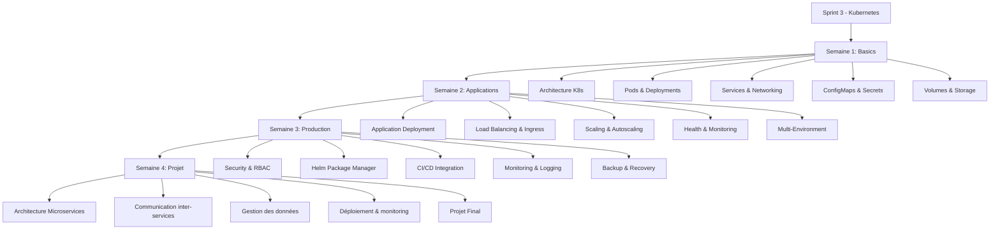

# Sprint 3 - Orchestration Kubernetes

## Objectifs du Sprint

Maîtriser l'orchestration de conteneurs avec Kubernetes pour déployer, gérer et scaler des applications en production dans un environnement cloud-native.

## 📚 Structure du Sprint et Navigation

### 📖 Semaine 1 - Kubernetes Basics

**Cours principal :** [S3_S1_cours_kubernetes_basics.md](Semaine-1-Kubernetes-Basics/cours/S3_S1_cours_kubernetes_basics.md)

**Contenu détaillé :**

- **Module 1:** Introduction Kubernetes - Architecture, composants, installation
- **Module 2:** Pods et Deployments - Gestion des workloads
- **Module 3:** Services et Networking - Communication inter-services
- **Module 4:** ConfigMaps et Secrets - Gestion de la configuration
- **Module 5:** Volumes et Storage - Persistance des données

**Ressources :**

- 📁 [LABs pratiques](Semaine-1-Kubernetes-Basics/labs/)
- 📝 [Quiz d'évaluation](Semaine-1-Kubernetes-Basics/quiz/)

---

### 📖 Semaine 2 - Kubernetes Applications

**Cours principal :** [S3_S2_cours_kubernetes_applications.md](Semaine-2-Kubernetes-Applications/cours/S3_S2_cours_kubernetes_applications.md)

**Contenu détaillé :**

- **Module 1:** Application Deployment - Déploiement d'applications complètes
- **Module 2:** Load Balancing et Ingress - Exposition et routage
- **Module 3:** Scaling et Autoscaling - Montée en charge automatique
- **Module 4:** Health et Monitoring - Surveillance et diagnostics
- **Module 5:** Multi-Environment - Gestion des environnements

**Ressources :**

- 📁 [LABs pratiques](Semaine-2-Kubernetes-Applications/labs/)
- 📝 [Quiz d'évaluation](Semaine-2-Kubernetes-Applications/quiz/)

---

### 📖 Semaine 3 - Kubernetes Production

**Cours spécialisés par séance :**

| Séance       | Sujet                 | Cours                                                                                                                |
| ------------ | --------------------- | -------------------------------------------------------------------------------------------------------------------- |
| **Séance 1** | Security et RBAC      | [S3_S3_Seance1_security_rbac.md](Semaine-3-Kubernetes-Production/cours/S3_S3_Seance1_security_rbac.md)               |
| **Séance 2** | Helm Package Manager  | [S3_S3_Seance2_helm_package_manager.md](Semaine-3-Kubernetes-Production/cours/S3_S3_Seance2_helm_package_manager.md) |
| **Séance 3** | CI/CD Integration     | [S3_S3_Seance3_cicd_integration.md](Semaine-3-Kubernetes-Production/cours/S3_S3_Seance3_cicd_integration.md)         |
| **Séance 4** | Monitoring et Logging | [S3_S3_Seance4_monitoring_logging.md](Semaine-3-Kubernetes-Production/cours/S3_S3_Seance4_monitoring_logging.md)     |
| **Séance 5** | Backup et Recovery    | [S3_S3_Seance5_backup_recovery.md](Semaine-3-Kubernetes-Production/cours/S3_S3_Seance5_backup_recovery.md)           |

**Ressources :**

- 📁 [LABs pratiques](Semaine-3-Kubernetes-Production/labs/)
- 📝 [Quiz d'évaluation](Semaine-3-Kubernetes-Production/quiz/)

---

### 📖 Semaine 4 - Projet K8s

**Cours projet :** [S3_S4_cours_projet_microservices.md](Semaine-4-Projet-K8s/cours/S3_S4_cours_projet_microservices.md)

**Contenu détaillé :**

- **Module 1:** Introduction aux Microservices
- **Module 2:** Architecture Patterns
- **Module 3:** Communication inter-services
- **Module 4:** Gestion des données
- **Module 5:** Déploiement et monitoring

**Ressources :**

- 📁 [LABs pratiques](Semaine-4-Projet-K8s/labs/)
- 📝 [Quiz d'évaluation](Semaine-4-Projet-K8s/quiz/)

## 🏆 Compétences Acquises

À l'issue de ce Sprint, vous maîtriserez :

### Compétences Kubernetes Core

- **Architecture K8s** : Master, Nodes, API Server, etcd
- **Workloads** : Pods, Deployments, StatefulSets, DaemonSets
- **Networking** : Services, Ingress, NetworkPolicies
- **Storage** : Volumes, PersistentVolumes, StorageClasses

### Compétences Applications

- **Deployment Strategies** : Rolling updates, Blue/Green, Canary
- **Configuration Management** : ConfigMaps, Secrets, Helm
- **Scaling** : HPA, VPA, Cluster Autoscaler
- **Security** : RBAC, Pod Security, Network Policies

### Compétences Production

- **Monitoring** : Prometheus, Grafana, Alerting
- **Logging** : ELK Stack, Fluentd, log aggregation
- **CI/CD** : GitLab K8s integration, ArgoCD
- **Service Mesh** : Istio, traffic management

## Prérequis

- **Sprint 2** : Docker, containerisation, CI/CD
- **Réseaux** : TCP/IP, DNS, load balancing
- **Système** : Administration Linux avancée
- **Cloud** : Concepts cloud computing de base

## Projet Final

Le Sprint se conclut par un **Projet Microservices Kubernetes** avec architecture complète :

📝 **Brief Projet** : Voir dossier `Brief-Projet-S3-Microservices-K8s/`

### Livrables du Projet

- Architecture microservices sur Kubernetes
- Déploiement multi-environnements (dev, staging, prod)
- CI/CD intégrée avec GitLab et ArgoCD
- Monitoring et logging centralisés
- Service mesh avec Istio

## Évaluation

- **LABs** : 80 exercices pratiques (4 par séance)
- **Quiz** : 20 validations de connaissances
- **Projet** : Architecture microservices complète
- **Seuil validation** : 72% minimum par évaluation

## 🧭 Navigation Complète

### 📚 Accès rapide aux cours

#### Semaine 1 - Kubernetes Basics

- 🎯 **[Cours principal](Semaine-1-Kubernetes-Basics/cours/S3_S1_cours_kubernetes_basics.md)** - Guide complet Kubernetes
- 📁 **[Dossier Semaine 1](Semaine-1-Kubernetes-Basics/)** - Tous les contenus

#### Semaine 2 - Kubernetes Applications

- 🎯 **[Cours principal](Semaine-2-Kubernetes-Applications/cours/S3_S2_cours_kubernetes_applications.md)** - Applications K8s
- 📁 **[Dossier Semaine 2](Semaine-2-Kubernetes-Applications/)** - Tous les contenus

#### Semaine 3 - Kubernetes Production

- 🔐 **[Security & RBAC](Semaine-3-Kubernetes-Production/cours/S3_S3_Seance1_security_rbac.md)**
- 📦 **[Helm Package Manager](Semaine-3-Kubernetes-Production/cours/S3_S3_Seance2_helm_package_manager.md)**
- 🔄 **[CI/CD Integration](Semaine-3-Kubernetes-Production/cours/S3_S3_Seance3_cicd_integration.md)**
- 📊 **[Monitoring & Logging](Semaine-3-Kubernetes-Production/cours/S3_S3_Seance4_monitoring_logging.md)**
- 💾 **[Backup & Recovery](Semaine-3-Kubernetes-Production/cours/S3_S3_Seance5_backup_recovery.md)**
- 📁 **[Dossier Semaine 3](Semaine-3-Kubernetes-Production/)** - Tous les contenus

#### Semaine 4 - Projet K8s

- 🏗️ **[Projet Microservices](Semaine-4-Projet-K8s/cours/S3_S4_cours_projet_microservices.md)** - Architecture complète
- 📁 **[Dossier Semaine 4](Semaine-4-Projet-K8s/)** - Tous les contenus

### 🎯 Ressources projet

- 📋 **[Brief Projet Final](Brief-Projet-S3-Microservices-K8s/)** - Spécifications complètes

### 🔧 Outils et ressources

- 📖 **[Documentation Kubernetes](https://kubernetes.io/docs/)**
- 🛠️ **[Kubectl Cheat Sheet](https://kubernetes.io/docs/reference/kubectl/cheatsheet/)**
- 📚 **[Helm Documentation](https://helm.sh/docs/)**

## 🗺️ Parcours d'apprentissage recommandé

---

_Formation DevOps - Sprint 3 Orchestration | Conforme aux standards HASSAN_
