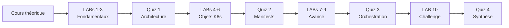

# Simplon Maghreb - Formation DevOps

# Sprint 3 - Semaine 1 : Kubernetes Basics

## Description de la semaine

Cette semaine introduit les concepts fondamentaux de Kubernetes, l'orchestrateur de conteneurs leader de l'industrie. Les apprenants découvriront l'architecture Kubernetes, les objets de base, et développeront une expertise pratique à travers 10 LABs progressifs.

## Organisation pédagogique

### Cours consolidé

- **S3_S1_cours_kubernetes_basics.md** : Cours unique couvrant tous les concepts de la semaine

### Exercices pratiques

- **10 LABs obligatoires** : Progression de l'installation à l'orchestration avancée
- **LAB 10 Challenge** : Projet d'intégration complet

### Évaluation spécialisée

- **4 quiz ciblés** : 100 questions réparties par niveau de complexité

## Objectifs de formation

### Objectifs pédagogiques

- Comprendre l'architecture et les concepts fondamentaux de Kubernetes
- Maîtriser la création et gestion des objets Kubernetes essentiels
- Développer l'autonomie dans le déploiement d'applications containerisées
- Acquérir les reflexes DevOps pour l'orchestration en production

### Objectifs techniques

Architecture Kubernetes, Pods, Services, Deployments, ConfigMaps, Secrets, Volumes, Ingress, kubectl, YAML manifests, orchestration conteneurs, haute disponibilité

## Structure des contenus

### LABs (labs/enonces/ et labs/corrections/)

1. **LAB 1** - Installation et configuration cluster
2. **LAB 2** - Premiers Pods et conteneurs
3. **LAB 3** - Services et networking
4. **LAB 4** - Deployments et ReplicaSets
5. **LAB 5** - ConfigMaps et variables
6. **LAB 6** - Secrets et sécurité
7. **LAB 7** - Volumes et persistance
8. **LAB 8** - Ingress et exposition
9. **LAB 9** - Monitoring et debugging
10. **LAB 10 Challenge** - Application multi-tiers complète

### Quiz spécialisés (quiz/)

1. **Quiz 1** - Concepts et architecture de base (25 questions)
2. **Quiz 2** - Objets et manifests intermédiaires (25 questions)
3. **Quiz 3** - Orchestration avancée (25 questions)
4. **Quiz 4** - Intégration et synthèse (25 questions)

## Durée et organisation

- **Cours théorique** : Étude autonome du fichier consolidé
- **Pratique intensive** : 10 LABs avec complexité croissante
- **Évaluation progressive** : 4 quiz de 25 questions chacun
- **Validation** : Seuil 72% pour chaque quiz

## Prérequis techniques

- Bases Docker et conteneurisation
- Connaissances réseau et architecture distribuée
- Expérience ligne de commande Linux
- Notions DevOps et infrastructure

## Navigation et Ressources

### Cours principal

- **[S3_S1_cours_kubernetes_basics.md](cours/S3_S1_cours_kubernetes_basics.md)** - Cours complet Kubernetes Basics

### Exercices pratiques - LABs

| LAB | Titre                           | Énoncé                                    | Correction                                       |
| --- | ------------------------------- | ----------------------------------------- | ------------------------------------------------ |
| 1   | Installation cluster            | [LAB 1](labs/enonces/lab1.md)             | [Solution](labs/corrections/lab1_correction.md)  |
| 2   | Premiers Pods                   | [LAB 2](labs/enonces/lab2.md)             | [Solution](labs/corrections/lab2_correction.md)  |
| 3   | Services et networking          | [LAB 3](labs/enonces/lab3.md)             | [Solution](labs/corrections/lab3_correction.md)  |
| 4   | Deployments et ReplicaSets      | [LAB 4](labs/enonces/lab4.md)             | [Solution](labs/corrections/lab4_correction.md)  |
| 5   | ConfigMaps et variables         | [LAB 5](labs/enonces/lab5.md)             | [Solution](labs/corrections/lab5_correction.md)  |
| 6   | Secrets et sécurité             | [LAB 6](labs/enonces/lab6.md)             | [Solution](labs/corrections/lab6_correction.md)  |
| 7   | Volumes et persistance          | [LAB 7](labs/enonces/lab7.md)             | [Solution](labs/corrections/lab7_correction.md)  |
| 8   | Ingress et exposition           | [LAB 8](labs/enonces/lab8.md)             | [Solution](labs/corrections/lab8_correction.md)  |
| 9   | Monitoring et debugging         | [LAB 9](labs/enonces/lab9.md)             | [Solution](labs/corrections/lab9_correction.md)  |
| 10  | **Challenge** - App multi-tiers | [LAB 10](labs/enonces/lab10_challenge.md) | [Solution](labs/corrections/lab10_correction.md) |

### Évaluations - Quiz

| Quiz | Thème                    | Questions | Lien                                 |
| ---- | ------------------------ | --------- | ------------------------------------ |
| 1    | Concepts et architecture | 25        | [Quiz 1](quiz/quiz1_architecture.md) |
| 2    | Objets et manifests      | 25        | [Quiz 2](quiz/quiz2_objets.md)       |
| 3    | Orchestration avancée    | 25        | [Quiz 3](quiz/quiz3_avance.md)       |
| 4    | Intégration et synthèse  | 25        | [Quiz 4](quiz/quiz4_integration.md)  |

### Liens utiles

- **[Retour Sprint 3](../README.md)** - Vue d'ensemble du sprint
- **[Semaine 2](../Semaine-2-Kubernetes-Applications/)** - Kubernetes Applications
- **[Documentation Kubernetes](https://kubernetes.io/docs/)** - Documentation officielle
- **[Kubectl Cheat Sheet](https://kubernetes.io/docs/reference/kubectl/cheatsheet/)** - Aide-mémoire kubectl

## Progression recommandée

