# Simplon Maghreb - Formation DevOps

# Sprint 3 - Semaine 1 : Kubernetes Basics - Introduction à l'orchestration de conteneurs

## Objectifs pédagogiques

- Comprendre l'architecture et les concepts fondamentaux de Kubernetes
- Maîtriser la création et gestion des objets Kubernetes essentiels
- Développer l'autonomie dans le déploiement d'applications containerisées
- Acquérir les reflexes DevOps pour l'orchestration en production

## Objectifs techniques

Architecture Kubernetes, Pods, Services, Deployments, ConfigMaps, Secrets, Volumes, Ingress, kubectl, YAML manifests, orchestration conteneurs, haute disponibilité

## Table des matières

1. [Introduction à Kubernetes](#1-introduction-à-kubernetes)
   - [1.8 Qu'est-ce qu'un cluster Kubernetes ?](#18-quest-ce-quun-cluster-kubernetes)
2. [Architecture Kubernetes](#2-architecture-kubernetes)
3. [Installation et configuration](#3-installation-et-configuration)
4. [Pods et conteneurs](#4-pods-et-conteneurs)
5. [Services et networking](#5-services-et-networking)
6. [Deployments et ReplicaSets](#6-deployments-et-replicasets)
7. [Configuration et secrets](#7-configuration-et-secrets)
8. [Volumes et persistance](#8-volumes-et-persistance)
9. [Ingress et exposition](#9-ingress-et-exposition)
10. [Monitoring et debugging](#10-monitoring-et-debugging)
11. [Récapitulatif et prochaines étapes](#11-récapitulatif-et-prochaines-étapes)
12. [Ressources complémentaires](#12-ressources-complémentaires)

---

## 1. Introduction à Kubernetes

### 1.1 Qu'est-ce que Kubernetes ? Comprendre les bases

Kubernetes (prononcé "kube-eur-netes" ou abrégé **K8s**) est un système qui vous aide à gérer des applications dans des conteneurs. Mais commençons par le début...

#### Analogie du port de conteneurs

Imaginez un port maritime géant avec des milliers de conteneurs :

- Chaque conteneur contient des marchandises (votre application)
- Il faut les organiser, les déplacer, les surveiller
- Certains conteneurs doivent être proches d'autres
- Il faut remplacer ceux qui sont endommagés
- Il faut adapter le nombre selon la demande

**Kubernetes fait exactement cela, mais avec des conteneurs d'applications !**

#### Définition simple

Kubernetes est un **chef d'orchestre** qui :

- Déploie vos applications dans des conteneurs
- Les surveille en permanence
- Les répare automatiquement si elles cassent
- Les fait grandir ou diminuer selon les besoins
- Les organise de manière intelligente

### 1.2 Pourquoi Kubernetes existe-t-il ?

#### Le problème avant Kubernetes

Vous développez une application web moderne. Sans Kubernetes, voici ce qui se passe :

**Scénario concret** : Boutique en ligne "TechShop"

```
Application = Frontend + API + Base de données + Service de paiement
```

**Les défis quotidiens** :

1. **Déploiement manuel** : "Il faut que je me connecte à 5 serveurs différents..."
2. **Surveillance constante** : "Est-ce que tout fonctionne ? Je dois vérifier toutes les heures..."
3. **Scaling difficile** : "Black Friday arrive, il faut 10 fois plus de serveurs. Vite !"
4. **Pannes** : "Le serveur 3 est tombé à 2h du matin. Personne ne l'a vu..."
5. **Mises à jour risquées** : "Si je me trompe, tout le site tombe..."

#### Ce que Kubernetes résout

Kubernetes automatise tout cela :

```
 Déploiement automatique    → "kubectl apply" et c'est parti !
 Surveillance 24/7          → Redémarre automatiquement ce qui casse
 Scaling intelligent        → Ajoute des serveurs quand il y a du trafic
 Auto-réparation           → Détecte et corrige les problèmes
 Mises à jour sécurisées   → Remplace progressivement sans interruption
```

### 1.3 Comment Kubernetes simplifie votre travail

#### Avant et après Kubernetes

**AVANT Kubernetes** (la vie difficile) :

```bash
# Vous devez faire cela sur chaque serveur...
ssh serveur1.com
docker stop mon-app
docker pull mon-app:nouvelle-version
docker run mon-app:nouvelle-version
# Puis répéter sur serveur2, serveur3, serveur4...
# En espérant que rien ne casse !
```

**AVEC Kubernetes** (la vie facile) :

```bash
# Une seule commande pour tout mettre à jour !
kubectl set image deployment/mon-app app=mon-app:nouvelle-version
# Kubernetes s'occupe de tout : 50 serveurs ? Pas de problème !
```

#### Les superpouvoir de Kubernetes

**1. Auto-guérison** : Comme un infirmier robot

- Une application crashe ? Kubernetes la redémarre
- Un serveur tombe ? Kubernetes déplace les applications ailleurs

**2. Scaling magique** : Comme un élastique intelligent

- Plus d'utilisateurs ? Plus d'applications automatiquement
- Moins d'utilisateurs ? Moins d'applications pour économiser

**3. Équilibrage de charge** : Comme un répartiteur de trafic

- Distribue les utilisateurs sur toutes vos applications
- Évite qu'une seule application soit surchargée

### 1.4 Les concepts de base (sans jargon technique)

Kubernetes organise tout avec quelques éléments simples :

#### Pod = La plus petite boîte

```
Un Pod = Un conteneur avec votre application
Exemple : Un Pod avec votre site web
```

#### Deployment = Le gestionnaire intelligent

```
Un Deployment = "Je veux 3 copies de mon site web"
Kubernetes s'assure qu'il y en a toujours 3 qui fonctionnent
```

#### Service = L'adresse fixe

```
Un Service = "Mon site est toujours accessible à cette adresse"
Même si les Pods bougent, l'adresse reste la même
```

#### Exemple concret : Restaurant moderne

Imaginez un restaurant avec :

- **Cuisiniers** (Pods) : Ils préparent les plats
- **Chef de cuisine** (Deployment) : "Il me faut 5 cuisiniers en permanence"
- **Maître d'hôtel** (Service) : Accueille les clients et les dirige vers les cuisiniers disponibles

Si un cuisinier tombe malade (Pod crashe), le chef embauche immédiatement un remplaçant !

### 1.5 Kubernetes dans le monde réel

#### Qui utilise Kubernetes ?

**Netflix** : Gère des millions de films et séries

- 1000+ microservices orchestrés par Kubernetes
- Scaling automatique selon l'audience

**Spotify** : Votre musique partout dans le monde

- Déploie 4000+ fois par jour grâce à Kubernetes
- Disponibilité 99.9% garantie

**Airbnb** : Des millions de réservations

- 1000+ services migrés vers Kubernetes
- Économies de 50% sur l'infrastructure

#### Kubernetes vs. alternatives

| Solution       | Complexité | Flexibilité   | Communauté |
| -------------- | ---------- | ------------- | ---------- |
| **Kubernetes** | Élevée     | Maximale      | Énorme     |
| Docker Swarm   | Faible     | Limitée       | Petite     |
| Amazon ECS     | Moyenne    | AWS seulement | AWS        |

**Pourquoi choisir Kubernetes ?**

- Standard de l'industrie (80% des entreprises)
- Fonctionne partout (AWS, Azure, Google, on-premise)
- Communauté massive et support à long terme

### 1.6 Votre parcours d'apprentissage

#### Étapes de ce cours

```
Étape 1: Installation de votre "laboratoire" Kubernetes
    ↓
Étape 2: Votre premier Pod (Hello World !)
    ↓
Étape 3: Créer un Deployment (plusieurs copies)
    ↓
Étape 4: Exposer avec un Service (accès externe)
    ↓
Étape 5: Configuration et secrets
    ↓
Étape 6: Stockage persistant
    ↓
Étape 7: Exposition sur Internet
    ↓
Étape 8: Surveillance et debugging
```

#### Objectifs d'apprentissage

À la fin de cette semaine, vous saurez :

**Compétences pratiques** :

- Installer et configurer un cluster Kubernetes
- Déployer vos applications en toute confiance
- Diagnostiquer et résoudre les problèmes courants
- Faire du scaling et des mises à jour sans stress

**Compétences conceptuelles** :

- Comprendre l'architecture Kubernetes
- Choisir les bons objets pour vos besoins
- Appliquer les bonnes pratiques de production
- Intégrer Kubernetes dans vos workflows DevOps

#### Prérequis recommandés

**Indispensables** :

- Docker : Création et gestion de conteneurs
- Linux : Ligne de commande et concepts de base
- Réseaux : IP, ports, DNS

**Recommandés** :

- YAML : Syntaxe de base
- Git : Versionning du code
- CI/CD : Pipelines de déploiement

### 1.7 Préparation de votre environnement

#### Outils que nous allons utiliser

**minikube** : Votre Kubernetes personnel

- Cluster Kubernetes complet sur votre machine
- Parfait pour apprendre et tester

**kubectl** : Votre baguette magique

- Interface en ligne de commande pour Kubernetes
- Toutes les opérations passent par cet outil

**Docker Desktop** : Moteur de conteneurs

- Création et gestion des images
- Intégration native avec Kubernetes

#### Méthodologie pédagogique

**Approche "Learning by Doing"** :

1. **Théorie** (15 min) : Concepts expliqués simplement
2. **Démonstration** (10 min) : Je vous montre comment faire
3. **Pratique** (20 min) : Vous faites un LAB guidé
4. **Validation** (5 min) : Quiz pour vérifier la compréhension

**Progression douce** :

- Chaque concept s'appuie sur le précédent
- Exemples concrets avant les abstractions
- Erreurs courantes expliquées et évitées

---

**Prêt pour l'aventure ?** Maintenant que vous comprenez POURQUOI Kubernetes existe et ce qu'il peut faire pour vous, commençons par comprendre ce qu'est un **cluster** avant de découvrir son architecture !

---

## 1.8 Qu'est-ce qu'un cluster Kubernetes ?

### 1.8.1 Définition du cluster

Un **cluster Kubernetes** est un ensemble de machines (physiques ou virtuelles) qui travaillent ensemble pour faire fonctionner vos applications conteneurisées.

**Analogie simple** : Imaginez un orchestre symphonique :

- **Le chef d'orchestre** = Control Plane (dirige tout)
- **Les musiciens** = Worker Nodes (exécutent le travail)
- **La partition** = Vos applications à déployer

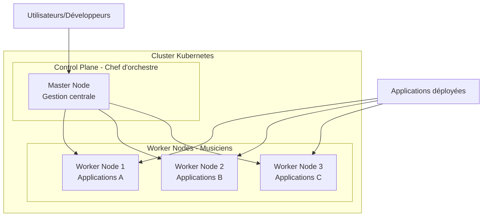

### 1.8.2 Anatomie d'un cluster

#### Control Plane - Le cerveau du cluster

**Rôle** : Prendre toutes les décisions importantes

- Où placer les applications ?
- Comment gérer les pannes ?
- Qui peut accéder à quoi ?

**Composants clés** :

- **API Server** : Point d'entrée pour toutes les commandes
- **etcd** : Mémoire du cluster (base de données)
- **Scheduler** : Décide où placer les applications
- **Controller Manager** : Surveille et corrige les problèmes

#### Worker Nodes - Les exécutants

**Rôle** : Faire tourner vos applications

- Héberger les conteneurs
- Communiquer avec le Control Plane
- Surveiller la santé des applications

**Composants clés** :

- **Kubelet** : Agent qui reçoit les ordres
- **Container Runtime** : Moteur qui fait tourner les conteneurs
- **Kube-proxy** : Gère le réseau entre les applications

### 1.8.3 Communication dans le cluster

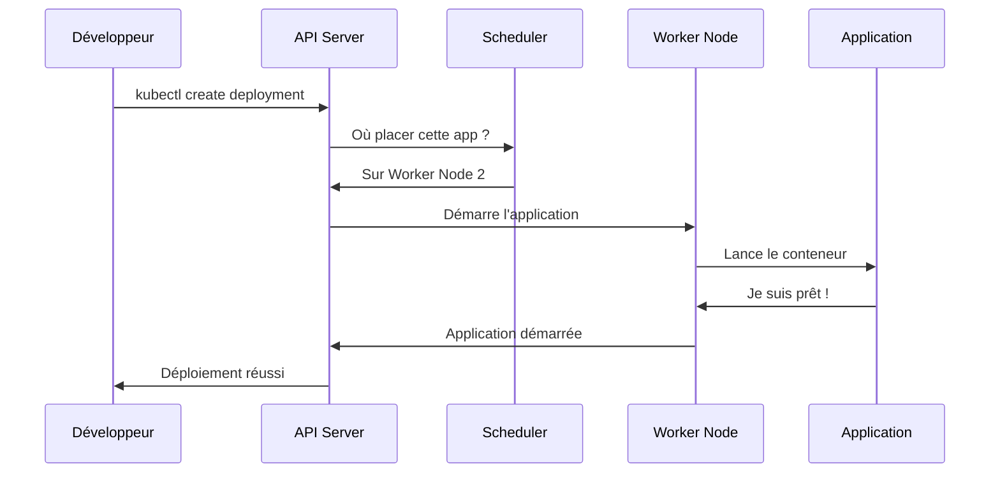

### 1.8.4 Avantages du cluster

#### Haute disponibilité

- Si un Worker Node tombe, les autres continuent
- Le Control Plane peut être dupliqué pour éviter les pannes

#### Scalabilité horizontale

**Deux niveaux de scalabilité distincts** :

- **Infrastructure** : Cluster saturé ? Un administrateur (ou Cluster Autoscaler) ajoute des Worker Nodes
- **Applications** : Trop de charge applicative ? Kubernetes scale automatiquement les pods (HPA)

#### Isolation et sécurité

- Chaque application dans son propre conteneur
- Réseau isolé entre les composants
- Contrôle d'accès granulaire

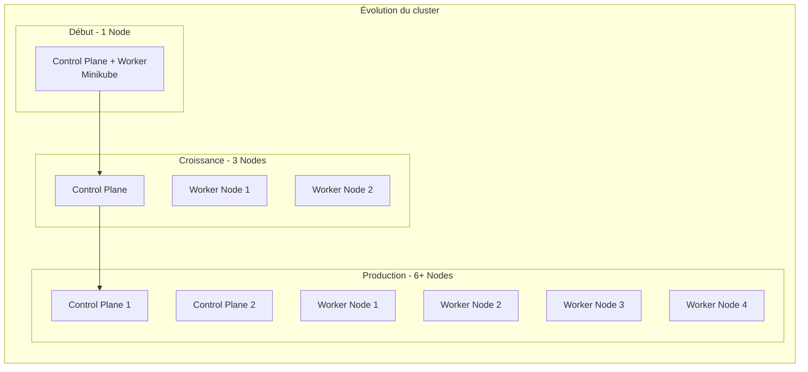

### 1.8.5 Types de clusters selon l'usage

#### Cluster de développement (Minikube)

- **1 seule machine** : Votre laptop
- **Tous les composants** sur le même node
- **Parfait pour** : Apprendre et tester

#### Cluster de production

- **Plusieurs machines** : Control Plane séparé des Workers
- **Haute disponibilité** : Redondance des composants critiques
- **Parfait pour** : Applications critiques en production

#### Cluster cloud managé

- **Infrastructure gérée** : Le cloud provider s'occupe du Control Plane
- **Vous gérez** : Seulement les Worker Nodes et applications
- **Parfait pour** : Focus sur les applications, pas l'infrastructure

### 1.8.6 Clarifications importantes sur les responsabilités

#### Qui crée le cluster ? (Kubernetes ne crée PAS l'infrastructure)

** Responsabilités EXTERNES à Kubernetes** :

- **Provisioning du cluster** : Créer les machines/VMs physiques ou cloud
- **Installation de Kubernetes** : Installer K8s sur ces machines
- **Configuration réseau de base** : Connectivité entre nodes

** Responsabilités de Kubernetes** :

- **Orchestration** : Gérer les applications dans un cluster existant
- **Scheduling** : Décider où placer les pods
- **Networking** : Connecter les services entre eux
- **Monitoring** : Surveiller la santé des applications

#### Qui crée réellement le cluster ?

**Plateformes cloud managées** :

- AWS EKS, Google GKE, Azure AKS
- Le cloud provider gère l'infrastructure, K8s gère les workloads

**Outils d'installation** :

- `kubeadm` (installation manuelle)
- `kops` (AWS), Terraform + Ansible
- Cluster Autoscaler (ajout automatique de nodes)

#### Les deux types de scalabilité

**1. Scalabilité des APPLICATIONS** ( Kubernetes s'en occupe automatiquement) :

```
Traffic ↑ → CPU usage ↑ → HPA déclenché → Plus de pods créés
1 pod nginx → 5 pods nginx (sur les nodes existants)
```

**2. Scalabilité de l'INFRASTRUCTURE** ( Kubernetes ne peut PAS le faire seul) :

```
Tous les nodes saturés → Un humain ou outil externe ajoute des Worker Nodes
Kubernetes ne peut pas appeler AWS pour créer une nouvelle EC2
```

**Analogie du chef d'orchestre** :

- **Kubernetes = Chef d'orchestre** : Dirige les musiciens existants, peut leur demander de jouer plus fort (scale pods)
- **Infrastructure = Salle de concert** : Il faut des humains/outils pour agrandir la salle et embaucher de nouveaux musiciens (nodes)

**Outils pour la scalabilité infrastructure** :

- Cluster Autoscaler (outil externe qui s'interface avec K8s)
- Cloud provider auto-scaling (AWS Auto Scaling Groups)
- Terraform/Pulumi pour provisioning
- Scripts d'administration manuelle

---

## 2. Architecture Kubernetes

### 2.1 Vue d'ensemble architecturale

Kubernetes suit une architecture **maître-esclave** avec séparation claire entre le **control plane** (gestion) et les **worker nodes** (exécution).

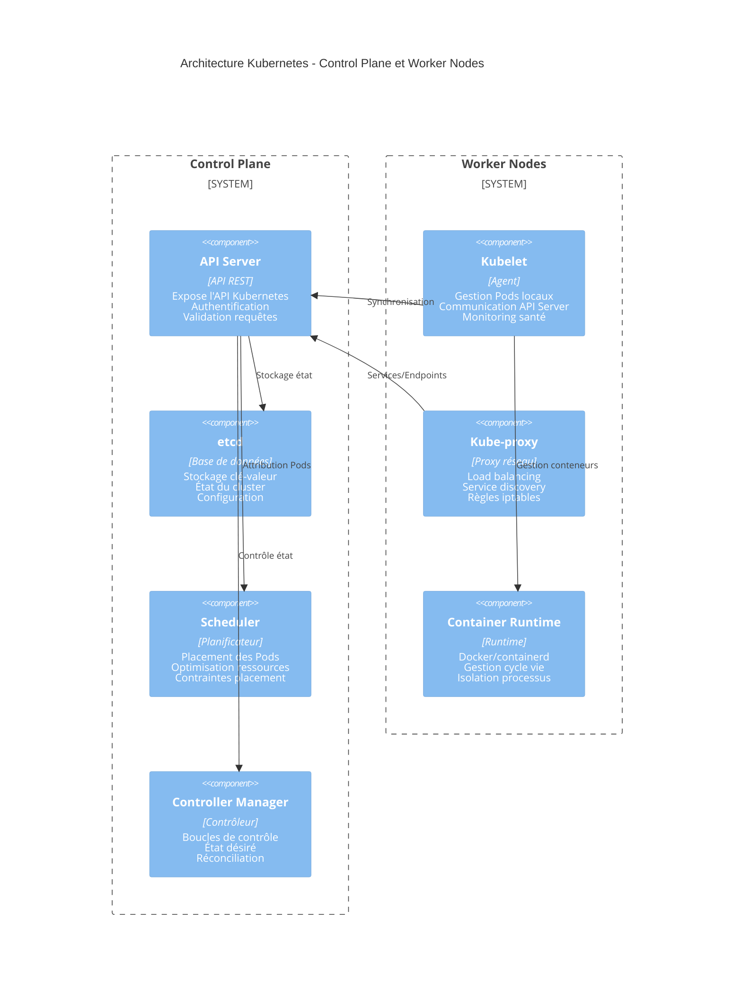

### 2.2 Composants du Control Plane

#### API Server

**Rôle** : Point d'entrée unique pour toutes les opérations du cluster

**Fonctions** :

- Expose l'API REST Kubernetes
- Authentification et autorisation des requêtes
- Validation et admission des objets
- Interface avec etcd pour la persistance

#### etcd

**Rôle** : Base de données distribuée du cluster

**Fonctions** :

- Stockage clé-valeur hautement disponible
- Persistance de l'état désiré du cluster
- Configuration et métadonnées des objets

#### Scheduler

**Rôle** : Planificateur intelligent des workloads

**Fonctions** :

- Attribution des Pods aux nodes appropriés
- Optimisation des ressources (CPU, mémoire)
- Respect des contraintes de placement

#### Controller Manager

**Rôle** : Moteur de réconciliation de l'état

**Fonctions** :

- Exécution des boucles de contrôle
- Maintien de l'état désiré vs état réel
- Gestion des objets Kubernetes (ReplicaSets, Services)

**Controllers intégrés** :

- **ReplicaSet Controller** : Assure le nombre correct de Pods
- **Deployment Controller** : Gère les déploiements et rolling updates
- **Service Controller** : Maintient les endpoints des Services
- **Node Controller** : Surveille l'état des nodes
- **Namespace Controller** : Gère le cycle de vie des namespaces

### 2.3 Composants des Worker Nodes

#### Kubelet

**Rôle** : Agent principal du node, interface avec le control plane

**Fonctions** :

- Communication bidirectionnelle avec l'API Server
- Gestion du cycle de vie des Pods sur le node
- Monitoring de la santé des conteneurs
- Reporting du statut du node et des Pods

#### Kube-proxy

**Rôle** : Proxy réseau pour la connectivité des Services

**Fonctions** :

- Implémentation des Services Kubernetes via iptables/IPVS
- Load balancing du trafic vers les Pods backends
- Service discovery et routage réseau
- Gestion des règles de pare-feu réseau

#### Container Runtime

**Rôle** : Moteur d'exécution des conteneurs

**Options supportées** :

- **Docker** : Runtime traditionnel (en cours de deprecation)
- **containerd** : Runtime léger, performant (recommandé)
- **CRI-O** : Runtime optimisé pour Kubernetes

**Fonctions** :

- Téléchargement et gestion des images conteneurs
- Création et démarrage des conteneurs
- Isolation des processus et gestion des ressources
- Interface avec le système d'exploitation hôte

---

## 3. Installation et configuration

### 3.1 Options d'installation disponibles

**Important** : Il existe plusieurs méthodes pour installer Kubernetes selon l'environnement :

#### Environnements de développement

- **Minikube** : Cluster local sur une seule machine (recommandé pour l'apprentissage)
- **Kind** : Kubernetes dans Docker
- **Docker Desktop** : Intégration Kubernetes native

#### Environnements de production

- **Kubeadm** : Installation manuelle sur infrastructure
- **Solutions cloud managées** : EKS (AWS), GKE (Google), AKS (Azure)

### 3.2 Installation pour l'apprentissage - Windows avec Chocolatey

**Pour des objectifs pédagogiques, nous allons installer Minikube avec VirtualBox comme driver.**

Cette configuration est idéale pour :

- Apprendre les concepts Kubernetes
- Tester des configurations
- Développer des applications

#### Étape 1 : Vérifier les prérequis

```powershell
# Vérifier que Windows est en version compatible
winver

# Vérifier que la virtualisation est activée
systeminfo | findstr /i "hyper-v"
```

#### Étape 2 : Installer Chocolatey (si pas déjà fait)

```powershell
# Exécuter en tant qu'administrateur
Set-ExecutionPolicy Bypass -Scope Process -Force;
[System.Net.ServicePointManager]::SecurityProtocol = [System.Net.ServicePointManager]::SecurityProtocol -bor 3072;
iex ((New-Object System.Net.WebClient).DownloadString('https://community.chocolatey.org/install.ps1'))
```

#### Étape 3 : Installer VirtualBox (driver pour Minikube)

```powershell
# Installer VirtualBox via Chocolatey
choco install virtualbox -y

# Redémarrer si demandé
```

#### Étape 4 : Installer kubectl

**Référence officielle** : [Install kubectl on Windows](https://kubernetes.io/docs/tasks/tools/install-kubectl-windows/)

```powershell
# Option 1 : Via Chocolatey (recommandé)
choco install kubernetes-cli -y

# Option 2 : Via curl (alternative)
curl.exe -LO "https://dl.k8s.io/release/v1.28.0/bin/windows/amd64/kubectl.exe"

# Vérifier l'installation
kubectl version --client
```

#### Étape 5 : Installer Minikube

**Référence officielle** : [Install Minikube](https://kubernetes.io/fr/docs/tasks/tools/install-minikube/)

```powershell
# Via Chocolatey
choco install minikube -y

# Ou via téléchargement direct
curl.exe -LO "https://storage.googleapis.com/minikube/releases/latest/minikube-windows-amd64.exe"
# Puis déplacer vers un dossier dans le PATH
```

#### Étape 6 : Démarrer votre cluster Kubernetes

**Méthode recommandée - VirtualBox** :

```powershell
# Démarrer Minikube avec VirtualBox
minikube start --driver=virtualbox
```

** Si VirtualBox échoue (problème VT-X/AMD-v)** :

Si vous obtenez l'erreur `This computer doesn't have VT-X/AMD-v enabled`, utilisez Docker à la place :

```powershell
# Solution alternative avec Docker Desktop
minikube delete  # Nettoyer si échec précédent
minikube start --driver=docker

# Ou avec plus d'options si nécessaire
minikube start --driver=docker --container-runtime=docker
```

**Vérification du cluster** :

```powershell
# Vérifier le statut
minikube status

# Vérifier que kubectl fonctionne
kubectl cluster-info
kubectl get nodes
```

### 3.3 Configuration et vérification

#### Configurer kubectl pour Minikube

```bash
# Minikube configure automatiquement kubectl
# Vérifier la configuration
kubectl config current-context

# Voir les détails du cluster
kubectl cluster-info

# Lister les nodes (vous devriez voir minikube)
kubectl get nodes
```

#### Commandes de diagnostic essentielles

```bash
# État du cluster
minikube status
kubectl get componentstatuses

# État des nodes
kubectl get nodes -o wide

# Pods système
kubectl get pods -n kube-system

# Événements récents
kubectl get events --sort-by='.firstTimestamp'
```

#### Interface graphique (optionnel)

```bash
# Démarrer le dashboard Kubernetes
minikube dashboard

# Cela ouvrira une interface web dans votre navigateur
```

### 3.4 Commandes utiles Minikube

```bash
# Arrêter le cluster
minikube stop

# Supprimer le cluster
minikube delete

# Voir l'IP du cluster
minikube ip

# Se connecter en SSH au node
minikube ssh

# Voir les addons disponibles
minikube addons list

# Activer un addon (ex: ingress)
minikube addons enable ingress
```

### 3.5 Gestion des profils Minikube

**Concept important** : Minikube permet de créer et gérer plusieurs **profils** (clusters isolés) simultanément. Chaque profil est un cluster Kubernetes indépendant avec sa propre configuration.

#### Pourquoi utiliser plusieurs profils ?

- **Isolation des environnements** : dev, test, staging séparés
- **Versions Kubernetes différentes** : tester la compatibilité
- **Configurations spécifiques** : ressources, addons, drivers
- **Projets multiples** : éviter les conflits entre applications

#### Commandes de gestion des profils

```bash
# Lister tous les profils existants
minikube profile list

# Créer et démarrer un nouveau profil
minikube start -p dev-cluster --kubernetes-version=v1.28.0
minikube start -p prod-cluster --cpus=4 --memory=8192

# Changer de profil actif
minikube profile dev-cluster

# Voir le profil actuellement actif
minikube profile

# Démarrer un profil spécifique
minikube start -p dev-cluster

# Arrêter un profil spécifique
minikube stop -p dev-cluster

# Supprimer un profil
minikube delete -p dev-cluster
```

#### Interaction kubectl avec les profils

**Important** : `kubectl` suit automatiquement le profil Minikube actif via les contextes.

```bash
# Voir le contexte kubectl actuel
kubectl config current-context

# Lister tous les contextes disponibles
kubectl config get-contexts

# Changer de contexte kubectl manuellement
kubectl config use-context minikube-dev-cluster

# Vérifier sur quel cluster vous travaillez
kubectl cluster-info
kubectl get nodes
```

#### Exemple pratique : Environnements séparés

```bash
# Environnement de développement
minikube start -p development \
  --cpus=2 --memory=4096 \
  --kubernetes-version=v1.28.0

# Environnement de test
minikube start -p testing \
  --cpus=3 --memory=6144 \
  --kubernetes-version=v1.29.0

# Basculer entre environnements
minikube profile development
kubectl get pods  # Pods de l'env development

minikube profile testing
kubectl get pods  # Pods de l'env testing
```

#### Bonnes pratiques profils

- **Nommage cohérent** : `dev`, `test`, `staging`
- **Documentation** : Noter la purpose de chaque profil
- **Nettoyage régulier** : Supprimer les profils inutilisés
- **Ressources appropriées** : Ajuster CPU/mémoire selon l'usage

#### 3.5.1 Différence cruciale : Profil vs Contexte

**Confusion courante** : Beaucoup confondent profils Minikube et contextes kubectl. Voici les différences essentielles :

| Aspect         | **Profil Minikube**                          | **Contexte kubectl**                            |
| -------------- | -------------------------------------------- | ----------------------------------------------- |
| **Définition** | Instance réelle de cluster Kubernetes        | Configuration client dans kubeconfig            |
| **Objet**      | Cluster physique (API server, kubelet, etcd) | Pointeur vers cluster + utilisateur + namespace |
| **Gestion**    | Commandés par `minikube`                     | Gérés par `kubectl config`                      |
| **Stockage**   | `~/.minikube/profiles/<nom>/`                | `~/.kube/config`                                |
| **Action**     | Démarre/arrête un cluster réel               | Change la cible du client kubectl               |

#### Exemples pratiques de la différence

**Scénario 1 : Créer un profil Minikube**

```bash
# Crée ET démarre un cluster réel nommé "development"
minikube start -p development

# Résultat :
# Cluster Kubernetes running sur votre machine
# Contexte "development" ajouté automatiquement dans kubeconfig
# kubectl pointe maintenant vers ce cluster
```

**Scénario 2 : Basculer entre contextes**

```bash
# Lister les contextes disponibles
kubectl config get-contexts

# Changer de contexte (ne démarre PAS de cluster)
kubectl config use-context minikube-production

# Résultat :
# kubectl pointe vers le cluster "production"
# Si le cluster n'est pas démarré → erreurs de connexion
```

**Scénario 3 : Arrêter un profil**

```bash
# Arrête le cluster physique "development"
minikube stop -p development

# Résultat :
# Cluster "development" arrêté (plus d'API server)
# Contexte "development" existe toujours dans kubeconfig
# kubectl vers ce contexte → erreurs "connection refused"
```

#### Workflow typique profil + contexte

```bash
# 1. Créer et démarrer un profil (cluster réel)
minikube start -p mon-projet --cpus=2 --memory=4096

# 2. Vérifier que le contexte est créé automatiquement
kubectl config get-contexts
# * minikube-mon-projet    minikube-mon-projet   minikube-mon-projet

# 3. Travailler avec kubectl (utilise le contexte actif)
kubectl get nodes
kubectl create deployment nginx --image=nginx

# 4. Créer un autre profil
minikube start -p autre-projet --cpus=1 --memory=2048

# 5. Basculer manuellement entre contextes
kubectl config use-context minikube-mon-projet
kubectl get pods  # Pods du premier projet

kubectl config use-context minikube-autre-projet
kubectl get pods  # Pods du second projet
```

#### Points d'attention importants

**Erreur fréquente** :

```bash
# Mauvais : essayer de démarrer un "contexte"
kubectl config use-context mon-cluster  # ← Juste pointer kubectl
# Si le cluster n'est pas running → erreurs !

# Correct : démarrer le profil puis utiliser le contexte
minikube start -p mon-cluster  # ← Démarrer le cluster réel
kubectl config use-context minikube-mon-cluster  # ← Pointer kubectl
```

**Règle mnémotechnique** :

- **Profil** = Cluster **physique** (CPU, mémoire, processus)
- **Contexte** = Configuration **logique** (fichier texte)

### 3.6 Résolution de problèmes courants

#### Problème de virtualisation (VT-X/AMD-v)

**Erreur** : `This computer doesn't have VT-X/AMD-v enabled`

**Causes possibles** :

- Virtualisation désactivée dans le BIOS
- Hyper-V activé (incompatible avec VirtualBox)
- Machine virtuelle ou WSL2 qui interfère

**Solutions** :

1. **Solution immédiate - Utiliser Docker** :

```bash
minikube delete
minikube start --driver=docker
```

2. **Vérifier Hyper-V (PowerShell Admin)** :

```powershell
# Désactiver Hyper-V si activé
dism.exe /Online /Disable-Feature:Microsoft-Hyper-V-All
# Redémarrer la machine
```

3. **Activer la virtualisation dans le BIOS** :
   - Redémarrer et entrer dans le BIOS (F2, F12, Del selon le fabricant)
   - Chercher "Virtualization Technology" ou "VT-X"
   - Activer et sauvegarder

#### Minikube ne démarre pas avec Docker

**Erreur** : `error during connect: Get "http://%2F%2F.%2Fpipe%2FdockerDesktopLinuxEngine/v1.51/version"`

**Solution** :

```bash
# S'assurer que Docker Desktop est démarré
docker version

# Si Docker ne répond pas, redémarrer Docker Desktop
# Puis essayer de nouveau
minikube start --driver=docker --container-runtime=docker
```

#### Minikube démarre mais kubectl ne fonctionne pas

```bash
# Vérifier les contextes
kubectl config get-contexts

# Utiliser le contexte minikube
kubectl config use-context minikube

# Vérifier la connectivité
kubectl cluster-info
```

#### Problèmes de réseau/proxy

**Erreur** : `Failing to connect to https://registry.k8s.io/`

**Solutions** :

```bash
# Démarrer avec une image locale si disponible
minikube start --driver=docker --base-image=gcr.io/k8s-minikube/kicbase:v0.0.48

# Ou configurer un proxy si nécessaire
minikube start --driver=docker --docker-env HTTP_PROXY=http://proxy:8080
```

#### Commandes de diagnostic

```bash
# Logs détaillés
minikube logs

# Statut complet
minikube status

# Informations système
minikube profile list
docker ps -a

# Redémarrage complet
minikube stop
minikube delete
minikube start --driver=docker
```

** Une fois cette installation terminée, vous aurez un cluster Kubernetes fonctionnel pour suivre tous les exercices du cours !**

### 3.7 Application pratique - Installation et premiers tests

📝 **LAB 1** - Installation et configuration de l'environnement : `labs/enonces/S3_S1_S1_lab1_installation_configuration.md`
**Correction** : `labs/corrections/S3_S1_S1_lab1_installation_configuration_correction.md`

**Énoncé du LAB 1** :

Installez et configurez votre environnement Kubernetes local pour les exercices pratiques.

- **Objectif** : Mettre en place un cluster Kubernetes fonctionnel
- **Contexte** : Préparation de l'environnement de développement DevOps
- **Instructions** :
  1. Installer kubectl et minikube via Chocolatey
  2. Configurer le driver approprié (Docker ou VirtualBox)
  3. Démarrer le cluster et vérifier son fonctionnement
  4. Tester les commandes kubectl de base
- **Critères de validation** : Cluster démarré, kubectl connecté, commandes de base fonctionnelles
- **Durée estimée** : 30 minutes
- **Fichier de travail** : Instructions dans l'énoncé

---

## 4. Pods et conteneurs

### 4.1 Comprendre les Pods : L'unité fondamentale de Kubernetes

#### Qu'est-ce qu'un Pod exactement ?

**Définition simplifiée** : Un **Pod** est comme un "studio d'appartement" pour vos conteneurs. C'est la plus petite unité que Kubernetes peut gérer et déployer.

#### L'analogie du studio d'appartement

Imaginez un Pod comme un studio d'appartement :

- **Un ou plusieurs colocataires** (conteneurs) vivent ensemble
- **Ils partagent la même adresse** (IP unique)
- **Ils partagent les mêmes ressources** (électricité, eau = CPU, mémoire)
- **Ils ont accès aux mêmes placards** (volumes partagés)
- **Ils naissent et meurent ensemble** (cycle de vie commun)

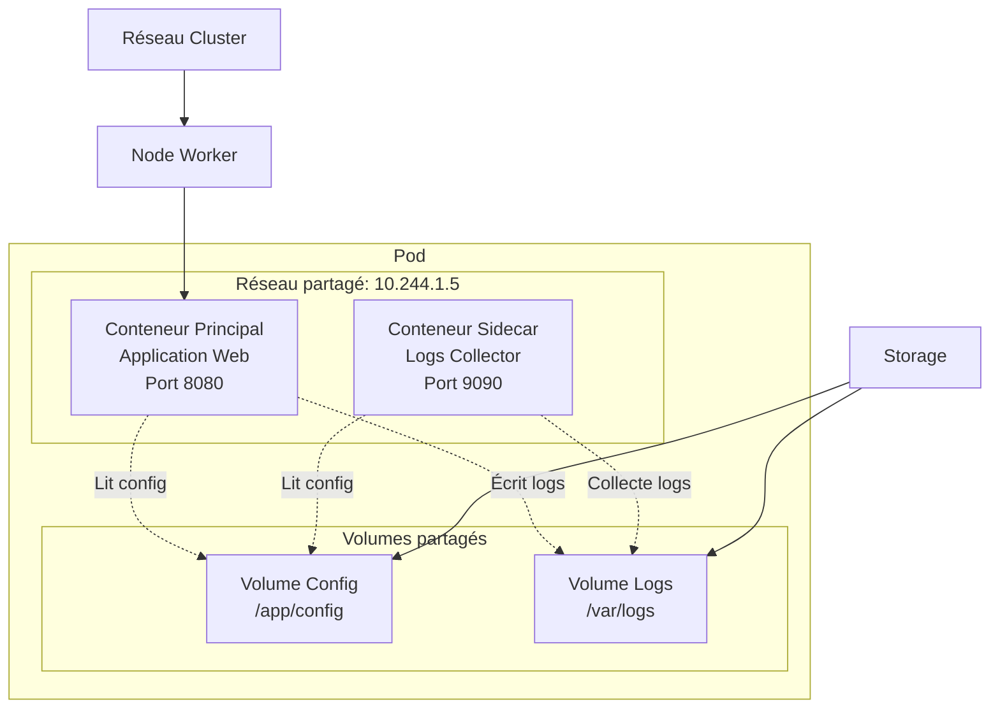

#### Caractéristiques fondamentales d'un Pod

**1. Unité atomique** :

- On ne peut pas déployer un conteneur seul, toujours dans un Pod
- Le Pod est créé et détruit comme une seule entité

**2. Réseau partagé** :

- Tous les conteneurs du Pod partagent la même IP
- Communication entre conteneurs via `localhost`
- Chaque conteneur peut écouter sur un port différent

**3. Stockage partagé** :

- Volumes montés et accessibles par tous les conteneurs
- Partage de données et configuration simplifié

**4. Localité garantie** :

- Tous les conteneurs d'un Pod sont toujours sur le même node
- Latence minimale entre conteneurs

### 4.2 Patterns de conception des Pods

#### Pod mono-conteneur (95% des cas)

```yaml
# Pod simple avec un seul conteneur
apiVersion: v1
kind: Pod
metadata:
  name: webapp-simple
spec:
  containers:
    - name: webapp
      image: nginx:1.21
      ports:
        - containerPort: 80
```

#### Comment utiliser ce YAML pour créer un Pod

**Étape 1 : Sauvegarder le YAML dans un fichier**

```bash
# Créer un fichier avec le contenu YAML
cat > webapp-simple.yaml << EOF
apiVersion: v1
kind: Pod
metadata:
  name: webapp-simple
spec:
  containers:
    - name: webapp
      image: nginx:1.21
      ports:
        - containerPort: 80
EOF
```

Ou simplement créer le fichier avec votre éditeur préféré (nano, vim, VS Code) et coller le contenu.

**Étape 2 : Appliquer le YAML avec kubectl**

```bash
# Méthode 1 : kubectl apply (recommandée)
kubectl apply -f webapp-simple.yaml

# Méthode 2 : kubectl create (création unique)
kubectl create -f webapp-simple.yaml
```

**Différence entre apply et create :**

```bash
# kubectl apply (recommandé)
kubectl apply -f webapp-simple.yaml
# Crée le Pod s'il n'existe pas
# Met à jour le Pod s'il existe déjà
# Gère les modifications futures
# Idempotent (peut être relancé sans problème)

# kubectl create
kubectl create -f webapp-simple.yaml
# Crée le Pod s'il n'existe pas
# Erreur si le Pod existe déjà
# Ne peut pas gérer les mises à jour
```

**Comprendre ce que fait ce YAML :**

Analyse ligne par ligne :

```yaml
apiVersion: v1 # Version de l'API Kubernetes pour les Pods
kind: Pod # Type d'objet : c'est un Pod
metadata: # Métadonnées du Pod
  name: webapp-simple # Nom unique du Pod dans le namespace
spec: # Spécification de ce qu'on veut
  containers: # Liste des conteneurs dans ce Pod
    - name: webapp # Nom du conteneur (unique dans le Pod)
      image: nginx:1.21 # Image Docker à utiliser
      ports: # Ports que le conteneur expose
        - containerPort: 80 # Le conteneur écoute sur le port 80
```

**Ce qui se passe quand vous appliquez ce YAML :**

1. **Kubernetes lit le fichier** et comprend que vous voulez un Pod
2. **Le Scheduler** choisit un Worker Node disponible
3. **Kubelet** sur ce node télécharge l'image `nginx:1.21`
4. **Le container runtime** démarre le conteneur nginx
5. **Le Pod obtient une IP** interne du cluster (ex: 10.244.1.5)
6. **nginx démarre** et écoute sur le port 80 à l'intérieur du conteneur

**Tester que ça fonctionne :**

```bash
# Port forwarding pour tester localement
kubectl port-forward pod/webapp-simple 8080:80

# Puis dans un autre terminal :
curl http://localhost:8080
# Vous devriez voir la page d'accueil nginx
```

**Workflow complet typique :**

````bash
# 1. Créer le fichier YAML
cat > my-pod.yaml << EOF
[votre YAML ici]
EOF

# 2. Valider le YAML (optionnel)
kubectl apply --dry-run=client -f my-pod.yaml

# 3. Appliquer
kubectl apply -f my-pod.yaml

# 4. Tester
kubectl port-forward pod/webapp-simple 8080:80

# 5. Nettoyer quand terminé
kubectl delete -f my-pod.yaml
```#### Pod multi-conteneurs : Le pattern Sidecar

```yaml
# Pod avec conteneur principal + sidecar
apiVersion: v1
kind: Pod
metadata:
  name: webapp-avec-sidecar
spec:
  containers:
    # Conteneur principal
    - name: webapp
      image: nginx:1.21
      ports:
        - containerPort: 80
      volumeMounts:
        - name: logs-volume
          mountPath: /var/log/nginx

    # Conteneur sidecar pour collecter les logs
    - name: log-collector
      image: fluent/fluent-bit:1.8
      volumeMounts:
        - name: logs-volume
          mountPath: /var/log/nginx
          readOnly: true

  volumes:
    - name: logs-volume
      emptyDir: {}
````

### 4.3 Création de Pods : Approche impérative

#### Commandes kubectl run - Création rapide

**Syntaxe de base** :

```bash
kubectl run [nom-pod] --image=[image] [options]
```

#### Exemples pratiques de création impérative

**1. Pod simple avec nginx** :

```bash
# Création basique
kubectl run nginx-pod --image=nginx:1.21

# Avec port exposé
kubectl run nginx-pod --image=nginx:1.21 --port=80

# Avec restart policy
kubectl run nginx-pod --image=nginx:1.21 --restart=Never
```

**2. Pod avec commandes personnalisées** :

```bash
# Pod avec commande custom
kubectl run busybox-pod --image=busybox --command -- sleep 3600

# Pod interactif (pour tests)
kubectl run debug-pod --image=busybox -it --rm --restart=Never -- sh
```

**3. Pod avec variables d'environnement** :

```bash
# Avec variables d'environnement
kubectl run webapp --image=nginx:1.21 --env="ENV=production" --env="DEBUG=false"

# Avec labels
kubectl run nginx-prod --image=nginx:1.21 --labels="app=nginx,env=prod"
```

**4. Pod avec ressources limitées** :

```bash
# Avec limites de ressources
kubectl run nginx-limited --image=nginx:1.21 \
  --requests="cpu=100m,memory=128Mi" \
  --limits="cpu=200m,memory=256Mi"
```

#### Génération de YAML depuis kubectl run

**Générer le YAML sans créer le Pod** :

```bash
# Générer et afficher le YAML
kubectl run nginx-pod --image=nginx:1.21 --dry-run=client -o yaml

# Sauvegarder dans un fichier
kubectl run nginx-pod --image=nginx:1.21 --dry-run=client -o yaml > nginx-pod.yaml

# Créer à partir du fichier généré
kubectl apply -f nginx-pod.yaml
```

### 4.5 Gestion et inspection des Pods

#### Commandes de visualisation

```bash
# Lister tous les pods
kubectl get pods

# Informations détaillées
kubectl get pods -o wide

# Description complète d'un pod
kubectl describe pod [nom-pod]

# Logs du pod
kubectl logs [nom-pod]

# Logs en temps réel
kubectl logs -f [nom-pod]

# Si plusieurs conteneurs dans le pod
kubectl logs [nom-pod] -c [nom-conteneur]
```

#### Commandes d'interaction

```bash
# Exécuter une commande dans le pod
kubectl exec [nom-pod] -- [commande]

# Shell interactif
kubectl exec -it [nom-pod] -- bash

# Si plusieurs conteneurs
kubectl exec -it [nom-pod] -c [nom-conteneur] -- bash

# Copier des fichiers
kubectl cp [fichier-local] [nom-pod]:/path/dans/conteneur
kubectl cp [nom-pod]:/path/dans/conteneur [fichier-local]
```

#### Gestion du cycle de vie

```bash
# Supprimer un pod
kubectl delete pod [nom-pod]

# Suppression forcée (attention !)
kubectl delete pod [nom-pod] --force --grace-period=0

# Supprimer tous les pods d'un label
kubectl delete pods -l app=nginx

# Redémarrer un pod (suppression + recréation)
kubectl delete pod [nom-pod]
kubectl apply -f [manifest.yaml]
```

### 4.6 États et cycle de vie des Pods

#### Les phases d'un Pod

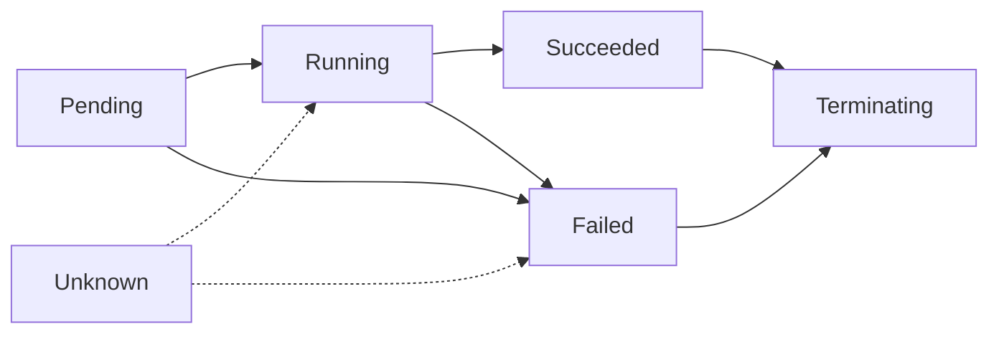

**Pending** : Pod accepté mais conteneurs pas encore créés
**Running** : Au moins un conteneur fonctionne
**Succeeded** : Tous les conteneurs terminés avec succès
**Failed** : Au moins un conteneur a échoué
**Unknown** : État du Pod impossible à déterminer

#### Conditions des Pods

```bash
# Voir les conditions détaillées
kubectl get pod [nom-pod] -o yaml | grep -A 10 conditions:
```

Les conditions principales :

- **PodScheduled** : Pod assigné à un node
- **ContainersReady** : Tous les conteneurs sont prêts
- **Initialized** : Init containers terminés avec succès
- **Ready** : Pod peut recevoir du trafic

### 4.7 Bonnes pratiques pour les Pods

#### 1. Ressources et limites

```yaml
# Toujours définir requests et limits
resources:
  requests:
    memory: '64Mi'
    cpu: '250m' # 0.25 CPU
  limits:
    memory: '128Mi'
    cpu: '500m' # 0.5 CPU
```

#### 2. Health checks obligatoires

```yaml
# Liveness : redémarre si l'app plante
livenessProbe:
  httpGet:
    path: /health
    port: 8080
  initialDelaySeconds: 30
  periodSeconds: 10

# Readiness : contrôle le trafic
readinessProbe:
  httpGet:
    path: /ready
    port: 8080
  initialDelaySeconds: 5
  periodSeconds: 5
```

#### 3. Labels et sélecteurs

```yaml
metadata:
  labels:
    app: webapp # Application
    version: v1.2.0 # Version
    component: frontend # Composant
    env: production # Environnement
    team: backend # Équipe responsable
```

#### 4. Sécurité

```yaml
spec:
  securityContext:
    runAsNonRoot: true # Ne pas run en root
    runAsUser: 1000 # UID spécifique
    fsGroup: 2000 # Groupe fichiers

  containers:
    - name: webapp
      securityContext:
        allowPrivilegeEscalation: false
        readOnlyRootFilesystem: true
        capabilities:
          drop:
            - ALL
```

📝 **LAB 2** - Création et gestion de Pods : `labs/enonces/S3_S1_S1_lab2_creation_gestion_pods.md`
**Correction** : `labs/corrections/S3_S1_S1_lab2_creation_gestion_pods_correction.md`

**Énoncé du LAB 2** :

Créez et gérez des Pods Kubernetes pour maîtriser les concepts fondamentaux.

- **Objectif** : Maîtriser la création déclarative et impérative des Pods
- **Contexte** : Déploiement d'applications conteneurisées avec bonnes pratiques
- **Instructions** :
  1. Créer des Pods avec `kubectl run` (approche impérative)
  2. Créer des Pods avec manifests YAML (approche déclarative)
  3. Configurer ressources, health checks et variables d'environnement
  4. Inspecter, déboguer et gérer le cycle de vie des Pods
  5. Tester les patterns multi-conteneurs (sidecar)
- **Critères de validation** : Pods déployés et opérationnels, ressources configurées, health checks fonctionnels, commandes impératives maîtrisées
- **Durée estimée** : 45 minutes
- **Fichier de travail** : `S3_S1_lab2_creation_gestion_pods.yml`

---

## 5. Services et networking

### 5.1 Concept de Service

**Problématique** : Les Pods sont éphémères avec des IPs dynamiques. Comment maintenir une connectivité stable ?

**Solution** : Les **Services** fournissent une abstraction stable pour accéder à un ensemble de Pods.

**Fonctionnalités** :

- **IP virtuelle stable** (ClusterIP) pour les Pods backends
- **Load balancing automatique** entre les réplicas
- **Service discovery** via DNS interne
- **Health checking** des endpoints

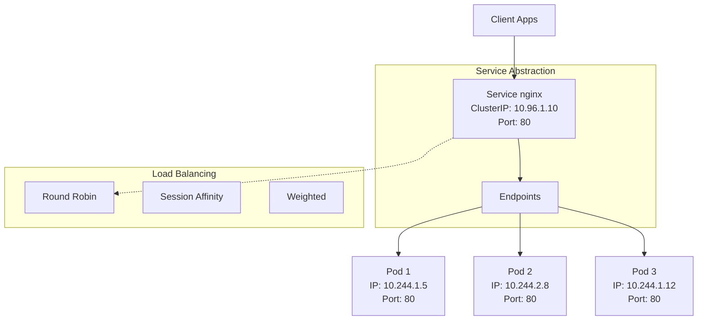

### 5.2 Types de Services

#### ClusterIP (Défaut)

- **Usage** : Communication interne entre composants
- **Portée** : Accessible uniquement depuis l'intérieur du cluster
- **Cas d'usage** : APIs internes, bases de données, microservices

#### NodePort

- **Usage** : Exposition externe via port sur chaque node
- **Portée** : Accessible depuis l'extérieur via `NodeIP:NodePort`
- **Cas d'usage** : Applications de développement, services simples

#### LoadBalancer

- **Usage** : Exposition via load balancer cloud provider
- **Portée** : IP externe dédiée fournie par le cloud
- **Cas d'usage** : Applications production, haute disponibilité

#### ExternalName

- **Usage** : Redirection vers service externe via CNAME DNS
- **Portée** : Proxy vers services hors cluster
- **Cas d'usage** : Migration, services legacy

### 5.3 Networking Kubernetes

**Modèle réseau** :

- **Flat network** : Tous les Pods peuvent communiquer directement
- **No NAT** : Communication sans translation d'adresses
- **Service mesh** : Couche d'infrastructure pour communication sécurisée

**Composants networking** :

- **CNI (Container Network Interface)** : Plugins réseau (Calico, Flannel, Weave)
- **kube-proxy** : Implémentation Services via iptables/IPVS
- **CoreDNS** : Résolution DNS interne du cluster

📝 **LAB 3** - Services et networking : `labs/enonces/S3_S1_S1_lab3_services_networking.md`
**Correction** : `labs/corrections/S3_S1_S1_lab3_services_networking_correction.md`

**Énoncé du LAB 3** :

Créez des Services Kubernetes pour exposer vos Pods et comprendre le networking dans le cluster.

- **Objectif** : Maîtriser la création et types de Services
- **Contexte** : Exposition d'API et applications web en production
- **Instructions** :
  1. Créer un Deployment nginx avec 3 replicas
  2. Exposer via Service ClusterIP pour communication interne
  3. Créer un Service NodePort pour accès externe
  4. Tester la connectivité et load balancing
- **Critères de validation** : Services actifs, endpoints configurés, load balancing fonctionnel
- **Durée estimée** : 25 minutes
- **Fichier de travail** : `S3_S1_lab3_services_networking.yml`

---

## 6. Deployments et ReplicaSets

### 6.1 Comprendre les limitations des Pods standalone

#### Problématiques des Pods isolés

Imaginez un site e-commerce géré par un seul Pod :

**Scénarios de défaillance** :

- **Panne du node** : Pod perdu = site indisponible
- **Bug de l'application** : Pod crash = perte de service
- **Pic de trafic** : Un seul Pod = surcharge et lenteur
- **Mise à jour** : Redéploiement = downtime obligatoire

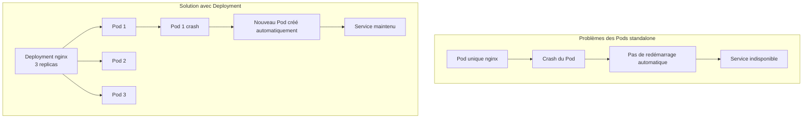

#### Besoins en production

- **Haute disponibilité** : Plusieurs instances pour éviter les points de défaillance unique
- **Scaling** : Adapter le nombre d'instances selon la charge
- **Rolling updates** : Mise à jour sans interruption de service
- **Rollback** : Retour rapide en cas de problème

### 6.2 ReplicaSets : La fondation

#### Qu'est-ce qu'un ReplicaSet ?

Un **ReplicaSet** assure qu'un nombre spécifié de Pods identiques fonctionnent à tout moment.

**Analogie du garde du corps** :

- Vous demandez 3 gardes du corps (replicas: 3)
- Si un garde est malade, un remplaçant arrive automatiquement
- Tous les gardes ont la même formation (même Pod template)
- Le chef de sécurité (ReplicaSet controller) surveille en permanence

> **Note technique** : Le **ReplicaSet Controller** fait partie du **Controller Manager** qui s'exécute sur le Control Plane. C'est lui qui surveille en permanence l'état des Pods et prend les actions correctives nécessaires.

#### Fonctionnement interne

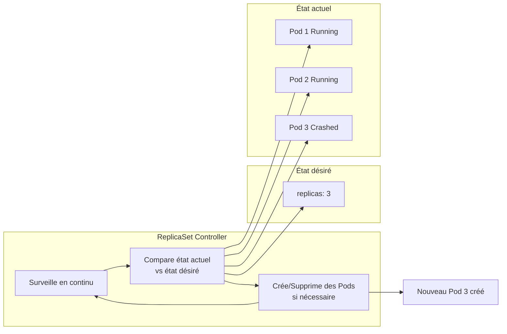

#### ReplicaSet manifest de base

```yaml
apiVersion: apps/v1
kind: ReplicaSet
metadata:
  name: nginx-replicaset
  labels:
    app: nginx
spec:
  replicas: 3 # Nombre de Pods désirés
  selector: # Comment identifier les Pods à gérer
    matchLabels:
      app: nginx
      version: v1
  template: # Modèle pour créer les Pods
    metadata:
      labels:
        app: nginx
        version: v1
    spec:
      containers:
        - name: nginx
          image: nginx:1.21
          ports:
            - containerPort: 80
```

**Éléments clés** :

- **replicas** : Nombre de Pods souhaités
- **selector** : Labels pour identifier les Pods gérés
- **template** : Spécification des Pods à créer

### 6.3 Deployments : La couche supérieure

#### Pourquoi les Deployments ?

Les **ReplicaSets** seuls ne suffisent pas pour la production :

**Problèmes des ReplicaSets** :

- Pas de gestion des mises à jour
- Pas de rollback automatique
- Pas d'historique des versions
- Gestion manuelle complexe

**Solutions des Deployments** :

- Rolling updates automatiques
- Rollback en une commande
- Historique des révisions
- Stratégies de déploiement configurables

### 6.4 Concepts fondamentaux des Deployments

#### 6.4.1 Rolling Updates : Mise à jour progressive

**Principe** : Remplacer progressivement les anciens Pods par de nouveaux, sans interruption de service.

**Scénario concret** : Mise à jour nginx:1.20 → nginx:1.21

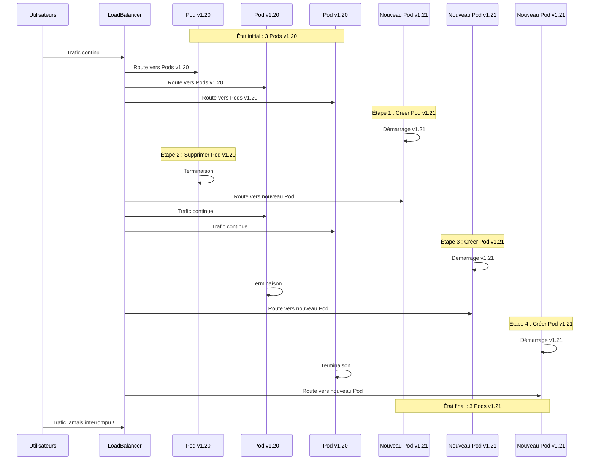

**Paramètres de contrôle** :

- **maxUnavailable** : Nombre max de Pods indisponibles pendant la mise à jour
- **maxSurge** : Nombre max de Pods supplémentaires créés temporairement

**Exemple** :

- 3 replicas, maxUnavailable=1, maxSurge=1
- Kubernetes peut avoir temporairement 4 Pods (3+1) et minimum 2 Pods (3-1)

#### 6.4.2 Rollback : Retour vers version précédente

**Principe** : Revenir rapidement à une version stable en cas de problème.

**Mécanisme** :

1. Kubernetes garde l'historique des ReplicaSets
2. Chaque déploiement crée un nouveau ReplicaSet
3. Les anciens ReplicaSets sont conservés (replicas=0)
4. Le rollback réactive un ancien ReplicaSet

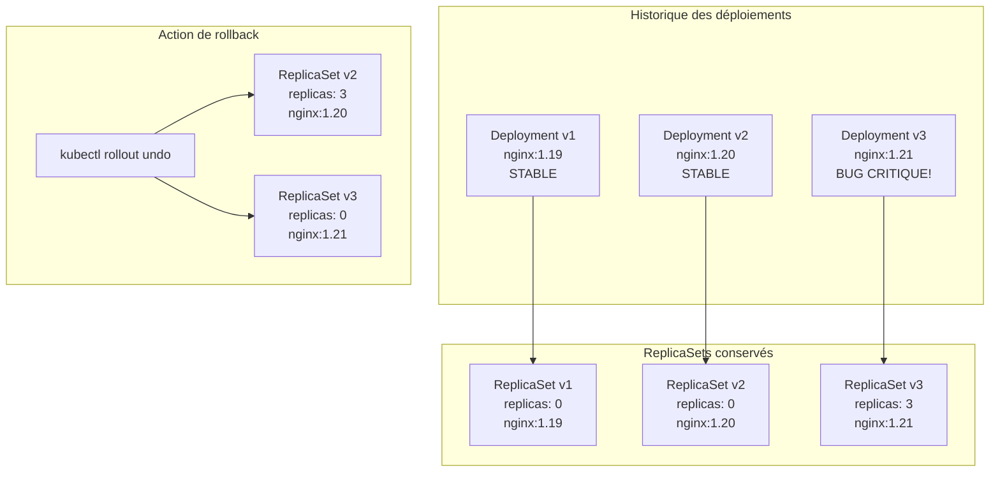

**Avantages** :

- **Rapidité** : Retour en quelques secondes
- **Fiabilité** : Version précédente déjà testée
- **Simplicité** : Une seule commande

#### 6.4.3 Historique des révisions

**Principe** : Kubernetes conserve un historique de tous les déploiements.

**Structure** :

```
Deployment "web-app"
├── Revision 1: nginx:1.19 (Initial deployment)
├── Revision 2: nginx:1.20 (Security update)
├── Revision 3: nginx:1.21 (Feature update)
└── Revision 4: nginx:1.20 (Rollback après bug)
```

**Métadonnées conservées** :

- Image utilisée
- Date/heure du déploiement
- Cause du changement (changement d'image, de config, etc.)
- Status de la révision (succès/échec)

**Rétention** : Par défaut, Kubernetes garde les 10 dernières révisions

#### 6.4.4 Stratégies de déploiement

**1. RollingUpdate (défaut)** :

- Remplacement progressif
- Service maintenu pendant la mise à jour
- Idéal pour les applications stateless

**2. Recreate** :

- Suppression de tous les Pods puis création des nouveaux
- Interruption de service temporaire
- Nécessaire pour certaines applications avec états partagés

```yaml
# Stratégie RollingUpdate (recommandée)
strategy:
  type: RollingUpdate
  rollingUpdate:
    maxUnavailable: 25%    # Max 25% des Pods indisponibles
    maxSurge: 25%          # Max 25% de Pods supplémentaires

# Stratégie Recreate (attention : downtime!)
strategy:
  type: Recreate
```

**Comparaison des stratégies** :

| Aspect            | RollingUpdate          | Recreate                |
| ----------------- | ---------------------- | ----------------------- |
| **Downtime**      | Aucun                  | Temporaire              |
| **Ressources**    | Plus consommées        | Optimisées              |
| **Compatibilité** | Applications stateless | Applications avec états |
| **Complexité**    | Gestion progressive    | Simple                  |
| **Rollback**      | Progressif             | Interruption            |

### 6.5 Architecture hiérarchique

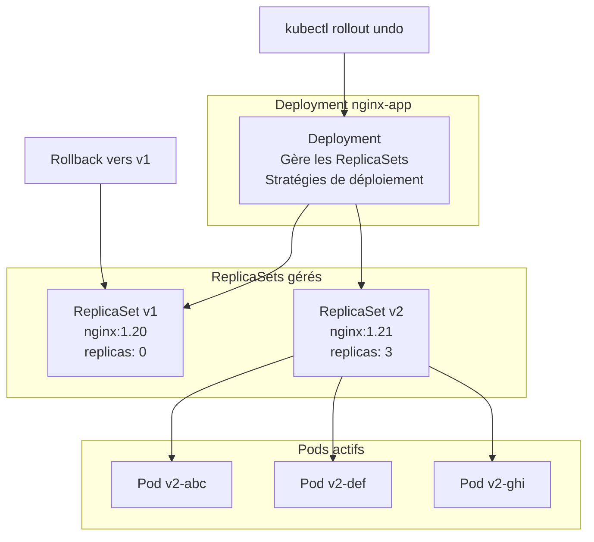

### 6.5 Exemple pratique : Cycle de vie d'un déploiement

#### Scénario : Application e-commerce en production

**Contexte** : Votre équipe gère une API e-commerce critique qui doit être mise à jour sans interruption de service.

**Étape 1 : Déploiement initial**

```yaml
# Deployment initial - API v1.0
apiVersion: apps/v1
kind: Deployment
metadata:
  name: ecommerce-api
  labels:
    app: ecommerce-api
spec:
  replicas: 5 # 5 instances pour haute disponibilité
  strategy:
    type: RollingUpdate
    rollingUpdate:
      maxUnavailable: 1 # Max 1 Pod indisponible (80% uptime garanti)
      maxSurge: 2 # Max 2 Pods supplémentaires (7 Pods max temporairement)
  selector:
    matchLabels:
      app: ecommerce-api
  template:
    metadata:
      labels:
        app: ecommerce-api
    spec:
      containers:
        - name: api
          image: mycompany/ecommerce-api:v1.0
          ports:
            - containerPort: 8080
          resources:
            requests:
              memory: '256Mi'
              cpu: '250m'
            limits:
              memory: '512Mi'
              cpu: '500m'
```

**Étape 2 : Rolling Update vers v1.1**

Lors de la mise à jour vers v1.1 :

```
État initial: 5 Pods v1.0
┌─────────────────────────────────────┐
│ Pod1 │ Pod2 │ Pod3 │ Pod4 │ Pod5 │   │  Status: 5/5 Ready
│ v1.0 │ v1.0 │ v1.0 │ v1.0 │ v1.0 │   │
└─────────────────────────────────────┘

Étape 1: Création 2 nouveaux Pods (maxSurge: 2)
┌─────────────────────────────────────────────────┐
│ Pod1 │ Pod2 │ Pod3 │ Pod4 │ Pod5 │ Pod6 │ Pod7 │   │  Status: 7/7 Ready
│ v1.0 │ v1.0 │ v1.0 │ v1.0 │ v1.0 │ v1.1 │ v1.1 │   │
└─────────────────────────────────────────────────┘

Étape 2: Suppression 1 ancien Pod (maxUnavailable: 1)
┌─────────────────────────────────────────────────┐
│      │ Pod2 │ Pod3 │ Pod4 │ Pod5 │ Pod6 │ Pod7 │   │  Status: 6/6 Ready
│  X   │ v1.0 │ v1.0 │ v1.0 │ v1.0 │ v1.1 │ v1.1 │   │
└─────────────────────────────────────────────────┘

... Processus continue ...

État final: 5 Pods v1.1
┌─────────────────────────────────────┐
│ Pod6 │ Pod7 │ Pod8 │ Pod9 │ Pod10│   │  Status: 5/5 Ready
│ v1.1 │ v1.1 │ v1.1 │ v1.1 │ v1.1 │   │
└─────────────────────────────────────┘
```

**Étape 3 : Détection d'un bug critique**

La v1.1 présente un bug qui affecte les paiements !

```bash
# Logs montrent des erreurs
kubectl logs deployment/ecommerce-api | grep ERROR
# ERROR: Payment processing failed for user 12345
# ERROR: Database connection timeout
```

**Étape 4 : Rollback immédiat**

```bash
# Retour rapide vers v1.0 (version stable)
kubectl rollout undo deployment/ecommerce-api

# Résultat: Retour en ~30 secondes vers v1.0
# Aucune donnée perdue, service restauré
```

**Bénéfices obtenus** :

- **Zéro downtime** pendant la mise à jour v1.0 → v1.1
- **Rollback rapide** quand un problème est détecté
- **Historique conservé** pour analysis post-incident
- **Service toujours disponible** pour les clients

### 6.6 Création de Deployments : Approches impératives

#### Commandes kubectl create deployment

**Création de base** :

```bash
# Deployment simple
kubectl create deployment nginx-app --image=nginx:1.21

# Avec nombre de replicas
kubectl create deployment web-app --image=nginx:1.21 --replicas=5

# Avec port exposé
kubectl create deployment api-app --image=myapi:v1.0 --port=8080
```

**Avec options avancées** :

```bash
# Deployment avec ressources
kubectl create deployment heavy-app \
  --image=myapp:v2.0 \
  --replicas=3 \
  --port=3000

# Avec variables d'environnement
kubectl create deployment config-app \
  --image=nginx:1.21 \
  --replicas=2 \
  --env="ENV=production" \
  --env="DEBUG=false"
```

#### Génération de YAML

```bash
# Générer le YAML sans créer
kubectl create deployment nginx-app \
  --image=nginx:1.21 \
  --replicas=3 \
  --dry-run=client -o yaml

# Sauvegarder dans un fichier
kubectl create deployment nginx-app \
  --image=nginx:1.21 \
  --replicas=3 \
  --dry-run=client -o yaml > nginx-deployment.yaml

# Modifier et appliquer
kubectl apply -f nginx-deployment.yaml
```

### 6.5 Deployment manifest complet

#### Structure détaillée

```yaml
apiVersion: apps/v1
kind: Deployment
metadata:
  name: nginx-deployment
  namespace: default
  labels:
    app: nginx
    version: v1.0
    environment: production
  annotations:
    deployment.kubernetes.io/revision: '1'

spec:
  # Configuration des replicas
  replicas: 5

  # Sélecteur pour les Pods
  selector:
    matchLabels:
      app: nginx
      version: v1.0

  # Stratégie de déploiement
  strategy:
    type: RollingUpdate
    rollingUpdate:
      maxUnavailable: 1 # Maximum de Pods indisponibles
      maxSurge: 1 # Maximum de Pods supplémentaires

  # Contrôle de progression
  progressDeadlineSeconds: 600
  revisionHistoryLimit: 10

  # Template des Pods
  template:
    metadata:
      labels:
        app: nginx
        version: v1.0
      annotations:
        prometheus.io/scrape: 'true'
        prometheus.io/port: '9113'

    spec:
      containers:
        - name: nginx
          image: nginx:1.21
          imagePullPolicy: IfNotPresent

          ports:
            - name: http
              containerPort: 80
              protocol: TCP

          env:
            - name: ENVIRONMENT
              value: 'production'
            - name: LOG_LEVEL
              value: 'info'

          resources:
            requests:
              memory: '128Mi'
              cpu: '100m'
            limits:
              memory: '256Mi'
              cpu: '200m'

          livenessProbe:
            httpGet:
              path: /
              port: 80
            initialDelaySeconds: 30
            periodSeconds: 10
            timeoutSeconds: 5
            failureThreshold: 3

          readinessProbe:
            httpGet:
              path: /
              port: 80
            initialDelaySeconds: 5
            periodSeconds: 5
            timeoutSeconds: 3
            failureThreshold: 3

      restartPolicy: Always
      terminationGracePeriodSeconds: 30
```

### 6.6 Scaling : Gestion dynamique des replicas

#### Scaling horizontal manuel

**Commandes impératives** :

```bash
# Scale up - augmenter les replicas
kubectl scale deployment nginx-app --replicas=10

# Scale down - réduire les replicas
kubectl scale deployment nginx-app --replicas=2

# Scale conditionnel
kubectl scale deployment nginx-app --current-replicas=3 --replicas=5
```

**Modification déclarative** :

```bash
# Éditer directement
kubectl edit deployment nginx-app

# Ou modifier le fichier YAML
kubectl patch deployment nginx-app -p '{"spec":{"replicas":8}}'
```

#### Auto-scaling avec HPA (Horizontal Pod Autoscaler)

**Création d'un HPA** :

```bash
# Autoscaling basé sur le CPU
kubectl autoscale deployment nginx-app \
  --cpu-percent=70 \
  --min=3 \
  --max=15

# Vérifier l'HPA
kubectl get hpa

# Détails de l'autoscaler
kubectl describe hpa nginx-app
```

**HPA manifest** :

```yaml
apiVersion: autoscaling/v2
kind: HorizontalPodAutoscaler
metadata:
  name: nginx-app-hpa
spec:
  scaleTargetRef:
    apiVersion: apps/v1
    kind: Deployment
    name: nginx-app
  minReplicas: 3
  maxReplicas: 20
  metrics:
    - type: Resource
      resource:
        name: cpu
        target:
          type: Utilization
          averageUtilization: 70
    - type: Resource
      resource:
        name: memory
        target:
          type: Utilization
          averageUtilization: 80
```

### 6.7 Rolling Updates : Mises à jour sans interruption

#### Stratégies de déploiement

**RollingUpdate (par défaut)** :

```yaml
strategy:
  type: RollingUpdate
  rollingUpdate:
    maxUnavailable: 25% # Ou un nombre absolu comme 2
    maxSurge: 25% # Ou un nombre absolu comme 2
```

**Recreate** :

```yaml
strategy:
  type: Recreate # Tous les Pods arrêtés puis recréés
```

#### Mise à jour d'image

**Commandes impératives** :

```bash
# Mettre à jour l'image
kubectl set image deployment/nginx-app nginx=nginx:1.22

# Mettre à jour avec plusieurs conteneurs
kubectl set image deployment/app-deployment \
  nginx=nginx:1.22 \
  sidecar=sidecar:v2.0

# Forcer un redéploiement (même image)
kubectl rollout restart deployment/nginx-app
```

**Suivi du déploiement** :

```bash
# Suivre le statut du rollout
kubectl rollout status deployment/nginx-app

# Voir les détails en temps réel
kubectl rollout status deployment/nginx-app --watch=true

# Timeout personnalisé
kubectl rollout status deployment/nginx-app --timeout=300s
```

#### Processus de Rolling Update

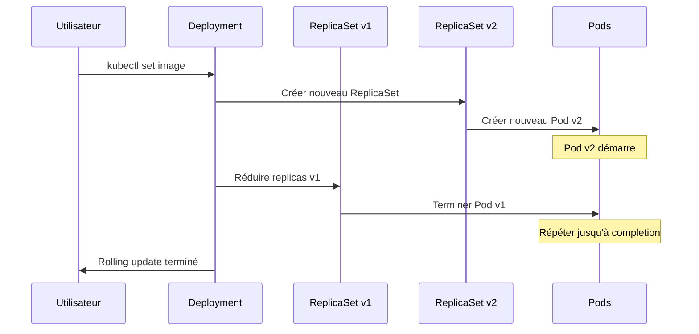

### 6.8 Rollback : Retour aux versions précédentes

#### Gestion de l'historique

**Voir l'historique des révisions** :

```bash
# Historique des deployments
kubectl rollout history deployment/nginx-app

# Détails d'une révision spécifique
kubectl rollout history deployment/nginx-app --revision=3

# Voir les changements entre révisions
kubectl rollout history deployment/nginx-app --revision=2 --revision=3
```

#### Rollback commands

**Rollback simple** :

```bash
# Retour à la révision précédente
kubectl rollout undo deployment/nginx-app

# Retour à une révision spécifique
kubectl rollout undo deployment/nginx-app --to-revision=2

# Vérifier le rollback
kubectl rollout status deployment/nginx-app
```

**Rollback avancé** :

```bash
# Rollback avec confirmation
kubectl rollout undo deployment/nginx-app --dry-run=server

# Rollback et suivi
kubectl rollout undo deployment/nginx-app && \
kubectl rollout status deployment/nginx-app --watch
```

### 6.9 Gestion et monitoring des Deployments

#### Commandes d'inspection

**Visualisation** :

```bash
# Lister tous les deployments
kubectl get deployments

# Informations détaillées
kubectl get deployments -o wide

# Format personnalisé
kubectl get deployments -o custom-columns=\
NAME:.metadata.name,\
READY:.status.readyReplicas,\
UP-TO-DATE:.status.updatedReplicas,\
AVAILABLE:.status.availableReplicas

# Description complète
kubectl describe deployment nginx-app
```

**Debugging** :

```bash
# Voir les événements
kubectl get events --field-selector involvedObject.name=nginx-app

# Logs de tous les Pods du deployment
kubectl logs -l app=nginx --tail=100

# Logs en streaming
kubectl logs -l app=nginx -f

# Exécuter des commandes dans les Pods
kubectl exec -l app=nginx -- nginx -t
```

#### États et conditions

**Comprendre les statuts** :

```bash
# Statut détaillé
kubectl get deployment nginx-app -o yaml | grep -A 10 conditions

# Conditions de santé
kubectl describe deployment nginx-app | grep -A 5 Conditions
```

**Conditions communes** :

- **Progressing** : Déploiement en cours
- **Available** : Replicas minimum disponibles
- **ReplicaFailure** : Échec de création de replicas

### 6.10 Stratégies avancées et patterns

#### Blue-Green Deployment

```bash
# Version Blue (actuelle)
kubectl create deployment app-blue --image=myapp:v1.0 --replicas=3

# Version Green (nouvelle)
kubectl create deployment app-green --image=myapp:v2.0 --replicas=3

# Tester Green en interne
kubectl port-forward deployment/app-green 8080:80

# Basculer le service vers Green
kubectl patch service app-service -p '{"spec":{"selector":{"version":"green"}}}'

# Supprimer Blue après validation
kubectl delete deployment app-blue
```

#### Canary Deployment

```yaml
# Deployment principal (90% du trafic)
apiVersion: apps/v1
kind: Deployment
metadata:
  name: app-stable
spec:
  replicas: 9
  selector:
    matchLabels:
      app: myapp
      version: stable
  template:
    metadata:
      labels:
        app: myapp
        version: stable
    spec:
      containers:
        - name: app
          image: myapp:v1.0

---
# Deployment canary (10% du trafic)
apiVersion: apps/v1
kind: Deployment
metadata:
  name: app-canary
spec:
  replicas: 1
  selector:
    matchLabels:
      app: myapp
      version: canary
  template:
    metadata:
      labels:
        app: myapp
        version: canary
    spec:
      containers:
        - name: app
          image: myapp:v2.0
```

### 6.11 Bonnes pratiques de production

#### Configuration des ressources

```yaml
resources:
  requests: # Ressources garanties
    memory: '256Mi'
    cpu: '100m'
  limits: # Limites maximales
    memory: '512Mi'
    cpu: '500m'
```

#### Health checks obligatoires

```yaml
livenessProbe: # Redémarre si échec
  httpGet:
    path: /health
    port: 8080
  initialDelaySeconds: 30
  periodSeconds: 10
  timeoutSeconds: 5
  failureThreshold: 3

readinessProbe: # Retire du service si échec
  httpGet:
    path: /ready
    port: 8080
  initialDelaySeconds: 5
  periodSeconds: 5
  timeoutSeconds: 3
  failureThreshold: 3
```

#### Labels et annotations

```yaml
metadata:
  labels:
    app: myapp # Application
    version: v1.0 # Version
    component: frontend # Composant
    environment: production # Environnement
    team: platform # Équipe responsable
  annotations:
    deployment.kubernetes.io/revision: '1'
    kubernetes.io/change-cause: 'Initial deployment'
    contact: 'platform-team@company.com'
```

#### Stratégie de rolling update optimisée

```yaml
strategy:
  type: RollingUpdate
  rollingUpdate:
    maxUnavailable: 1 # Conserve la disponibilité
    maxSurge: 1 # Contrôle la consommation de ressources
```

📝 **LAB 4** - Deployments et ReplicaSets : `labs/enonces/S3_S1_S1_lab4_deployments_replicasets.md`
**Correction** : `labs/corrections/S3_S1_S1_lab4_deployments_replicasets_correction.md`

**Énoncé du LAB 4** :

Maîtrisez les Deployments pour la gestion production d'applications conteneurisées.

- **Objectif** : Maîtriser scaling, rolling updates, rollback et monitoring des Deployments
- **Contexte** : Déploiement et gestion d'une application web critique en production
- **Instructions** :
  1. Créer un Deployment avec commandes impératives et déclaratives
  2. Effectuer du scaling manuel et configurer l'autoscaling
  3. Réaliser un rolling update vers une nouvelle version
  4. Tester la résistance aux pannes et l'auto-healing
  5. Effectuer un rollback et gérer l'historique des révisions
  6. Implémenter les health checks et bonnes pratiques
- **Critères de validation** : Deployments opérationnels, scaling fonctionnel, rolling updates sans downtime, rollback réussi, monitoring configuré
- **Durée estimée** : 60 minutes
- **Fichier de travail** : `S3_S1_lab4_deployments_replicasets.yml`

---

## 7. Configuration et secrets

### 7.1 Séparation configuration/code

**Principe DevOps** : La configuration doit être externalisée du code pour :

- **Portabilité** : Même image dans différents environnements
- **Sécurité** : Pas de secrets dans le code source
- **Flexibilité** : Modification sans rebuild

### 7.2 ConfigMaps

**Définition** : Objets Kubernetes pour stocker des données de configuration non sensibles.

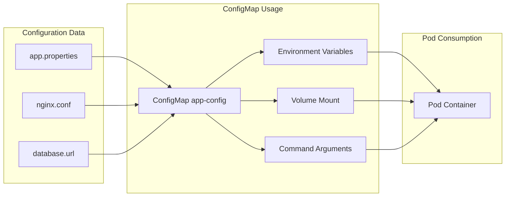

**Création ConfigMap** :

```yaml
apiVersion: v1
kind: ConfigMap
metadata:
  name: app-config
data:
  database_url: 'postgresql://db.example.com:5432/app'
  api_endpoint: 'https://api.example.com/v1'
  log_level: 'INFO'
  app.properties: |
    server.port=8080
    spring.datasource.url=${database_url}
    logging.level.root=${log_level}
```

### 7.3 Secrets

**Définition** : Objets pour données sensibles (mots de passe, tokens, clés).

**Avantages** :

- **Encodage Base64** (pas de chiffrement !)
- **Accès contrôlé** via RBAC
- **Audit trail** des accès
- **Rotation** facilitée

```yaml
apiVersion: v1
kind: Secret
metadata:
  name: app-secrets
type: Opaque
data:
  username: YWRtaW4= # admin en base64
  password: cGFzc3dvcmQ= # password en base64
```

### 7.5 Application pratique - Configuration

📝 **LAB 5** - ConfigMaps et variables : `labs/enonces/S3_S1_S1_lab5_configmaps_variables.md`
**Correction** : `labs/corrections/S3_S1_S1_lab5_configmaps_variables_correction.md`

**Énoncé du LAB 5** :

Externalisez la configuration d'applications avec ConfigMaps pour respecter les bonnes pratiques DevOps.

- **Objectif** : Maîtriser la gestion de configuration externe
- **Contexte** : Configuration multi-environnements (dev, staging, prod)
- **Instructions** :
  1. Créer ConfigMaps pour configuration application web
  2. Injecter configuration via variables d'environnement
  3. Monter configuration sous forme de fichiers
  4. Modifier configuration et observer rechargement
- **Critères de validation** : Configuration externalisée, variables injectées, fichiers montés correctement
- **Durée estimée** : 25 minutes
- **Fichier de travail** : `S3_S1_lab5_configmaps_variables.yml`

📝 **LAB 6** - Secrets et sécurité : `labs/enonces/S3_S1_S1_lab6_secrets_securite.md`
**Correction** : `labs/corrections/S3_S1_S1_lab6_secrets_securite_correction.md`

**Énoncé du LAB 6** :

Gérez les données sensibles avec les Secrets Kubernetes pour sécuriser vos déploiements.

- **Objectif** : Maîtriser la gestion sécurisée des credentials
- **Contexte** : Connexions bases de données et APIs externes sécurisées
- **Instructions** :
  1. Créer Secrets pour credentials base de données
  2. Injecter secrets dans Pods via variables d'environnement
  3. Monter secrets comme volumes dans conteneurs
  4. Tester rotation des secrets
- **Critères de validation** : Secrets créés, accès sécurisé, rotation fonctionnelle
- **Durée estimée** : 30 minutes
- **Fichier de travail** : `S3_S1_lab6_secrets_securite.yml`

---

## 8. Volumes et persistance

### 8.1 Problématique des données

**Contrainte** : Les conteneurs sont éphémères, leurs données sont perdues à l'arrêt.

**Solution** : Les **Volumes** fournissent un stockage persistant aux Pods.

### 8.2 Types de Volumes

#### emptyDir

- **Usage** : Stockage temporaire partagé entre conteneurs d'un Pod
- **Durée de vie** : Liée au Pod
- **Cas d'usage** : Cache, fichiers temporaires

#### hostPath

- **Usage** : Montage d'un répertoire du node hôte
- **Durée de vie** : Indépendante du Pod
- **Cas d'usage** : Logs système, accès ressources node

#### persistentVolumeClaim (PVC)

- **Usage** : Demande de stockage persistant
- **Durée de vie** : Indépendante du Pod et node
- **Cas d'usage** : Bases de données, stockage applicatif

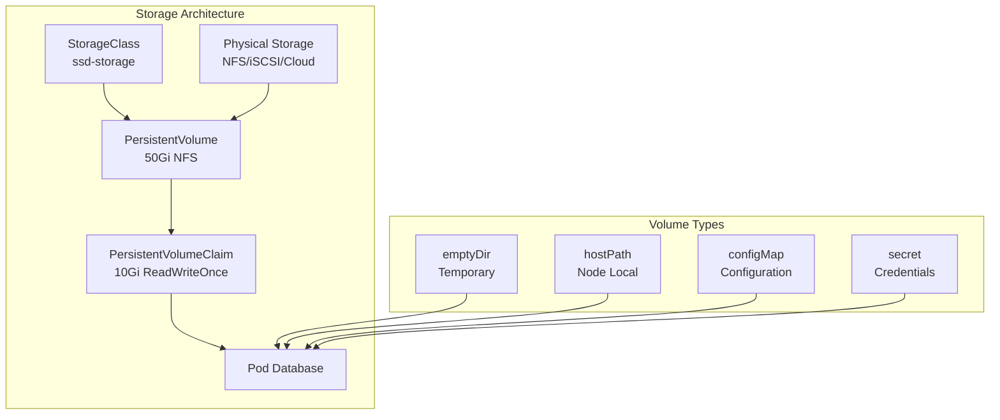

### 8.3 Persistent Volumes (PV) et Claims (PVC)

**PersistentVolume** : Ressource de stockage dans le cluster
**PersistentVolumeClaim** : Demande de stockage par un utilisateur

**Cycle de vie** :

1. **Provisioning** : Création du PV (statique ou dynamique)
2. **Binding** : Association PV/PVC compatible
3. **Using** : Montage dans Pod via PVC
4. **Reclaiming** : Politique après suppression PVC (Retain/Delete/Recycle)

### 8.4 Application pratique - Volumes

📝 **LAB 7** - Volumes et persistance : `labs/enonces/S3_S1_S1_lab7_volumes_persistance.md`
**Correction** : `labs/corrections/S3_S1_S1_lab7_volumes_persistance_correction.md`

**Énoncé du LAB 7** :

Configurez des volumes persistants pour assurer la persistance des données applications.

- **Objectif** : Maîtriser les volumes et la persistance de données
- **Contexte** : Déploiement base de données avec sauvegarde des données
- **Instructions** :
  1. Créer PersistentVolume et PersistentVolumeClaim
  2. Déployer base de données MySQL avec volume persistant
  3. Insérer des données et redémarrer le Pod
  4. Vérifier la persistance des données
- **Critères de validation** : Données persistantes après redémarrage, volumes montés correctement
- **Durée estimée** : 35 minutes
- **Fichier de travail** : `S3_S1_lab7_volumes_persistance.yml`

---

## 9. Ingress et exposition

### 9.1 Limitations des Services

**Problématiques** :

- **NodePort** : Ports aléatoires, pas de SSL/TLS natif
- **LoadBalancer** : Coûteux, une IP par service
- **Pas de routage avancé** : Host-based, path-based routing

**Solution** : **Ingress** fournit un point d'entrée unique avec routage intelligent.

### 9.2 Architecture Ingress

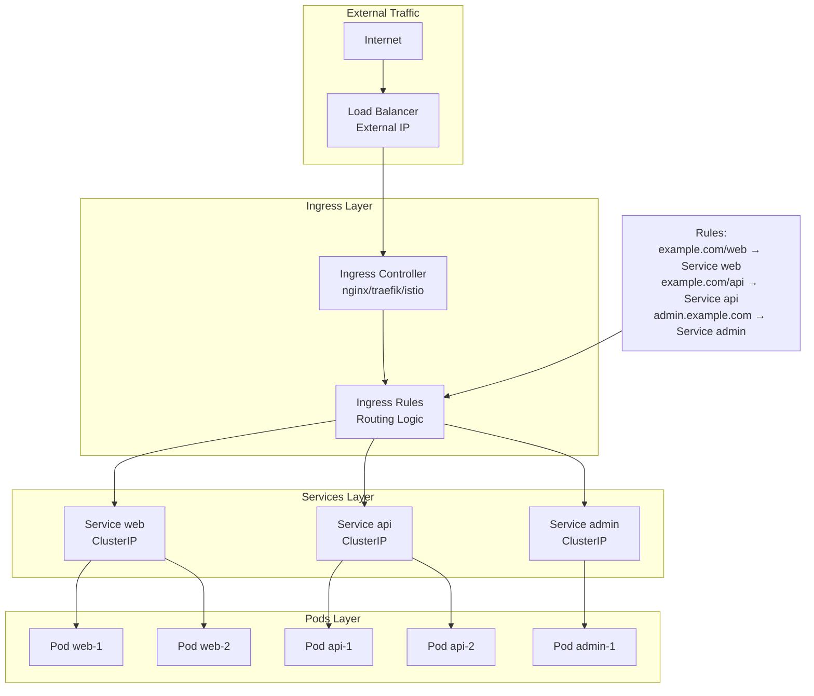

### 9.3 Configuration Ingress

```yaml
apiVersion: networking.k8s.io/v1
kind: Ingress
metadata:
  name: app-ingress
  annotations:
    kubernetes.io/ingress.class: 'nginx'
    cert-manager.io/cluster-issuer: 'letsencrypt-prod'
spec:
  tls:
    - hosts:
        - app.example.com
      secretName: app-tls
  rules:
    - host: app.example.com
      http:
        paths:
          - path: /api
            pathType: Prefix
            backend:
              service:
                name: api-service
                port:
                  number: 80
          - path: /
            pathType: Prefix
            backend:
              service:
                name: web-service
                port:
                  number: 80
```

### 9.4 Application pratique - Ingress

📝 **LAB 8** - Ingress et exposition : `labs/enonces/S3_S1_S1_lab8_ingress_exposition.md`
**Correction** : `labs/corrections/S3_S1_S1_lab8_ingress_exposition_correction.md`

**Énoncé du LAB 8** :

Configurez Ingress pour exposer intelligemment vos applications vers l'extérieur.

- **Objectif** : Maîtriser l'exposition externe via Ingress
- **Contexte** : Exposition production d'applications web avec SSL/TLS
- **Instructions** :
  1. Déployer Ingress Controller (nginx)
  2. Créer plusieurs services backend (web, api)
  3. Configurer Ingress avec routage host-based et path-based
  4. Tester l'accès externe et le routage
- **Critères de validation** : Ingress actif, routage fonctionnel, SSL configuré
- **Durée estimée** : 40 minutes
- **Fichier de travail** : `S3_S1_lab8_ingress_exposition.yml`

---

## 10. Monitoring et debugging

### 10.1 Observabilité Kubernetes

**Dimensions** :

- **Métriques** : CPU, mémoire, réseau, stockage
- **Logs** : Événements applicatifs et système
- **Traces** : Suivi des requêtes distribuées
- **Événements** : Changements d'état du cluster

### 10.2 Outils natifs de debugging

**kubectl** commandes essentielles :

```bash
# État des ressources
kubectl get pods -o wide
kubectl describe pod nginx-pod

# Logs des conteneurs
kubectl logs nginx-pod
kubectl logs -f nginx-pod -c sidecar

# Débogage interactif
kubectl exec -it nginx-pod -- /bin/bash
kubectl port-forward nginx-pod 8080:80

# Événements cluster
kubectl get events --sort-by='.firstTimestamp'
kubectl top nodes
kubectl top pods
```

### 10.3 Monitoring avancé

**Stack de monitoring** :

- **Prometheus** : Collecte et stockage métriques
- **Grafana** : Visualisation et alerting
- **Alertmanager** : Gestion notifications
- **Node Exporter** : Métriques système nodes

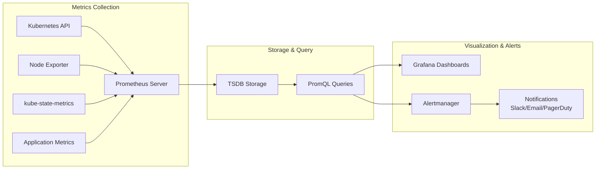

### 10.4 Application pratique - Monitoring

📝 **LAB 9** - Monitoring et debugging : `labs/enonces/S3_S1_S1_lab9_monitoring_debugging.md`
**Correction** : `labs/corrections/S3_S1_S1_lab9_monitoring_debugging_correction.md`

**Énoncé du LAB 9** :

Mettez en place monitoring et debugging pour assurer l'observabilité de vos déploiements.

- **Objectif** : Maîtriser l'observabilité et le debugging Kubernetes
- **Contexte** : Monitoring production et résolution d'incidents
- **Instructions** :
  1. Déployer stack Prometheus/Grafana
  2. Configurer métriques Kubernetes et applications
  3. Créer dashboards pour monitoring cluster et workloads
  4. Simuler incidents et utiliser outils debugging
- **Critères de validation** : Métriques collectées, dashboards fonctionnels, debugging efficace
- **Durée estimée** : 45 minutes
- **Fichier de travail** : `S3_S1_lab9_monitoring_debugging.yml`

---

## 10.5 Challenge d'intégration

📝 **LAB 10 Challenge** - Application multi-tiers complète : `labs/enonces/S3_S1_S1_lab10_challenge_application_complete.md`
**Correction** : `labs/corrections/S3_S1_S1_lab10_challenge_application_complete_correction.md`

**Énoncé du LAB 10 Challenge** :

Déployez une application web complète multi-tiers intégrant tous les concepts Kubernetes étudiés.

- **Objectif** : Intégrer tous les concepts dans un projet complet
- **Contexte** : Déploiement production d'application e-commerce DevOps
- **Instructions** :
  1. Déployer stack complète (frontend, backend, base de données)
  2. Configurer networking, persistance, et sécurité
  3. Implémenter monitoring, logging, et alerting
  4. Tester haute disponibilité et disaster recovery
- **Critères de validation** : Application complète fonctionnelle, haute disponibilité, monitoring actif
- **Durée estimée** : 60 minutes
- **Fichier de travail** : `S3_S1_lab10_challenge_application_complete.yml`

---

## 11. Récapitulatif et prochaines étapes

### 11.1 Concepts maîtrisés

À l'issue de cette semaine, vous maîtrisez :

**Architecture** :

- Control plane et worker nodes
- API Server, etcd, scheduler, controller manager
- Kubelet, kube-proxy, container runtime

**Objets fondamentaux** :

- Pods comme unité d'exécution atomique
- Services pour networking stable
- Deployments pour haute disponibilité
- ConfigMaps et Secrets pour configuration

**Stockage et réseau** :

- Volumes et persistance de données
- Ingress pour exposition externe
- Service discovery et load balancing

**Opérations** :

- Installation et configuration cluster
- Déploiement et gestion d'applications
- Monitoring et debugging

### 11.2 Prochaines étapes - Semaine 2

**Kubernetes Applications** :

- Helm pour package management
- StatefulSets pour applications stateful
- Jobs et CronJobs pour tâches batch
- DaemonSets pour services système

**Sécurité avancée** :

- RBAC et gestion des accès
- Network Policies pour micro-segmentation
- Pod Security Policies
- Service Mesh (Istio)

**Production ready** :

- High Availability cluster setup
- Backup et disaster recovery
- Performance tuning
- Troubleshooting avancé

---

## 12. Ressources complémentaires

### 12.1 Documentation officielle

- **Kubernetes.io** : Documentation complète et tutoriels
- **Kubectl Reference** : Référence complète des commandes
- **API Reference** : Spécification des objets Kubernetes

### 12.2 Outils et extensions

- **Lens** : IDE Kubernetes pour gestion visuelle
- **k9s** : Interface terminal avancée
- **Helm** : Package manager pour Kubernetes
- **Kustomize** : Gestion configuration native

### 12.3 Environnements d'apprentissage

- **Minikube** : Cluster local pour développement
- **Kind** : Kubernetes in Docker pour tests
- **Katacoda** : Labs interactifs en ligne
- **Play with Kubernetes** : Environnement web gratuit

### 12.4 Certifications

- **CKA** : Certified Kubernetes Administrator
- **CKAD** : Certified Kubernetes Application Developer
- **CKS** : Certified Kubernetes Security Specialist

---

_Formateur : Hassan ESSADIK | Sprint 3 - Semaine 1 - Kubernetes Basics_
