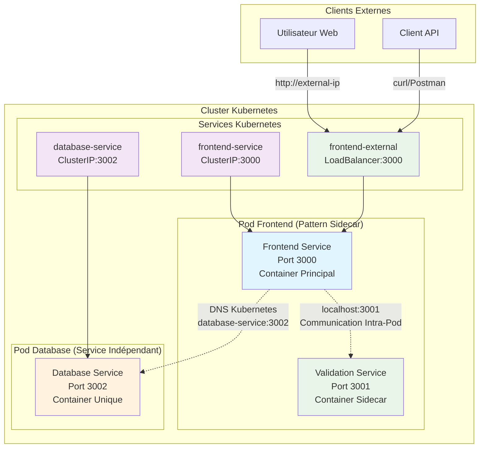
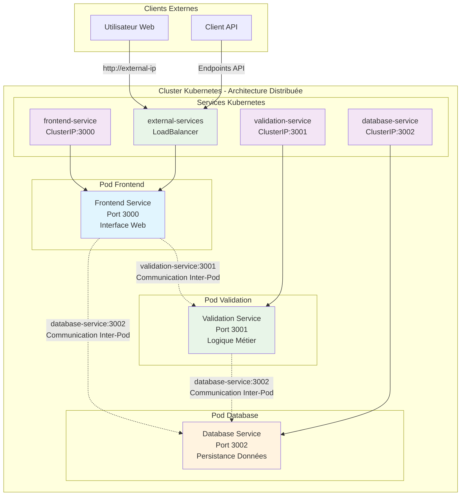

# Demo Microservices - Communication Kubernetes

Application de démonstration pour illustrer les différents types de communication dans Kubernetes. Cette démo comprend 3 services Node.js qui communiquent selon deux patterns principaux : **Communication Intra-Pod (Sidecar)** et **Communication Inter-Pod**.

---

# 1. Communication Sidecar (Intra-Pod)

## Vue d'ensemble

Le pattern **Sidecar** place plusieurs conteneurs dans le même Pod, permettant une communication ultra-rapide via `localhost`. Dans cette architecture, le Frontend et le service Validation partagent le même Pod.

## Architecture Sidecar



## Caractéristiques de la Communication Sidecar

### Avantages

- **Latence ultra-faible** : Communication via `localhost`
- **Partage de ressources** : Mêmes volumes, réseau, lifecycle
- **Couplage fort** : Démarrage/arrêt synchronisé
- **Sécurité renforcée** : Pas d'exposition réseau entre conteneurs

### Inconvénients

- **Scaling couplé** : Impossible de scaler indépendamment
- **Ressources partagées** : Limitation par les ressources du Pod
- **Debugging complexe** : Plusieurs processus dans le même Pod

### Cas d'usage idéaux

- **Services auxiliaires** : Logging, monitoring, proxy
- **Couplage fonctionnel fort** : Validation + Frontend
- **Performance critique** : Communication très fréquente

## Déploiement Sidecar

### Prérequis

- Kubernetes cluster (minikube, kind, ou cluster cloud)
- kubectl configuré
- Images Docker disponibles

### 1. Déploiement des manifests

```bash
# Déployer l'architecture Sidecar
kubectl apply -f sidecar-pod/

# Vérifier le déploiement
kubectl get pods,services
```

### 2. Test de la Communication Intra-Pod

```bash
# Obtenir le nom du pod frontend
FRONTEND_POD=$(kubectl get pods -l tier=frontend -o jsonpath='{.items[0].metadata.name}')

# Test communication localhost entre conteneurs
kubectl exec -it $FRONTEND_POD -c frontend-container -- curl localhost:3001/health
kubectl exec -it $FRONTEND_POD -c validation-container -- curl localhost:3000/health
```

### 3. Accès externe

```bash
# Obtenir l'URL externe du LoadBalancer
kubectl get service frontend-service

# Test depuis l'extérieur (remplacer EXTERNAL-IP)
curl http://EXTERNAL-IP:3000/
curl http://EXTERNAL-IP:3000/validate-user -X POST -H "Content-Type: application/json" -d '{"email":"test@example.com"}'
```

---

# 2. Communication Inter-Pod

## Vue d'ensemble

L'architecture **Pod Séparés** place chaque service dans son propre Pod, permettant un scaling indépendant et une isolation maximale. La communication se fait via les Services Kubernetes et le DNS interne.

## Architecture Pod Séparés




## Caractéristiques de la Communication Inter-Pod

### Avantages

- **Scaling indépendant** : Chaque service peut être scalé séparément
- **Isolation maximale** : Ressources dédiées par service
- **Debugging simplifié** : Un seul processus par Pod
- **Résilience** : Panne d'un service n'affecte pas les autres

### Inconvénients

- **Latence réseau** : Communication via le réseau Kubernetes
- **Complexité de déploiement** : Plus de manifests à gérer
- **Overhead réseau** : Sérialisation/désérialisation des requêtes

### Cas d'usage idéaux

- **Microservices autonomes** : Services avec logiques métier distinctes
- **Équipes séparées** : Développement et déploiement indépendants
- **Scaling différencié** : Besoins de performance variables

## Déploiement Inter-Pod

### 1. Déploiement des manifests

```bash
# Déployer l'architecture Pod Séparés
kubectl apply -f pod-unique-container/

# Vérifier le déploiement
kubectl get pods,services
```

### 2. Test de la Communication Inter-Pod

```bash
# Obtenir les noms des pods
FRONTEND_POD=$(kubectl get pods -l tier=frontend -o jsonpath='{.items[0].metadata.name}')
VALIDATION_POD=$(kubectl get pods -l tier=backend -o jsonpath='{.items[0].metadata.name}')

# Test communication DNS entre pods
kubectl exec -it $FRONTEND_POD -- curl validation-service:3001/health
kubectl exec -it $VALIDATION_POD -- curl database-service:3002/health

# Test résolution DNS
kubectl exec -it $FRONTEND_POD -- nslookup validation-service
```

### 3. Monitoring de la Communication

```bash
# Voir les logs de communication
kubectl logs $FRONTEND_POD -f
kubectl logs $VALIDATION_POD -f

# Test de connectivité réseau
kubectl exec -it $FRONTEND_POD -- nc -zv validation-service 3001
```

---

# Comparaison des Patterns

| **Aspect**        | **Pattern Sidecar (Intra-Pod)** | **Pods Séparés (Inter-Pod)** |
| ----------------- | ------------------------------- | ---------------------------- |
| **Latence**       | Très faible (localhost)         | Faible (réseau K8s)          |
| **Sécurité**      | Isolation moindre               | Isolation maximale           |
| **Scaling**       | Couplé (même pod)               | Indépendant                  |
| **Resources**     | Partagées                       | Dédiées                      |
| **Debugging**     | Plus complexe                   | Plus simple                  |
| **Use Case**      | Fonctions auxiliaires           | Services autonomes           |
| **Communication** | `localhost:port`                | `service-name:port`          |
| **Déploiement**   | Un seul manifest                | Manifests multiples          |
| **Résilience**    | Couplée                         | Indépendante                 |

---

# Tests et Débogage

## Tests Docker Compose (Développement Local)

### Démarrage rapide

```bash
# Démarrage avec Docker Compose
docker-compose up --build -d
```

### Accès à l'application

- **Frontend**: http://localhost:3000
- **Database API**: http://localhost:3002

### Tests automatisés

```bash
# Tests de connectivité
curl http://localhost:3000/health
curl http://localhost:3002/health

# Voir les logs
docker-compose logs -f

# Statut des services
docker-compose ps
```

### Arrêter l'application

```bash
docker-compose down
```

## Déploiement Kubernetes (Production)

### Construction des images

```bash
# Construction des images Docker
docker build -t hassanaym/frontend-service:1.0 ./frontend-service
docker build -t hassanaym/validation-service:1.0 ./validation-service
docker build -t hassanaym/database-service:1.0 ./database-service
```

### Déploiement

```bash
# Déploiement Kubernetes
kubectl apply -f k8s-manifests/

# Vérifier le statut
kubectl get pods,services
```

## Description des Services

### 1. Frontend Service (Port 3000)

- **Interface** : Page web avec formulaires de démonstration
- **Communication Sidecar** : `localhost:3001` → Validation Service
- **Communication Inter-Pod** : `validation-service:3001` → Validation Service
- **Database** : `database-service:3002` → Database Service

### 2. Validation Service (Port 3001)

- **Fonction** : Validation des données utilisateur (email, téléphone)
- **Accès Sidecar** : Depuis Frontend via localhost
- **Accès Inter-Pod** : Via Service Kubernetes

### 3. Database Service (Port 3002)

- **Fonction** : CRUD utilisateurs (stockage en mémoire)
- **Accès** : Via Service Kubernetes depuis n'importe quel Pod

## Endpoints API

### Frontend Service (3000)

- `GET /` - Page d'accueil avec formulaire
- `POST /validate-user` - Validation complète
- `GET /users` - Liste des utilisateurs
- `POST /users` - Créer utilisateur
- `GET /health` - Health check

### Validation Service (3001)

- `POST /validate` - Validation des données
- `GET /rules` - Règles de validation
- `GET /health` - Health check

### Database Service (3002)

- `GET /users` - Liste des utilisateurs
- `POST /users` - Créer un utilisateur
- `GET /users/:id` - Détails utilisateur
- `PUT /users/:id` - Modifier utilisateur
- `DELETE /users/:id` - Supprimer utilisateur
- `GET /health` - Health check
- `GET /stats` - Statistiques d'utilisation

---

# Structure du Projet

```
demo-microservices/
├── README.md                        # Documentation complète
├── docker-compose.yml               # Développement local
├── frontend-service/                # Service Frontend
│   ├── app.js                       # Application Express.js
│   ├── package.json                 # Dépendances Node.js
│   ├── Dockerfile                   # Image Docker
│   └── views/
│       └── index.html               # Interface web
├── validation-service/              # Service Validation
│   ├── app.js                       # Service de validation
│   ├── package.json                 # Dépendances Node.js
│   └── Dockerfile                   # Image Docker
├── database-service/                # Service Base de données
│   ├── app.js                       # Service base de données
│   ├── package.json                 # Dépendances Node.js
│   └── Dockerfile                   # Image Docker
├── sidecar-pod/                     # Pattern Sidecar (Intra-Pod)
│   ├── frontend-deployment.yml      # Deployment avec 2 conteneurs
│   └── frontend-service.yml         # Service LoadBalancer
└── pod-unique-container/            # Pattern Inter-Pod
    ├── frontend-deployment.yml      # Deployment Frontend seul
    ├── frontend-service.yml         # Service Frontend LoadBalancer
    ├── validation-deployment.yml    # Deployment Validation seul
    └── validation-service.yml       # Service Validation ClusterIP
```

---

# Objectifs Pédagogiques

Cette démonstration permet de comprendre :

1. **Communication Intra-Pod** : Partage localhost entre conteneurs dans le pattern Sidecar
2. **Communication Inter-Pod** : DNS Kubernetes et Services pour la communication entre Pods
3. **Patterns de déploiement** : Sidecar vs Services distribués
4. **Types de Services** : ClusterIP vs LoadBalancer
5. **Debugging réseau** : Outils et techniques Kubernetes
6. **Microservices** : Séparation des responsabilités et communication

---

**Formateur** : Hassan ESSADIK | **Sprint 3** - Semaine 1 - Kubernetes Basics
