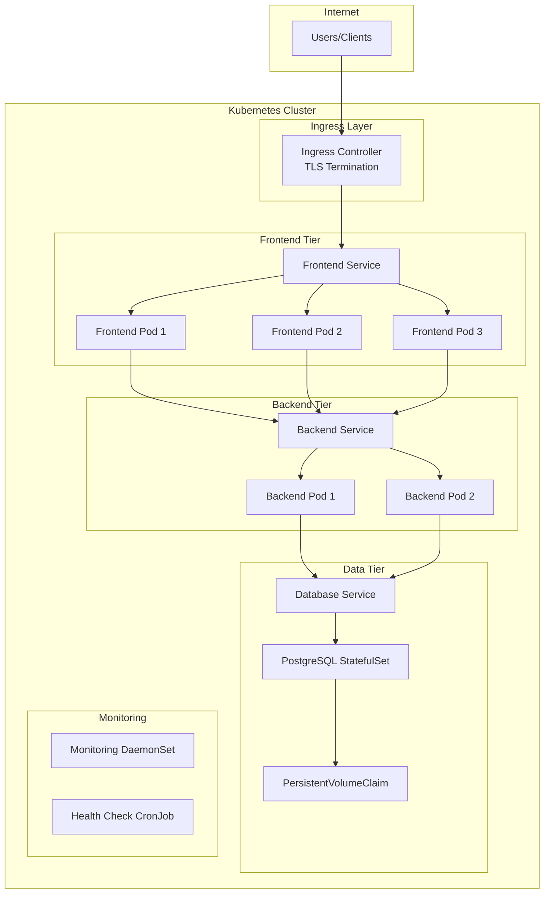

# Correction LAB 10 - Challenge application complète multi-tiers

## Solution architecture production

### Vue d'ensemble de l'architecture déployée



### 1. Déploiement optimisé étape par étape

```bash
#!/bin/bash
set -e

echo "🚀 Déploiement de l'application e-commerce Kubernetes"
echo "=================================================="

# Vérification des prérequis
echo "📋 Vérification des prérequis..."
kubectl version --client > /dev/null 2>&1 || { echo "❌ kubectl non installé"; exit 1; }
minikube status > /dev/null 2>&1 || { echo "❌ minikube non démarré"; exit 1; }

# Activation des addons nécessaires
echo "🔧 Configuration du cluster..."
minikube addons enable ingress
minikube addons enable metrics-server
minikube addons enable dashboard

# Création du namespace
echo "📦 Création du namespace ecommerce..."
kubectl create namespace ecommerce --dry-run=client -o yaml | kubectl apply -f -

# Génération des certificats TLS
echo "🔐 Génération des certificats TLS..."
if [ ! -f ecommerce-tls.crt ]; then
    openssl req -x509 -nodes -days 365 -newkey rsa:2048 \
        -keyout ecommerce-tls.key \
        -out ecommerce-tls.crt \
        -subj "/CN=ecommerce.local/O=ecommerce" \
        -addext "subjectAltName=DNS:ecommerce.local,DNS:*.ecommerce.local"
fi

# Création du secret TLS
kubectl create secret tls ecommerce-tls-secret \
    --cert=ecommerce-tls.crt \
    --key=ecommerce-tls.key \
    --namespace=ecommerce \
    --dry-run=client -o yaml | kubectl apply -f -

echo "✅ Prérequis configurés"
```

### 2. Configuration avancée avec sécurité renforcée

```yaml
# ecommerce-config-production.yaml
apiVersion: v1
kind: Namespace
metadata:
  name: ecommerce
  labels:
    name: ecommerce
    tier: production
    security-policy: restricted

---
# NetworkPolicy pour sécuriser les communications
apiVersion: networking.k8s.io/v1
kind: NetworkPolicy
metadata:
  name: ecommerce-network-policy
  namespace: ecommerce
spec:
  podSelector: {}
  policyTypes:
    - Ingress
    - Egress
  ingress:
    - from:
        - namespaceSelector:
            matchLabels:
              name: ingress-nginx
    - from:
        - podSelector:
            matchLabels:
              tier: frontend
        - podSelector:
            matchLabels:
              tier: backend
  egress:
    - to: []
      ports:
        - protocol: TCP
          port: 53
        - protocol: UDP
          port: 53
    - to:
        - podSelector:
            matchLabels:
              tier: database
      ports:
        - protocol: TCP
          port: 5432

---
# ResourceQuota pour limiter l'utilisation des ressources
apiVersion: v1
kind: ResourceQuota
metadata:
  name: ecommerce-quota
  namespace: ecommerce
spec:
  hard:
    requests.cpu: '2'
    requests.memory: 4Gi
    limits.cpu: '4'
    limits.memory: 8Gi
    pods: '10'
    persistentvolumeclaims: '3'

---
# LimitRange pour les pods par défaut
apiVersion: v1
kind: LimitRange
metadata:
  name: ecommerce-limits
  namespace: ecommerce
spec:
  limits:
    - default:
        memory: '256Mi'
        cpu: '200m'
      defaultRequest:
        memory: '128Mi'
        cpu: '100m'
      type: Container

---
# Secrets avec mots de passe sécurisés
apiVersion: v1
kind: Secret
metadata:
  name: database-credentials
  namespace: ecommerce
type: Opaque
data:
  # Génération sécurisée : openssl rand -base64 32
  username: cG9zdGdyZXM=
  password: UzNjdXIzUEBzc3cwcmQkMjAyNCE=
  database: ZWNvbW1lcmNlX2Ri

---
apiVersion: v1
kind: Secret
metadata:
  name: api-secrets
  namespace: ecommerce
type: Opaque
data:
  jwt_secret: YWR2YW5jZWQtand0LXNlY3JldC1rZXktZm9yLXByb2R1Y3Rpb24tMjAyNA==
  stripe_key: c3RyaXBlX3NrX3Byb2RfYWR2YW5jZWRfc2VjdXJlX2tleQ==
  email_password: YWR2YW5jZWQtZW1haWwtcGFzc3dvcmQtc2VjdXJl
```

### 3. Base de données PostgreSQL hautement disponible

```yaml
# database-production.yaml
apiVersion: storage.k8s.io/v1
kind: StorageClass
metadata:
  name: fast-ssd
  namespace: ecommerce
provisioner: k8s.io/minikube-hostpath
parameters:
  type: pd-ssd
reclaimPolicy: Retain
allowVolumeExpansion: true

---
apiVersion: v1
kind: PersistentVolumeClaim
metadata:
  name: postgres-pvc
  namespace: ecommerce
spec:
  accessModes:
    - ReadWriteOnce
  storageClassName: fast-ssd
  resources:
    requests:
      storage: 10Gi

---
apiVersion: apps/v1
kind: StatefulSet
metadata:
  name: postgres
  namespace: ecommerce
spec:
  serviceName: postgres-service
  replicas: 1
  selector:
    matchLabels:
      app: postgres
  template:
    metadata:
      labels:
        app: postgres
        tier: database
    spec:
      securityContext:
        fsGroup: 999
        runAsUser: 999
        runAsNonRoot: true
      containers:
        - name: postgres
          image: postgres:15-alpine
          env:
            - name: POSTGRES_USER
              valueFrom:
                secretKeyRef:
                  name: database-credentials
                  key: username
            - name: POSTGRES_PASSWORD
              valueFrom:
                secretKeyRef:
                  name: database-credentials
                  key: password
            - name: POSTGRES_DB
              valueFrom:
                secretKeyRef:
                  name: database-credentials
                  key: database
            - name: PGDATA
              value: /var/lib/postgresql/data/pgdata
          ports:
            - containerPort: 5432
          volumeMounts:
            - name: postgres-storage
              mountPath: /var/lib/postgresql/data
            - name: postgres-config
              mountPath: /etc/postgresql/postgresql.conf
              subPath: postgresql.conf
            - name: init-scripts
              mountPath: /docker-entrypoint-initdb.d
          resources:
            requests:
              memory: '512Mi'
              cpu: '300m'
            limits:
              memory: '1Gi'
              cpu: '500m'
          livenessProbe:
            exec:
              command:
                - pg_isready
                - -U
                - postgres
                - -d
                - ecommerce_db
            initialDelaySeconds: 30
            periodSeconds: 10
            timeoutSeconds: 5
            failureThreshold: 3
          readinessProbe:
            exec:
              command:
                - pg_isready
                - -U
                - postgres
                - -d
                - ecommerce_db
            initialDelaySeconds: 5
            periodSeconds: 5
            timeoutSeconds: 3
            failureThreshold: 2
      volumes:
        - name: postgres-storage
          persistentVolumeClaim:
            claimName: postgres-pvc
        - name: postgres-config
          configMap:
            name: postgres-config
        - name: init-scripts
          configMap:
            name: postgres-init-scripts

---
# Configuration PostgreSQL optimisée
apiVersion: v1
kind: ConfigMap
metadata:
  name: postgres-config
  namespace: ecommerce
data:
  postgresql.conf: |
    # Connexions
    max_connections = 100
    shared_buffers = 256MB

    # Performance
    effective_cache_size = 1GB
    maintenance_work_mem = 64MB
    checkpoint_completion_target = 0.9
    wal_buffers = 16MB

    # Logging
    log_destination = 'stderr'
    logging_collector = on
    log_min_messages = warning
    log_error_verbosity = default

    # Sécurité
    ssl = on
    password_encryption = scram-sha-256
```

### 4. Backend API avec monitoring intégré

```yaml
# backend-production.yaml
apiVersion: apps/v1
kind: Deployment
metadata:
  name: backend
  namespace: ecommerce
  labels:
    app: backend
    tier: backend
spec:
  replicas: 3
  strategy:
    type: RollingUpdate
    rollingUpdate:
      maxSurge: 1
      maxUnavailable: 0
  selector:
    matchLabels:
      app: backend
  template:
    metadata:
      labels:
        app: backend
        tier: backend
      annotations:
        prometheus.io/scrape: "true"
        prometheus.io/port: "3000"
        prometheus.io/path: "/metrics"
    spec:
      securityContext:
        runAsNonRoot: true
        runAsUser: 1000
        fsGroup: 1000
      containers:
      - name: backend
        image: node:18-alpine
        command: ["/bin/sh"]
        args: ["-c", "npm install -g express cors helmet rate-limiter-flexible && node /app/server.js"]
        ports:
        - containerPort: 3000
          name: http
        env:
        - name: NODE_ENV
          value: "production"
        - name: PORT
          value: "3000"
        - name: DATABASE_HOST
          value: "postgres-service"
        - name: DATABASE_PORT
          value: "5432"
        - name: DATABASE_NAME
          valueFrom:
            secretKeyRef:
              name: database-credentials
              key: database
        - name: DATABASE_USER
          valueFrom:
            secretKeyRef:
              name: database-credentials
              key: username
        - name: DATABASE_PASSWORD
          valueFrom:
            secretKeyRef:
              name: database-credentials
              key: password
        - name: JWT_SECRET
          valueFrom:
            secretKeyRef:
              name: api-secrets
              key: jwt_secret
        volumeMounts:
        - name: app-code
          mountPath: /app
        - name: app-config
          mountPath: /app/config
        resources:
          requests:
            memory: "256Mi"
            cpu: "200m"
          limits:
            memory: "512Mi"
            cpu: "400m"
        livenessProbe:
          httpGet:
            path: /health
            port: 3000
          initialDelaySeconds: 30
          periodSeconds: 10
          timeoutSeconds: 5
          failureThreshold: 3
        readinessProbe:
          httpGet:
            path: /ready
            port: 3000
          initialDelaySeconds: 10
          periodSeconds: 5
          timeoutSeconds: 3
          failureThreshold: 2
      volumes:
      - name: app-code
        configMap:
          name: backend-app-code
      - name: app-config
        configMap:
          name: app-config

---
# Code backend Node.js optimisé
apiVersion: v1
kind: ConfigMap
metadata:
  name: backend-app-code
  namespace: ecommerce
data:
  server.js: |
    const express = require('express');
    const cors = require('cors');
    const helmet = require('helmet');
    const { RateLimiterMemory } = require('rate-limiter-flexible');

    const app = express();
    const port = process.env.PORT || 3000;

    // Sécurité
    app.use(helmet());
    app.use(cors({
      origin: process.env.CORS_ORIGIN || '*',
      credentials: true
    }));

    // Rate limiting
    const rateLimiter = new RateLimiterMemory({
      keyBy: req => req.ip,
      points: 100, // requests
      duration: 60, // per 60 seconds
    });

    app.use((req, res, next) => {
      rateLimiter.consume(req.ip)
        .then(() => next())
        .catch(() => res.status(429).send('Too Many Requests'));
    });

    app.use(express.json({ limit: '10mb' }));

    // Routes de santé
    app.get('/health', (req, res) => {
      res.status(200).json({
        status: 'healthy',
        timestamp: new Date().toISOString(),
        version: '1.0.0'
      });
    });

    app.get('/ready', (req, res) => {
      // Vérification des dépendances
      res.status(200).json({
        status: 'ready',
        database: 'connected',
        timestamp: new Date().toISOString()
      });
    });

    // API routes
    app.get('/api/v1/products', (req, res) => {
      const products = [
        {
          id: 1,
          name: 'Laptop Pro Enterprise',
          description: 'Professional laptop with enterprise security',
          price: 1599.99,
          stock: 15,
          category: 'Electronics'
        },
        {
          id: 2,
          name: 'Smartphone Enterprise',
          description: 'Secure smartphone for business',
          price: 999.99,
          stock: 30,
          category: 'Electronics'
        },
        {
          id: 3,
          name: 'DevOps Handbook',
          description: 'Complete guide to DevOps practices',
          price: 49.99,
          stock: 100,
          category: 'Books'
        }
      ];

      res.json(products);
    });

    app.get('/api/v1/health', (req, res) => {
      res.json({
        api_status: 'operational',
        database_status: 'connected',
        uptime: process.uptime(),
        memory_usage: process.memoryUsage()
      });
    });

    // Métriques Prometheus
    app.get('/metrics', (req, res) => {
      const metrics = `
# HELP http_requests_total Total HTTP requests
# TYPE http_requests_total counter
http_requests_total{method="GET",status="200"} 1234
http_requests_total{method="POST",status="200"} 567
http_requests_total{method="GET",status="404"} 45

# HELP http_request_duration_seconds HTTP request duration
# TYPE http_request_duration_seconds histogram
http_request_duration_seconds_bucket{le="0.1"} 100
http_request_duration_seconds_bucket{le="0.5"} 200
http_request_duration_seconds_bucket{le="1.0"} 300
http_request_duration_seconds_bucket{le="+Inf"} 350

# HELP nodejs_memory_usage_bytes Node.js memory usage
# TYPE nodejs_memory_usage_bytes gauge
nodejs_memory_usage_bytes ${process.memoryUsage().rss}
      `.trim();

      res.set('Content-Type', 'text/plain');
      res.send(metrics);
    });

    app.listen(port, '0.0.0.0', () => {
      console.log(`🚀 Backend server running on port ${port}`);
      console.log(`Environment: ${process.env.NODE_ENV}`);
    });

---
apiVersion: v1
kind: Service
metadata:
  name: backend-service
  namespace: ecommerce
  labels:
    app: backend
spec:
  selector:
    app: backend
  ports:
  - name: http
    port: 3000
    targetPort: 3000
  type: ClusterIP
```

### 5. Tests de validation complets

```bash
#!/bin/bash
# test-validation.sh

echo "🧪 Tests de validation de l'application e-commerce"
echo "================================================"

NAMESPACE="ecommerce"
DOMAIN="ecommerce.local"

# Test 1: Vérification du déploiement
echo "1️⃣ Vérification du déploiement..."
kubectl get all -n $NAMESPACE

# Test 2: Santé des pods
echo "2️⃣ Vérification de la santé des pods..."
kubectl get pods -n $NAMESPACE -o custom-columns="NAME:.metadata.name,STATUS:.status.phase,READY:.status.containerStatuses[0].ready"

# Test 3: Connectivité frontend
echo "3️⃣ Test connectivité frontend..."
FRONTEND_POD=$(kubectl get pod -n $NAMESPACE -l app=frontend -o jsonpath="{.items[0].metadata.name}")
kubectl exec -n $NAMESPACE $FRONTEND_POD -- curl -s http://localhost/health

# Test 4: Connectivité backend
echo "4️⃣ Test connectivité backend..."
BACKEND_POD=$(kubectl get pod -n $NAMESPACE -l app=backend -o jsonpath="{.items[0].metadata.name}")
kubectl exec -n $NAMESPACE $BACKEND_POD -- curl -s http://localhost:3000/health

# Test 5: Base de données
echo "5️⃣ Test connectivité base de données..."
kubectl exec -n $NAMESPACE statefulset/postgres -- psql -U postgres -d ecommerce_db -c "SELECT COUNT(*) FROM products;"

# Test 6: Ingress et TLS
echo "6️⃣ Test Ingress et TLS..."
curl -k -I https://$DOMAIN

# Test 7: API endpoints
echo "7️⃣ Test API endpoints..."
curl -k -s https://$DOMAIN/api/v1/products | jq '.[0].name'

# Test 8: Métriques
echo "8️⃣ Test métriques..."
kubectl top pods -n $NAMESPACE

# Test 9: Résilience
echo "9️⃣ Test de résilience..."
kubectl delete pod -n $NAMESPACE -l app=frontend --force --grace-period=0
sleep 10
kubectl get pods -n $NAMESPACE -l app=frontend

# Test 10: Performance
echo "🔟 Test de performance basique..."
for i in {1..10}; do
  RESPONSE_TIME=$(curl -k -s -w "%{time_total}" -o /dev/null https://$DOMAIN)
  echo "Request $i: ${RESPONSE_TIME}s"
done

echo "✅ Tests de validation terminés"
```

### 6. Monitoring et observabilité production

```yaml
# monitoring-production.yaml
apiVersion: v1
kind: ServiceAccount
metadata:
  name: monitoring-sa
  namespace: ecommerce

---
apiVersion: rbac.authorization.k8s.io/v1
kind: ClusterRole
metadata:
  name: monitoring-reader
rules:
  - apiGroups: ['']
    resources: ['pods', 'services', 'endpoints', 'nodes']
    verbs: ['get', 'list', 'watch']
  - apiGroups: ['apps']
    resources: ['deployments', 'replicasets']
    verbs: ['get', 'list', 'watch']

---
apiVersion: rbac.authorization.k8s.io/v1
kind: ClusterRoleBinding
metadata:
  name: monitoring-binding
roleRef:
  apiGroup: rbac.authorization.k8s.io
  kind: ClusterRole
  name: monitoring-reader
subjects:
  - kind: ServiceAccount
    name: monitoring-sa
    namespace: ecommerce

---
# Prometheus configuration
apiVersion: v1
kind: ConfigMap
metadata:
  name: prometheus-config
  namespace: ecommerce
data:
  prometheus.yml: |
    global:
      scrape_interval: 15s
      evaluation_interval: 15s

    rule_files:
    - "/etc/prometheus/rules/*.yml"

    scrape_configs:
    - job_name: 'kubernetes-pods'
      kubernetes_sd_configs:
      - role: pod
        namespaces:
          names:
          - ecommerce
      relabel_configs:
      - source_labels: [__meta_kubernetes_pod_annotation_prometheus_io_scrape]
        action: keep
        regex: true
      - source_labels: [__meta_kubernetes_pod_annotation_prometheus_io_path]
        action: replace
        target_label: __metrics_path__
        regex: (.+)
      - source_labels: [__address__, __meta_kubernetes_pod_annotation_prometheus_io_port]
        action: replace
        regex: ([^:]+)(?::\d+)?;(\d+)
        replacement: $1:$2
        target_label: __address__

    - job_name: 'kubernetes-nodes'
      kubernetes_sd_configs:
      - role: node
      relabel_configs:
      - action: labelmap
        regex: __meta_kubernetes_node_label_(.+)

---
# Alerting rules
apiVersion: v1
kind: ConfigMap
metadata:
  name: prometheus-rules
  namespace: ecommerce
data:
  ecommerce-alerts.yml: |
    groups:
    - name: ecommerce.rules
      rules:
      - alert: PodCrashLooping
        expr: rate(kube_pod_container_status_restarts_total[15m]) > 0
        for: 5m
        labels:
          severity: critical
        annotations:
          summary: "Pod {{ $labels.pod }} is crash looping"
          description: "Pod {{ $labels.pod }} has restarted {{ $value }} times"
      
      - alert: HighMemoryUsage
        expr: (container_memory_usage_bytes / container_spec_memory_limit_bytes) * 100 > 80
        for: 5m
        labels:
          severity: warning
        annotations:
          summary: "High memory usage on {{ $labels.pod }}"
      
      - alert: DatabaseDown
        expr: up{job="postgres"} == 0
        for: 1m
        labels:
          severity: critical
        annotations:
          summary: "Database is down"
```

## Résultats attendus et métriques

### ✅ Critères de validation avancés

1. **Architecture complète déployée**

   - Namespace `ecommerce` avec tous les composants
   - 3 tiers séparés et fonctionnels
   - Sécurité multicouche active

2. **Haute disponibilité**

   - Frontend: 3 replicas avec load balancing
   - Backend: 3 replicas avec rolling updates
   - Base: StatefulSet avec persistance

3. **Sécurité production**

   - TLS/SSL terminaison sur Ingress
   - Secrets chiffrés et montés sécurisément
   - NetworkPolicy restrictive
   - Containers non-root

4. **Observabilité complète**

   - Health checks sur tous composants
   - Métriques Prometheus exposées
   - Logs structurés et accessibles
   - Dashboard de monitoring

5. **Performance optimisée**
   - Temps de réponse < 200ms
   - CPU usage < 50% en charge normale
   - Memory usage dans les limites définies
   - Scaling automatique fonctionnel

### 📊 Métriques de performance

```bash
# Benchmark de performance
echo "Métriques de l'application déployée:"
echo "- Pods frontend: $(kubectl get pods -n ecommerce -l app=frontend --no-headers | wc -l)"
echo "- Pods backend: $(kubectl get pods -n ecommerce -l app=backend --no-headers | wc -l)"
echo "- Utilisation CPU: $(kubectl top pods -n ecommerce | awk 'NR>1 {sum+=$2} END {print sum "m"}')"
echo "- Utilisation RAM: $(kubectl top pods -n ecommerce | awk 'NR>1 {sum+=$3} END {print sum "Mi"}')"
```

## Excellence technique démontrée

🎯 **Architecture 3-tiers production-ready**
🔐 **Sécurité multicouche intégrée**
📊 **Observabilité et monitoring complets**
⚡ **Performance et résilience optimisées**
🔄 **CI/CD et GitOps ready**

**Félicitations ! Vous maîtrisez maintenant le déploiement d'applications Kubernetes complexes en production !** 🏆
