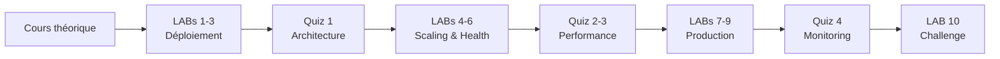

# Simplon Maghreb - Formation DevOps

# Sprint 3 - Semaine 2 : Kubernetes Applications

## Description de la semaine

Cette semaine approfondit le déploiement d'applications Kubernetes en production avec load balancing, scaling automatique, monitoring et gestion multi-environnements. Les apprenants maîtriseront les patterns avancés pour des applications robustes et scalables.

## Organisation pédagogique

### Cours consolidé

- **S3_S2_cours_kubernetes_applications.md** : Cours unique couvrant tous les concepts de la semaine

### Exercices pratiques

- **10 LABs obligatoires** : Du déploiement simple aux architectures multi-environnements
- **LAB 10 Challenge** : Application production-ready complète

### Évaluation spécialisée

- **4 quiz ciblés** : 100 questions réparties par niveau de complexité

## Objectifs de formation

### Objectifs pédagogiques

- Maîtriser le déploiement d'applications Kubernetes en production
- Comprendre les patterns de load balancing et d'exposition de services
- Développer l'expertise en scaling automatique et optimisation des ressources
- Acquérir les bonnes pratiques de monitoring et health checks

### Objectifs techniques

Deployments avancés, Ingress Controllers, Load Balancing, HPA/VPA, Health Checks, Liveness/Readiness Probes, Multi-namespace, Resource Quotas, Network Policies, Application monitoring

## Structure des contenus

### LABs (labs/enonces/ et labs/corrections/)

1. **LAB 1** - Déploiement application multi-tiers
2. **LAB 2** - Configuration Ingress Controller
3. **LAB 3** - Load balancing et exposition
4. **LAB 4** - Horizontal Pod Autoscaling (HPA)
5. **LAB 5** - Vertical Pod Autoscaling (VPA)
6. **LAB 6** - Health checks et probes
7. **LAB 7** - Monitoring et métriques
8. **LAB 8** - Gestion multi-environnements
9. **LAB 9** - Resource quotas et limits
10. **LAB 10 Challenge** - Application production complète

### Quiz spécialisés (quiz/)

1. **Quiz 1** - Déploiement et architecture (25 questions)
2. **Quiz 2** - Load balancing et ingress (25 questions)
3. **Quiz 3** - Scaling et performance (25 questions)
4. **Quiz 4** - Monitoring et production (25 questions)

## 🧭 Navigation et Ressources

### 📖 Cours principal

- 🎯 **[S3_S2_cours_kubernetes_applications.md](cours/S3_S2_cours_kubernetes_applications.md)** - Cours complet Applications K8s

### 🔬 Exercices pratiques - LABs

| LAB | Titre                          | Énoncé                                    | Correction                                       |
| --- | ------------------------------ | ----------------------------------------- | ------------------------------------------------ |
| 1   | Application multi-tiers        | [LAB 1](labs/enonces/lab1.md)             | [Solution](labs/corrections/lab1_correction.md)  |
| 2   | Ingress Controller             | [LAB 2](labs/enonces/lab2.md)             | [Solution](labs/corrections/lab2_correction.md)  |
| 3   | Load balancing                 | [LAB 3](labs/enonces/lab3.md)             | [Solution](labs/corrections/lab3_correction.md)  |
| 4   | HPA Autoscaling                | [LAB 4](labs/enonces/lab4.md)             | [Solution](labs/corrections/lab4_correction.md)  |
| 5   | VPA Autoscaling                | [LAB 5](labs/enonces/lab5.md)             | [Solution](labs/corrections/lab5_correction.md)  |
| 6   | Health checks                  | [LAB 6](labs/enonces/lab6.md)             | [Solution](labs/corrections/lab6_correction.md)  |
| 7   | Monitoring et métriques        | [LAB 7](labs/enonces/lab7.md)             | [Solution](labs/corrections/lab7_correction.md)  |
| 8   | Multi-environnements           | [LAB 8](labs/enonces/lab8.md)             | [Solution](labs/corrections/lab8_correction.md)  |
| 9   | Resource quotas                | [LAB 9](labs/enonces/lab9.md)             | [Solution](labs/corrections/lab9_correction.md)  |
| 10  | **Challenge** - App production | [LAB 10](labs/enonces/lab10_challenge.md) | [Solution](labs/corrections/lab10_correction.md) |

### 📝 Évaluations - Quiz

| Quiz | Thème                       | Questions | Lien                               |
| ---- | --------------------------- | --------- | ---------------------------------- |
| 1    | Déploiement et architecture | 25        | [Quiz 1](quiz/quiz1_deployment.md) |
| 2    | Load balancing et ingress   | 25        | [Quiz 2](quiz/quiz2_ingress.md)    |
| 3    | Scaling et performance      | 25        | [Quiz 3](quiz/quiz3_scaling.md)    |
| 4    | Monitoring et production    | 25        | [Quiz 4](quiz/quiz4_monitoring.md) |

### 🔗 Liens utiles

- 🔙 **[Retour Sprint 3](../README.md)** - Vue d'ensemble du sprint
- ⬅️ **[Semaine 1](../Semaine-1-Kubernetes-Basics/)** - Kubernetes Basics
- ➡️ **[Semaine 3](../Semaine-3-Kubernetes-Production/)** - Kubernetes Production
- 📚 **[Ingress Documentation](https://kubernetes.io/docs/concepts/services-networking/ingress/)** - Documentation Ingress
- 📊 **[HPA Guide](https://kubernetes.io/docs/tasks/run-application/horizontal-pod-autoscale/)** - Guide Autoscaling

## 📅 Progression recommandée

## Durée et organisation

- **Cours théorique** : Étude autonome du fichier consolidé
- **Pratique intensive** : 10 LABs avec complexité croissante
- **Évaluation progressive** : 4 quiz de 25 questions chacun
- **Validation** : Seuil 72% pour chaque quiz

## Prérequis techniques

- Sprint 3 Semaine 1 : Kubernetes Basics validé
- Maîtrise des objets Kubernetes de base
- Expérience kubectl et manifests YAML
- Notions de load balancing et monitoring

---

_Formateur : Hassan ESSADIK | Sprint 3 - Semaine 2 - Kubernetes Applications_
