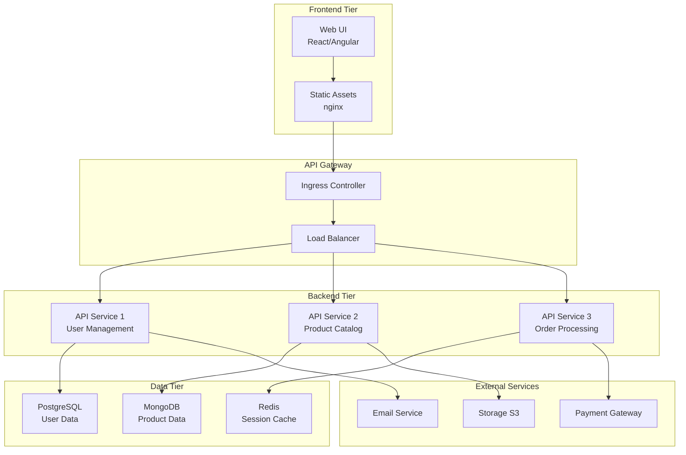
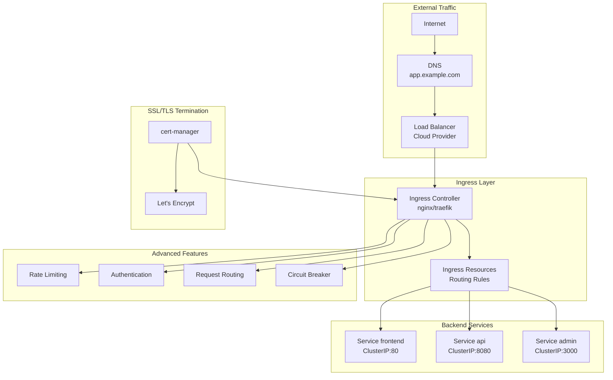
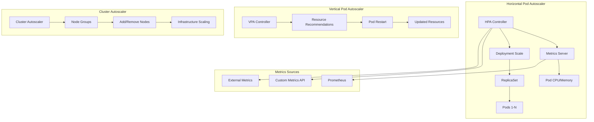
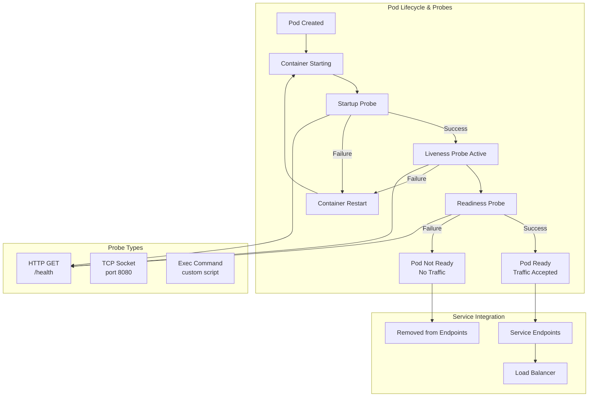
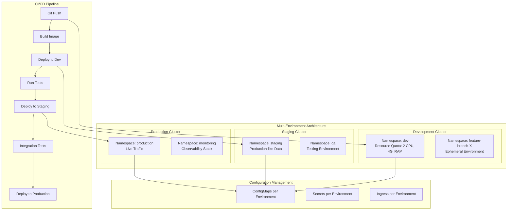

# Simplon Maghreb - Formation DevOps

# Sprint 3 - Semaine 2 : Kubernetes Applications - Déploiement d'applications avancées

## Objectifs pédagogiques

- Maîtriser le déploiement d'applications complètes et complexes
- Comprendre et implémenter le load balancing et l'exposition via Ingress
- Mettre en place l'autoscaling horizontal et vertical
- Configurer health checks et monitoring applicatif
- Gérer des environnements multiples (dev, staging, prod)

## Objectifs techniques

Application Deployment, Ingress Controllers, Load Balancing, HPA/VPA, Health Checks, Readiness/Liveness Probes, Multi-Environment, Namespaces, Resource Quotas, Network Policies

## Table des matières

1. [Application Deployment avancé](#1-application-deployment-avancé)
2. [Load Balancing et Ingress](#2-load-balancing-et-ingress)
3. [Scaling et Autoscaling](#3-scaling-et-autoscaling)
4. [Health et Monitoring](#4-health-et-monitoring)
5. [Multi-Environment Management](#5-multi-environment-management)
6. [Stratégies de déploiement](#6-stratégies-de-déploiement)
7. [Récapitulatif et bonnes pratiques](#7-récapitulatif-et-bonnes-pratiques)
8. [Ressources complémentaires](#8-ressources-complémentaires)

---

## 1. Application Deployment avancé

### 1.1 Architecture d'applications multi-tiers

**Problématique** : Déployer des applications complexes avec frontend, backend, base de données et services externes.

**Composants typiques** :

- **Frontend** : Interface utilisateur (React, Angular, Vue.js)
- **Backend/API** : Logique métier (Node.js, Python, Java)
- **Base de données** : Persistance (PostgreSQL, MySQL, MongoDB)
- **Cache** : Performance (Redis, Memcached)
- **Message Queue** : Communication asynchrone (RabbitMQ, Kafka)



### 1.2 Stratégies de déploiement

#### Rolling Update (Défaut)

- **Principe** : Remplacement progressif des instances
- **Avantage** : Zéro downtime
- **Inconvénient** : Versions multiples temporaires

#### Blue/Green Deployment

- **Principe** : Deux environnements identiques
- **Avantage** : Rollback instantané
- **Inconvénient** : Ressources doublées

#### Canary Deployment

- **Principe** : Déploiement graduel sur sous-ensemble
- **Avantage** : Réduction des risques
- **Inconvénient** : Complexité de routing

### 1.3 Application pratique - Deployment complet

📝 **LAB 1** - Application Deployment complète : `labs/enonces/S3_S2_S1_lab1_application_deployment_complete.md`
🔧 **Correction** : `labs/corrections/S3_S2_S1_lab1_application_deployment_complete_correction.md`

**Énoncé du LAB 1** :

Déployez une application e-commerce complète avec architecture 3-tiers sur Kubernetes.

- **Objectif** : Maîtriser le déploiement d'applications complexes
- **Contexte** : Application e-commerce en production avec haute disponibilité
- **Instructions** :
  1. Déployer frontend React avec nginx
  2. Déployer API backend Node.js avec base de données PostgreSQL
  3. Configurer communication inter-services
  4. Implémenter health checks et resource limits
- **Critères de validation** : Application complète fonctionnelle, communication établie, haute disponibilité
- **Durée estimée** : 45 minutes

---

## 2. Load Balancing et Ingress

### 2.1 Ingress avancé et contrôleurs

**Ingress Controllers populaires** :

- **NGINX Ingress** : Le plus utilisé, riche en fonctionnalités
- **Traefik** : Configuration automatique, service discovery
- **HAProxy** : Performance élevée, load balancing avancé
- **Istio Gateway** : Service mesh intégré
- **AWS ALB** : Intégration native AWS



### 2.2 Configuration Ingress avancée

```yaml
apiVersion: networking.k8s.io/v1
kind: Ingress
metadata:
  name: app-ingress
  annotations:
    kubernetes.io/ingress.class: nginx
    nginx.ingress.kubernetes.io/rewrite-target: /
    nginx.ingress.kubernetes.io/rate-limit: '100'
    nginx.ingress.kubernetes.io/rate-limit-window: '1m'
    cert-manager.io/cluster-issuer: letsencrypt-prod
spec:
  tls:
    - hosts:
        - app.example.com
        - api.example.com
      secretName: app-tls
  rules:
    - host: app.example.com
      http:
        paths:
          - path: /
            pathType: Prefix
            backend:
              service:
                name: frontend-service
                port:
                  number: 80
    - host: api.example.com
      http:
        paths:
          - path: /v1
            pathType: Prefix
            backend:
              service:
                name: api-service
                port:
                  number: 8080
          - path: /health
            pathType: Exact
            backend:
              service:
                name: health-service
                port:
                  number: 9090
```

### 2.3 Application pratique - Load Balancing

📝 **LAB 2** - Load Balancing et Ingress avancé : `labs/enonces/S3_S2_S1_lab2_load_balancing_ingress.md`
🔧 **Correction** : `labs/corrections/S3_S2_S1_lab2_load_balancing_ingress_correction.md`

**Énoncé du LAB 2** :

Configurez un Ingress Controller avec load balancing avancé et SSL/TLS.

- **Objectif** : Maîtriser l'exposition externe et le routage avancé
- **Contexte** : Exposition production avec SSL, rate limiting, et monitoring
- **Instructions** :
  1. Installer NGINX Ingress Controller
  2. Configurer SSL/TLS avec cert-manager
  3. Implémenter rate limiting et authentication
  4. Tester load balancing et failover
- **Critères de validation** : SSL actif, rate limiting fonctionnel, load balancing efficace
- **Durée estimée** : 40 minutes

---

## 3. Scaling et Autoscaling

### 3.1 Types de scaling Kubernetes

#### Horizontal Pod Autoscaler (HPA)

- **Principe** : Augmente/diminue le nombre de pods
- **Métriques** : CPU, mémoire, métriques custom
- **Cas d'usage** : Applications stateless

#### Vertical Pod Autoscaler (VPA)

- **Principe** : Ajuste les resources (CPU/mémoire) des pods
- **Métriques** : Historique d'utilisation
- **Cas d'usage** : Optimisation ressources

#### Cluster Autoscaler

- **Principe** : Ajoute/supprime des nodes
- **Déclencheur** : Pods en pending ou nodes sous-utilisés
- **Cas d'usage** : Adaptation infrastructure



### 3.2 Configuration HPA

```yaml
apiVersion: autoscaling/v2
kind: HorizontalPodAutoscaler
metadata:
  name: web-app-hpa
spec:
  scaleTargetRef:
    apiVersion: apps/v1
    kind: Deployment
    name: web-app
  minReplicas: 2
  maxReplicas: 10
  metrics:
    - type: Resource
      resource:
        name: cpu
        target:
          type: Utilization
          averageUtilization: 70
    - type: Resource
      resource:
        name: memory
        target:
          type: Utilization
          averageUtilization: 80
    - type: Pods
      pods:
        metric:
          name: http_requests_per_second
        target:
          type: AverageValue
          averageValue: '100'
  behavior:
    scaleDown:
      stabilizationWindowSeconds: 300
      policies:
        - type: Percent
          value: 10
          periodSeconds: 60
    scaleUp:
      stabilizationWindowSeconds: 60
      policies:
        - type: Percent
          value: 50
          periodSeconds: 60
```

### 3.3 Application pratique - Autoscaling

📝 **LAB 3** - Scaling et Autoscaling : `labs/enonces/S3_S2_S1_lab3_scaling_autoscaling.md`
🔧 **Correction** : `labs/corrections/S3_S2_S1_lab3_scaling_autoscaling_correction.md`

**Énoncé du LAB 3** :

Configurez l'autoscaling horizontal et vertical pour gérer automatiquement la charge.

- **Objectif** : Maîtriser l'autoscaling automatique des applications
- **Contexte** : Gestion automatique de la charge en production
- **Instructions** :
  1. Configurer metrics-server pour collecte métriques
  2. Créer HPA basé sur CPU et métriques custom
  3. Tester scaling sous charge avec Apache Bench
  4. Configurer VPA pour optimisation ressources
- **Critères de validation** : HPA fonctionnel, scaling automatique, métriques collectées
- **Durée estimée** : 35 minutes

---

## 4. Health et Monitoring

### 4.1 Health Checks Kubernetes

#### Readiness Probes

- **Objectif** : Déterminer si le pod est prêt à recevoir du trafic
- **Impact** : Pod retiré des endpoints de service si échec
- **Cas d'usage** : Temps de démarrage, dépendances externes

#### Liveness Probes

- **Objectif** : Déterminer si le pod fonctionne correctement
- **Impact** : Pod redémarré si échec
- **Cas d'usage** : Deadlocks, corruption mémoire

#### Startup Probes

- **Objectif** : Gérer les applications avec démarrage lent
- **Impact** : Désactive liveness jusqu'au succès
- **Cas d'usage** : Applications legacy, initialisation complexe



### 4.2 Configuration Health Checks

```yaml
apiVersion: apps/v1
kind: Deployment
metadata:
  name: web-app
spec:
  replicas: 3
  selector:
    matchLabels:
      app: web-app
  template:
    metadata:
      labels:
        app: web-app
    spec:
      containers:
        - name: web-app
          image: nginx:1.21
          ports:
            - containerPort: 80
          # Startup probe pour applications lentes
          startupProbe:
            httpGet:
              path: /health
              port: 80
            initialDelaySeconds: 10
            periodSeconds: 5
            timeoutSeconds: 3
            failureThreshold: 30
          # Liveness probe pour redémarrage automatique
          livenessProbe:
            httpGet:
              path: /health
              port: 80
            initialDelaySeconds: 30
            periodSeconds: 10
            timeoutSeconds: 5
            failureThreshold: 3
          # Readiness probe pour trafic
          readinessProbe:
            httpGet:
              path: /ready
              port: 80
            initialDelaySeconds: 5
            periodSeconds: 5
            timeoutSeconds: 3
            failureThreshold: 3
          resources:
            requests:
              memory: '64Mi'
              cpu: '250m'
            limits:
              memory: '128Mi'
              cpu: '500m'
```

### 4.3 Application pratique - Health Monitoring

📝 **LAB 4** - Health et Monitoring : `labs/enonces/S3_S2_S1_lab4_health_monitoring.md`
🔧 **Correction** : `labs/corrections/S3_S2_S1_lab4_health_monitoring_correction.md`

**Énoncé du LAB 4** :

Configurez health checks complets et monitoring applicatif avec Prometheus.

- **Objectif** : Maîtriser la surveillance et diagnostics d'applications
- **Contexte** : Monitoring production avec alerting automatique
- **Instructions** :
  1. Configurer startup, liveness et readiness probes
  2. Déployer Prometheus et Grafana
  3. Créer métriques applicatives custom
  4. Configurer alerting sur seuils critiques
- **Critères de validation** : Health checks fonctionnels, métriques collectées, alertes configurées
- **Durée estimée** : 50 minutes

---

## 5. Multi-Environment Management

### 5.1 Stratégies multi-environnements

#### Namespaces

- **Isolation logique** : Ressources séparées par environnement
- **RBAC** : Contrôle d'accès par namespace
- **Resource Quotas** : Limitation ressources par environnement

#### Clusters séparés

- **Isolation physique** : Infrastructure dédiée
- **Sécurité renforcée** : Réseau isolé
- **Coût élevé** : Infrastructure multiple



### 5.2 Resource Quotas et Limits

```yaml
apiVersion: v1
kind: ResourceQuota
metadata:
  name: dev-quota
  namespace: development
spec:
  hard:
    requests.cpu: '4'
    requests.memory: 8Gi
    limits.cpu: '8'
    limits.memory: 16Gi
    pods: '10'
    persistentvolumeclaims: '4'
    services: '5'
    secrets: '10'
    configmaps: '10'

---
apiVersion: v1
kind: LimitRange
metadata:
  name: dev-limits
  namespace: development
spec:
  limits:
    - default:
        cpu: 500m
        memory: 512Mi
      defaultRequest:
        cpu: 100m
        memory: 128Mi
      type: Container
    - max:
        cpu: '2'
        memory: 4Gi
      min:
        cpu: 50m
        memory: 64Mi
      type: Container
```

### 5.3 Application pratique - Multi-Environment

📝 **LAB 5** - Multi-Environment Management : `labs/enonces/S3_S2_S1_lab5_multi_environment.md`
🔧 **Correction** : `labs/corrections/S3_S2_S1_lab5_multi_environment_correction.md`

**Énoncé du LAB 5** :

Configurez une gestion multi-environnements avec isolation et quotas de ressources.

- **Objectif** : Maîtriser la gestion des environnements multiples
- **Contexte** : Architecture dev/staging/prod avec isolation complète
- **Instructions** :
  1. Créer namespaces pour dev, staging, production
  2. Configurer ResourceQuotas et LimitRanges
  3. Déployer même application avec configurations différentes
  4. Tester isolation et limits de ressources
- **Critères de validation** : Isolation effective, quotas respectés, configurations distinctes
- **Durée estimée** : 40 minutes

---

## 6. Stratégies de déploiement

### 6.1 Blue/Green Deployment

```yaml
# Service pointant vers version "blue"
apiVersion: v1
kind: Service
metadata:
  name: app-service
spec:
  selector:
    app: myapp
    version: blue # Switch vers green pour deployment
  ports:
    - port: 80
      targetPort: 8080

---
# Deployment Blue (version actuelle)
apiVersion: apps/v1
kind: Deployment
metadata:
  name: app-blue
spec:
  replicas: 3
  selector:
    matchLabels:
      app: myapp
      version: blue
  template:
    metadata:
      labels:
        app: myapp
        version: blue
    spec:
      containers:
        - name: app
          image: myapp:v1.0
          ports:
            - containerPort: 8080

---
# Deployment Green (nouvelle version)
apiVersion: apps/v1
kind: Deployment
metadata:
  name: app-green
spec:
  replicas: 3
  selector:
    matchLabels:
      app: myapp
      version: green
  template:
    metadata:
      labels:
        app: myapp
        version: green
    spec:
      containers:
        - name: app
          image: myapp:v2.0
          ports:
            - containerPort: 8080
```

### 6.2 Canary Deployment avec Ingress

```yaml
apiVersion: networking.k8s.io/v1
kind: Ingress
metadata:
  name: canary-ingress
  annotations:
    nginx.ingress.kubernetes.io/canary: 'true'
    nginx.ingress.kubernetes.io/canary-weight: '10' # 10% vers nouvelle version
    nginx.ingress.kubernetes.io/canary-by-header: 'X-Canary'
spec:
  rules:
    - host: app.example.com
      http:
        paths:
          - path: /
            pathType: Prefix
            backend:
              service:
                name: app-canary-service
                port:
                  number: 80
```

### 6.3 Application pratique - Stratégies avancées

📝 **LAB 6** - Stratégies de déploiement avancées : `labs/enonces/S3_S2_S1_lab6_deployment_strategies.md`
🔧 **Correction** : `labs/corrections/S3_S2_S1_lab6_deployment_strategies_correction.md`

📝 **LAB 7** - Blue/Green et Canary : `labs/enonces/S3_S2_S1_lab7_blue_green_canary.md`
🔧 **Correction** : `labs/corrections/S3_S2_S1_lab7_blue_green_canary_correction.md`

📝 **LAB 8** - Network Policies avancées : `labs/enonces/S3_S2_S1_lab8_network_policies.md`
🔧 **Correction** : `labs/corrections/S3_S2_S1_lab8_network_policies_correction.md`

📝 **LAB 9** - StatefulSets et données : `labs/enonces/S3_S2_S1_lab9_statefulsets_data.md`
🔧 **Correction** : `labs/corrections/S3_S2_S1_lab9_statefulsets_data_correction.md`

📝 **LAB 10 Challenge** - Projet application complète : `labs/enonces/S3_S2_S1_lab10_projet_application_complete.md`
🔧 **Correction** : `labs/corrections/S3_S2_S1_lab10_projet_application_complete_correction.md`

---

## 7. Récapitulatif et bonnes pratiques

### 7.1 Concepts maîtrisés

À l'issue de cette semaine, vous maîtrisez :

**Application Deployment** :

- Architecture multi-tiers et microservices
- Stratégies de déploiement (Rolling, Blue/Green, Canary)
- Configuration et gestion des dépendances

**Load Balancing et Ingress** :

- Ingress Controllers et configuration avancée
- SSL/TLS et certificats automatiques
- Rate limiting et sécurité

**Scaling et Performance** :

- HPA, VPA et Cluster Autoscaler
- Métriques custom et optimisation
- Gestion automatique de la charge

**Monitoring et Santé** :

- Health checks complets (startup, liveness, readiness)
- Monitoring avec Prometheus/Grafana
- Alerting et notification

**Multi-Environment** :

- Isolation par namespaces
- Resource quotas et limits
- Configuration par environnement

### 7.2 Prochaines étapes - Semaine 3

**Kubernetes Production** :

- Sécurité et RBAC avancés
- Helm pour package management
- CI/CD intégration complète
- Backup et disaster recovery

---

## 8. Ressources complémentaires

### 8.1 Documentation et guides

- **Kubernetes Application Deployment** : Best practices officielles
- **Ingress Controllers Comparison** : Choix du bon contrôleur
- **Autoscaling Guide** : Configuration optimale HPA/VPA
- **Multi-tenancy** : Isolation et sécurité

### 8.2 Outils avancés

- **ArgoCD** : GitOps et déploiement continu
- **Flux** : Synchronisation Git-Cluster
- **Kustomize** : Gestion configuration sans templates
- **Helm** : Package manager Kubernetes

### 8.3 Monitoring et observabilité

- **Prometheus Operator** : Déploiement simplifié
- **Jaeger** : Distributed tracing
- **Elastic Stack** : Logging centralisé
- **Service Mesh** : Istio pour observabilité

---

_Formateur : Hassan ESSADIK | Sprint 3 - Semaine 2 - Kubernetes Applications_
