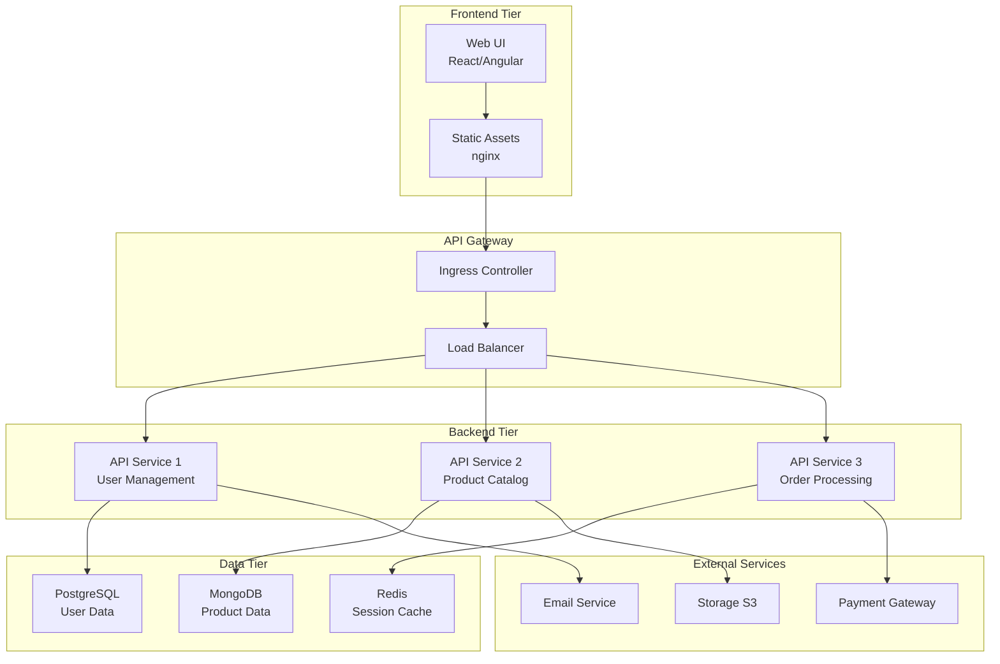
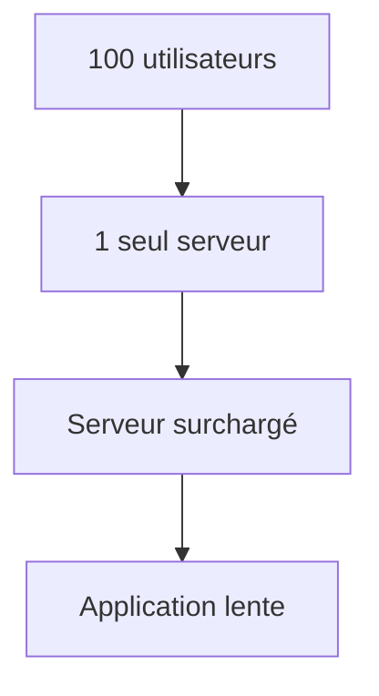
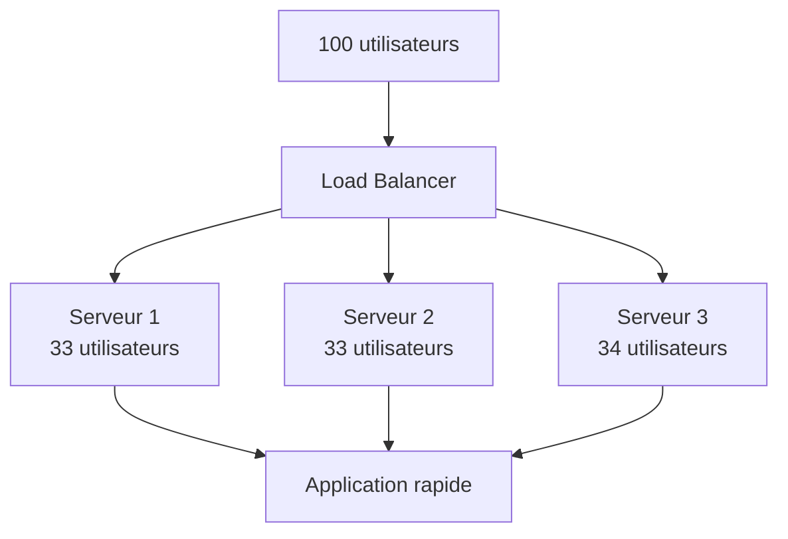
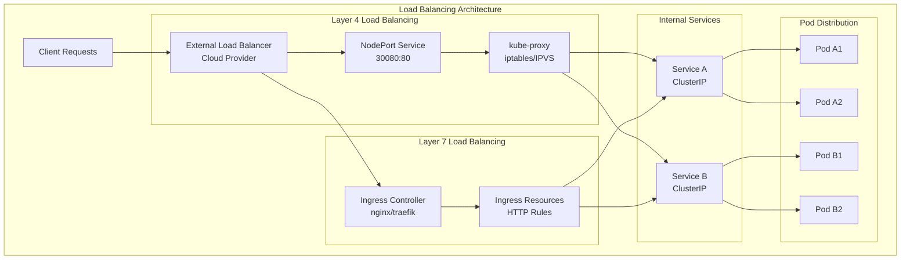
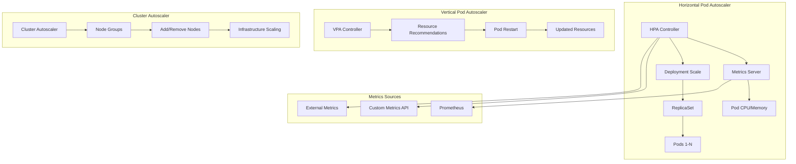
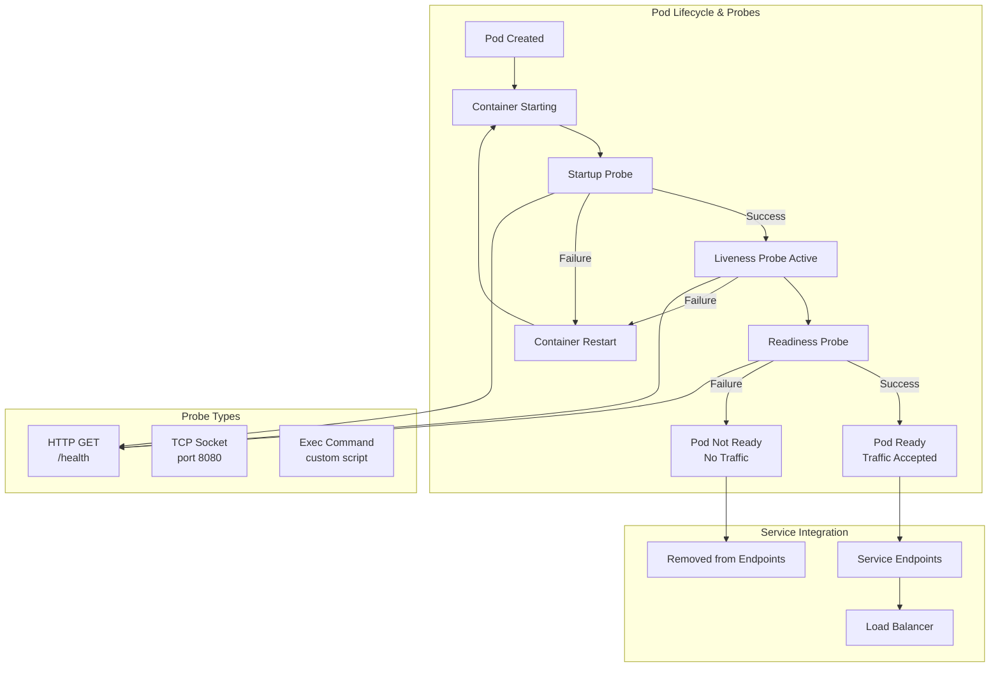
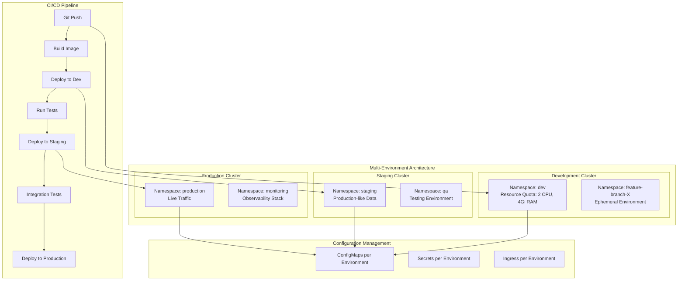

# Simplon Maghreb - Formation DevOps

# Sprint 3 - Semaine 2 : Kubernetes Applications - Déploiement d'applications avancées

## Objectifs pédagogiques

- Maîtriser le déploiement d'applications complètes et complexes
- Comprendre et implémenter le load balancing et l'exposition via Ingress
- Mettre en place l'autoscaling horizontal et vertical
- Configurer health checks et monitoring applicatif
- Gérer des environnements multiples (dev, staging, prod)

## Objectifs techniques

Application Deployment, Ingress Controllers, Load Balancing, HPA/VPA, Health Checks, Readiness/Liveness Probes, Multi-Environment, Namespaces, Resource Quotas, Network Policies

## Table des matières

1. [Application Deployment avancé](#1-application-deployment-avancé)
2. [Load Balancing et Ingress](#2-load-balancing-et-ingress)
3. [Scaling et Autoscaling](#3-scaling-et-autoscaling)
4. [Health et Monitoring](#4-health-et-monitoring)
5. [Multi-Environment Management](#5-multi-environment-management)
6. [Stratégies de déploiement](#6-stratégies-de-déploiement)
7. [Récapitulatif et bonnes pratiques](#7-récapitulatif-et-bonnes-pratiques)
8. [Ressources complémentaires](#8-ressources-complémentaires)

---

## 1. Application Deployment avancé

### 1.1 Architecture d'applications multi-tiers

**Problématique** : Déployer des applications complexes avec frontend, backend, base de données et services externes.

**Composants typiques** :

- **Frontend** : Interface utilisateur (React, Angular, Vue.js)
- **Backend/API** : Logique métier (Node.js, Python, Java)
- **Base de données** : Persistance (PostgreSQL, MySQL, MongoDB)
- **Cache** : Performance (Redis, Memcached)
- **Message Queue** : Communication asynchrone (RabbitMQ, Kafka)



### 1.2 Stratégies de déploiement

#### Rolling Update (Défaut)

- **Principe** : Remplacement progressif des instances
- **Avantage** : Zéro downtime
- **Inconvénient** : Versions multiples temporaires

#### Blue/Green Deployment

- **Principe** : Deux environnements identiques
- **Avantage** : Rollback instantané
- **Inconvénient** : Ressources doublées

#### Canary Deployment

- **Principe** : Déploiement graduel sur sous-ensemble
- **Avantage** : Réduction des risques
- **Inconvénient** : Complexité de routing

### 1.3 Application pratique - Deployment complet

📝 **LAB 1** - Application Deployment complète : `labs/enonces/S3_S2_S1_lab1_application_deployment_complete.md`
**Correction** : `labs/corrections/S3_S2_S1_lab1_application_deployment_complete_correction.md`

**Énoncé du LAB 1** :

Déployez une application e-commerce complète avec architecture 3-tiers sur Kubernetes.

- **Objectif** : Maîtriser le déploiement d'applications complexes
- **Contexte** : Application e-commerce en production avec haute disponibilité
- **Instructions** :
  1. Déployer frontend React avec nginx
  2. Déployer API backend Node.js avec base de données PostgreSQL
  3. Configurer communication inter-services
  4. Implémenter health checks et resource limits
- **Critères de validation** : Application complète fonctionnelle, communication établie, haute disponibilité
- **Durée estimée** : 45 minutes

---

## 2. Load Balancing et Ingress

### 2.0 Introduction pour débutants

#### Qu'est-ce que le Load Balancing ?

**Analogie du supermarché** :
Imaginez un supermarché le samedi après-midi :

- **Problème** : Une seule caisse ouverte = file d'attente interminable
- **Solution** : Ouvrir plusieurs caisses et répartir les clients
- **Résultat** : Tout le monde est servi plus rapidement

**En informatique** :

- **Problème** : Un seul serveur web = lenteur quand beaucoup d'utilisateurs
- **Solution** : Plusieurs serveurs identiques + répartition intelligente du trafic
- **Résultat** : Application rapide et fiable

#### Qu'est-ce qu'un Ingress ?

**Analogie de la réception d'hôtel** :

- **Clients** = Utilisateurs web
- **Réceptionniste** = Ingress Controller
- **Chambres** = Services Kubernetes
- Le réceptionniste dirige chaque client vers la bonne chambre selon sa réservation

**Concrètement** :

```
Utilisateur tape : https://monapp.com/api/users
                      ↓
                 Ingress Controller
                      ↓
              Service "api-users"
                      ↓
                 Pods de l'API
```

#### Glossaire des termes essentiels

| Terme             | Définition simple              | Exemple                              |
| ----------------- | ------------------------------ | ------------------------------------ |
| **Load Balancer** | Répartiteur de trafic          | Comme un agent de circulation        |
| **Ingress**       | Point d'entrée dans le cluster | Porte d'entrée d'un bâtiment         |
| **SSL/TLS**       | Sécurisation HTTPS             | Cadenas dans votre navigateur        |
| **Backend**       | Service de destination         | Restaurant dans un centre commercial |
| **Route**         | Chemin vers un service         | Plan pour aller d'un point A à B     |

---

### 2.1 Niveau Débutant : Bases du Load Balancing

#### 2.1.1 Principe de base

**Situation avant Load Balancing** :



**Situation avec Load Balancing** :



#### 2.1.2 Votre premier Service Load Balancer

**Étape 1** : Créer une application simple

```yaml
# deployment-simple.yaml
apiVersion: apps/v1
kind: Deployment
metadata:
  name: mon-app
spec:
  replicas: 3 # 3 copies de l'application
  selector:
    matchLabels:
      app: mon-app
  template:
    metadata:
      labels:
        app: mon-app
    spec:
      containers:
        - name: web
          image: nginx
          ports:
            - containerPort: 80
```

**Étape 2** : Créer un Service Load Balancer

```yaml
# service-loadbalancer.yaml
apiVersion: v1
kind: Service
metadata:
  name: mon-app-service
spec:
  type: LoadBalancer # Type qui expose vers l'extérieur
  selector:
    app: mon-app # Connecte aux pods avec ce label
  ports:
    - port: 80 # Port exposé
      targetPort: 80 # Port dans le pod
```

**Test pratique** :

```bash
# Déployer l'application
kubectl apply -f deployment-simple.yaml
kubectl apply -f service-loadbalancer.yaml

# Vérifier que ça marche
kubectl get services
kubectl get pods

# Tester l'accès (récupérer l'IP externe)
curl http://EXTERNAL-IP
```

#### 2.1.3 Introduction à Ingress

**Problème avec LoadBalancer** :

- Coûteux : 1 LoadBalancer = 1 IP publique payante
- Limité : Pas de routage intelligent

**Solution Ingress** :

- 1 seule IP publique pour plusieurs applications
- Routage par nom de domaine

**Premier Ingress simple** :

```yaml
# ingress-simple.yaml
apiVersion: networking.k8s.io/v1
kind: Ingress
metadata:
  name: mon-premier-ingress
  annotations:
    kubernetes.io/ingress.class: nginx
spec:
  rules:
    - host: monapp.exemple.com
      http:
        paths:
          - path: /
            pathType: Prefix
            backend:
              service:
                name: mon-app-service
                port:
                  number: 80
```

---

### 2.2 Niveau Intermédiaire : Ingress avancé

#### 2.2.1 Routage par chemins multiples

**Cas d'usage** : Une application avec frontend et API

```yaml
apiVersion: networking.k8s.io/v1
kind: Ingress
metadata:
  name: app-complete-ingress
  annotations:
    kubernetes.io/ingress.class: nginx
    nginx.ingress.kubernetes.io/rewrite-target: /
spec:
  rules:
    - host: monapp.exemple.com
      http:
        paths:
          # Frontend React
          - path: /
            pathType: Prefix
            backend:
              service:
                name: frontend-service
                port:
                  number: 80
          # API Backend
          - path: /api
            pathType: Prefix
            backend:
              service:
                name: api-service
                port:
                  number: 8080
          # Administration
          - path: /admin
            pathType: Prefix
            backend:
              service:
                name: admin-service
                port:
                  number: 3000
```

#### 2.2.2 SSL/TLS automatique avec cert-manager

**Pourquoi SSL/TLS ?**

- **Sécurité** : Chiffrement des données
- **Confiance** : Cadenas vert dans le navigateur
- **SEO** : Google favorise les sites HTTPS

**Installation cert-manager** :

```bash
# Installer cert-manager
kubectl apply -f https://github.com/cert-manager/cert-manager/releases/download/v1.11.0/cert-manager.yaml

# Créer un émetteur de certificats
kubectl apply -f - <<EOF
apiVersion: cert-manager.io/v1
kind: ClusterIssuer
metadata:
  name: letsencrypt-prod
spec:
  acme:
    server: https://acme-v02.api.letsencrypt.org/directory
    email: votre-email@exemple.com
    privateKeySecretRef:
      name: letsencrypt-prod
    solvers:
    - http01:
        ingress:
          class: nginx
EOF
```

**Ingress avec SSL automatique** :

```yaml
apiVersion: networking.k8s.io/v1
kind: Ingress
metadata:
  name: ingress-ssl
  annotations:
    kubernetes.io/ingress.class: nginx
    cert-manager.io/cluster-issuer: letsencrypt-prod
    nginx.ingress.kubernetes.io/ssl-redirect: 'true'
spec:
  tls:
    - hosts:
        - monapp.exemple.com
      secretName: monapp-tls # Certificat auto-généré
  rules:
    - host: monapp.exemple.com
      http:
        paths:
          - path: /
            pathType: Prefix
            backend:
              service:
                name: mon-service
                port:
                  number: 80
```

#### 2.2.3 Load Balancing intelligent

**Algorithmes de répartition** :

**Round Robin** (par défaut) :

```yaml
annotations:
  nginx.ingress.kubernetes.io/load-balance: 'round_robin'
```

Utilisateur 1 → Serveur 1, Utilisateur 2 → Serveur 2, Utilisateur 3 → Serveur 3, etc.

**Least Connections** :

```yaml
annotations:
  nginx.ingress.kubernetes.io/load-balance: 'least_conn'
```

Dirige vers le serveur qui a le moins de connexions actives.

**IP Hash** :

```yaml
annotations:
  nginx.ingress.kubernetes.io/upstream-hash-by: '$remote_addr'
```

Même utilisateur → toujours même serveur (session persistante).

#### 2.2.4 Rate Limiting (limitation de débit)

**Protéger contre les attaques** :

```yaml
apiVersion: networking.k8s.io/v1
kind: Ingress
metadata:
  name: ingress-protege
  annotations:
    kubernetes.io/ingress.class: nginx
    # Limite : 100 requêtes par minute par IP
    nginx.ingress.kubernetes.io/rate-limit: '100'
    nginx.ingress.kubernetes.io/rate-limit-window: '1m'
    # Limite connexions simultanées
    nginx.ingress.kubernetes.io/rate-limit-connections: '10'
spec:
  rules:
    - host: api.exemple.com
      http:
        paths:
          - path: /
            pathType: Prefix
            backend:
              service:
                name: api-service
                port:
                  number: 8080
```

**Test du rate limiting** :

```bash
# Test normal
curl https://api.exemple.com/users

# Test de surcharge (doit être bloqué après 100 requêtes)
for i in {1..150}; do curl https://api.exemple.com/users; done
```

---

### 2.3 Niveau Avancé : Configuration Production

#### 2.3.1 Ingress Controllers - Comparaison

| Controller  | Avantages              | Inconvénients            | Cas d'usage           |
| ----------- | ---------------------- | ------------------------ | --------------------- |
| **NGINX**   | Mature, stable, riche  | Configuration complexe   | Production générale   |
| **Traefik** | Auto-discovery, UI     | Moins de fonctionnalités | Microservices, Docker |
| **HAProxy** | Performance élevée     | Configuration manuelle   | Haute charge          |
| **AWS ALB** | Intégration AWS native | Vendor lock-in           | Infrastructure AWS    |

#### 2.3.2 NGINX Ingress - Configuration avancée

```yaml
apiVersion: networking.k8s.io/v1
kind: Ingress
metadata:
  name: nginx-production-ingress
  annotations:
    kubernetes.io/ingress.class: nginx

    # SSL/TLS avancé
    nginx.ingress.kubernetes.io/ssl-protocols: 'TLSv1.2 TLSv1.3'
    nginx.ingress.kubernetes.io/ssl-ciphers: 'ECDHE-RSA-AES128-GCM-SHA256,ECDHE-RSA-AES256-GCM-SHA384'

    # Sécurité
    nginx.ingress.kubernetes.io/enable-cors: 'true'
    nginx.ingress.kubernetes.io/cors-allow-origin: 'https://monapp.com'
    nginx.ingress.kubernetes.io/cors-allow-methods: 'GET, POST, PUT, DELETE'

    # Performance
    nginx.ingress.kubernetes.io/proxy-buffer-size: '8k'
    nginx.ingress.kubernetes.io/proxy-buffers: '8 8k'

    # Monitoring
    nginx.ingress.kubernetes.io/enable-access-log: 'true'

    # Headers de sécurité
    nginx.ingress.kubernetes.io/configuration-snippet: |
      add_header X-Frame-Options "SAMEORIGIN" always;
      add_header X-Content-Type-Options "nosniff" always;
      add_header X-XSS-Protection "1; mode=block" always;
      add_header Strict-Transport-Security "max-age=31536000; includeSubDomains" always;

    # Rate limiting avancé
    nginx.ingress.kubernetes.io/rate-limit: '1000'
    nginx.ingress.kubernetes.io/rate-limit-window: '1m'
    nginx.ingress.kubernetes.io/rate-limit-key: '${binary_remote_addr}'

spec:
  tls:
    - hosts:
        - app.exemple.com
        - api.exemple.com
      secretName: app-tls-secret
  rules:
    - host: app.exemple.com
      http:
        paths:
          - path: /
            pathType: Prefix
            backend:
              service:
                name: frontend-service
                port:
                  number: 80
    - host: api.exemple.com
      http:
        paths:
          - path: /v1
            pathType: Prefix
            backend:
              service:
                name: api-v1-service
                port:
                  number: 8080
```

#### 2.3.3 Canary Deployments (déploiements progressifs)

**Concept** : Tester une nouvelle version sur un petit pourcentage d'utilisateurs

```yaml
# Ingress principal (version stable - 90% du trafic)
apiVersion: networking.k8s.io/v1
kind: Ingress
metadata:
  name: production-ingress
spec:
  rules:
    - host: app.exemple.com
      http:
        paths:
          - path: /
            pathType: Prefix
            backend:
              service:
                name: app-v1-service
                port:
                  number: 80

---
# Ingress canary (nouvelle version - 10% du trafic)
apiVersion: networking.k8s.io/v1
kind: Ingress
metadata:
  name: canary-ingress
  annotations:
    kubernetes.io/ingress.class: nginx
    nginx.ingress.kubernetes.io/canary: 'true'
    nginx.ingress.kubernetes.io/canary-weight: '10'
    # Ou basé sur un header spécifique
    nginx.ingress.kubernetes.io/canary-by-header: 'X-Canary'
    nginx.ingress.kubernetes.io/canary-by-header-value: 'always'
spec:
  rules:
    - host: app.exemple.com
      http:
        paths:
          - path: /
            pathType: Prefix
            backend:
              service:
                name: app-v2-service # Nouvelle version
                port:
                  number: 80
```

**Test Canary** :

```bash
# Traffic normal (90% vers v1)
curl https://app.exemple.com

# Forcer la nouvelle version
curl -H "X-Canary: always" https://app.exemple.com
```

### 2.4 Troubleshooting - Guide de dépannage

#### 2.4.1 Problèmes courants et solutions

| Symptôme                    | Cause probable          | Solution                                            |
| --------------------------- | ----------------------- | --------------------------------------------------- |
| **404 Not Found**           | Mauvais path ou service | Vérifier `kubectl get ingress` et `kubectl get svc` |
| **502 Bad Gateway**         | Service inaccessible    | Vérifier `kubectl get pods` et les health checks    |
| **503 Service Unavailable** | Pas de pods prêts       | Vérifier les readiness probes                       |
| **SSL Certificate Error**   | Problème cert-manager   | Vérifier `kubectl get certificates`                 |
| **Connexion timeout**       | Problème réseau         | Vérifier les NetworkPolicies                        |

#### 2.4.2 Commandes de diagnostic

```bash
# 1. Vérifier l'état général
kubectl get ingress --all-namespaces
kubectl get services --all-namespaces
kubectl get pods --all-namespaces

# 2. Debug un Ingress spécifique
kubectl describe ingress mon-ingress
kubectl get events --field-selector involvedObject.name=mon-ingress

# 3. Vérifier l'Ingress Controller
kubectl logs -n ingress-nginx deployment/ingress-nginx-controller

# 4. Tester la connectivité
kubectl run test-pod --image=busybox -it --rm -- sh
# Dans le pod : wget -qO- http://mon-service.default.svc.cluster.local

# 5. Vérifier les certificats SSL
kubectl get certificates
kubectl describe certificate mon-cert
```

#### 2.4.3 Tests de validation

```bash
# Test 1 : Résolution DNS
nslookup app.exemple.com

# Test 2 : Connectivité HTTP
curl -v http://app.exemple.com

# Test 3 : SSL/TLS
curl -v https://app.exemple.com
openssl s_client -connect app.exemple.com:443

# Test 4 : Headers de sécurité
curl -I https://app.exemple.com

# Test 5 : Load balancing
for i in {1..10}; do curl https://app.exemple.com; done
```

### 2.5 Bonnes pratiques et recommandations

#### 2.5.1 Sécurité

- **Toujours utiliser HTTPS** en production
- **Configurer rate limiting** pour éviter les attaques
- **Ajouter headers de sécurité** (HSTS, X-Frame-Options, etc.)
- **Utiliser des domaines spécifiques** plutôt que des wildcards

#### 2.5.2 Performance

- **Optimiser les buffer sizes** selon votre trafic
- **Utiliser la compression** pour réduire la bande passante
- **Configurer le caching** pour les assets statiques
- **Monitorer les métriques** régulièrement

#### 2.5.3 Haute disponibilité

- **Déployer plusieurs replicas** de l'Ingress Controller
- **Utiliser anti-affinity** pour répartir sur différents nodes
- **Configurer health checks** appropriés
- **Avoir un plan de disaster recovery**

### 2.6 Application pratique - Labs progressifs

📝 **LAB 2A** - Premier Ingress (Débutant) : `labs/enonces/S3_S2_lab2a_premier_ingress.md`
**Correction** : `labs/corrections/S3_S2_lab2a_premier_ingress_correction.md`

**Objectif** : Créer votre premier Ingress avec SSL automatique

- Déployer une application simple
- Configurer un Ingress basique
- Ajouter SSL avec cert-manager
- Tester l'accès HTTPS

📝 **LAB 2B** - Load Balancing avancé (Intermédiaire) : `labs/enonces/S3_S2_lab2b_load_balancing_avance.md`
**Correction** : `labs/corrections/S3_S2_lab2b_load_balancing_avance_correction.md`

**Objectif** : Configurer du load balancing intelligent et du rate limiting

- Déployer une application multi-services
- Configurer algorithmes de load balancing
- Implémenter rate limiting
- Tester la résilience

📝 **LAB 2C** - Configuration Production (Avancé) : `labs/enonces/S3_S2_lab2c_production_config.md`
**Correction** : `labs/corrections/S3_S2_lab2c_production_config_correction.md`

**Objectif** : Configuration complète pour la production avec monitoring

- Configuration sécurisée avancée
- Canary deployments
- Monitoring avec Prometheus/Grafana
- Tests de charge et validation

**Durée totale estimée** : 90 minutes (30min par lab)

---

**Load Balancing Layer 4 (Transport)** :

- **Principe** : Routage basé sur IP et port
- **Avantages** : Performance élevée, faible latence
- **Inconvénients** : Pas de connaissance du contenu
- **Cas d'usage** : TCP/UDP, protocoles non-HTTP

**Load Balancing Layer 7 (Application)** :

- **Principe** : Routage basé sur contenu HTTP
- **Avantages** : Routage intelligent, SSL termination
- **Inconvénients** : Plus de ressources consommées
- **Cas d'usage** : Applications web, APIs REST



#### 2.1.2 Algorithmes de Load Balancing

**Round Robin** :

- **Principe** : Distribution séquentielle
- **Avantage** : Simple, équitable
- **Inconvénient** : Ne considère pas la charge

**Weighted Round Robin** :

- **Principe** : Poids différents par backend
- **Avantage** : Adaptation aux capacités
- **Configuration** : Annotations ou labels

**Least Connections** :

- **Principe** : Vers le backend avec moins de connexions
- **Avantage** : Optimal pour sessions longues
- **Inconvénient** : Suivi d'état requis

**IP Hash** :

- **Principe** : Hash de l'IP client
- **Avantage** : Affinité de session
- **Inconvénient** : Distribution inégale possible

### 2.2 Ingress Controllers - Comparaison approfondie

#### 2.2.1 NGINX Ingress Controller

**Avantages** :

- Maturité et stabilité éprouvées
- Riche écosystème d'annotations
- Performance élevée et optimisations
- Support complet des standards HTTP

**Configuration avancée** :

```yaml
apiVersion: networking.k8s.io/v1
kind: Ingress
metadata:
  name: nginx-advanced-ingress
  annotations:
    # Load Balancing
    nginx.ingress.kubernetes.io/load-balance: 'ewma'
    nginx.ingress.kubernetes.io/upstream-hash-by: '$request_uri'

    # Security
    nginx.ingress.kubernetes.io/auth-basic: 'Authentication Required'
    nginx.ingress.kubernetes.io/auth-basic-realm: 'Please enter your credentials'
    nginx.ingress.kubernetes.io/auth-secret: 'basic-auth-secret'

    # Rate Limiting
    nginx.ingress.kubernetes.io/rate-limit: '100'
    nginx.ingress.kubernetes.io/rate-limit-window: '1m'
    nginx.ingress.kubernetes.io/rate-limit-connections: '10'

    # SSL/TLS
    nginx.ingress.kubernetes.io/ssl-redirect: 'true'
    nginx.ingress.kubernetes.io/force-ssl-redirect: 'true'
    cert-manager.io/cluster-issuer: 'letsencrypt-prod'

    # Caching
    nginx.ingress.kubernetes.io/proxy-cache-valid: '200 302 1h'
    nginx.ingress.kubernetes.io/proxy-cache-key: '$scheme$proxy_host$request_uri'

    # Circuit Breaker
    nginx.ingress.kubernetes.io/proxy-next-upstream: 'error timeout http_502 http_503 http_504'
    nginx.ingress.kubernetes.io/proxy-next-upstream-tries: '3'

    # CORS
    nginx.ingress.kubernetes.io/enable-cors: 'true'
    nginx.ingress.kubernetes.io/cors-allow-origin: 'https://app.example.com'
    nginx.ingress.kubernetes.io/cors-allow-methods: 'GET, POST, PUT, DELETE, OPTIONS'

    # Custom Headers
    nginx.ingress.kubernetes.io/configuration-snippet: |
      add_header X-Frame-Options "SAMEORIGIN" always;
      add_header X-Content-Type-Options "nosniff" always;
      add_header X-XSS-Protection "1; mode=block" always;
      add_header Strict-Transport-Security "max-age=31536000; includeSubDomains" always;
spec:
  tls:
    - hosts:
        - app.example.com
        - api.example.com
      secretName: app-tls-secret
  rules:
    - host: app.example.com
      http:
        paths:
          - path: /
            pathType: Prefix
            backend:
              service:
                name: frontend-service
                port:
                  number: 80
          - path: /api
            pathType: Prefix
            backend:
              service:
                name: api-service
                port:
                  number: 8080
    - host: api.example.com
      http:
        paths:
          - path: /v1
            pathType: Prefix
            backend:
              service:
                name: api-v1-service
                port:
                  number: 8080
          - path: /v2
            pathType: Prefix
            backend:
              service:
                name: api-v2-service
                port:
                  number: 8080
```

#### 2.2.2 Traefik Ingress Controller

**Avantages** :

- Configuration automatique (service discovery)
- Interface web intuitive
- Support natif des microservices
- Intégration excellente avec Docker/Kubernetes

**Configuration avec CRDs** :

```yaml
apiVersion: traefik.containo.us/v1alpha1
kind: IngressRoute
metadata:
  name: traefik-advanced-route
spec:
  entryPoints:
    - websecure
  routes:
    - match: Host(`app.example.com`) && PathPrefix(`/api`)
      kind: Rule
      services:
        - name: api-service
          port: 8080
          weight: 80
          strategy: RoundRobin
        - name: api-canary-service
          port: 8080
          weight: 20
      middlewares:
        - name: rate-limit
        - name: auth
        - name: retry
    - match: Host(`app.example.com`)
      kind: Rule
      services:
        - name: frontend-service
          port: 80
  tls:
    certResolver: letsencrypt

---
apiVersion: traefik.containo.us/v1alpha1
kind: Middleware
metadata:
  name: rate-limit
spec:
  rateLimit:
    burst: 100
    average: 50
    period: 1m

---
apiVersion: traefik.containo.us/v1alpha1
kind: Middleware
metadata:
  name: auth
spec:
  basicAuth:
    secret: auth-secret

---
apiVersion: traefik.containo.us/v1alpha1
kind: Middleware
metadata:
  name: retry
spec:
  retry:
    attempts: 3
    initialInterval: 100ms
```

#### 2.2.3 HAProxy Ingress Controller

**Avantages** :

- Performance exceptionnelle
- Algorithmes de load balancing avancés
- Monitoring et statistiques détaillées
- Haute disponibilité native

**Configuration** :

```yaml
apiVersion: networking.k8s.io/v1
kind: Ingress
metadata:
  name: haproxy-ingress
  annotations:
    ingress.class: haproxy
    haproxy.org/load-balance: 'leastconn'
    haproxy.org/check: 'true'
    haproxy.org/check-interval: '5s'
    haproxy.org/server-slots: '10'
    haproxy.org/timeout-connect: '5s'
    haproxy.org/timeout-server: '30s'
    haproxy.org/rate-limit-requests: '100'
    haproxy.org/rate-limit-period: '1m'
spec:
  rules:
    - host: app.example.com
      http:
        paths:
          - path: /
            pathType: Prefix
            backend:
              service:
                name: app-service
                port:
                  number: 80
```

### 2.3 SSL/TLS et Certificats

#### 2.3.1 cert-manager pour HTTPS automatique

**Installation cert-manager** :

```yaml
# Installation via Helm
helm repo add jetstack https://charts.jetstack.io
helm repo update
helm install cert-manager jetstack/cert-manager \
  --namespace cert-manager \
  --create-namespace \
  --version v1.11.0 \
  --set installCRDs=true

# ClusterIssuer pour Let's Encrypt
apiVersion: cert-manager.io/v1
kind: ClusterIssuer
metadata:
  name: letsencrypt-prod
spec:
  acme:
    server: https://acme-v02.api.letsencrypt.org/directory
    email: admin@example.com
    privateKeySecretRef:
      name: letsencrypt-prod
    solvers:
      - http01:
          ingress:
            class: nginx
      - dns01:
          cloudflare:
            email: admin@example.com
            apiKeySecretRef:
              name: cloudflare-api-key
              key: api-key
        selector:
          dnsZones:
            - "example.com"
```

#### 2.3.2 Configuration SSL avancée

```yaml
apiVersion: networking.k8s.io/v1
kind: Ingress
metadata:
  name: ssl-ingress
  annotations:
    kubernetes.io/ingress.class: nginx
    cert-manager.io/cluster-issuer: letsencrypt-prod
    # SSL Configuration
    nginx.ingress.kubernetes.io/ssl-protocols: 'TLSv1.2 TLSv1.3'
    nginx.ingress.kubernetes.io/ssl-ciphers: 'ECDHE-RSA-AES128-GCM-SHA256,ECDHE-RSA-AES256-GCM-SHA384'
    nginx.ingress.kubernetes.io/ssl-prefer-server-ciphers: 'true'
    # HSTS
    nginx.ingress.kubernetes.io/custom-http-errors: '404,503'
    nginx.ingress.kubernetes.io/configuration-snippet: |
      add_header Strict-Transport-Security "max-age=31536000; includeSubDomains; preload" always;
spec:
  tls:
    - hosts:
        - app.example.com
        - api.example.com
      secretName: app-tls-secret
  rules:
    - host: app.example.com
      http:
        paths:
          - path: /
            pathType: Prefix
            backend:
              service:
                name: app-service
                port:
                  number: 80
```

### 2.4 Stratégies de routage avancées

#### 2.4.1 Canary Deployments avec Ingress

```yaml
# Production traffic (90%)
apiVersion: networking.k8s.io/v1
kind: Ingress
metadata:
  name: production-ingress
  annotations:
    kubernetes.io/ingress.class: nginx
spec:
  rules:
    - host: app.example.com
      http:
        paths:
          - path: /
            pathType: Prefix
            backend:
              service:
                name: app-production
                port:
                  number: 80

---
# Canary traffic (10%)
apiVersion: networking.k8s.io/v1
kind: Ingress
metadata:
  name: canary-ingress
  annotations:
    kubernetes.io/ingress.class: nginx
    nginx.ingress.kubernetes.io/canary: 'true'
    nginx.ingress.kubernetes.io/canary-weight: '10'
    nginx.ingress.kubernetes.io/canary-by-header: 'X-Canary'
    nginx.ingress.kubernetes.io/canary-by-header-value: 'always'
    nginx.ingress.kubernetes.io/canary-by-cookie: 'canary'
spec:
  rules:
    - host: app.example.com
      http:
        paths:
          - path: /
            pathType: Prefix
            backend:
              service:
                name: app-canary
                port:
                  number: 80
```

#### 2.4.2 A/B Testing avec Headers

```yaml
apiVersion: networking.k8s.io/v1
kind: Ingress
metadata:
  name: ab-testing-ingress
  annotations:
    kubernetes.io/ingress.class: nginx
    nginx.ingress.kubernetes.io/server-snippet: |
      set $ab_test "version_a";
      if ($http_user_agent ~* "Mobile") {
        set $ab_test "version_b";
      }
      if ($cookie_ab_test) {
        set $ab_test $cookie_ab_test;
      }
    nginx.ingress.kubernetes.io/configuration-snippet: |
      proxy_set_header X-AB-Test $ab_test;
      add_header Set-Cookie "ab_test=$ab_test; Path=/; Max-Age=86400" always;
spec:
  rules:
    - host: app.example.com
      http:
        paths:
          - path: /
            pathType: Prefix
            backend:
              service:
                name: app-service
                port:
                  number: 80
```

### 2.5 Monitoring et Observabilité

#### 2.5.1 Métriques Ingress

```yaml
apiVersion: v1
kind: Service
metadata:
  name: nginx-ingress-controller-metrics
  labels:
    app.kubernetes.io/name: ingress-nginx
spec:
  selector:
    app.kubernetes.io/name: ingress-nginx
  ports:
    - name: prometheus
      port: 10254
      targetPort: 10254

---
apiVersion: monitoring.coreos.com/v1
kind: ServiceMonitor
metadata:
  name: nginx-ingress-controller
spec:
  selector:
    matchLabels:
      app.kubernetes.io/name: ingress-nginx
  endpoints:
    - port: prometheus
      interval: 30s
      path: /metrics
```

#### 2.5.2 Dashboard Grafana pour Ingress

```json
{
  "dashboard": {
    "title": "NGINX Ingress Controller",
    "panels": [
      {
        "title": "Request Rate",
        "targets": [
          {
            "expr": "sum(rate(nginx_ingress_controller_requests_total[5m])) by (ingress)"
          }
        ]
      },
      {
        "title": "Response Time",
        "targets": [
          {
            "expr": "histogram_quantile(0.95, sum(rate(nginx_ingress_controller_request_duration_seconds_bucket[5m])) by (le, ingress))"
          }
        ]
      },
      {
        "title": "Error Rate",
        "targets": [
          {
            "expr": "sum(rate(nginx_ingress_controller_requests_total{status=~\"5..\"}[5m])) by (ingress) / sum(rate(nginx_ingress_controller_requests_total[5m])) by (ingress)"
          }
        ]
      }
    ]
  }
}
```

### 2.6 Sécurité avancée

#### 2.6.1 WAF (Web Application Firewall)

```yaml
apiVersion: networking.k8s.io/v1
kind: Ingress
metadata:
  name: waf-protected-ingress
  annotations:
    kubernetes.io/ingress.class: nginx
    # ModSecurity WAF
    nginx.ingress.kubernetes.io/enable-modsecurity: 'true'
    nginx.ingress.kubernetes.io/enable-owasp-core-rules: 'true'
    nginx.ingress.kubernetes.io/modsecurity-transaction-id: '$request_id'
    nginx.ingress.kubernetes.io/modsecurity-snippet: |
      SecRuleEngine On
      SecRequestBodyAccess On
      SecRule REQUEST_HEADERS:Content-Type "text/xml" \
        "id:'200001',phase:1,t:none,t:lowercase,pass,nolog,ctl:requestBodyProcessor=XML"
      SecRule REQUEST_HEADERS:Content-Type "application/json" \
        "id:'200002',phase:1,t:none,t:lowercase,pass,nolog,ctl:requestBodyProcessor=JSON"

    # Rate Limiting per IP
    nginx.ingress.kubernetes.io/rate-limit: '10'
    nginx.ingress.kubernetes.io/rate-limit-window: '1m'
    nginx.ingress.kubernetes.io/rate-limit-key: '${binary_remote_addr}'

    # IP Whitelisting
    nginx.ingress.kubernetes.io/whitelist-source-range: '10.0.0.0/8,172.16.0.0/12,192.168.0.0/16'

    # Custom error pages
    nginx.ingress.kubernetes.io/custom-http-errors: '400,401,403,404,500,502,503,504'
    nginx.ingress.kubernetes.io/default-backend: 'error-pages'
spec:
  rules:
    - host: secure.example.com
      http:
        paths:
          - path: /
            pathType: Prefix
            backend:
              service:
                name: secure-app
                port:
                  number: 80
```

#### 2.6.2 OAuth2 Authentication

```yaml
apiVersion: networking.k8s.io/v1
kind: Ingress
metadata:
  name: oauth2-protected-ingress
  annotations:
    kubernetes.io/ingress.class: nginx
    nginx.ingress.kubernetes.io/auth-url: 'https://oauth2-proxy.example.com/oauth2/auth'
    nginx.ingress.kubernetes.io/auth-signin: 'https://oauth2-proxy.example.com/oauth2/start?rd=$escaped_request_uri'
    nginx.ingress.kubernetes.io/auth-response-headers: 'X-Auth-Request-User,X-Auth-Request-Email'
spec:
  rules:
    - host: protected.example.com
      http:
        paths:
          - path: /
            pathType: Prefix
            backend:
              service:
                name: protected-app
                port:
                  number: 80
```

### 2.7 Troubleshooting et Debugging

#### 2.7.1 Diagnostics courants

```bash
# Vérifier l'état de l'Ingress Controller
kubectl get pods -n ingress-nginx
kubectl logs -n ingress-nginx deployment/ingress-nginx-controller

# Vérifier les Ingress Resources
kubectl get ingress --all-namespaces
kubectl describe ingress my-ingress

# Tester la résolution DNS
nslookup app.example.com
dig app.example.com

# Vérifier les certificats SSL
kubectl get certificates
kubectl describe certificate app-tls-secret

# Debug des règles nginx
kubectl exec -n ingress-nginx deployment/ingress-nginx-controller -- cat /etc/nginx/nginx.conf

# Tester la connectivité
curl -v https://app.example.com
curl -H "Host: app.example.com" http://EXTERNAL-IP
```

#### 2.7.2 Problèmes fréquents et solutions

| Problème                | Symptôme             | Solution                                   |
| ----------------------- | -------------------- | ------------------------------------------ |
| 404 Not Found           | Page non trouvée     | Vérifier pathType et backend service       |
| 502 Bad Gateway         | Erreur de proxy      | Vérifier que les pods backend sont running |
| 503 Service Unavailable | Service indisponible | Vérifier readiness probes et endpoints     |
| SSL Certificate Error   | Erreur certificat    | Vérifier cert-manager et ClusterIssuer     |
| Rate Limit Exceeded     | Trop de requêtes     | Ajuster les annotations de rate limiting   |

### 2.8 Application pratique - Load Balancing avancé

📝 **LAB 2** - Load Balancing et Ingress avancé : `labs/enonces/S3_S2_S1_lab2_load_balancing_ingress.md`
**Correction** : `labs/corrections/S3_S2_S1_lab2_load_balancing_ingress_correction.md`

**Énoncé du LAB 2** :

## 3. Scaling et Autoscaling

### 3.1 Types de scaling Kubernetes

#### Horizontal Pod Autoscaler (HPA)

- **Principe** : Augmente/diminue le nombre de pods
- **Métriques** : CPU, mémoire, métriques custom
- **Cas d'usage** : Applications stateless

#### Vertical Pod Autoscaler (VPA)

- **Principe** : Ajuste les resources (CPU/mémoire) des pods
- **Métriques** : Historique d'utilisation
- **Cas d'usage** : Optimisation ressources

#### Cluster Autoscaler

- **Principe** : Ajoute/supprime des nodes
- **Déclencheur** : Pods en pending ou nodes sous-utilisés
- **Cas d'usage** : Adaptation infrastructure



### 3.2 Configuration HPA

```yaml
apiVersion: autoscaling/v2
kind: HorizontalPodAutoscaler
metadata:
  name: web-app-hpa
spec:
  scaleTargetRef:
    apiVersion: apps/v1
    kind: Deployment
    name: web-app
  minReplicas: 2
  maxReplicas: 10
  metrics:
    - type: Resource
      resource:
        name: cpu
        target:
          type: Utilization
          averageUtilization: 70
    - type: Resource
      resource:
        name: memory
        target:
          type: Utilization
          averageUtilization: 80
    - type: Pods
      pods:
        metric:
          name: http_requests_per_second
        target:
          type: AverageValue
          averageValue: '100'
  behavior:
    scaleDown:
      stabilizationWindowSeconds: 300
      policies:
        - type: Percent
          value: 10
          periodSeconds: 60
    scaleUp:
      stabilizationWindowSeconds: 60
      policies:
        - type: Percent
          value: 50
          periodSeconds: 60
```

### 3.3 Application pratique - Autoscaling

📝 **LAB 3** - Scaling et Autoscaling : `labs/enonces/S3_S2_S1_lab3_scaling_autoscaling.md`
**Correction** : `labs/corrections/S3_S2_S1_lab3_scaling_autoscaling_correction.md`

**Énoncé du LAB 3** :

Configurez l'autoscaling horizontal et vertical pour gérer automatiquement la charge.

- **Objectif** : Maîtriser l'autoscaling automatique des applications
- **Contexte** : Gestion automatique de la charge en production
- **Instructions** :
  1. Configurer metrics-server pour collecte métriques
  2. Créer HPA basé sur CPU et métriques custom
  3. Tester scaling sous charge avec Apache Bench
  4. Configurer VPA pour optimisation ressources
- **Critères de validation** : HPA fonctionnel, scaling automatique, métriques collectées
- **Durée estimée** : 35 minutes

---

## 4. Health et Monitoring

### 4.1 Health Checks Kubernetes

#### Readiness Probes

- **Objectif** : Déterminer si le pod est prêt à recevoir du trafic
- **Impact** : Pod retiré des endpoints de service si échec
- **Cas d'usage** : Temps de démarrage, dépendances externes

#### Liveness Probes

- **Objectif** : Déterminer si le pod fonctionne correctement
- **Impact** : Pod redémarré si échec
- **Cas d'usage** : Deadlocks, corruption mémoire

#### Startup Probes

- **Objectif** : Gérer les applications avec démarrage lent
- **Impact** : Désactive liveness jusqu'au succès
- **Cas d'usage** : Applications legacy, initialisation complexe



### 4.2 Configuration Health Checks

```yaml
apiVersion: apps/v1
kind: Deployment
metadata:
  name: web-app
spec:
  replicas: 3
  selector:
    matchLabels:
      app: web-app
  template:
    metadata:
      labels:
        app: web-app
    spec:
      containers:
        - name: web-app
          image: nginx:1.21
          ports:
            - containerPort: 80
          # Startup probe pour applications lentes
          startupProbe:
            httpGet:
              path: /health
              port: 80
            initialDelaySeconds: 10
            periodSeconds: 5
            timeoutSeconds: 3
            failureThreshold: 30
          # Liveness probe pour redémarrage automatique
          livenessProbe:
            httpGet:
              path: /health
              port: 80
            initialDelaySeconds: 30
            periodSeconds: 10
            timeoutSeconds: 5
            failureThreshold: 3
          # Readiness probe pour trafic
          readinessProbe:
            httpGet:
              path: /ready
              port: 80
            initialDelaySeconds: 5
            periodSeconds: 5
            timeoutSeconds: 3
            failureThreshold: 3
          resources:
            requests:
              memory: '64Mi'
              cpu: '250m'
            limits:
              memory: '128Mi'
              cpu: '500m'
```

### 4.3 Application pratique - Health Monitoring

📝 **LAB 4** - Health et Monitoring : `labs/enonces/S3_S2_S1_lab4_health_monitoring.md`
**Correction** : `labs/corrections/S3_S2_S1_lab4_health_monitoring_correction.md`

**Énoncé du LAB 4** :

Configurez health checks complets et monitoring applicatif avec Prometheus.

- **Objectif** : Maîtriser la surveillance et diagnostics d'applications
- **Contexte** : Monitoring production avec alerting automatique
- **Instructions** :
  1. Configurer startup, liveness et readiness probes
  2. Déployer Prometheus et Grafana
  3. Créer métriques applicatives custom
  4. Configurer alerting sur seuils critiques
- **Critères de validation** : Health checks fonctionnels, métriques collectées, alertes configurées
- **Durée estimée** : 50 minutes

---

## 5. Multi-Environment Management

### 5.1 Stratégies multi-environnements

#### Namespaces

- **Isolation logique** : Ressources séparées par environnement
- **RBAC** : Contrôle d'accès par namespace
- **Resource Quotas** : Limitation ressources par environnement

#### Clusters séparés

- **Isolation physique** : Infrastructure dédiée
- **Sécurité renforcée** : Réseau isolé
- **Coût élevé** : Infrastructure multiple



### 5.2 Resource Quotas et Limits

```yaml
apiVersion: v1
kind: ResourceQuota
metadata:
  name: dev-quota
  namespace: development
spec:
  hard:
    requests.cpu: '4'
    requests.memory: 8Gi
    limits.cpu: '8'
    limits.memory: 16Gi
    pods: '10'
    persistentvolumeclaims: '4'
    services: '5'
    secrets: '10'
    configmaps: '10'

---
apiVersion: v1
kind: LimitRange
metadata:
  name: dev-limits
  namespace: development
spec:
  limits:
    - default:
        cpu: 500m
        memory: 512Mi
      defaultRequest:
        cpu: 100m
        memory: 128Mi
      type: Container
    - max:
        cpu: '2'
        memory: 4Gi
      min:
        cpu: 50m
        memory: 64Mi
      type: Container
```

### 5.3 Application pratique - Multi-Environment

📝 **LAB 5** - Multi-Environment Management : `labs/enonces/S3_S2_S1_lab5_multi_environment.md`
**Correction** : `labs/corrections/S3_S2_S1_lab5_multi_environment_correction.md`

**Énoncé du LAB 5** :

Configurez une gestion multi-environnements avec isolation et quotas de ressources.

- **Objectif** : Maîtriser la gestion des environnements multiples
- **Contexte** : Architecture dev/staging/prod avec isolation complète
- **Instructions** :
  1. Créer namespaces pour dev, staging, production
  2. Configurer ResourceQuotas et LimitRanges
  3. Déployer même application avec configurations différentes
  4. Tester isolation et limits de ressources
- **Critères de validation** : Isolation effective, quotas respectés, configurations distinctes
- **Durée estimée** : 40 minutes

---

## 6. Stratégies de déploiement

### 6.1 Blue/Green Deployment

```yaml
# Service pointant vers version "blue"
apiVersion: v1
kind: Service
metadata:
  name: app-service
spec:
  selector:
    app: myapp
    version: blue # Switch vers green pour deployment
  ports:
    - port: 80
      targetPort: 8080

---
# Deployment Blue (version actuelle)
apiVersion: apps/v1
kind: Deployment
metadata:
  name: app-blue
spec:
  replicas: 3
  selector:
    matchLabels:
      app: myapp
      version: blue
  template:
    metadata:
      labels:
        app: myapp
        version: blue
    spec:
      containers:
        - name: app
          image: myapp:v1.0
          ports:
            - containerPort: 8080

---
# Deployment Green (nouvelle version)
apiVersion: apps/v1
kind: Deployment
metadata:
  name: app-green
spec:
  replicas: 3
  selector:
    matchLabels:
      app: myapp
      version: green
  template:
    metadata:
      labels:
        app: myapp
        version: green
    spec:
      containers:
        - name: app
          image: myapp:v2.0
          ports:
            - containerPort: 8080
```

### 6.2 Canary Deployment avec Ingress

```yaml
apiVersion: networking.k8s.io/v1
kind: Ingress
metadata:
  name: canary-ingress
  annotations:
    nginx.ingress.kubernetes.io/canary: 'true'
    nginx.ingress.kubernetes.io/canary-weight: '10' # 10% vers nouvelle version
    nginx.ingress.kubernetes.io/canary-by-header: 'X-Canary'
spec:
  rules:
    - host: app.example.com
      http:
        paths:
          - path: /
            pathType: Prefix
            backend:
              service:
                name: app-canary-service
                port:
                  number: 80
```

### 6.3 Application pratique - Stratégies avancées

📝 **LAB 6** - Stratégies de déploiement avancées : `labs/enonces/S3_S2_S1_lab6_deployment_strategies.md`
**Correction** : `labs/corrections/S3_S2_S1_lab6_deployment_strategies_correction.md`

📝 **LAB 7** - Blue/Green et Canary : `labs/enonces/S3_S2_S1_lab7_blue_green_canary.md`
**Correction** : `labs/corrections/S3_S2_S1_lab7_blue_green_canary_correction.md`

📝 **LAB 8** - Network Policies avancées : `labs/enonces/S3_S2_S1_lab8_network_policies.md`
**Correction** : `labs/corrections/S3_S2_S1_lab8_network_policies_correction.md`

📝 **LAB 9** - StatefulSets et données : `labs/enonces/S3_S2_S1_lab9_statefulsets_data.md`
**Correction** : `labs/corrections/S3_S2_S1_lab9_statefulsets_data_correction.md`

📝 **LAB 10 Challenge** - Projet application complète : `labs/enonces/S3_S2_S1_lab10_projet_application_complete.md`
**Correction** : `labs/corrections/S3_S2_S1_lab10_projet_application_complete_correction.md`

---

## 7. Récapitulatif et bonnes pratiques

### 7.1 Concepts maîtrisés

À l'issue de cette semaine, vous maîtrisez :

**Application Deployment** :

- Architecture multi-tiers et microservices
- Stratégies de déploiement (Rolling, Blue/Green, Canary)
- Configuration et gestion des dépendances

**Load Balancing et Ingress** :

- Ingress Controllers et configuration avancée
- SSL/TLS et certificats automatiques
- Rate limiting et sécurité

**Scaling et Performance** :

- HPA, VPA et Cluster Autoscaler
- Métriques custom et optimisation
- Gestion automatique de la charge

**Monitoring et Santé** :

- Health checks complets (startup, liveness, readiness)
- Monitoring avec Prometheus/Grafana
- Alerting et notification

**Multi-Environment** :

- Isolation par namespaces
- Resource quotas et limits
- Configuration par environnement

### 7.2 Prochaines étapes - Semaine 3

**Kubernetes Production** :

- Sécurité et RBAC avancés
- Helm pour package management
- CI/CD intégration complète
- Backup et disaster recovery

---

## 8. Ressources complémentaires

### 8.1 Documentation et guides

- **Kubernetes Application Deployment** : Best practices officielles
- **Ingress Controllers Comparison** : Choix du bon contrôleur
- **Autoscaling Guide** : Configuration optimale HPA/VPA
- **Multi-tenancy** : Isolation et sécurité

### 8.2 Outils avancés

- **ArgoCD** : GitOps et déploiement continu
- **Flux** : Synchronisation Git-Cluster
- **Kustomize** : Gestion configuration sans templates
- **Helm** : Package manager Kubernetes

### 8.3 Monitoring et observabilité

- **Prometheus Operator** : Déploiement simplifié
- **Jaeger** : Distributed tracing
- **Elastic Stack** : Logging centralisé
- **Service Mesh** : Istio pour observabilité

---

_Formateur : Hassan ESSADIK | Sprint 3 - Semaine 2 - Kubernetes Applications_
