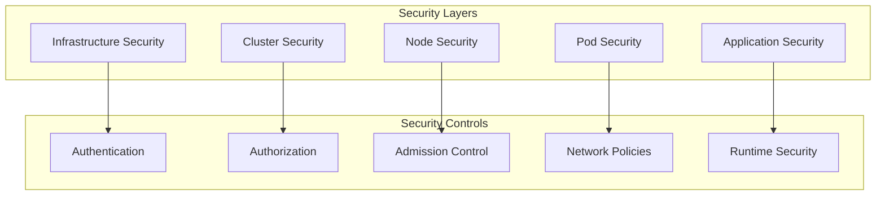
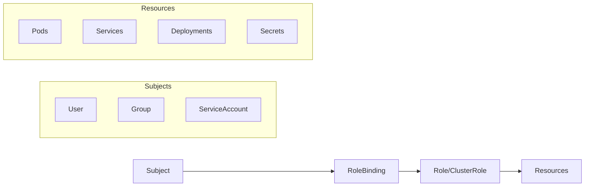
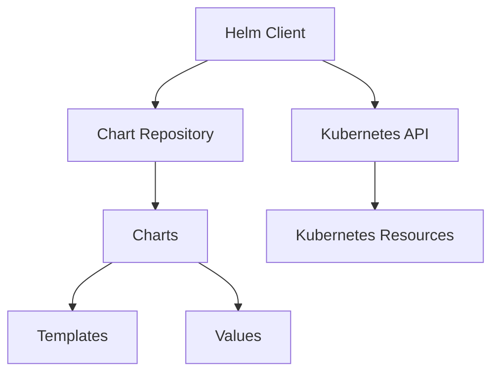
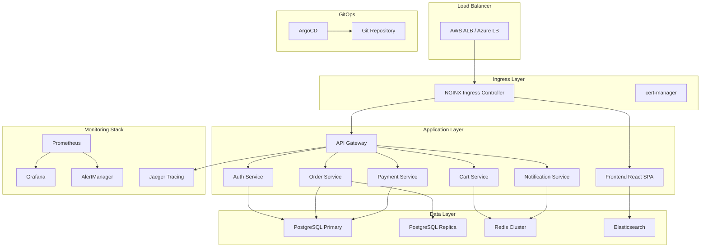

# Simplon Maghreb - Formation DevOps

# Sprint 3 - Semaine 3 : Kubernetes Production

## Table des matières

1. [Architecture sécurisée Kubernetes](#1-architecture-sécurisée-kubernetes)
2. [RBAC et contrôle d'accès](#2-rbac-et-contrôle-daccès)
3. [Pod Security et Network Policies](#3-pod-security-et-network-policies)
4. [Helm Package Manager](#4-helm-package-manager)
5. [CI/CD et GitOps](#5-cicd-et-gitops)
6. [Monitoring et Observabilité](#6-monitoring-et-observabilité)
7. [Logging centralisé](#7-logging-centralisé)
8. [Backup et Recovery](#8-backup-et-recovery)
9. [Best Practices Production](#9-best-practices-production)
10. [Projet final intégration](#10-projet-final-intégration)

---

## 1. Architecture sécurisée Kubernetes

### 1.1 Introduction à la sécurité Kubernetes

La sécurité dans Kubernetes est un défi complexe qui nécessite une approche multicouche. En production, il est essentiel de sécuriser tous les composants du cluster.

#### Principes de sécurité



#### Architecture sécurisée

```yaml
# Exemple de configuration sécurisée
apiVersion: v1
kind: Namespace
metadata:
  name: production
  labels:
    security.kubernetes.io/enforce: 'restricted'
    security.kubernetes.io/audit: 'restricted'
    security.kubernetes.io/warn: 'restricted'
---
apiVersion: networking.k8s.io/v1
kind: NetworkPolicy
metadata:
  name: deny-all
  namespace: production
spec:
  podSelector: {}
  policyTypes:
    - Ingress
    - Egress
```

### 1.2 Composants de sécurité

#### API Server Security

```yaml
# Configuration API Server sécurisée
apiVersion: v1
kind: Pod
metadata:
  name: kube-apiserver
spec:
  containers:
    - name: kube-apiserver
      command:
        - kube-apiserver
        - --enable-admission-plugins=NodeRestriction,NamespaceLifecycle,PodSecurity
        - --audit-log-path=/var/log/audit.log
        - --audit-policy-file=/etc/kubernetes/audit-policy.yaml
        - --encryption-provider-config=/etc/kubernetes/encryption-config.yaml
```

#### ETCD Security

```yaml
# Configuration ETCD chiffrée
apiVersion: v1
kind: Pod
metadata:
  name: etcd
spec:
  containers:
    - name: etcd
      command:
        - etcd
        - --cert-file=/etc/kubernetes/pki/etcd/server.crt
        - --key-file=/etc/kubernetes/pki/etcd/server.key
        - --trusted-ca-file=/etc/kubernetes/pki/etcd/ca.crt
        - --client-cert-auth=true
```

---

## 2. RBAC et contrôle d'accès

### 2.1 Concepts RBAC

Role-Based Access Control (RBAC) permet de contrôler finement les accès aux ressources Kubernetes.

#### Composants RBAC



### 2.2 Roles et ClusterRoles

#### Role pour un namespace

```yaml
apiVersion: rbac.authorization.k8s.io/v1
kind: Role
metadata:
  namespace: production
  name: pod-reader
rules:
  - apiGroups: ['']
    resources: ['pods']
    verbs: ['get', 'watch', 'list']
  - apiGroups: ['apps']
    resources: ['deployments']
    verbs: ['get', 'list', 'watch', 'create', 'update', 'patch']
```

#### ClusterRole pour tout le cluster

```yaml
apiVersion: rbac.authorization.k8s.io/v1
kind: ClusterRole
metadata:
  name: monitoring-reader
rules:
  - apiGroups: ['']
    resources: ['nodes', 'nodes/proxy', 'services', 'endpoints', 'pods']
    verbs: ['get', 'list', 'watch']
  - apiGroups: ['extensions']
    resources: ['ingresses']
    verbs: ['get', 'list', 'watch']
```

### 2.3 RoleBindings et ClusterRoleBindings

#### RoleBinding

```yaml
apiVersion: rbac.authorization.k8s.io/v1
kind: RoleBinding
metadata:
  name: read-pods
  namespace: production
subjects:
  - kind: User
    name: jane
    apiGroup: rbac.authorization.k8s.io
  - kind: ServiceAccount
    name: pod-reader
    namespace: production
roleRef:
  kind: Role
  name: pod-reader
  apiGroup: rbac.authorization.k8s.io
```

#### Service Account sécurisé

```yaml
apiVersion: v1
kind: ServiceAccount
metadata:
  name: webapp-sa
  namespace: production
  annotations:
    kubernetes.io/enforce-mountable-secrets: 'webapp-secret'
---
apiVersion: v1
kind: Secret
metadata:
  name: webapp-secret
  namespace: production
  annotations:
    kubernetes.io/service-account.name: webapp-sa
type: kubernetes.io/service-account-token
```

---

## 3. Pod Security et Network Policies

### 3.1 Pod Security Standards

Kubernetes utilise les Pod Security Standards pour définir des politiques de sécurité.

#### Niveaux de sécurité

```yaml
# Namespace avec Pod Security Standards
apiVersion: v1
kind: Namespace
metadata:
  name: secure-apps
  labels:
    # Niveau le plus sécurisé
    pod-security.kubernetes.io/enforce: restricted
    pod-security.kubernetes.io/audit: restricted
    pod-security.kubernetes.io/warn: restricted
```

#### Pod sécurisé

```yaml
apiVersion: v1
kind: Pod
metadata:
  name: secure-pod
  namespace: secure-apps
spec:
  securityContext:
    runAsNonRoot: true
    runAsUser: 1000
    runAsGroup: 3000
    fsGroup: 2000
    seccompProfile:
      type: RuntimeDefault
  containers:
    - name: app
      image: nginx:1.21
      securityContext:
        allowPrivilegeEscalation: false
        readOnlyRootFilesystem: true
        capabilities:
          drop:
            - ALL
      resources:
        limits:
          memory: '128Mi'
          cpu: '500m'
        requests:
          memory: '64Mi'
          cpu: '250m'
      volumeMounts:
        - name: tmp
          mountPath: /tmp
        - name: cache
          mountPath: /var/cache/nginx
  volumes:
    - name: tmp
      emptyDir: {}
    - name: cache
      emptyDir: {}
```

### 3.2 Network Policies

#### Isolement réseau complet

```yaml
apiVersion: networking.k8s.io/v1
kind: NetworkPolicy
metadata:
  name: default-deny-all
  namespace: secure-apps
spec:
  podSelector: {}
  policyTypes:
    - Ingress
    - Egress
---
apiVersion: networking.k8s.io/v1
kind: NetworkPolicy
metadata:
  name: allow-frontend-to-backend
  namespace: secure-apps
spec:
  podSelector:
    matchLabels:
      app: backend
  policyTypes:
    - Ingress
  ingress:
    - from:
        - podSelector:
            matchLabels:
              app: frontend
      ports:
        - protocol: TCP
          port: 8080
```

#### Micro-segmentation

```yaml
apiVersion: networking.k8s.io/v1
kind: NetworkPolicy
metadata:
  name: database-access
  namespace: secure-apps
spec:
  podSelector:
    matchLabels:
      app: database
  policyTypes:
    - Ingress
  ingress:
    - from:
        - podSelector:
            matchLabels:
              app: backend
        - namespaceSelector:
            matchLabels:
              name: monitoring
      ports:
        - protocol: TCP
          port: 5432
```

---

## 4. Helm Package Manager

### 4.1 Introduction à Helm

Helm est le gestionnaire de packages de Kubernetes qui simplifie le déploiement et la gestion d'applications.

#### Architecture Helm



### 4.2 Structure d'un Chart

#### Arborescence standard

```
mychart/
├── Chart.yaml          # Métadonnées du chart
├── values.yaml         # Valeurs par défaut
├── charts/             # Charts dépendants
├── templates/          # Templates Kubernetes
│   ├── deployment.yaml
│   ├── service.yaml
│   ├── ingress.yaml
│   └── _helpers.tpl    # Helpers templates
└── tests/              # Tests du chart
```

#### Chart.yaml

```yaml
apiVersion: v2
name: webapp
description: Application web sécurisée
version: 1.0.0
appVersion: '2.1.0'
keywords:
  - web
  - security
  - production
dependencies:
  - name: postgresql
    version: 11.6.12
    repository: https://charts.bitnami.com/bitnami
    condition: postgresql.enabled
  - name: redis
    version: 16.9.11
    repository: https://charts.bitnami.com/bitnami
    condition: redis.enabled
```

### 4.3 Templates avancés

#### Deployment template

```yaml
apiVersion: apps/v1
kind: Deployment
metadata:
  name: {{ include "webapp.fullname" . }}
  labels:
    {{- include "webapp.labels" . | nindent 4 }}
spec:
  {{- if not .Values.autoscaling.enabled }}
  replicas: {{ .Values.replicaCount }}
  {{- end }}
  selector:
    matchLabels:
      {{- include "webapp.selectorLabels" . | nindent 6 }}
  template:
    metadata:
      annotations:
        checksum/config: {{ include (print $.Template.BasePath "/configmap.yaml") . | sha256sum }}
      labels:
        {{- include "webapp.selectorLabels" . | nindent 8 }}
    spec:
      securityContext:
        {{- toYaml .Values.podSecurityContext | nindent 8 }}
      containers:
      - name: {{ .Chart.Name }}
        image: "{{ .Values.image.repository }}:{{ .Values.image.tag | default .Chart.AppVersion }}"
        imagePullPolicy: {{ .Values.image.pullPolicy }}
        ports:
        - name: http
          containerPort: 8080
          protocol: TCP
        livenessProbe:
          httpGet:
            path: /health
            port: http
          initialDelaySeconds: 30
          periodSeconds: 10
        readinessProbe:
          httpGet:
            path: /ready
            port: http
          initialDelaySeconds: 5
          periodSeconds: 5
        resources:
          {{- toYaml .Values.resources | nindent 12 }}
        env:
        {{- range $key, $value := .Values.env }}
        - name: {{ $key }}
          value: {{ $value | quote }}
        {{- end }}
```

#### Values.yaml structuré

```yaml
replicaCount: 3

image:
  repository: myapp
  pullPolicy: IfNotPresent
  tag: '1.2.0'

serviceAccount:
  create: true
  annotations: {}
  name: ''

podSecurityContext:
  runAsNonRoot: true
  runAsUser: 1000
  fsGroup: 2000

securityContext:
  allowPrivilegeEscalation: false
  readOnlyRootFilesystem: true
  capabilities:
    drop:
      - ALL

service:
  type: ClusterIP
  port: 80

ingress:
  enabled: true
  className: 'nginx'
  annotations:
    cert-manager.io/cluster-issuer: 'letsencrypt-prod'
    nginx.ingress.kubernetes.io/ssl-redirect: 'true'
  hosts:
    - host: myapp.example.com
      paths:
        - path: /
          pathType: Prefix
  tls:
    - secretName: myapp-tls
      hosts:
        - myapp.example.com

resources:
  limits:
    cpu: 500m
    memory: 512Mi
  requests:
    cpu: 250m
    memory: 256Mi

autoscaling:
  enabled: true
  minReplicas: 3
  maxReplicas: 100
  targetCPUUtilizationPercentage: 80

postgresql:
  enabled: true
  auth:
    database: myapp
    username: myapp
```

### 4.4 Gestion des releases

#### Installation et mise à jour

```bash
# Installation
helm install myapp ./mychart -n production --create-namespace

# Mise à jour
helm upgrade myapp ./mychart -n production --values production-values.yaml

# Rollback
helm rollback myapp 1 -n production

# Historique
helm history myapp -n production
```

---

## 5. CI/CD et GitOps

### 5.1 Integration GitLab CI/CD

#### .gitlab-ci.yml pour Kubernetes

```yaml
stages:
  - build
  - test
  - security-scan
  - deploy-staging
  - deploy-production

variables:
  DOCKER_REGISTRY: registry.gitlab.com
  DOCKER_IMAGE_NAME: $CI_PROJECT_PATH
  KUBECONFIG_FILE: $KUBECONFIG

build:
  stage: build
  image: docker:20.0.12
  services:
    - docker:20.0.12-dind
  script:
    - docker build -t $DOCKER_REGISTRY/$DOCKER_IMAGE_NAME:$CI_COMMIT_SHA .
    - docker push $DOCKER_REGISTRY/$DOCKER_IMAGE_NAME:$CI_COMMIT_SHA
  only:
    - main
    - develop

security-scan:
  stage: security-scan
  image: aquasec/trivy:latest
  script:
    - trivy image --exit-code 1 --severity HIGH,CRITICAL $DOCKER_REGISTRY/$DOCKER_IMAGE_NAME:$CI_COMMIT_SHA
  allow_failure: false

deploy-staging:
  stage: deploy-staging
  image: alpine/helm:latest
  script:
    - helm upgrade --install myapp-staging ./helm-chart
      --namespace staging
      --create-namespace
      --set image.tag=$CI_COMMIT_SHA
      --set environment=staging
  environment:
    name: staging
    url: https://staging.myapp.com
  only:
    - develop

deploy-production:
  stage: deploy-production
  image: alpine/helm:latest
  script:
    - helm upgrade --install myapp-prod ./helm-chart
      --namespace production
      --create-namespace
      --set image.tag=$CI_COMMIT_SHA
      --set environment=production
      --values production-values.yaml
  environment:
    name: production
    url: https://myapp.com
  when: manual
  only:
    - main
```

### 5.2 ArgoCD - GitOps

#### Installation ArgoCD

```yaml
apiVersion: v1
kind: Namespace
metadata:
  name: argocd
---
apiVersion: v1
kind: ConfigMap
metadata:
  name: argocd-server-config
  namespace: argocd
data:
  url: https://argocd.example.com
  oidc.config: |
    name: GitLab
    issuer: https://gitlab.com
    clientId: your-client-id
    clientSecret: your-client-secret
    requestedScopes: ["openid", "profile", "email", "groups"]
```

#### Application ArgoCD

```yaml
apiVersion: argoproj.io/v1alpha1
kind: Application
metadata:
  name: myapp-production
  namespace: argocd
spec:
  project: default
  source:
    repoURL: https://gitlab.com/mycompany/myapp-config.git
    targetRevision: HEAD
    path: overlays/production
  destination:
    server: https://kubernetes.default.svc
    namespace: production
  syncPolicy:
    automated:
      prune: true
      selfHeal: true
    syncOptions:
      - CreateNamespace=true
    retry:
      limit: 5
      backoff:
        duration: 5s
        factor: 2
        maxDuration: 3m
```

#### ApplicationSet pour multi-environnements

```yaml
apiVersion: argoproj.io/v1alpha1
kind: ApplicationSet
metadata:
  name: myapp-environments
  namespace: argocd
spec:
  generators:
    - list:
        elements:
          - cluster: staging
            url: https://staging-cluster
            namespace: myapp-staging
          - cluster: production
            url: https://production-cluster
            namespace: myapp-production
  template:
    metadata:
      name: 'myapp-{{cluster}}'
    spec:
      project: default
      source:
        repoURL: https://gitlab.com/mycompany/myapp-config.git
        targetRevision: HEAD
        path: 'overlays/{{cluster}}'
      destination:
        server: '{{url}}'
        namespace: '{{namespace}}'
      syncPolicy:
        automated:
          prune: true
          selfHeal: true
```

---

## 6. Monitoring et Observabilité

### 6.1 Stack Prometheus

#### Prometheus Operator

```yaml
apiVersion: v1
kind: Namespace
metadata:
  name: monitoring
---
apiVersion: monitoring.coreos.com/v1
kind: Prometheus
metadata:
  name: prometheus
  namespace: monitoring
spec:
  serviceAccountName: prometheus
  serviceMonitorSelector:
    matchLabels:
      team: frontend
  ruleSelector:
    matchLabels:
      team: frontend
  resources:
    requests:
      memory: 400Mi
      cpu: 200m
  retention: 30d
  storage:
    volumeClaimTemplate:
      spec:
        storageClassName: fast-ssd
        resources:
          requests:
            storage: 50Gi
```

#### ServiceMonitor

```yaml
apiVersion: monitoring.coreos.com/v1
kind: ServiceMonitor
metadata:
  name: webapp-monitor
  namespace: monitoring
  labels:
    team: frontend
spec:
  selector:
    matchLabels:
      app: webapp
  endpoints:
    - port: metrics
      interval: 30s
      path: /metrics
      honorLabels: true
```

### 6.2 Alerting avec AlertManager

#### PrometheusRule

```yaml
apiVersion: monitoring.coreos.com/v1
kind: PrometheusRule
metadata:
  name: webapp-alerts
  namespace: monitoring
  labels:
    team: frontend
spec:
  groups:
    - name: webapp.rules
      rules:
        - alert: WebAppDown
          expr: up{job="webapp"} == 0
          for: 5m
          labels:
            severity: critical
          annotations:
            summary: 'WebApp instance is down'
            description: 'WebApp instance {{ $labels.instance }} has been down for more than 5 minutes.'

        - alert: HighErrorRate
          expr: rate(http_requests_total{status=~"5.."}[5m]) > 0.1
          for: 2m
          labels:
            severity: warning
          annotations:
            summary: 'High error rate detected'
            description: 'Error rate is {{ $value }} errors per second'
```

#### AlertManager configuration

```yaml
apiVersion: v1
kind: ConfigMap
metadata:
  name: alertmanager-config
  namespace: monitoring
data:
  alertmanager.yml: |
    global:
      smtp_smarthost: 'localhost:587'
      smtp_from: 'alerts@company.com'

    route:
      group_by: ['alertname']
      group_wait: 10s
      group_interval: 10s
      repeat_interval: 1h
      receiver: 'web.hook'
      routes:
      - match:
          severity: critical
        receiver: 'critical-alerts'

    receivers:
    - name: 'web.hook'
      webhook_configs:
      - url: 'http://slack-webhook-url'
        
    - name: 'critical-alerts'
      email_configs:
      - to: 'oncall@company.com'
        subject: 'CRITICAL: {{ range .Alerts }}{{ .Annotations.summary }}{{ end }}'
        body: |
          {{ range .Alerts }}
          Alert: {{ .Annotations.summary }}
          Description: {{ .Annotations.description }}
          {{ end }}
```

### 6.3 Grafana Dashboards

#### Grafana configuration

```yaml
apiVersion: v1
kind: ConfigMap
metadata:
  name: grafana-datasources
  namespace: monitoring
data:
  prometheus.yaml: |
    apiVersion: 1
    datasources:
    - name: Prometheus
      type: prometheus
      url: http://prometheus:9090
      access: proxy
      isDefault: true
---
apiVersion: apps/v1
kind: Deployment
metadata:
  name: grafana
  namespace: monitoring
spec:
  replicas: 1
  selector:
    matchLabels:
      app: grafana
  template:
    metadata:
      labels:
        app: grafana
    spec:
      containers:
        - name: grafana
          image: grafana/grafana:8.5.0
          env:
            - name: GF_SECURITY_ADMIN_PASSWORD
              valueFrom:
                secretKeyRef:
                  name: grafana-secret
                  key: admin-password
          volumeMounts:
            - name: grafana-datasources
              mountPath: /etc/grafana/provisioning/datasources
      volumes:
        - name: grafana-datasources
          configMap:
            name: grafana-datasources
```

---

## 7. Logging centralisé

### 7.1 ELK Stack (Elasticsearch, Logstash, Kibana)

#### Elasticsearch Cluster

```yaml
apiVersion: elasticsearch.k8s.elastic.co/v1
kind: Elasticsearch
metadata:
  name: logging-cluster
  namespace: logging
spec:
  version: 8.3.0
  nodeSets:
    - name: master
      count: 3
      config:
        node.roles: ['master']
        xpack.security.enabled: true
      podTemplate:
        spec:
          containers:
            - name: elasticsearch
              resources:
                requests:
                  memory: 2Gi
                  cpu: 1
                limits:
                  memory: 2Gi
                  cpu: 2
      volumeClaimTemplates:
        - metadata:
            name: elasticsearch-data
          spec:
            accessModes:
              - ReadWriteOnce
            resources:
              requests:
                storage: 100Gi
            storageClassName: fast-ssd
    - name: data
      count: 3
      config:
        node.roles: ['data', 'ingest']
      podTemplate:
        spec:
          containers:
            - name: elasticsearch
              resources:
                requests:
                  memory: 4Gi
                  cpu: 2
                limits:
                  memory: 4Gi
                  cpu: 4
      volumeClaimTemplates:
        - metadata:
            name: elasticsearch-data
          spec:
            accessModes:
              - ReadWriteOnce
            resources:
              requests:
                storage: 500Gi
            storageClassName: fast-ssd
```

#### Filebeat DaemonSet

```yaml
apiVersion: apps/v1
kind: DaemonSet
metadata:
  name: filebeat
  namespace: logging
spec:
  selector:
    matchLabels:
      app: filebeat
  template:
    metadata:
      labels:
        app: filebeat
    spec:
      serviceAccountName: filebeat
      terminationGracePeriodSeconds: 30
      containers:
        - name: filebeat
          image: elastic/filebeat:8.3.0
          args: ['-c', '/etc/filebeat.yml', '-e']
          env:
            - name: ELASTICSEARCH_HOST
              value: logging-cluster-es-http
            - name: ELASTICSEARCH_PORT
              value: '9200'
          securityContext:
            runAsUser: 0
          resources:
            limits:
              memory: 200Mi
            requests:
              cpu: 100m
              memory: 100Mi
          volumeMounts:
            - name: config
              mountPath: /etc/filebeat.yml
              readOnly: true
              subPath: filebeat.yml
            - name: data
              mountPath: /usr/share/filebeat/data
            - name: varlibdockercontainers
              mountPath: /var/lib/docker/containers
              readOnly: true
            - name: varlog
              mountPath: /var/log
              readOnly: true
      volumes:
        - name: config
          configMap:
            defaultMode: 0640
            name: filebeat-config
        - name: varlibdockercontainers
          hostPath:
            path: /var/lib/docker/containers
        - name: varlog
          hostPath:
            path: /var/log
        - name: data
          hostPath:
            path: /var/lib/filebeat-data
            type: DirectoryOrCreate
```

### 7.2 Fluent Bit comme alternative

```yaml
apiVersion: v1
kind: ConfigMap
metadata:
  name: fluent-bit-config
  namespace: logging
data:
  fluent-bit.conf: |
    [SERVICE]
        Flush         1
        Log_Level     info
        Daemon        off
        Parsers_File  parsers.conf

    [INPUT]
        Name              tail
        Tag               kube.*
        Path              /var/log/containers/*.log
        Parser            cri
        DB                /var/log/flb_kube.db
        Mem_Buf_Limit     50MB
        Skip_Long_Lines   On
        Refresh_Interval  10

    [FILTER]
        Name                kubernetes
        Match               kube.*
        Kube_URL            https://kubernetes.default.svc:443
        Kube_CA_File        /var/run/secrets/kubernetes.io/serviceaccount/ca.crt
        Kube_Token_File     /var/run/secrets/kubernetes.io/serviceaccount/token
        Merge_Log           On
        K8S-Logging.Parser  On
        K8S-Logging.Exclude Off

    [OUTPUT]
        Name            es
        Match           *
        Host            logging-cluster-es-http
        Port            9200
        HTTP_User       elastic
        HTTP_Passwd     ${ELASTICSEARCH_PASSWORD}
        Index           kubernetes-logs
        Type            _doc
        Logstash_Format On
        Logstash_Prefix kubernetes
        Time_Key        @timestamp
        Replace_Dots    On
        Retry_Limit     False
        tls             On
        tls.verify      Off
```

---

## 8. Backup et Recovery

### 8.1 Velero - Cluster Backup

#### Installation Velero

```bash
# Installation avec provider AWS
velero install \
    --provider aws \
    --plugins velero/velero-plugin-for-aws:v1.5.0 \
    --bucket my-backup-bucket \
    --backup-location-config region=eu-west-1 \
    --snapshot-location-config region=eu-west-1 \
    --secret-file ./credentials-velero
```

#### Configuration Backup

```yaml
apiVersion: velero.io/v1
kind: Backup
metadata:
  name: daily-backup
  namespace: velero
spec:
  # Inclure tous les namespaces sauf velero
  includedNamespaces:
    - '*'
  excludedNamespaces:
    - velero

  # Inclure les volumes persistants
  defaultVolumesToRestic: true

  # Retention
  ttl: 720h0m0s # 30 jours

  # Hooks pour arrêter les bases de données
  hooks:
    resources:
      - name: postgresql-backup
        includedNamespaces:
          - production
        includedResources:
          - pods
        labelSelector:
          matchLabels:
            app: postgresql
        pre:
          - exec:
              container: postgresql
              command:
                - /bin/bash
                - -c
                - 'pg_dump -h localhost -U postgres myapp > /tmp/backup.sql'
        post:
          - exec:
              container: postgresql
              command:
                - /bin/bash
                - -c
                - 'rm -f /tmp/backup.sql'
```

#### Schedule Backup

```yaml
apiVersion: velero.io/v1
kind: Schedule
metadata:
  name: daily-backup
  namespace: velero
spec:
  schedule: '0 2 * * *' # Tous les jours à 2h du matin
  template:
    includedNamespaces:
      - production
      - staging
    defaultVolumesToRestic: true
    ttl: 720h0m0s
---
apiVersion: velero.io/v1
kind: Schedule
metadata:
  name: weekly-full-backup
  namespace: velero
spec:
  schedule: '0 3 * * 0' # Dimanche à 3h du matin
  template:
    includedNamespaces:
      - '*'
    excludedNamespaces:
      - velero
      - kube-system
    defaultVolumesToRestic: true
    ttl: 2160h0m0s # 90 jours
```

### 8.2 ETCD Backup

#### Script de sauvegarde ETCD

```bash
#!/bin/bash
ETCDCTL_API=3 etcdctl snapshot save /backup/etcd-snapshot-$(date +%Y%m%d-%H%M%S).db \
  --endpoints=https://127.0.0.1:2379 \
  --cacert=/etc/kubernetes/pki/etcd/ca.crt \
  --cert=/etc/kubernetes/pki/etcd/server.crt \
  --key=/etc/kubernetes/pki/etcd/server.key

# Vérification de la sauvegarde
ETCDCTL_API=3 etcdctl snapshot status /backup/etcd-snapshot-$(date +%Y%m%d-%H%M%S).db
```

#### Restauration ETCD

```bash
#!/bin/bash
ETCDCTL_API=3 etcdctl snapshot restore /backup/etcd-snapshot-20230515-020000.db \
  --name etcd-restore \
  --initial-cluster etcd-restore=https://127.0.0.1:2380 \
  --initial-advertise-peer-urls https://127.0.0.1:2380 \
  --data-dir /var/lib/etcd-restore
```

### 8.3 Disaster Recovery Plan

#### Procédure de récupération

```yaml
# 1. Restauration du cluster ETCD
# 2. Vérification des composants Kubernetes
# 3. Restauration Velero

apiVersion: velero.io/v1
kind: Restore
metadata:
  name: production-restore
  namespace: velero
spec:
  backupName: daily-backup-20230515
  includedNamespaces:
    - production
  excludedResources:
    - nodes
    - events
    - events.events.k8s.io
    - backups.velero.io
    - restores.velero.io
  restorePVs: true
```

---

## 9. Best Practices Production

### 9.1 Resource Management

#### ResourceQuota par namespace

```yaml
apiVersion: v1
kind: ResourceQuota
metadata:
  name: production-quota
  namespace: production
spec:
  hard:
    requests.cpu: '20'
    requests.memory: 40Gi
    limits.cpu: '40'
    limits.memory: 80Gi
    persistentvolumeclaims: '10'
    pods: '50'
    services: '20'
    secrets: '30'
    configmaps: '30'
```

#### LimitRange

```yaml
apiVersion: v1
kind: LimitRange
metadata:
  name: production-limits
  namespace: production
spec:
  limits:
    - default:
        cpu: '500m'
        memory: '512Mi'
      defaultRequest:
        cpu: '100m'
        memory: '128Mi'
      type: Container
    - max:
        cpu: '2'
        memory: '4Gi'
      min:
        cpu: '10m'
        memory: '16Mi'
      type: Container
```

### 9.2 PodDisruptionBudget

```yaml
apiVersion: policy/v1
kind: PodDisruptionBudget
metadata:
  name: webapp-pdb
  namespace: production
spec:
  minAvailable: 2
  selector:
    matchLabels:
      app: webapp
---
apiVersion: policy/v1
kind: PodDisruptionBudget
metadata:
  name: database-pdb
  namespace: production
spec:
  maxUnavailable: 0
  selector:
    matchLabels:
      app: database
```

### 9.3 Node Affinity et Taints

#### Node labels et taints

```bash
# Ajouter des labels aux nodes
kubectl label nodes node-1 workload=production
kubectl label nodes node-2 workload=production
kubectl label nodes node-3 workload=development

# Ajouter des taints
kubectl taint nodes node-1 workload=production:NoSchedule
kubectl taint nodes node-2 workload=production:NoSchedule
```

#### Deployment avec affinity

```yaml
apiVersion: apps/v1
kind: Deployment
metadata:
  name: webapp-production
  namespace: production
spec:
  replicas: 3
  selector:
    matchLabels:
      app: webapp
  template:
    metadata:
      labels:
        app: webapp
    spec:
      nodeSelector:
        workload: production
      tolerations:
        - key: 'workload'
          operator: 'Equal'
          value: 'production'
          effect: 'NoSchedule'
      affinity:
        podAntiAffinity:
          requiredDuringSchedulingIgnoredDuringExecution:
            - labelSelector:
                matchExpressions:
                  - key: app
                    operator: In
                    values:
                      - webapp
              topologyKey: 'kubernetes.io/hostname'
      containers:
        - name: webapp
          image: webapp:v1.0.0
```

---

## 10. Projet final intégration

### 10.1 Architecture E-commerce

Le projet final consiste à déployer une architecture e-commerce complète en production avec tous les éléments de sécurité, monitoring et CI/CD.

#### Composants de l'architecture



### 10.2 Manifestes de déploiement

#### Namespace et sécurité

```yaml
apiVersion: v1
kind: Namespace
metadata:
  name: ecommerce-prod
  labels:
    pod-security.kubernetes.io/enforce: restricted
    pod-security.kubernetes.io/audit: restricted
    pod-security.kubernetes.io/warn: restricted
---
apiVersion: v1
kind: ServiceAccount
metadata:
  name: ecommerce-sa
  namespace: ecommerce-prod
---
apiVersion: rbac.authorization.k8s.io/v1
kind: Role
metadata:
  namespace: ecommerce-prod
  name: ecommerce-role
rules:
  - apiGroups: ['']
    resources: ['configmaps', 'secrets', 'services']
    verbs: ['get', 'list', 'watch']
  - apiGroups: ['apps']
    resources: ['deployments']
    verbs: ['get', 'list', 'watch']
---
apiVersion: rbac.authorization.k8s.io/v1
kind: RoleBinding
metadata:
  name: ecommerce-binding
  namespace: ecommerce-prod
subjects:
  - kind: ServiceAccount
    name: ecommerce-sa
    namespace: ecommerce-prod
roleRef:
  kind: Role
  name: ecommerce-role
  apiGroup: rbac.authorization.k8s.io
```

#### Frontend React

```yaml
apiVersion: apps/v1
kind: Deployment
metadata:
  name: frontend
  namespace: ecommerce-prod
spec:
  replicas: 3
  selector:
    matchLabels:
      app: frontend
  template:
    metadata:
      labels:
        app: frontend
    spec:
      serviceAccountName: ecommerce-sa
      securityContext:
        runAsNonRoot: true
        runAsUser: 1000
        fsGroup: 2000
      containers:
        - name: frontend
          image: ecommerce/frontend:v1.0.0
          ports:
            - containerPort: 3000
          securityContext:
            allowPrivilegeEscalation: false
            readOnlyRootFilesystem: true
            capabilities:
              drop:
                - ALL
          resources:
            requests:
              memory: '128Mi'
              cpu: '100m'
            limits:
              memory: '512Mi'
              cpu: '500m'
          livenessProbe:
            httpGet:
              path: /health
              port: 3000
            initialDelaySeconds: 30
            periodSeconds: 10
          readinessProbe:
            httpGet:
              path: /ready
              port: 3000
            initialDelaySeconds: 5
            periodSeconds: 5
          env:
            - name: API_URL
              value: 'https://api.ecommerce.com'
            - name: NODE_ENV
              value: 'production'
---
apiVersion: v1
kind: Service
metadata:
  name: frontend-service
  namespace: ecommerce-prod
spec:
  selector:
    app: frontend
  ports:
    - protocol: TCP
      port: 80
      targetPort: 3000
  type: ClusterIP
---
apiVersion: autoscaling/v2
kind: HorizontalPodAutoscaler
metadata:
  name: frontend-hpa
  namespace: ecommerce-prod
spec:
  scaleTargetRef:
    apiVersion: apps/v1
    kind: Deployment
    name: frontend
  minReplicas: 3
  maxReplicas: 10
  metrics:
    - type: Resource
      resource:
        name: cpu
        target:
          type: Utilization
          averageUtilization: 70
    - type: Resource
      resource:
        name: memory
        target:
          type: Utilization
          averageUtilization: 80
```

### 10.3 Configuration monitoring

#### ServiceMonitor pour Prometheus

```yaml
apiVersion: monitoring.coreos.com/v1
kind: ServiceMonitor
metadata:
  name: ecommerce-monitor
  namespace: monitoring
  labels:
    app: ecommerce
spec:
  namespaceSelector:
    matchNames:
      - ecommerce-prod
  selector:
    matchLabels:
      app: api-gateway
  endpoints:
    - port: metrics
      interval: 30s
      path: /metrics
---
apiVersion: monitoring.coreos.com/v1
kind: PrometheusRule
metadata:
  name: ecommerce-alerts
  namespace: monitoring
spec:
  groups:
    - name: ecommerce.rules
      rules:
        - alert: EcommerceHighErrorRate
          expr: rate(http_requests_total{app="api-gateway",status=~"5.."}[5m]) > 0.05
          for: 2m
          labels:
            severity: warning
            service: ecommerce
          annotations:
            summary: 'High error rate in e-commerce API'
            description: 'Error rate is {{ $value }} requests per second'

        - alert: EcommerceHighLatency
          expr: histogram_quantile(0.95, rate(http_request_duration_seconds_bucket{app="api-gateway"}[5m])) > 0.5
          for: 5m
          labels:
            severity: warning
            service: ecommerce
          annotations:
            summary: 'High latency in e-commerce API'
            description: '95th percentile latency is {{ $value }} seconds'
```

### 10.4 Déploiement Helm Chart

#### Chart.yaml

```yaml
apiVersion: v2
name: ecommerce
description: E-commerce platform - Production ready
version: 1.0.0
appVersion: '1.0.0'
dependencies:
  - name: postgresql
    version: 11.6.12
    repository: https://charts.bitnami.com/bitnami
    condition: postgresql.enabled
  - name: redis
    version: 16.9.11
    repository: https://charts.bitnami.com/bitnami
    condition: redis.enabled
  - name: elasticsearch
    version: 19.0.0
    repository: https://charts.bitnami.com/bitnami
    condition: elasticsearch.enabled
```

#### Values production

```yaml
global:
  environment: production
  domain: ecommerce.com

frontend:
  replicaCount: 3
  image:
    repository: ecommerce/frontend
    tag: '1.0.0'
  autoscaling:
    enabled: true
    minReplicas: 3
    maxReplicas: 10

apiGateway:
  replicaCount: 5
  image:
    repository: ecommerce/api-gateway
    tag: '1.0.0'
  autoscaling:
    enabled: true
    minReplicas: 5
    maxReplicas: 20

postgresql:
  enabled: true
  auth:
    database: ecommerce
    username: ecommerce
  primary:
    persistence:
      enabled: true
      size: 100Gi
      storageClass: 'fast-ssd'
  readReplicas:
    replicaCount: 2

redis:
  enabled: true
  architecture: replication
  auth:
    enabled: true
  master:
    persistence:
      enabled: true
      size: 20Gi

elasticsearch:
  enabled: true
  replicas: 3
  minimumMasterNodes: 2
  volumeClaimTemplate:
    resources:
      requests:
        storage: 50Gi

ingress:
  enabled: true
  className: 'nginx'
  annotations:
    cert-manager.io/cluster-issuer: 'letsencrypt-prod'
    nginx.ingress.kubernetes.io/ssl-redirect: 'true'
    nginx.ingress.kubernetes.io/rate-limit: '100'
  hosts:
    - host: ecommerce.com
      paths:
        - path: /
          pathType: Prefix
          service: frontend-service
    - host: api.ecommerce.com
      paths:
        - path: /
          pathType: Prefix
          service: api-gateway-service
  tls:
    - secretName: ecommerce-tls
      hosts:
        - ecommerce.com
        - api.ecommerce.com

monitoring:
  enabled: true
  serviceMonitor:
    enabled: true
    interval: 30s
  prometheusRule:
    enabled: true
```

## Conclusion

Cette formation Kubernetes Production couvre tous les aspects essentiels pour déployer et maintenir des applications en production :

- **Sécurité multicouche** avec RBAC, Pod Security Standards et Network Policies
- **Packaging professionnel** avec Helm Charts avancés
- **CI/CD robuste** avec GitLab et ArgoCD GitOps
- **Observabilité complète** avec Prometheus, Grafana et ELK
- **Backup et recovery** avec Velero et stratégies disaster recovery
- **Best practices** pour la production

Le projet final d'architecture e-commerce permet de mettre en pratique tous ces concepts dans un environnement réaliste et complexe.
