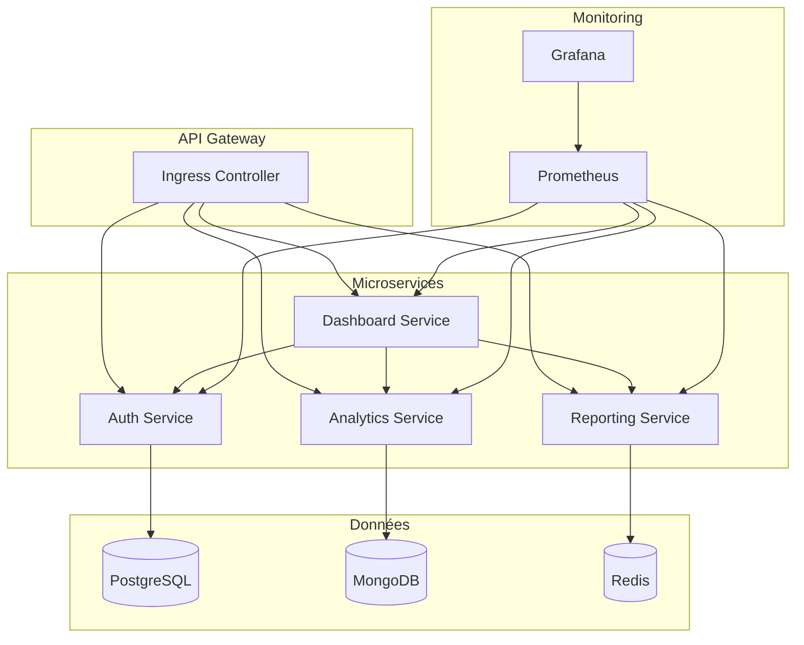
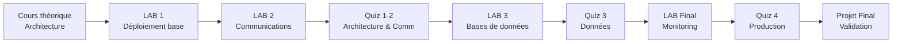

# Simplon Maghreb - Formation DevOps

# Sprint 3 - Semaine 4 : Projet K8s

## Description de la semaine

Cette semaine finale du Sprint 3 se concentre sur un projet complet d'architecture microservices avec Kubernetes. Les apprenants conçoivent et déploient une plateforme analytics DevOps avec communication inter-services, gestion des données et monitoring en production.

## Organisation pédagogique

### Cours projet

- **S3_S4_cours_projet_microservices.md** : Cours complet sur l'architecture microservices K8s

### Projet intégré

- **3 LABs progressifs** : Construction étape par étape de l'architecture
- **LAB Final** : Déploiement complet avec monitoring
- **DevOps Analytics Platform** : Projet fil rouge de 4 microservices

### Évaluation projet

- **4 quiz spécialisés** : 100 questions sur les microservices et K8s
- **Évaluation projet** : Architecture complète et fonctionnelle

## Objectifs de formation

### Objectifs pédagogiques

- Concevoir une architecture microservices complète sur Kubernetes
- Maîtriser la communication inter-services et la gestion des données
- Développer des compétences en déploiement production-ready
- Intégrer monitoring, logging et observabilité

### Objectifs techniques

Architecture microservices, Service Discovery, API Gateway, Database per Service, Health Checks, Circuit Breaker, Prometheus, Grafana, Service Mesh, Load Balancing, Auto-scaling

## Structure des contenus

### Projet : DevOps Analytics Platform

**Architecture** : 4 microservices interconnectés

- **Auth Service** : Authentification et autorisation
- **Analytics Service** : Collecte et traitement des métriques
- **Reporting Service** : Génération de rapports
- **Dashboard Service** : Interface utilisateur

### LABs intégrés (dans le cours)

1. **LAB 1** - Déploiement de l'architecture de base
2. **LAB 2** - Configuration des communications inter-services
3. **LAB 3** - Configuration des bases de données
4. **LAB Final** - Déploiement complet avec monitoring

### Ressources techniques

- **Manifests YAML** : Tous les fichiers de déploiement
- **Docker Images** : Images des microservices
- **Monitoring Stack** : Prometheus + Grafana
- **Scripts de déploiement** : Automatisation complète

## 🧭 Navigation et Ressources

### 📖 Cours principal

- 🎯 **[S3_S4_cours_projet_microservices.md](cours/S3_S4_cours_projet_microservices.md)** - Cours complet Projet Microservices

### 🏗️ Architecture du projet

### 🔬 LABs pratiques

| LAB   | Titre                | Description                       | Intégré dans                                                                                         |
| ----- | -------------------- | --------------------------------- | ---------------------------------------------------------------------------------------------------- |
| 1     | Architecture de base | Déploiement des 4 microservices   | [Section 2](cours/S3_S4_cours_projet_microservices.md#23-lab-1---déploiement-de-larchitecture)       |
| 2     | Communications       | Service discovery et API Gateway  | [Section 3](cours/S3_S4_cours_projet_microservices.md#33-lab-2---configuration-des-communications)   |
| 3     | Bases de données     | Configuration des BDD par service | [Section 4](cours/S3_S4_cours_projet_microservices.md#43-lab-3---configuration-des-bases-de-données) |
| Final | Déploiement complet  | Monitoring et observabilité       | [Section 5](cours/S3_S4_cours_projet_microservices.md#53-lab-final---déploiement-complet)            |

### 📝 Évaluations - Quiz

| Quiz | Thème                       | Questions | Lien                                  |
| ---- | --------------------------- | --------- | ------------------------------------- |
| 1    | Architecture microservices  | 25        | [Quiz 1](quiz/quiz1_architecture.md)  |
| 2    | Communication et découverte | 25        | [Quiz 2](quiz/quiz2_communication.md) |
| 3    | Gestion des données         | 25        | [Quiz 3](quiz/quiz3_donnees.md)       |
| 4    | Production et monitoring    | 25        | [Quiz 4](quiz/quiz4_production.md)    |

### 🔗 Liens utiles

- 🔙 **[Retour Sprint 3](../README.md)** - Vue d'ensemble du sprint
- ⬅️ **[Semaine 3](../Semaine-3-Kubernetes-Production/)** - Kubernetes Production
- 📚 **[Microservices Patterns](https://microservices.io/patterns/)** - Patterns microservices
- 🛠️ **[Prometheus Docs](https://prometheus.io/docs/)** - Documentation Prometheus
- 📊 **[Grafana Docs](https://grafana.com/docs/)** - Documentation Grafana

## 📅 Progression recommandée

## Livrables du projet

### 🎯 Critères de validation

- ✅ **Architecture complète** : 4 microservices déployés et fonctionnels
- ✅ **Communication** : Service discovery et API Gateway opérationnels
- ✅ **Données** : Bases de données séparées par service
- ✅ **Monitoring** : Métriques Prometheus et dashboards Grafana
- ✅ **Résilience** : Health checks et circuit breakers configurés
- ✅ **Documentation** : Architecture et déploiement documentés

### 📋 Fichiers à produire

- Manifests YAML complets
- Scripts de déploiement
- Configuration monitoring
- Documentation architecture
- Guide de déploiement

## Durée et organisation

- **Cours théorique** : 2 heures - Étude du cours projet
- **LABs pratiques** : 12 heures - 4 LABs progressifs
- **Projet final** : 6 heures - Intégration et validation
- **Évaluation** : 4 quiz de 25 questions + évaluation projet

## Prérequis techniques

- Sprint 3 Semaines 1-3 : Kubernetes maîtrisé
- Architecture microservices : Concepts de base
- Docker et containerisation : Expertise confirmée
- Monitoring et observabilité : Notions de base

---

_Formateur : Hassan ESSADIK | Sprint 3 - Semaine 4 - Projet K8s_
