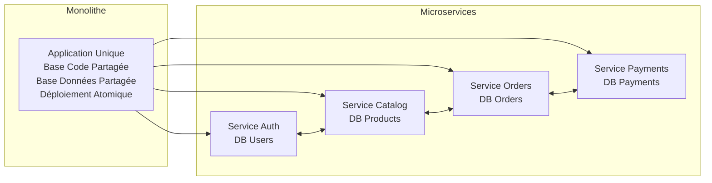
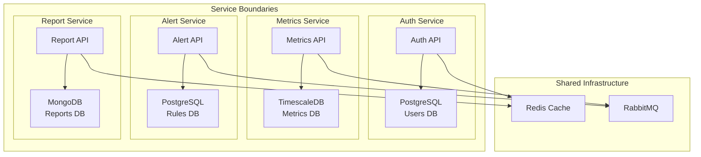
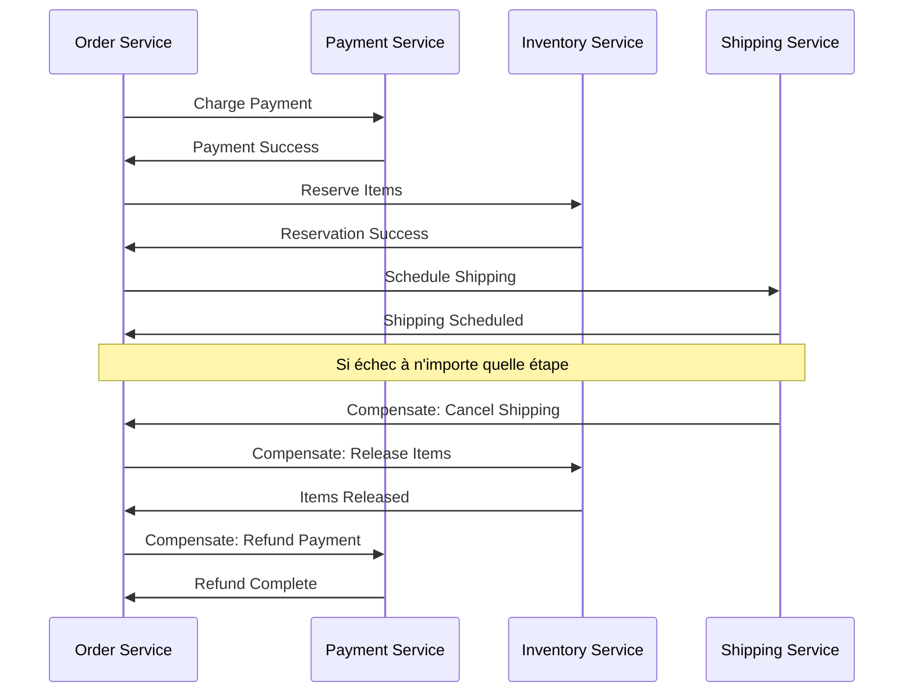

# Simplon Maghreb - Formation DevOps

# Sprint 3 - Semaine 4 : Projet Kubernetes - Architecture Microservices

## Objectifs pédagogiques

- Concevoir et déployer une architecture microservices complète sur Kubernetes
- Maîtriser les patterns avancés de communication inter-services
- Implémenter CI/CD et monitoring pour environnements production
- Développer expertise en optimisation et sécurisation des déploiements

## Objectifs techniques

Microservices Architecture, Service Mesh, API Gateway, Data Management, DevOps Patterns, CI/CD Integration, Monitoring Stack, Production Optimization, Security Hardening, Performance Tuning

## Table des matières

1. [Introduction aux Microservices](#1-introduction-aux-microservices)
2. [Architecture Patterns](#2-architecture-patterns)
3. [Communication inter-services](#3-communication-inter-services)
4. [Gestion des données](#4-gestion-des-données)
5. [Déploiement et monitoring](#5-déploiement-et-monitoring)
6. [Récapitulatif et prochaines étapes](#récapitulatif-et-prochaines-étapes)

---

## 1. Introduction aux Microservices

### 1.1 Définition et positionnement

**Microservices** représentent un style architectural où une application est développée comme une suite de services indépendants, chacun s'exécutant dans son propre processus et communiquant via des mécanismes légers.

**Problématiques résolues** :

- **Scalabilité granulaire** : Scaling indépendant par service
- **Indépendance technologique** : Stack technique adaptée par service
- **Équipes autonomes** : Développement et déploiement décentralisés
- **Résilience** : Isolation des pannes par service

### 1.2 Transition Monolith → Microservices



### 1.3 Application pratique - Analyse architecture

📝 **Contexte projet** : DevOps Analytics Platform

**Objectif** : Analyser l'architecture existante d'une application monolithique et identifier les services candidats pour une migration microservices.

**Analyse** :

- Identification des bounded contexts métier
- Mapping des données et dépendances
- Définition des interfaces de communication
- Stratégie de migration progressive

**Cas d'étude** : Plateforme de monitoring DevOps avec authentification, collecte de métriques, alerting et génération de rapports.

---

## 2. Architecture Patterns

### 2.1 Decomposition Strategies

#### Domain-Driven Design (DDD)

**Bounded Context** : Chaque microservice correspond à un domaine métier spécifique avec ses propres règles et données.

```yaml
# Architecture DevOps Analytics Platform
domains:
  authentication:
    service: auth-service
    responsibilities:
      - User authentication
      - Role management
      - Session handling
    data: [users, roles, sessions]

  metrics:
    service: metrics-collector
    responsibilities:
      - Data ingestion
      - Time series storage
      - Aggregation processing
    data: [metrics, timeseries, metadata]

  alerting:
    service: alert-manager
    responsibilities:
      - Rule evaluation
      - Incident management
      - Notification routing
    data: [rules, incidents, notifications]

  reporting:
    service: report-generator
    responsibilities:
      - Dashboard generation
      - Scheduled reports
      - Data visualization
    data: [templates, reports, schedules]
```

### 2.2 Service Boundaries et Database per Service

**Principe** : Chaque service possède sa propre base de données pour garantir l'indépendance.



### 2.3 Application pratique - Service design

📝 **LAB 1** - Architecture microservices : `labs/enonces/S3_S4_lab1_architecture_microservices.md`

**Énoncé** :

Concevez et déployez l'architecture complète de la DevOps Analytics Platform avec 4 microservices interconnectés.

- **Objectif** : Implémenter architecture microservices production-ready
- **Contexte** : Plateforme analytics pour équipes DevOps avec haute disponibilité
- **Instructions** :
  1. Déployer 4 services avec bases de données dédiées
  2. Configurer communication inter-services avec service discovery
  3. Implémenter API Gateway pour routage externe
  4. Tester résilience et isolation des services
- **Critères de validation** : Services indépendants, communication établie, résilience validée
- **Durée estimée** : 3 heures

---

## 3. Communication inter-services

### 3.1 Concepts clés

La communication entre microservices est un aspect critique de l'architecture. Dans Kubernetes, plusieurs patterns permettent cette communication :

#### Service Discovery

```yaml
# Service pour exposition interne
apiVersion: v1
kind: Service
metadata:
  name: user-service
spec:
  selector:
    app: user-service
  ports:
    - port: 8080
      targetPort: 8080
  type: ClusterIP # Par défaut, accessible uniquement dans le cluster
```

#### Communication Patterns

- **Synchrone** : REST APIs, gRPC
- **Asynchrone** : Message queues, event streaming
- **Service Mesh** : Istio, Linkerd pour observabilité avancée

### 3.2 Implementation pratique

#### API Gateway Pattern

```yaml
apiVersion: networking.k8s.io/v1
kind: Ingress
metadata:
  name: api-gateway
  annotations:
    nginx.ingress.kubernetes.io/rewrite-target: /
spec:
  rules:
    - host: api.devops-platform.local
      http:
        paths:
          - path: /auth
            pathType: Prefix
            backend:
              service:
                name: auth-service
                port:
                  number: 8080
          - path: /analytics
            pathType: Prefix
            backend:
              service:
                name: analytics-service
                port:
                  number: 8080
```

> 💡 **Best Practice** : Utilisez des noms de services DNS pour la découverte automatique (ex: `http://user-service:8080`)

### 3.3 LAB 2 - Configuration des communications

**Objectif** : Configurer la communication entre les microservices de la DevOps Analytics Platform

**Instructions** :

1. **Service Discovery** :

   ```bash
   # Créer les services pour chaque microservice
   kubectl apply -f auth-service.yaml
   kubectl apply -f analytics-service.yaml
   kubectl apply -f reporting-service.yaml
   kubectl apply -f dashboard-service.yaml
   ```

2. **Test de connectivité** :

   ```bash
   # Vérifier la résolution DNS
   kubectl exec -it auth-service-pod -- nslookup analytics-service

   # Test de communication
   kubectl exec -it auth-service-pod -- curl http://analytics-service:8080/health
   ```

3. **Configuration API Gateway** :

   ```bash
   # Déployer l'Ingress Controller
   kubectl apply -f api-gateway-ingress.yaml

   # Vérifier le routage
   curl -H "Host: api.devops-platform.local" http://localhost/auth/health
   ```

**Critères de validation** :

- Services accessibles via DNS interne
- API Gateway route correctement les requêtes
- Communication inter-services fonctionnelle

---

## 4. Gestion des données

### 4.1 Concepts clés

La gestion des données dans une architecture microservices suit le principe "Database per Service" :

#### Database per Service Pattern

```yaml
# Auth Service - PostgreSQL
apiVersion: v1
kind: ConfigMap
metadata:
  name: auth-db-config
data:
  POSTGRES_DB: auth_service
  POSTGRES_USER: auth_user
---
# Analytics Service - MongoDB
apiVersion: v1
kind: ConfigMap
metadata:
  name: analytics-db-config
data:
  MONGO_DB: analytics_db
  MONGO_COLLECTION: metrics
```

#### Data Consistency Patterns

- **Saga Pattern** : Transactions distribuées
- **Event Sourcing** : Historique des changements
- **CQRS** : Séparation lecture/écriture

### 4.2 Implementation pratique

#### Persistent Volumes pour les bases de données

```yaml
apiVersion: v1
kind: PersistentVolumeClaim
metadata:
  name: postgres-pvc
spec:
  accessModes:
    - ReadWriteOnce
  resources:
    requests:
      storage: 10Gi
  storageClassName: standard
```

#### Backup et Recovery

```yaml
apiVersion: batch/v1
kind: CronJob
metadata:
  name: database-backup
spec:
  schedule: '0 2 * * *' # Daily at 2 AM
  jobTemplate:
    spec:
      template:
        spec:
          containers:
            - name: backup
              image: postgres:13
              command:
                - sh
                - -c
                - pg_dump $DATABASE_URL > /backup/backup-$(date +%Y%m%d).sql
```

> 💡 **Best Practice** : Utilisez des StatefulSets pour les bases de données avec stockage persistant

### 4.3 LAB 3 - Configuration des bases de données

**Objectif** : Déployer et configurer les bases de données pour chaque microservice

**Instructions** :

1. **Déploiement PostgreSQL** :

   ```bash
   # Créer le secret pour les credentials
   kubectl create secret generic postgres-secret \
     --from-literal=password=secretpassword

   # Déployer PostgreSQL
   kubectl apply -f postgres-deployment.yaml
   kubectl apply -f postgres-service.yaml
   ```

2. **Déploiement MongoDB** :

   ```bash
   # Déployer MongoDB pour le service analytics
   kubectl apply -f mongodb-deployment.yaml
   kubectl apply -f mongodb-service.yaml
   ```

3. **Test de connectivité** :

   ```bash
   # Tester la connexion PostgreSQL
   kubectl exec -it postgres-pod -- psql -U auth_user -d auth_service -c "\l"

   # Tester la connexion MongoDB
   kubectl exec -it mongodb-pod -- mongo analytics_db --eval "db.runCommand('ping')"
   ```

**Critères de validation** :

- Bases de données accessibles depuis les services
- Données persistantes après redémarrage des pods
- Backups automatiques configurés

#### Service Data Ownership

```yaml
# Auth Service - PostgreSQL
apiVersion: v1
kind: PersistentVolumeClaim
metadata:
  name: auth-db-pvc
spec:
  accessModes: [ReadWriteOnce]
  resources:
    requests:
      storage: 10Gi
---
apiVersion: apps/v1
kind: Deployment
metadata:
  name: auth-db
spec:
  template:
    spec:
      containers:
        - name: postgres
          image: postgres:14
          env:
            - name: POSTGRES_DB
              value: auth_service
            - name: POSTGRES_USER
              value: auth_user
            - name: POSTGRES_PASSWORD
              valueFrom:
                secretKeyRef:
                  name: auth-db-secret
                  key: password
          volumeMounts:
            - name: data
              mountPath: /var/lib/postgresql/data
      volumes:
        - name: data
          persistentVolumeClaim:
            claimName: auth-db-pvc

---
# Metrics Service - TimescaleDB
apiVersion: apps/v1
kind: Deployment
metadata:
  name: metrics-db
spec:
  template:
    spec:
      containers:
        - name: timescaledb
          image: timescale/timescaledb:latest-pg14
          env:
            - name: POSTGRES_DB
              value: metrics_data
            - name: POSTGRES_USER
              value: metrics_user
```

### 3.2 Data Consistency Patterns

#### Eventual Consistency

```yaml
# Event Store pour coordination
apiVersion: v1
kind: ConfigMap
metadata:
  name: event-store-config
data:
  events_schema: |
    CREATE TABLE events (
      id UUID PRIMARY KEY,
      aggregate_id UUID NOT NULL,
      event_type VARCHAR(100) NOT NULL,
      event_data JSONB NOT NULL,
      event_version INTEGER NOT NULL,
      occurred_at TIMESTAMP DEFAULT NOW()
    );

    CREATE INDEX idx_events_aggregate_id ON events(aggregate_id);
    CREATE INDEX idx_events_occurred_at ON events(occurred_at);
```

#### Saga Pattern Implementation



### 3.3 Distributed Transactions

#### Outbox Pattern

```sql
-- Dans chaque service database
CREATE TABLE outbox_events (
  id UUID PRIMARY KEY,
  aggregate_id UUID NOT NULL,
  event_type VARCHAR(100) NOT NULL,
  payload JSONB NOT NULL,
  created_at TIMESTAMP DEFAULT NOW(),
  processed_at TIMESTAMP NULL
);

-- Transaction locale avec outbox
BEGIN;
  -- Business operation
  UPDATE metrics SET status = 'processed' WHERE id = $1;

  -- Outbox event
  INSERT INTO outbox_events (aggregate_id, event_type, payload)
  VALUES ($1, 'MetricProcessed', '{"metric_id": "...", "value": 42}');
COMMIT;
```

---

## 5. Déploiement et monitoring

### 5.1 Concepts clés

Le déploiement de microservices en production nécessite des patterns spécifiques pour la résilience et l'observabilité :

#### Resilience Patterns

- **Circuit Breaker** : Protection contre les pannes en cascade
- **Bulkhead** : Isolation des ressources
- **Timeout & Retry** : Gestion des latences

#### Health Checks

```yaml
apiVersion: v1
kind: Pod
metadata:
  name: auth-service
spec:
  containers:
    - name: auth-service
      image: auth-service:v1.0
      livenessProbe:
        httpGet:
          path: /health
          port: 8080
        initialDelaySeconds: 30
        periodSeconds: 10
      readinessProbe:
        httpGet:
          path: /ready
          port: 8080
        initialDelaySeconds: 5
        periodSeconds: 5
```

### 5.2 Observabilité

#### Prometheus Monitoring

```yaml
apiVersion: v1
kind: ServiceMonitor
metadata:
  name: microservices-monitor
spec:
  selector:
    matchLabels:
      app: microservice
  endpoints:
    - port: metrics
      path: /metrics
      interval: 30s
```

#### Logging centralisé

```yaml
apiVersion: v1
kind: ConfigMap
metadata:
  name: fluentd-config
data:
  fluent.conf: |
    <source>
      @type kubernetes_metadata
      @log_level info
    </source>

    <match kubernetes.**>
      @type elasticsearch
      host elasticsearch.logging.svc.cluster.local
      port 9200
      index_name microservices
    </match>
```

### 5.3 LAB Final - Déploiement complet

**Objectif** : Déployer l'architecture complète avec monitoring et observabilité

**Instructions** :

1. **Déploiement complet** :

   ```bash
   # Déployer tous les services
   kubectl apply -f manifests/

   # Vérifier le statut
   kubectl get pods,services,ingress
   ```

2. **Configuration monitoring** :

   ```bash
   # Déployer Prometheus
   kubectl apply -f monitoring/prometheus.yaml

   # Déployer Grafana
   kubectl apply -f monitoring/grafana.yaml
   ```

3. **Tests de charge** :
   ```bash
   # Tester la résilience
   kubectl run load-test --image=busybox --rm -it -- \
     sh -c 'for i in $(seq 1 100); do wget -qO- http://api-gateway/auth/health; done'
   ```

**Critères de validation** :

- Tous les services opérationnels
- Métriques visibles dans Prometheus
- Logs centralisés accessibles
- Tests de charge passés avec succès

---

## Récapitulatif et prochaines étapes

### 🎯 Objectifs atteints

✅ **Architecture microservices** : Concepts et patterns maîtrisés  
✅ **Communication inter-services** : Service discovery et API Gateway configurés  
✅ **Gestion des données** : Database per service implémenté  
✅ **Déploiement production** : Monitoring et observabilité en place

### 📋 Points clés à retenir

- **Isolation** : Chaque service est indépendant avec sa base de données
- **Communication** : Utilisation de Kubernetes DNS et API Gateway
- **Résilience** : Health checks et circuit breakers pour la stabilité
- **Observabilité** : Métriques, logs et traces pour le monitoring

### 🚀 Prochaines étapes

1. **Semaine 5** : Infrastructure Cloud (Azure/AWS)
2. **Approfondissement** : Service Mesh avec Istio
3. **Projet final** : Application microservices complète

### 📚 Ressources complémentaires

#### Documentation officielle

- [Kubernetes Microservices](https://kubernetes.io/docs/concepts/services-networking/)
- [Microservices Patterns](https://microservices.io/patterns/)
- [Prometheus Monitoring](https://prometheus.io/docs/guides/kubernetes/)

#### Outils recommandés

- **Helm** : Gestionnaire de packages Kubernetes
- **Istio** : Service Mesh pour communication avancée
- **Jaeger** : Distributed tracing

#### Lectures supplémentaires

- "Building Microservices" - Sam Newman
- "Microservices Patterns" - Chris Richardson
- "Kubernetes in Action" - Marko Lukša

---

_© 2024 Simplon Maghreb - Formation DevOps_
