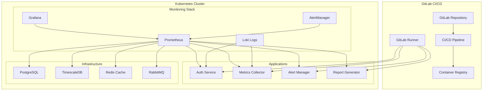

# 📝 LAB 2 - INTÉGRATION CI/CD + MONITORING

**Durée : 3h | Niveau Bloom 6-Créer | Framework Hassan Sprint 2+**

---

## 🎯 OBJECTIFS LAB 2

### Objectifs Pédagogiques (Niveau Bloom 6 - CRÉER)

- **Créer** pipelines CI/CD multi-services automatisés
- **Implémenter** observabilité complète (metrics, logs, traces)
- **Intégrer** monitoring et alerting production-ready
- **Développer** stratégies de déploiement avancées

### Objectifs Techniques

- Mettre en place GitLab CI/CD pour microservices
- Déployer stack monitoring Prometheus/Grafana
- Configurer alerting automatique et notifications
- Implémenter healthchecks et métriques custom

---

## 📋 CONTEXTE LAB 2

### Évolution Plateforme DevOps Analytics

Suite au LAB 1, votre architecture microservices est fonctionnelle. Maintenant, il faut :

1. **Automatiser** le déploiement avec CI/CD GitLab
2. **Monitorer** la performance et disponibilité 24/7
3. **Alerter** proactivement sur les anomalies
4. **Optimiser** la pipeline de delivery continue

### Prérequis LAB 1

- Cluster Kind avec 4 microservices fonctionnels
- Bases de données PostgreSQL, TimescaleDB, Redis
- API Gateway Nginx Ingress configuré
- Services communicants via DNS Kubernetes

---

## 🔄 ARCHITECTURE CI/CD + MONITORING



---

## 🛠️ IMPLÉMENTATION LAB 2

### Partie 1 : GitLab CI/CD Setup (75min)

#### 1.1 Repository Structure

Créez la structure GitLab optimale pour microservices :

```bash
# Structure repository DevOps Analytics
devops-analytics-platform/
├── .gitlab-ci.yml                    # Pipeline principal
├── docker-compose.dev.yml            # Développement local
├── README.md
├── services/
│   ├── auth-service/
│   │   ├── Dockerfile
│   │   ├── src/
│   │   └── tests/
│   ├── metrics-collector/
│   │   ├── Dockerfile
│   │   ├── src/
│   │   └── tests/
│   ├── alert-manager/
│   │   ├── Dockerfile
│   │   ├── src/
│   │   └── tests/
│   └── report-generator/
│       ├── Dockerfile
│       ├── src/
│       └── tests/
├── kubernetes/
│   ├── base/                         # Manifests Kustomize
│   ├── overlays/
│   │   ├── development/
│   │   ├── staging/
│   │   └── production/
│   └── monitoring/
├── ci-cd/
│   ├── scripts/
│   ├── templates/
│   └── configs/
└── docs/
    ├── architecture/
    └── deployment/
```

#### 1.2 Dockerfiles pour Services

**Auth Service Dockerfile :**

```dockerfile
# services/auth-service/Dockerfile
FROM node:18-alpine AS builder

WORKDIR /app
COPY package*.json ./
RUN npm ci --only=production

FROM node:18-alpine AS runtime
WORKDIR /app

# Sécurité
RUN addgroup -g 1001 -S nodejs && \
    adduser -S nextjs -u 1001

# Dependencies
COPY --from=builder /app/node_modules ./node_modules
COPY --chown=nextjs:nodejs . .

# Health check
HEALTHCHECK --interval=30s --timeout=3s --start-period=5s --retries=3 \
  CMD curl -f http://localhost:8080/health || exit 1

USER nextjs
EXPOSE 8080

CMD ["node", "src/server.js"]
```

**Mock pour LAB - Nginx avec configuration :**

```dockerfile
# services/auth-service/Dockerfile (mock pour LAB)
FROM nginx:alpine

# Configuration nginx
COPY nginx.conf /etc/nginx/nginx.conf
COPY html/ /usr/share/nginx/html/

# Health check
HEALTHCHECK --interval=30s --timeout=3s --start-period=5s --retries=3 \
  CMD wget --no-verbose --tries=1 --spider http://localhost:8080/health || exit 1

EXPOSE 8080

CMD ["nginx", "-g", "daemon off;"]
```

```nginx
# services/auth-service/nginx.conf
events {
    worker_connections 1024;
}

http {
    include       /etc/nginx/mime.types;
    default_type  application/octet-stream;

    server {
        listen 8080;
        server_name localhost;

        location / {
            root /usr/share/nginx/html;
            index index.html;
        }

        location /health {
            access_log off;
            return 200 "healthy\n";
            add_header Content-Type text/plain;
        }

        location /metrics {
            access_log off;
            return 200 "# AUTH SERVICE METRICS\nauth_requests_total 42\nauth_response_time_seconds 0.1\n";
            add_header Content-Type text/plain;
        }
    }
}
```

#### 1.3 Pipeline GitLab CI/CD

**Pipeline principal `.gitlab-ci.yml` :**

```yaml
# .gitlab-ci.yml
stages:
  - validate
  - build
  - test
  - security
  - deploy-dev
  - integration-tests
  - deploy-staging
  - deploy-production

variables:
  DOCKER_REGISTRY: $CI_REGISTRY
  DOCKER_DRIVER: overlay2
  KUBECONFIG: /etc/kubeconfig/config
  KUSTOMIZE_VERSION: '4.5.7'

# Templates
.docker_build_template: &docker_build
  image: docker:20.10.16
  services:
    - docker:20.10.16-dind
  before_script:
    - echo $CI_REGISTRY_PASSWORD | docker login -u $CI_REGISTRY_USER --password-stdin $CI_REGISTRY
  script:
    - cd services/$SERVICE_NAME
    - docker build -t $CI_REGISTRY_IMAGE/$SERVICE_NAME:$CI_COMMIT_SHA .
    - docker push $CI_REGISTRY_IMAGE/$SERVICE_NAME:$CI_COMMIT_SHA
    - docker tag $CI_REGISTRY_IMAGE/$SERVICE_NAME:$CI_COMMIT_SHA $CI_REGISTRY_IMAGE/$SERVICE_NAME:latest
    - docker push $CI_REGISTRY_IMAGE/$SERVICE_NAME:latest

.deploy_template: &deploy
  image: bitnami/kubectl:latest
  before_script:
    - curl -s "https://raw.githubusercontent.com/kubernetes-sigs/kustomize/master/hack/install_kustomize.sh" | bash
    - mv kustomize /usr/local/bin/
  script:
    - cd kubernetes/overlays/$ENVIRONMENT
    - kustomize edit set image $SERVICE_NAME=$CI_REGISTRY_IMAGE/$SERVICE_NAME:$CI_COMMIT_SHA
    - kubectl apply -k .
    - kubectl rollout status deployment/$SERVICE_NAME -n microservices --timeout=300s

# Validation
validate:yaml:
  stage: validate
  image: alpine:latest
  script:
    - apk add --no-cache yamllint
    - find kubernetes/ -name "*.yaml" -exec yamllint {} \;
  only:
    changes:
      - kubernetes/**/*

validate:dockerfile:
  stage: validate
  image: hadolint/hadolint:latest-debian
  script:
    - find services/ -name "Dockerfile" -exec hadolint {} \;
  only:
    changes:
      - services/**/*

# Build Services
build:auth-service:
  <<: *docker_build
  stage: build
  variables:
    SERVICE_NAME: auth-service
  only:
    changes:
      - services/auth-service/**/*

build:metrics-collector:
  <<: *docker_build
  stage: build
  variables:
    SERVICE_NAME: metrics-collector
  only:
    changes:
      - services/metrics-collector/**/*

build:alert-manager:
  <<: *docker_build
  stage: build
  variables:
    SERVICE_NAME: alert-manager
  only:
    changes:
      - services/alert-manager/**/*

build:report-generator:
  <<: *docker_build
  stage: build
  variables:
    SERVICE_NAME: report-generator
  only:
    changes:
      - services/report-generator/**/*

# Tests
test:unit:
  stage: test
  image: node:18-alpine
  script:
    - npm install
    - npm run test:unit
  coverage: '/Coverage: \d+\.\d+%/'
  artifacts:
    reports:
      junit: test-results.xml
      coverage_report:
        coverage_format: cobertura
        path: coverage/cobertura-coverage.xml

test:security:
  stage: security
  image: securecodewarrior/docker-security-scanning:latest
  script:
    - scan-images.sh $CI_REGISTRY_IMAGE
  artifacts:
    reports:
      security:
        - security-report.json

# Déploiement Development
deploy:dev:auth-service:
  <<: *deploy
  stage: deploy-dev
  variables:
    ENVIRONMENT: development
    SERVICE_NAME: auth-service
  environment:
    name: development
    url: http://api.devops-platform.local:8080
  only:
    changes:
      - services/auth-service/**/*

deploy:dev:metrics-collector:
  <<: *deploy
  stage: deploy-dev
  variables:
    ENVIRONMENT: development
    SERVICE_NAME: metrics-collector
  only:
    changes:
      - services/metrics-collector/**/*

# Tests d'intégration
integration-tests:
  stage: integration-tests
  image: postman/newman:alpine
  script:
    - newman run tests/integration/api-tests.json
      --environment tests/integration/dev-environment.json
      --reporters junit,cli
  artifacts:
    reports:
      junit: newman-report.xml
  dependencies:
    - deploy:dev:auth-service
    - deploy:dev:metrics-collector

# Déploiement Staging
deploy:staging:
  <<: *deploy
  stage: deploy-staging
  variables:
    ENVIRONMENT: staging
  environment:
    name: staging
    url: http://staging.devops-platform.com
  when: manual
  only:
    - main

# Déploiement Production
deploy:production:
  <<: *deploy
  stage: deploy-production
  variables:
    ENVIRONMENT: production
  environment:
    name: production
    url: http://devops-platform.com
  when: manual
  only:
    - main
  before_script:
    - echo "Deploying to PRODUCTION - requires approval"
```

#### 1.4 Kustomize Configuration

**Base Kustomization :**

```yaml
# kubernetes/base/kustomization.yaml
apiVersion: kustomize.config.k8s.io/v1beta1
kind: Kustomization

namespace: microservices

resources:
  - namespace.yaml
  - postgres-auth.yaml
  - timescaledb.yaml
  - redis.yaml
  - rabbitmq.yaml
  - auth-service.yaml
  - metrics-collector.yaml
  - alert-manager.yaml
  - report-generator.yaml
  - api-gateway.yaml

images:
  - name: auth-service
    newName: registry.gitlab.com/company/devops-platform/auth-service
    newTag: latest
  - name: metrics-collector
    newName: registry.gitlab.com/company/devops-platform/metrics-collector
    newTag: latest

commonLabels:
  app.kubernetes.io/managed-by: kustomize
  app.kubernetes.io/part-of: devops-analytics

configMapGenerator:
  - name: platform-config
    files:
      - config/platform.properties
```

**Development Overlay :**

```yaml
# kubernetes/overlays/development/kustomization.yaml
apiVersion: kustomize.config.k8s.io/v1beta1
kind: Kustomization

bases:
  - ../../base

patchesStrategicMerge:
  - replicas-patch.yaml
  - resources-patch.yaml

configMapGenerator:
  - name: platform-config
    behavior: merge
    literals:
      - LOG_LEVEL=DEBUG
      - ENVIRONMENT=development

commonLabels:
  environment: development
```

### Partie 2 : Stack Monitoring (90min)

#### 2.1 Prometheus Deployment

```yaml
# kubernetes/monitoring/prometheus.yaml
apiVersion: v1
kind: ServiceAccount
metadata:
  name: prometheus
  namespace: monitoring

---
apiVersion: rbac.authorization.k8s.io/v1
kind: ClusterRole
metadata:
  name: prometheus
rules:
  - apiGroups: ['']
    resources:
      - nodes
      - nodes/proxy
      - services
      - endpoints
      - pods
    verbs: ['get', 'list', 'watch']
  - apiGroups:
      - extensions
    resources:
      - ingresses
    verbs: ['get', 'list', 'watch']

---
apiVersion: rbac.authorization.k8s.io/v1
kind: ClusterRoleBinding
metadata:
  name: prometheus
roleRef:
  apiGroup: rbac.authorization.k8s.io
  kind: ClusterRole
  name: prometheus
subjects:
  - kind: ServiceAccount
    name: prometheus
    namespace: monitoring

---
apiVersion: v1
kind: ConfigMap
metadata:
  name: prometheus-config
  namespace: monitoring
data:
  prometheus.yml: |
    global:
      scrape_interval: 15s
      evaluation_interval: 15s

    rule_files:
      - "rules/*.yml"

    alerting:
      alertmanagers:
        - static_configs:
            - targets:
              - alertmanager:9093

    scrape_configs:
      # Prometheus self-monitoring
      - job_name: 'prometheus'
        static_configs:
          - targets: ['localhost:9090']

      # Kubernetes API server
      - job_name: 'kubernetes-apiservers'
        kubernetes_sd_configs:
          - role: endpoints
        scheme: https
        tls_config:
          ca_file: /var/run/secrets/kubernetes.io/serviceaccount/ca.crt
        bearer_token_file: /var/run/secrets/kubernetes.io/serviceaccount/token
        relabel_configs:
          - source_labels: [__meta_kubernetes_namespace, __meta_kubernetes_service_name, __meta_kubernetes_endpoint_port_name]
            action: keep
            regex: default;kubernetes;https

      # Kubernetes nodes
      - job_name: 'kubernetes-nodes'
        kubernetes_sd_configs:
          - role: node
        scheme: https
        tls_config:
          ca_file: /var/run/secrets/kubernetes.io/serviceaccount/ca.crt
        bearer_token_file: /var/run/secrets/kubernetes.io/serviceaccount/token

      # Microservices
      - job_name: 'auth-service'
        kubernetes_sd_configs:
          - role: endpoints
            namespaces:
              names:
                - microservices
        relabel_configs:
          - source_labels: [__meta_kubernetes_service_name]
            action: keep
            regex: auth-service
          - source_labels: [__meta_kubernetes_endpoint_port_name]
            action: keep
            regex: metrics

      - job_name: 'metrics-collector'
        kubernetes_sd_configs:
          - role: endpoints
            namespaces:
              names:
                - microservices
        relabel_configs:
          - source_labels: [__meta_kubernetes_service_name]
            action: keep
            regex: metrics-collector

      - job_name: 'alert-manager-service'
        kubernetes_sd_configs:
          - role: endpoints
            namespaces:
              names:
                - microservices
        relabel_configs:
          - source_labels: [__meta_kubernetes_service_name]
            action: keep
            regex: alert-manager

      - job_name: 'report-generator'
        kubernetes_sd_configs:
          - role: endpoints
            namespaces:
              names:
                - microservices
        relabel_configs:
          - source_labels: [__meta_kubernetes_service_name]
            action: keep
            regex: report-generator

      # Infrastructure
      - job_name: 'postgres-exporter'
        static_configs:
          - targets: ['postgres-exporter:9187']

      - job_name: 'redis-exporter'
        static_configs:
          - targets: ['redis-exporter:9121']

---
apiVersion: v1
kind: PersistentVolumeClaim
metadata:
  name: prometheus-pvc
  namespace: monitoring
spec:
  accessModes:
    - ReadWriteOnce
  resources:
    requests:
      storage: 10Gi

---
apiVersion: apps/v1
kind: Deployment
metadata:
  name: prometheus
  namespace: monitoring
  labels:
    app: prometheus
spec:
  replicas: 1
  selector:
    matchLabels:
      app: prometheus
  template:
    metadata:
      labels:
        app: prometheus
    spec:
      serviceAccountName: prometheus
      containers:
        - name: prometheus
          image: prom/prometheus:v2.40.0
          args:
            - '--config.file=/etc/prometheus/prometheus.yml'
            - '--storage.tsdb.path=/prometheus/'
            - '--web.console.libraries=/etc/prometheus/console_libraries'
            - '--web.console.templates=/etc/prometheus/consoles'
            - '--storage.tsdb.retention.time=30d'
            - '--web.enable-lifecycle'
            - '--web.enable-admin-api'
          ports:
            - containerPort: 9090
          volumeMounts:
            - name: prometheus-config
              mountPath: /etc/prometheus/
            - name: prometheus-storage
              mountPath: /prometheus/
          resources:
            requests:
              memory: '512Mi'
              cpu: '200m'
            limits:
              memory: '1Gi'
              cpu: '500m'
          livenessProbe:
            httpGet:
              path: /-/healthy
              port: 9090
            initialDelaySeconds: 30
            periodSeconds: 15
          readinessProbe:
            httpGet:
              path: /-/ready
              port: 9090
            initialDelaySeconds: 5
            periodSeconds: 5
      volumes:
        - name: prometheus-config
          configMap:
            name: prometheus-config
        - name: prometheus-storage
          persistentVolumeClaim:
            claimName: prometheus-pvc

---
apiVersion: v1
kind: Service
metadata:
  name: prometheus
  namespace: monitoring
  labels:
    app: prometheus
spec:
  selector:
    app: prometheus
  ports:
    - port: 9090
      targetPort: 9090
      name: web
  type: ClusterIP
```

#### 2.2 Grafana Dashboard

```yaml
# kubernetes/monitoring/grafana.yaml
apiVersion: v1
kind: Secret
metadata:
  name: grafana-admin
  namespace: monitoring
type: Opaque
data:
  admin-user: YWRtaW4= # admin
  admin-password: Z3JhZmFuYV9wYXNzd29yZA== # grafana_password

---
apiVersion: v1
kind: ConfigMap
metadata:
  name: grafana-datasources
  namespace: monitoring
data:
  datasources.yaml: |
    apiVersion: 1
    datasources:
    - name: Prometheus
      type: prometheus
      access: proxy
      url: http://prometheus:9090
      isDefault: true
    - name: Loki
      type: loki
      access: proxy
      url: http://loki:3100

---
apiVersion: v1
kind: ConfigMap
metadata:
  name: grafana-dashboards-config
  namespace: monitoring
data:
  dashboards.yaml: |
    apiVersion: 1
    providers:
    - name: 'default'
      orgId: 1
      folder: ''
      type: file
      disableDeletion: false
      updateIntervalSeconds: 10
      allowUiUpdates: true
      options:
        path: /var/lib/grafana/dashboards

---
apiVersion: v1
kind: ConfigMap
metadata:
  name: microservices-dashboard
  namespace: monitoring
data:
  microservices.json: |
    {
      "dashboard": {
        "id": null,
        "title": "DevOps Analytics Platform",
        "tags": ["microservices", "devops"],
        "timezone": "browser",
        "panels": [
          {
            "id": 1,
            "title": "Service Health",
            "type": "stat",
            "targets": [
              {
                "expr": "up{job=~\".*-service\"}",
                "legendFormat": "{{ job }}"
              }
            ],
            "fieldConfig": {
              "defaults": {
                "color": {
                  "mode": "thresholds"
                },
                "thresholds": {
                  "steps": [
                    {"color": "red", "value": 0},
                    {"color": "green", "value": 1}
                  ]
                }
              }
            },
            "gridPos": {"h": 8, "w": 12, "x": 0, "y": 0}
          },
          {
            "id": 2,
            "title": "Request Rate",
            "type": "graph",
            "targets": [
              {
                "expr": "rate(http_requests_total[5m])",
                "legendFormat": "{{ job }} - {{ method }}"
              }
            ],
            "gridPos": {"h": 8, "w": 12, "x": 12, "y": 0}
          },
          {
            "id": 3,
            "title": "Response Time",
            "type": "graph",
            "targets": [
              {
                "expr": "histogram_quantile(0.95, rate(http_request_duration_seconds_bucket[5m]))",
                "legendFormat": "{{ job }} - 95th percentile"
              }
            ],
            "gridPos": {"h": 8, "w": 12, "x": 0, "y": 8}
          },
          {
            "id": 4,
            "title": "Error Rate",
            "type": "graph",
            "targets": [
              {
                "expr": "rate(http_requests_total{status=~\"5..\"}[5m]) / rate(http_requests_total[5m])",
                "legendFormat": "{{ job }}"
              }
            ],
            "gridPos": {"h": 8, "w": 12, "x": 12, "y": 8}
          }
        ],
        "time": {
          "from": "now-1h",
          "to": "now"
        },
        "refresh": "30s"
      }
    }

---
apiVersion: v1
kind: PersistentVolumeClaim
metadata:
  name: grafana-pvc
  namespace: monitoring
spec:
  accessModes:
    - ReadWriteOnce
  resources:
    requests:
      storage: 5Gi

---
apiVersion: apps/v1
kind: Deployment
metadata:
  name: grafana
  namespace: monitoring
  labels:
    app: grafana
spec:
  replicas: 1
  selector:
    matchLabels:
      app: grafana
  template:
    metadata:
      labels:
        app: grafana
    spec:
      containers:
        - name: grafana
          image: grafana/grafana:9.3.0
          env:
            - name: GF_SECURITY_ADMIN_USER
              valueFrom:
                secretKeyRef:
                  name: grafana-admin
                  key: admin-user
            - name: GF_SECURITY_ADMIN_PASSWORD
              valueFrom:
                secretKeyRef:
                  name: grafana-admin
                  key: admin-password
            - name: GF_INSTALL_PLUGINS
              value: 'grafana-kubernetes-app'
          ports:
            - containerPort: 3000
              name: web
          volumeMounts:
            - name: grafana-storage
              mountPath: /var/lib/grafana
            - name: grafana-datasources
              mountPath: /etc/grafana/provisioning/datasources
            - name: grafana-dashboards-config
              mountPath: /etc/grafana/provisioning/dashboards
            - name: grafana-dashboards
              mountPath: /var/lib/grafana/dashboards
          resources:
            requests:
              memory: '256Mi'
              cpu: '100m'
            limits:
              memory: '512Mi'
              cpu: '300m'
          livenessProbe:
            httpGet:
              path: /api/health
              port: 3000
            initialDelaySeconds: 30
            periodSeconds: 10
          readinessProbe:
            httpGet:
              path: /api/health
              port: 3000
            initialDelaySeconds: 5
            periodSeconds: 5
      volumes:
        - name: grafana-storage
          persistentVolumeClaim:
            claimName: grafana-pvc
        - name: grafana-datasources
          configMap:
            name: grafana-datasources
        - name: grafana-dashboards-config
          configMap:
            name: grafana-dashboards-config
        - name: grafana-dashboards
          configMap:
            name: microservices-dashboard

---
apiVersion: v1
kind: Service
metadata:
  name: grafana
  namespace: monitoring
  labels:
    app: grafana
spec:
  selector:
    app: grafana
  ports:
    - port: 3000
      targetPort: 3000
      name: web
  type: ClusterIP
```

#### 2.3 AlertManager Configuration

```yaml
# kubernetes/monitoring/alertmanager.yaml
apiVersion: v1
kind: ConfigMap
metadata:
  name: alertmanager-config
  namespace: monitoring
data:
  alertmanager.yml: |
    global:
      smtp_smarthost: 'localhost:587'
      smtp_from: 'alerts@devops-platform.com'

    route:
      group_by: ['alertname']
      group_wait: 10s
      group_interval: 10s
      repeat_interval: 1h
      receiver: 'web.hook'
      routes:
      - match:
          severity: critical
        receiver: 'critical-alerts'
      - match:
          severity: warning
        receiver: 'warning-alerts'

    receivers:
    - name: 'web.hook'
      webhook_configs:
      - url: 'http://alert-manager.microservices.svc.cluster.local:8082/webhook'

    - name: 'critical-alerts'
      email_configs:
      - to: 'oncall@devops-platform.com'
        subject: '[CRITICAL] {{ .GroupLabels.alertname }}'
        body: |
          {{ range .Alerts }}
          Alert: {{ .Annotations.summary }}
          Description: {{ .Annotations.description }}
          {{ end }}
      slack_configs:
      - api_url: 'https://hooks.slack.com/services/YOUR/SLACK/WEBHOOK'
        channel: '#alerts-critical'
        title: '[CRITICAL] {{ .GroupLabels.alertname }}'

    - name: 'warning-alerts'
      email_configs:
      - to: 'team@devops-platform.com'
        subject: '[WARNING] {{ .GroupLabels.alertname }}'

---
apiVersion: apps/v1
kind: Deployment
metadata:
  name: alertmanager
  namespace: monitoring
  labels:
    app: alertmanager
spec:
  replicas: 1
  selector:
    matchLabels:
      app: alertmanager
  template:
    metadata:
      labels:
        app: alertmanager
    spec:
      containers:
        - name: alertmanager
          image: prom/alertmanager:v0.25.0
          args:
            - '--config.file=/etc/alertmanager/alertmanager.yml'
            - '--storage.path=/alertmanager'
            - '--web.external-url=http://alertmanager.monitoring.svc.cluster.local:9093'
          ports:
            - containerPort: 9093
              name: web
          volumeMounts:
            - name: alertmanager-config
              mountPath: /etc/alertmanager
          resources:
            requests:
              memory: '128Mi'
              cpu: '100m'
            limits:
              memory: '256Mi'
              cpu: '200m'
          livenessProbe:
            httpGet:
              path: /-/healthy
              port: 9093
            initialDelaySeconds: 30
            periodSeconds: 15
          readinessProbe:
            httpGet:
              path: /-/ready
              port: 9093
            initialDelaySeconds: 5
            periodSeconds: 5
      volumes:
        - name: alertmanager-config
          configMap:
            name: alertmanager-config

---
apiVersion: v1
kind: Service
metadata:
  name: alertmanager
  namespace: monitoring
  labels:
    app: alertmanager
spec:
  selector:
    app: alertmanager
  ports:
    - port: 9093
      targetPort: 9093
      name: web
  type: ClusterIP
```

### Partie 3 : Alerting Rules et Tests (45min)

#### 3.1 Règles d'Alerting Prometheus

```yaml
# kubernetes/monitoring/prometheus-rules.yaml
apiVersion: v1
kind: ConfigMap
metadata:
  name: prometheus-rules
  namespace: monitoring
data:
  microservices.yml: |
    groups:
    - name: microservices.rules
      rules:
      
      # Service Down
      - alert: ServiceDown
        expr: up{job=~".*-service"} == 0
        for: 1m
        labels:
          severity: critical
        annotations:
          summary: "Service {{ $labels.job }} is down"
          description: "Service {{ $labels.job }} has been down for more than 1 minute."
          
      # High Error Rate
      - alert: HighErrorRate
        expr: |
          (
            rate(http_requests_total{status=~"5.."}[5m]) /
            rate(http_requests_total[5m])
          ) > 0.1
        for: 5m
        labels:
          severity: warning
        annotations:
          summary: "High error rate for {{ $labels.job }}"
          description: "Error rate is {{ $value | humanizePercentage }} for {{ $labels.job }}"
          
      # High Response Time
      - alert: HighLatency
        expr: |
          histogram_quantile(0.95,
            rate(http_request_duration_seconds_bucket[5m])
          ) > 0.5
        for: 10m
        labels:
          severity: warning
        annotations:
          summary: "High latency for {{ $labels.job }}"
          description: "95th percentile latency is {{ $value }}s for {{ $labels.job }}"
          
      # Database Connection Issues
      - alert: DatabaseConnectionHigh
        expr: |
          (
            rate(database_connections_active[5m]) /
            database_connections_max
          ) > 0.8
        for: 5m
        labels:
          severity: warning
        annotations:
          summary: "High database connection usage"
          description: "Database connection usage is {{ $value | humanizePercentage }}"
          
      # Memory Usage High
      - alert: HighMemoryUsage
        expr: |
          (
            container_memory_usage_bytes{pod=~".*-service-.*"} /
            container_spec_memory_limit_bytes
          ) > 0.9
        for: 10m
        labels:
          severity: warning
        annotations:
          summary: "High memory usage for {{ $labels.pod }}"
          description: "Memory usage is {{ $value | humanizePercentage }} for pod {{ $labels.pod }}"
          
      # Disk Space Low
      - alert: DiskSpaceLow
        expr: |
          (
            node_filesystem_avail_bytes{mountpoint="/"} /
            node_filesystem_size_bytes{mountpoint="/"}
          ) < 0.1
        for: 5m
        labels:
          severity: critical
        annotations:
          summary: "Low disk space on {{ $labels.instance }}"
          description: "Disk space is {{ $value | humanizePercentage }} available"

    - name: business.rules
      rules:
      
      # Metrics Ingestion Rate
      - record: metrics_ingestion_rate
        expr: rate(metrics_ingested_total[5m])
        
      # Active Users
      - record: active_users_5m
        expr: increase(auth_successful_logins_total[5m])
        
      # Alert Processing Time
      - record: alert_processing_time_avg
        expr: rate(alert_processing_duration_seconds_sum[5m]) / rate(alert_processing_duration_seconds_count[5m])
```

#### 3.2 Service Monitors pour Métriques Custom

```yaml
# kubernetes/monitoring/servicemonitors.yaml
apiVersion: monitoring.coreos.com/v1
kind: ServiceMonitor
metadata:
  name: auth-service-monitor
  namespace: monitoring
  labels:
    app: auth-service
spec:
  selector:
    matchLabels:
      app: auth-service
  endpoints:
    - port: metrics
      path: /metrics
      interval: 15s
      honorLabels: true

---
apiVersion: monitoring.coreos.com/v1
kind: ServiceMonitor
metadata:
  name: metrics-collector-monitor
  namespace: monitoring
  labels:
    app: metrics-collector
spec:
  selector:
    matchLabels:
      app: metrics-collector
  endpoints:
    - port: metrics
      path: /metrics
      interval: 15s
      honorLabels: true

---
apiVersion: monitoring.coreos.com/v1
kind: ServiceMonitor
metadata:
  name: alert-manager-monitor
  namespace: monitoring
  labels:
    app: alert-manager
spec:
  selector:
    matchLabels:
      app: alert-manager
  endpoints:
    - port: metrics
      path: /metrics
      interval: 15s
      honorLabels: true
```

#### 3.3 Tests Monitoring et Alerting

```bash
#!/bin/bash
# test-monitoring.sh

echo "=== Test Stack Monitoring ==="

# Test 1: Prometheus Health
echo "Testing Prometheus..."
kubectl port-forward -n monitoring svc/prometheus 9090:9090 &
PROM_PID=$!
sleep 5

PROM_STATUS=$(curl -s http://localhost:9090/-/healthy)
if [[ $PROM_STATUS == "Prometheus is Healthy." ]]; then
    echo "✅ Prometheus: Healthy"
else
    echo "❌ Prometheus: Unhealthy"
fi

kill $PROM_PID

# Test 2: Grafana Health
echo "Testing Grafana..."
kubectl port-forward -n monitoring svc/grafana 3000:3000 &
GRAF_PID=$!
sleep 5

GRAF_STATUS=$(curl -s http://localhost:3000/api/health | jq -r '.status')
if [[ $GRAF_STATUS == "ok" ]]; then
    echo "✅ Grafana: Healthy"
else
    echo "❌ Grafana: Unhealthy"
fi

kill $GRAF_PID

# Test 3: Métriques Services
echo "Testing Service Metrics..."
for service in auth-service metrics-collector alert-manager report-generator; do
    echo "Checking $service metrics..."

    # Port-forward vers service
    kubectl port-forward -n microservices svc/$service 8080:8080 &
    SERVICE_PID=$!
    sleep 3

    # Test endpoint metrics
    METRICS=$(curl -s http://localhost:8080/metrics)
    if [[ $METRICS == *"# AUTH SERVICE METRICS"* ]] || [[ $METRICS == *"# HELP"* ]]; then
        echo "✅ $service: Metrics available"
    else
        echo "❌ $service: No metrics"
    fi

    kill $SERVICE_PID
done

# Test 4: Alerting Rules
echo "Testing Alerting Rules..."
kubectl port-forward -n monitoring svc/prometheus 9090:9090 &
PROM_PID=$!
sleep 5

RULES=$(curl -s http://localhost:9090/api/v1/rules | jq '.data.groups | length')
if [[ $RULES -gt 0 ]]; then
    echo "✅ Alerting Rules: $RULES groups loaded"
else
    echo "❌ Alerting Rules: No rules loaded"
fi

kill $PROM_PID

# Test 5: Simulation Alerte
echo "Testing Alert Simulation..."

# Arrêter un service pour déclencher alerte
kubectl scale deployment auth-service -n microservices --replicas=0
echo "Service auth-service stopped - waiting for alert..."
sleep 90

# Redémarrer service
kubectl scale deployment auth-service -n microservices --replicas=2
kubectl wait --for=condition=ready pod -l app=auth-service -n microservices --timeout=120s

echo "Service auth-service restored"

echo "=== Monitoring Tests Complete ==="
```

---

## 📊 LIVRABLES LAB 2

### 1. Pipeline CI/CD GitLab

Créez repository avec :

```
devops-analytics-cicd/
├── .gitlab-ci.yml              # Pipeline principal
├── services/
│   ├── auth-service/
│   │   ├── Dockerfile
│   │   ├── nginx.conf
│   │   └── html/index.html
│   ├── metrics-collector/
│   ├── alert-manager/
│   └── report-generator/
├── kubernetes/
│   ├── base/
│   └── overlays/
│       ├── development/
│       ├── staging/
│       └── production/
├── ci-cd/
│   ├── scripts/
│   └── tests/
└── docs/
    ├── CICD.md
    └── MONITORING.md
```

### 2. Stack Monitoring Complète

```bash
# Déploiement monitoring
kubectl create namespace monitoring
kubectl apply -f kubernetes/monitoring/prometheus.yaml
kubectl apply -f kubernetes/monitoring/grafana.yaml
kubectl apply -f kubernetes/monitoring/alertmanager.yaml
kubectl apply -f kubernetes/monitoring/prometheus-rules.yaml
kubectl apply -f kubernetes/monitoring/servicemonitors.yaml
```

### 3. Documentation Opérationnelle

**CICD.md :**

- Pipeline GitLab étapes détaillées
- Stratégies déploiement (rolling, blue-green)
- Tests automatisés et quality gates
- Rollback procedures

**MONITORING.md :**

- Architecture stack monitoring
- Dashboards Grafana essentiels
- Règles d'alerting et escalade
- Troubleshooting runbooks

---

## 🎯 ÉVALUATION LAB 2

### Critères Techniques (18 points)

| Critère           | Points | Description                                |
| ----------------- | ------ | ------------------------------------------ |
| Pipeline CI/CD    | 5      | GitLab pipeline fonctionnel multi-services |
| Monitoring Stack  | 4      | Prometheus/Grafana déployés                |
| Alerting          | 3      | Rules et notifications configurées         |
| Métriques Custom  | 3      | Services exposent métriques /metrics       |
| Tests Automatisés | 3      | Integration tests et quality gates         |

### Critères Architecture (8 points)

| Critère       | Points | Description                         |
| ------------- | ------ | ----------------------------------- |
| GitOps        | 2      | Kustomize et déploiement déclaratif |
| Observabilité | 2      | Logs, métriques, traces intégrés    |
| Security      | 2      | Scans sécurité et RBAC              |
| Documentation | 2      | Runbooks et procédures claires      |

### Critères Bloom Niveau 6 (4 points)

| Critère               | Points | Description                      |
| --------------------- | ------ | -------------------------------- |
| Création pipeline     | 2      | Pipeline original et optimisé    |
| Innovation monitoring | 1      | Dashboards et alertes créatives  |
| Intégration complète  | 1      | Services, CI/CD, monitoring unis |

**Total : 30 points | Seuil : 23 points (75%)**

---

## 🚀 SUITE LAB 3

### LAB 3 - Production et Optimisation (2h)

- Performance tuning et autoscaling
- Security hardening et compliance
- Disaster recovery et backup
- Cost optimization et right-sizing

---

**LAB 2 Semaine 4 - CI/CD + Monitoring | Framework Hassan Sprint 2+ | 3h | Bloom 6-Créer**
