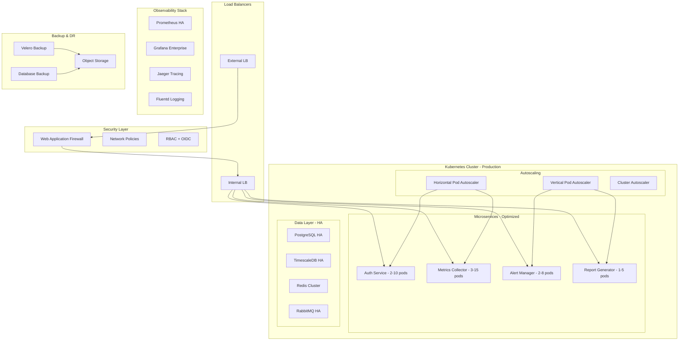

# 🏭 LAB 3 - PRODUCTION & OPTIMISATION

**Durée : 2h | Niveau Bloom 6-Créer | Framework Hassan Sprint 2+**

---

## 🎯 OBJECTIFS LAB 3

### Objectifs Pédagogiques (Niveau Bloom 6 - CRÉER)

- **Optimiser** performances et ressources en production
- **Sécuriser** infrastructure et applications critiques
- **Implémenter** stratégies de récupération d'urgence
- **Concevoir** solutions cost-effective et scalables

### Objectifs Techniques

- Mettre en place autoscaling horizontal et vertical
- Configurer security policies et compliance
- Implémenter backup/restore automatisé
- Optimiser coûts et performances cluster

---

## 📋 CONTEXTE LAB 3

### Production-Ready DevOps Analytics Platform

Votre plateforme microservices est maintenant :

- ✅ **Déployée** avec architecture complète (LAB 1)
- ✅ **Monitorée** avec CI/CD automatisé (LAB 2)
- 🎯 **Production-Ready** avec optimisations avancées (LAB 3)

### Challenges Production

1. **Performance** : Gérer charge variable et pics de trafic
2. **Sécurité** : Protéger données sensibles et accès
3. **Résilience** : Assurer continuité de service 99.9%
4. **Coûts** : Optimiser ressources sans dégradation

---

## 🏗️ ARCHITECTURE PRODUCTION OPTIMISÉE



---

## 🛠️ IMPLÉMENTATION LAB 3

### Partie 1 : Autoscaling et Performance (45min)

#### 1.1 Horizontal Pod Autoscaler (HPA)

```yaml
# kubernetes/production/hpa-auth-service.yaml
apiVersion: autoscaling/v2
kind: HorizontalPodAutoscaler
metadata:
  name: auth-service-hpa
  namespace: microservices
spec:
  scaleTargetRef:
    apiVersion: apps/v1
    kind: Deployment
    name: auth-service
  minReplicas: 2
  maxReplicas: 10
  metrics:
    - type: Resource
      resource:
        name: cpu
        target:
          type: Utilization
          averageUtilization: 70
    - type: Resource
      resource:
        name: memory
        target:
          type: Utilization
          averageUtilization: 80
    - type: Pods
      pods:
        metric:
          name: nginx_active_connections
        target:
          type: AverageValue
          averageValue: '50'
  behavior:
    scaleDown:
      stabilizationWindowSeconds: 300
      policies:
        - type: Percent
          value: 50
          periodSeconds: 60
    scaleUp:
      stabilizationWindowSeconds: 60
      policies:
        - type: Percent
          value: 100
          periodSeconds: 30
        - type: Pods
          value: 2
          periodSeconds: 60

---
apiVersion: autoscaling/v2
kind: HorizontalPodAutoscaler
metadata:
  name: metrics-collector-hpa
  namespace: microservices
spec:
  scaleTargetRef:
    apiVersion: apps/v1
    kind: Deployment
    name: metrics-collector
  minReplicas: 3
  maxReplicas: 15
  metrics:
    - type: Resource
      resource:
        name: cpu
        target:
          type: Utilization
          averageUtilization: 60
    - type: Resource
      resource:
        name: memory
        target:
          type: Utilization
          averageUtilization: 75
    - type: Object
      object:
        metric:
          name: rabbitmq_queue_depth
        describedObject:
          apiVersion: v1
          kind: Service
          name: rabbitmq
        target:
          type: AverageValue
          averageValue: '1000'
```

#### 1.2 Vertical Pod Autoscaler (VPA)

```yaml
# kubernetes/production/vpa-config.yaml
apiVersion: autoscaling.k8s.io/v1
kind: VerticalPodAutoscaler
metadata:
  name: alert-manager-vpa
  namespace: microservices
spec:
  targetRef:
    apiVersion: apps/v1
    kind: Deployment
    name: alert-manager
  updatePolicy:
    updateMode: 'Auto'
  resourcePolicy:
    containerPolicies:
      - containerName: alert-manager
        minAllowed:
          cpu: 100m
          memory: 128Mi
        maxAllowed:
          cpu: 500m
          memory: 1Gi
        controlledResources: ['cpu', 'memory']

---
apiVersion: autoscaling.k8s.io/v1
kind: VerticalPodAutoscaler
metadata:
  name: report-generator-vpa
  namespace: microservices
spec:
  targetRef:
    apiVersion: apps/v1
    kind: Deployment
    name: report-generator
  updatePolicy:
    updateMode: 'Auto'
  resourcePolicy:
    containerPolicies:
      - containerName: report-generator
        minAllowed:
          cpu: 200m
          memory: 256Mi
        maxAllowed:
          cpu: 1000m
          memory: 2Gi
        controlledResources: ['cpu', 'memory']
```

#### 1.3 Resource Quotas et Limits

```yaml
# kubernetes/production/resource-quotas.yaml
apiVersion: v1
kind: ResourceQuota
metadata:
  name: microservices-quota
  namespace: microservices
spec:
  hard:
    requests.cpu: '4'
    requests.memory: 8Gi
    limits.cpu: '8'
    limits.memory: 16Gi
    persistentvolumeclaims: '10'
    services: '10'
    secrets: '20'
    pods: '50'

---
apiVersion: v1
kind: LimitRange
metadata:
  name: microservices-limits
  namespace: microservices
spec:
  limits:
    - default:
        cpu: 500m
        memory: 512Mi
      defaultRequest:
        cpu: 100m
        memory: 128Mi
      type: Container
    - default:
        storage: 1Gi
      type: PersistentVolumeClaim
```

#### 1.4 Performance Testing et Load Generation

```yaml
# kubernetes/testing/load-test.yaml
apiVersion: batch/v1
kind: Job
metadata:
  name: load-test-auth-service
  namespace: microservices
spec:
  template:
    spec:
      containers:
        - name: load-test
          image: appropriate/curl:latest
          command:
            - /bin/sh
            - -c
            - |
              echo "Starting load test for Auth Service..."

              # Test configuration
              SERVICE_URL="http://auth-service:8080"
              CONCURRENT_USERS=50
              REQUESTS_PER_USER=100

              # Function to generate load
              generate_load() {
                local user_id=$1
                for i in $(seq 1 $REQUESTS_PER_USER); do
                  # Health check requests
                  curl -s "$SERVICE_URL/health" > /dev/null
                  
                  # Metrics requests
                  curl -s "$SERVICE_URL/metrics" > /dev/null
                  
                  # Simulated login requests
                  curl -s -X POST "$SERVICE_URL/login" \
                    -H "Content-Type: application/json" \
                    -d '{"username":"user'$user_id'","password":"test"}' > /dev/null
                  
                  # Small delay between requests
                  sleep 0.1
                done
                
                echo "User $user_id completed $REQUESTS_PER_USER requests"
              }

              # Launch concurrent users
              echo "Launching $CONCURRENT_USERS concurrent users..."
              for user in $(seq 1 $CONCURRENT_USERS); do
                generate_load $user &
              done

              # Wait for all background jobs
              wait

              echo "Load test completed!"
              echo "Total requests: $(($CONCURRENT_USERS * $REQUESTS_PER_USER))"

              # Check autoscaling results
              echo "Checking autoscaling status..."
              kubectl get hpa -n microservices
              kubectl get pods -n microservices -l app=auth-service
      restartPolicy: Never
  backoffLimit: 1
```

### Partie 2 : Security Hardening (45min)

#### 2.1 Network Policies

```yaml
# kubernetes/security/network-policies.yaml
apiVersion: networking.k8s.io/v1
kind: NetworkPolicy
metadata:
  name: auth-service-netpol
  namespace: microservices
spec:
  podSelector:
    matchLabels:
      app: auth-service
  policyTypes:
    - Ingress
    - Egress
  ingress:
    - from:
        - namespaceSelector:
            matchLabels:
              name: ingress-nginx
        - podSelector:
            matchLabels:
              app: metrics-collector
        - podSelector:
            matchLabels:
              app: alert-manager
      ports:
        - protocol: TCP
          port: 8080
  egress:
    - to:
        - podSelector:
            matchLabels:
              app: postgres-auth
      ports:
        - protocol: TCP
          port: 5432
    - to: []
      ports:
        - protocol: TCP
          port: 53
        - protocol: UDP
          port: 53

---
apiVersion: networking.k8s.io/v1
kind: NetworkPolicy
metadata:
  name: database-netpol
  namespace: microservices
spec:
  podSelector:
    matchLabels:
      tier: database
  policyTypes:
    - Ingress
  ingress:
    - from:
        - podSelector:
            matchLabels:
              tier: application
      ports:
        - protocol: TCP
          port: 5432

---
apiVersion: networking.k8s.io/v1
kind: NetworkPolicy
metadata:
  name: deny-all-default
  namespace: microservices
spec:
  podSelector: {}
  policyTypes:
    - Ingress
    - Egress
```

#### 2.2 Pod Security Standards

```yaml
# kubernetes/security/pod-security.yaml
apiVersion: v1
kind: Namespace
metadata:
  name: microservices
  labels:
    pod-security.kubernetes.io/enforce: restricted
    pod-security.kubernetes.io/audit: restricted
    pod-security.kubernetes.io/warn: restricted

---
apiVersion: v1
kind: ServiceAccount
metadata:
  name: auth-service-sa
  namespace: microservices
automountServiceAccountToken: false

---
apiVersion: v1
kind: ServiceAccount
metadata:
  name: metrics-collector-sa
  namespace: microservices
automountServiceAccountToken: false

---
apiVersion: policy/v1
kind: PodDisruptionBudget
metadata:
  name: auth-service-pdb
  namespace: microservices
spec:
  minAvailable: 1
  selector:
    matchLabels:
      app: auth-service

---
apiVersion: policy/v1
kind: PodDisruptionBudget
metadata:
  name: metrics-collector-pdb
  namespace: microservices
spec:
  maxUnavailable: 25%
  selector:
    matchLabels:
      app: metrics-collector
```

#### 2.3 Secrets Management et RBAC

```yaml
# kubernetes/security/rbac.yaml
apiVersion: rbac.authorization.k8s.io/v1
kind: Role
metadata:
  namespace: microservices
  name: microservice-reader
rules:
  - apiGroups: ['']
    resources: ['configmaps', 'secrets']
    verbs: ['get', 'list']
  - apiGroups: ['']
    resources: ['services', 'endpoints']
    verbs: ['get', 'list', 'watch']

---
apiVersion: rbac.authorization.k8s.io/v1
kind: RoleBinding
metadata:
  name: auth-service-binding
  namespace: microservices
subjects:
  - kind: ServiceAccount
    name: auth-service-sa
    namespace: microservices
roleRef:
  kind: Role
  name: microservice-reader
  apiGroup: rbac.authorization.k8s.io

---
apiVersion: v1
kind: Secret
metadata:
  name: database-credentials
  namespace: microservices
type: Opaque
data:
  postgres-auth-user: YXV0aF91c2Vy # auth_user
  postgres-auth-password: YXV0aF9wYXNzd29yZA== # auth_password
  timescale-user: bWV0cmljc191c2Vy # metrics_user
  timescale-password: bWV0cmljc19wYXNzd29yZA== # metrics_password
  redis-password: cmVkaXNfcGFzc3dvcmQ= # redis_password
  rabbitmq-user: cmFiYml0X3VzZXI= # rabbit_user
  rabbitmq-password: cmFiYml0X3Bhc3N3b3Jk # rabbit_password

---
apiVersion: external-secrets.io/v1beta1
kind: SecretStore
metadata:
  name: vault-backend
  namespace: microservices
spec:
  provider:
    vault:
      server: 'http://vault.vault.svc.cluster.local:8200'
      path: 'secret'
      version: 'v2'
      auth:
        kubernetes:
          mountPath: 'kubernetes'
          role: 'microservices'
```

### Partie 3 : Backup et Disaster Recovery (30min)

#### 3.1 Velero Backup Configuration

```yaml
# kubernetes/backup/velero-schedule.yaml
apiVersion: velero.io/v1
kind: Schedule
metadata:
  name: microservices-daily-backup
  namespace: velero
spec:
  schedule: '0 2 * * *' # 2 AM daily
  template:
    includedNamespaces:
      - microservices
      - monitoring
    excludedResources:
      - events
      - pods
      - replicasets
    storageLocation: default
    ttl: 720h # 30 days
    snapshotVolumes: true

---
apiVersion: velero.io/v1
kind: Schedule
metadata:
  name: cluster-weekly-backup
  namespace: velero
spec:
  schedule: '0 1 * * 0' # 1 AM Sunday
  template:
    includeClusterResources: true
    excludedNamespaces:
      - velero
      - kube-system
    storageLocation: default
    ttl: 2160h # 90 days
```

#### 3.2 Database Backup Jobs

```yaml
# kubernetes/backup/database-backup.yaml
apiVersion: batch/v1
kind: CronJob
metadata:
  name: postgres-backup
  namespace: microservices
spec:
  schedule: '0 3 * * *' # 3 AM daily
  jobTemplate:
    spec:
      template:
        spec:
          containers:
            - name: postgres-backup
              image: postgres:15-alpine
              env:
                - name: PGPASSWORD
                  valueFrom:
                    secretKeyRef:
                      name: database-credentials
                      key: postgres-auth-password
              command:
                - /bin/sh
                - -c
                - |
                  export BACKUP_FILE="/backup/postgres-auth-$(date +%Y%m%d_%H%M%S).sql"

                  echo "Starting PostgreSQL backup..."
                  pg_dump -h postgres-auth -U auth_user -d auth_db > $BACKUP_FILE

                  if [ $? -eq 0 ]; then
                    echo "Backup completed successfully: $BACKUP_FILE"
                    
                    # Compress backup
                    gzip $BACKUP_FILE
                    
                    # Keep only last 7 days
                    find /backup -name "postgres-auth-*.sql.gz" -mtime +7 -delete
                    
                    echo "Backup retention applied"
                  else
                    echo "Backup failed!"
                    exit 1
                  fi
              volumeMounts:
                - name: backup-storage
                  mountPath: /backup
          volumes:
            - name: backup-storage
              persistentVolumeClaim:
                claimName: backup-pvc
          restartPolicy: OnFailure

---
apiVersion: batch/v1
kind: CronJob
metadata:
  name: timescaledb-backup
  namespace: microservices
spec:
  schedule: '0 4 * * *' # 4 AM daily
  jobTemplate:
    spec:
      template:
        spec:
          containers:
            - name: timescaledb-backup
              image: timescale/timescaledb:latest-pg15
              env:
                - name: PGPASSWORD
                  valueFrom:
                    secretKeyRef:
                      name: database-credentials
                      key: timescale-password
              command:
                - /bin/sh
                - -c
                - |
                  export BACKUP_FILE="/backup/timescaledb-$(date +%Y%m%d_%H%M%S).sql"

                  echo "Starting TimescaleDB backup..."
                  pg_dump -h timescaledb -U metrics_user -d metrics_db > $BACKUP_FILE

                  if [ $? -eq 0 ]; then
                    echo "Backup completed successfully: $BACKUP_FILE"
                    gzip $BACKUP_FILE
                    find /backup -name "timescaledb-*.sql.gz" -mtime +7 -delete
                  else
                    echo "Backup failed!"
                    exit 1
                  fi
              volumeMounts:
                - name: backup-storage
                  mountPath: /backup
          volumes:
            - name: backup-storage
              persistentVolumeClaim:
                claimName: backup-pvc
          restartPolicy: OnFailure

---
apiVersion: v1
kind: PersistentVolumeClaim
metadata:
  name: backup-pvc
  namespace: microservices
spec:
  accessModes:
    - ReadWriteOnce
  resources:
    requests:
      storage: 50Gi
  storageClassName: fast-ssd
```

#### 3.3 Disaster Recovery Procedures

```bash
#!/bin/bash
# disaster-recovery.sh

echo "=== Disaster Recovery Procedures ==="

# Function: Backup current state
backup_current_state() {
    echo "1. Creating emergency backup..."

    # Create immediate backup
    velero backup create emergency-backup-$(date +%Y%m%d-%H%M%S) \
        --include-namespaces microservices,monitoring \
        --wait

    # Export configurations
    kubectl get all -n microservices -o yaml > microservices-backup.yaml
    kubectl get all -n monitoring -o yaml > monitoring-backup.yaml

    echo "Emergency backup completed"
}

# Function: Restore from backup
restore_from_backup() {
    local backup_name=$1

    echo "2. Restoring from backup: $backup_name"

    # Restore using Velero
    velero restore create restore-$(date +%Y%m%d-%H%M%S) \
        --from-backup $backup_name \
        --wait

    # Verify restoration
    kubectl get pods -n microservices
    kubectl get pods -n monitoring
}

# Function: Database recovery
recover_databases() {
    echo "3. Recovering databases..."

    # PostgreSQL recovery
    echo "Recovering PostgreSQL..."
    kubectl exec -n microservices deployment/postgres-auth -- \
        psql -U auth_user -d auth_db -c "\l"

    # TimescaleDB recovery
    echo "Recovering TimescaleDB..."
    kubectl exec -n microservices deployment/timescaledb -- \
        psql -U metrics_user -d metrics_db -c "SELECT version();"

    # Redis recovery
    echo "Checking Redis..."
    kubectl exec -n microservices deployment/redis -- redis-cli ping

    # RabbitMQ recovery
    echo "Checking RabbitMQ..."
    kubectl exec -n microservices deployment/rabbitmq -- rabbitmqctl status
}

# Function: Service health verification
verify_service_health() {
    echo "4. Verifying service health..."

    services=("auth-service" "metrics-collector" "alert-manager" "report-generator")

    for service in "${services[@]}"; do
        echo "Checking $service..."

        # Wait for pods to be ready
        kubectl wait --for=condition=ready pod -l app=$service -n microservices --timeout=300s

        # Test health endpoint
        kubectl port-forward -n microservices svc/$service 8080:8080 &
        PF_PID=$!
        sleep 5

        HEALTH=$(curl -s http://localhost:8080/health)
        if [[ $HEALTH == "healthy" ]]; then
            echo "✅ $service: Healthy"
        else
            echo "❌ $service: Unhealthy"
        fi

        kill $PF_PID
    done
}

# Function: Monitoring stack verification
verify_monitoring() {
    echo "5. Verifying monitoring stack..."

    # Prometheus
    kubectl wait --for=condition=ready pod -l app=prometheus -n monitoring --timeout=300s

    # Grafana
    kubectl wait --for=condition=ready pod -l app=grafana -n monitoring --timeout=300s

    # AlertManager
    kubectl wait --for=condition=ready pod -l app=alertmanager -n monitoring --timeout=300s

    echo "Monitoring stack verified"
}

# Main disaster recovery flow
case "$1" in
    "backup")
        backup_current_state
        ;;
    "restore")
        if [ -z "$2" ]; then
            echo "Usage: $0 restore <backup-name>"
            exit 1
        fi
        restore_from_backup $2
        recover_databases
        verify_service_health
        verify_monitoring
        ;;
    "full-recovery")
        echo "Starting full disaster recovery..."
        backup_current_state

        echo "Available backups:"
        velero backup get

        read -p "Enter backup name to restore from: " backup_name
        restore_from_backup $backup_name
        recover_databases
        verify_service_health
        verify_monitoring

        echo "Disaster recovery completed"
        ;;
    *)
        echo "Usage: $0 {backup|restore <backup-name>|full-recovery}"
        exit 1
        ;;
esac
```

---

## 📊 LIVRABLES LAB 3

### 1. Production Configurations

```
production-configs/
├── autoscaling/
│   ├── hpa-configs.yaml
│   ├── vpa-configs.yaml
│   └── cluster-autoscaler.yaml
├── security/
│   ├── network-policies.yaml
│   ├── pod-security.yaml
│   ├── rbac.yaml
│   └── secrets-management.yaml
├── backup/
│   ├── velero-schedule.yaml
│   ├── database-backup.yaml
│   └── disaster-recovery.sh
├── monitoring/
│   ├── production-alerts.yaml
│   ├── sli-slo-configs.yaml
│   └── capacity-planning.yaml
└── testing/
    ├── load-test.yaml
    ├── chaos-engineering.yaml
    └── performance-benchmark.sh
```

### 2. Runbooks Opérationnels

**PRODUCTION.md :**

- Procédures de déploiement production
- Scaling policies et thresholds
- Security compliance checklist
- Emergency response procedures

**SLI-SLO.md :**

- Service Level Indicators définition
- Service Level Objectives targets
- Error budgets et alerting
- Capacity planning strategies

### 3. Tests et Validation

```bash
# Production readiness tests
./test-autoscaling.sh      # Test HPA/VPA responses
./test-security.sh         # Security policies validation
./test-backup-restore.sh   # Backup/restore procedures
./load-test-production.sh  # Performance under load
```

---

## 🎯 ÉVALUATION LAB 3

### Critères Techniques (16 points)

| Critère     | Points | Description                        |
| ----------- | ------ | ---------------------------------- |
| Autoscaling | 4      | HPA/VPA configurés et fonctionnels |
| Security    | 4      | Network policies, RBAC, secrets    |
| Backup/DR   | 4      | Stratégies backup et recovery      |
| Performance | 4      | Optimisations et load testing      |

### Critères Production (8 points)

| Critère       | Points | Description                    |
| ------------- | ------ | ------------------------------ |
| Résilience    | 2      | PDBs et fault tolerance        |
| Compliance    | 2      | Security standards et auditing |
| Observabilité | 2      | SLIs/SLOs et capacity planning |
| Documentation | 2      | Runbooks et procédures         |

### Critères Innovation (6 points)

| Critère               | Points | Description                      |
| --------------------- | ------ | -------------------------------- |
| Optimisation créative | 2      | Solutions innovantes performance |
| Security avancée      | 2      | Mesures sécurité proactives      |
| Automation DR         | 2      | Procédures recovery automatisées |

**Total : 30 points | Seuil : 23 points (75%)**

---

## 🏁 SYNTHÈSE PROJET MICROSERVICES

### LABs 1-2-3 : Architecture Complète

**LAB 1** : Architecture microservices fondamentale
**LAB 2** : CI/CD + Monitoring intégré
**LAB 3** : Production-ready + Optimisation

### Compétences Développées

- ✅ **Architecture** microservices Kubernetes
- ✅ **DevOps** CI/CD GitLab automatisé
- ✅ **Observabilité** complète (metrics, logs, traces)
- ✅ **Production** sécurisée et optimisée
- ✅ **Résilience** backup et disaster recovery

### Portfolio Projet Final

- Plateforme DevOps Analytics complète
- Infrastructure-as-Code reproductible
- Documentation opérationnelle exhaustive
- Démonstration expertise Kubernetes production

---

**LAB 3 Semaine 4 - Production & Optimisation | Framework Hassan Sprint 2+ | 2h | Bloom 6-Créer**
